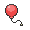

#  Air balloon

**Category:** Held-items

## Description
Held: Grants immunity to Ground-type moves, Spikes, and Toxic Spikes. Consumed when the holder takes damage from a move.

## Locations
| Route | Type |
| --- | --- |
| [Route 11](../routes/route-11.md) | General |

