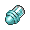

# Battle Effect

| Icon | Item | Description | Locations |
| --- | --- | --- | --- |
|  | [Dire Hit](dire-hit.md) | An item that raises the critical-hit ratio of a Pokémon in battle. It wears off if the Pokémon is withdrawn. | [Shop](../routes/shop.md) |
|  | [Guard Spec.](guard-spec.md) | An item that prevents stat reduction among the Trainer's party Pokémon for five turns after use. | [Shop](../routes/shop.md) |
|  | [X Accuracy](x-accuracy.md) | An item that raises the accuracy of a Pokémon in battle. It wears off if the Pokémon is withdrawn. | [Route 9](../routes/route-9.md), [Route 4](../routes/route-4.md) |
|  | [X Attack](x-attack.md) | An item that raises the Attack stat of a Pokémon in battle. It wears off if the Pokémon is withdrawn. | [Route 9](../routes/route-9.md) |
|  | [X Defend](x-defend.md) | An item that raises the Defense stat of a Pokémon in battle. It wears off if the Pokémon is withdrawn. | [Route 9](../routes/route-9.md), [Dreamyard](../routes/dreamyard.md) |
|  | [X Sp. Def](x-sp-def.md) | An item that raises the Sp. Def stat of a Pokémon in battle. It wears off if the Pokémon is withdrawn. | [Shop](../routes/shop.md) |
|  | [X Special](x-special.md) | An item that raises the Sp. Atk stat of a Pokémon in battle. It wears off if the Pokémon is withdrawn. | [Shop](../routes/shop.md) |
|  | [X Speed](x-speed.md) | An item that raises the Speed stat of a Pokémon in battle. It wears off if the Pokémon is withdrawn. | [Striaton City](../routes/striaton-city.md) |
