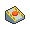

#  Eject Button

**Category:** Hold

## Description
If it is held, when you are hit by an attack the Pokemon can escape the battle-field and switch places with a team member.

## Locations
| Route | Type | Info |
| --- | --- | --- |
| [Shop](../routes/shop.md) | General |  |

