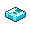
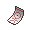
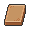
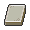
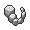
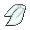
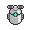

# Items

## Battle Effect

| Icon | Item | Description | Locations |
| --- | --- | --- | --- |
|  | [Dire Hit](dire-hit.md) | An item that raises the critical-hit ratio of a Pokémon in battle. It wears off if the Pokémon is withdrawn. | [Route 9](../routes/route-9.md) |
|  | [Guard Spec.](guard-spec.md) | An item that prevents stat reduction among the Trainer's party Pokémon for five turns after use. | [Route 9](../routes/route-9.md) |
|  | [X Accuracy](x-accuracy.md) | An item that raises the accuracy of a Pokémon in battle. It wears off if the Pokémon is withdrawn. | [Route 9](../routes/route-9.md), [Route 4](../routes/route-4.md) |
|  | [X Attack](x-attack.md) | An item that raises the Attack stat of a Pokémon in battle. It wears off if the Pokémon is withdrawn. | [Route 9](../routes/route-9.md) |
|  | [X Defend](x-defend.md) | An item that raises the Defense stat of a Pokémon in battle. It wears off if the Pokémon is withdrawn. | [Route 9](../routes/route-9.md), [Dreamyard](../routes/dreamyard.md) |
|  | [X Sp. Def](x-sp-def.md) | An item that raises the Sp. Def stat of a Pokémon in battle. It wears off if the Pokémon is withdrawn. | [Route 9](../routes/route-9.md) |
|  | [X Special](x-special.md) | An item that raises the Sp. Atk stat of a Pokémon in battle. It wears off if the Pokémon is withdrawn. | [Route 9](../routes/route-9.md) |
|  | [X Speed](x-speed.md) | An item that raises the Speed stat of a Pokémon in battle. It wears off if the Pokémon is withdrawn. | [Striaton City](../routes/striaton-city.md) |

## Evolutionary

| Icon | Item | Description | Locations |
| --- | --- | --- | --- |
|  | [Calcium](calcium.md) | A nutritious drink for Pokémon. It raises the base Sp. Atk (Special Attack) stat of a single Pokémon. | [Route 9](../routes/route-9.md), [Village Bridge](../routes/village-bridge.md), [Victory Road](../routes/victory-road.md), [Route 18](../routes/route-18.md), [Gear Station](../routes/gear-station.md) |
|  | [Carbos](carbos.md) | Raises Speed effort and happiness. | [Route 9](../routes/route-9.md), [Mistralton Cave](../routes/mistralton-cave.md), [Victory Road](../routes/victory-road.md), [Giant Chasm](../routes/giant-chasm.md), [Gear Station](../routes/gear-station.md) |
|  | [Clever Wing](clever-wing.md) | An item used by Pokémon. It raises the Special Defence EVs of one Pokemon a little. | [Route 9](../routes/route-9.md), [Marvelous Bridge](../routes/marvelous-bridge.md), [Gear Station](../routes/gear-station.md), [Driftveil Drawbridge](../routes/driftveil-drawbridge.md) |
|  | [Dawn Stone](dawn-stone.md) | Evolves a male Kirlia into Gallade or a female Snorunt into Froslass. | [Cold Storage](../routes/cold-storage.md), [Route 9](../routes/route-9.md), [Black City](../routes/black-city.md), [Twist Mountain](../routes/twist-mountain.md), [Wellspring Cave](../routes/wellspring-cave.md), [Mistralton Cave](../routes/mistralton-cave.md), [Chargestone Cave](../routes/chargestone-cave.md), [Victory Road](../routes/victory-road.md), [Giant Chasm](../routes/giant-chasm.md), [Gear Station](../routes/gear-station.md), [Challenger's Cave](../routes/challengers-cave.md) |
|  | [Dragon Scale](dragon-scale.md) | Traded on a Seadra: Holder evolves into Kingdra. | [Route 9](../routes/route-9.md), [Black City](../routes/black-city.md), [Route 18](../routes/route-18.md), [Route 13](../routes/route-13.md), [Gear Station](../routes/gear-station.md) |
|  | [Dusk Stone](dusk-stone.md) | Evolves a Lampent into Chandelure, a Misdreavus into Mismagius, or a Murkrow into Honchkrow. | [Route 6](../routes/route-6.md), [Route 9](../routes/route-9.md), [Black City](../routes/black-city.md), [Twist Mountain](../routes/twist-mountain.md), [Wellspring Cave](../routes/wellspring-cave.md), [Mistralton Cave](../routes/mistralton-cave.md), [Chargestone Cave](../routes/chargestone-cave.md), [Victory Road](../routes/victory-road.md), [Giant Chasm](../routes/giant-chasm.md), [Gear Station](../routes/gear-station.md), [Challenger's Cave](../routes/challengers-cave.md) |
|  | [Fire Stone](fire-stone.md) | Evolves an Eevee into Flareon, a Growlithe into Arcanine, a Pansear into Simisear, or a Vulpix into Ninetales. | [Castelia City](../routes/castelia-city.md), [Desert Resort](../routes/desert-resort.md), [Route 9](../routes/route-9.md), [Black City](../routes/black-city.md), [Twist Mountain](../routes/twist-mountain.md), [Wellspring Cave](../routes/wellspring-cave.md), [Mistralton Cave](../routes/mistralton-cave.md), [Chargestone Cave](../routes/chargestone-cave.md), [Victory Road](../routes/victory-road.md), [Giant Chasm](../routes/giant-chasm.md), [Gear Station](../routes/gear-station.md), [Challenger's Cave](../routes/challengers-cave.md) |
|  | [Genius Wing](genius-wing.md) | An item used by Pokémon. It raises the Special Attack EVs of one Pokemon a little. | [Route 9](../routes/route-9.md), [Marvelous Bridge](../routes/marvelous-bridge.md), [Gear Station](../routes/gear-station.md), [Driftveil Drawbridge](../routes/driftveil-drawbridge.md) |
|  | [Health Wing](health-wing.md) | An item used by Pokémon. It raises the HP EVs of one Pokemon a little. | [Route 9](../routes/route-9.md), [Marvelous Bridge](../routes/marvelous-bridge.md), [Gear Station](../routes/gear-station.md), [Driftveil Drawbridge](../routes/driftveil-drawbridge.md) |
|  | [HP Up](hp-up.md) | A nutritious drink for Pokémon. It raises the base HP of a single Pokémon. | [Route 9](../routes/route-9.md), [Route 9](../routes/route-9.md), [Chargestone Cave](../routes/chargestone-cave.md), [Gear Station](../routes/gear-station.md) |
|  | [Iron](iron.md) | A nutritious drink for Pokémon. It raises the base Defense stat of a single Pokémon. | [Route 9](../routes/route-9.md), [Twist Mountain](../routes/twist-mountain.md), [Mistralton Cave](../routes/mistralton-cave.md), [Chargestone Cave](../routes/chargestone-cave.md), [Gear Station](../routes/gear-station.md) |
|  | [Leaf Stone](leaf-stone.md) | Evolves an Exeggcute into Exeggutor, a Gloom into Vileplume, a Nuzleaf into Shiftry, a Pansage into Simisage, or a Weepinbell into Victreebel. | [Castelia City](../routes/castelia-city.md), [Route 6](../routes/route-6.md), [Route 9](../routes/route-9.md), [Black City](../routes/black-city.md), [Twist Mountain](../routes/twist-mountain.md), [Wellspring Cave](../routes/wellspring-cave.md), [Mistralton Cave](../routes/mistralton-cave.md), [Chargestone Cave](../routes/chargestone-cave.md), [Victory Road](../routes/victory-road.md), [Giant Chasm](../routes/giant-chasm.md), [Gear Station](../routes/gear-station.md), [Challenger's Cave](../routes/challengers-cave.md) |
|  | [Moon Stone](moon-stone.md) | A peculiar stone that makes certain species of Pokémon evolve. It is as black as the night sky. | [Pinwheel Forest](../routes/pinwheel-forest.md), [Route 9](../routes/route-9.md), [Black City](../routes/black-city.md), [Twist Mountain](../routes/twist-mountain.md), [Twist Mountain](../routes/twist-mountain.md), [Wellspring Cave](../routes/wellspring-cave.md), [Mistralton Cave](../routes/mistralton-cave.md), [Chargestone Cave](../routes/chargestone-cave.md), [Victory Road](../routes/victory-road.md), [Giant Chasm](../routes/giant-chasm.md), [Gear Station](../routes/gear-station.md), [Challenger's Cave](../routes/challengers-cave.md) |
|  | [Muscle Wing](muscle-wing.md) | An item used by Pokémon. It raises the Attack EVs of one Pokemon a little. | [Route 9](../routes/route-9.md), [Marvelous Bridge](../routes/marvelous-bridge.md), [Gear Station](../routes/gear-station.md), [Driftveil Drawbridge](../routes/driftveil-drawbridge.md) |
|  | [Oval Stone](oval-stone.md) | Level-up during Day on a Happiny: Holder evolves into Chansey. | [Route 2](../routes/route-2.md), [Route 9](../routes/route-9.md), [Black City](../routes/black-city.md), [Gear Station](../routes/gear-station.md) |
|  | [PP Max](pp-max.md) | It maximally raises the top PP of a selected move that has been learned by the target Pokémon. | [Challenger's Cave](../routes/challengers-cave.md), [Route 9](../routes/route-9.md), [Castelia City](../routes/castelia-city.md), [Nimbasa City](../routes/nimbasa-city.md), [Nimbasa City](../routes/nimbasa-city.md), [Relic Castle](../routes/relic-castle.md), [Gear Station](../routes/gear-station.md) |
|  | [PP Up](pp-up.md) | It slightly raises the maximum PP of a selected move that has been learned by the target Pokémon. | [Route 9](../routes/route-9.md), [Route 9](../routes/route-9.md), [Nimbasa City](../routes/nimbasa-city.md), [Cold Storage](../routes/cold-storage.md), [Twist Mountain](../routes/twist-mountain.md), [Wellspring Cave](../routes/wellspring-cave.md), [Relic Castle](../routes/relic-castle.md), [Mistralton Cave](../routes/mistralton-cave.md), [Anville Town](../routes/anville-town.md), [Route 7](../routes/route-7.md), [Gear Station](../routes/gear-station.md) |
|  | [Prism Scale](prism-scale.md) | Traded on a Feebas: Holder evolves into Milotic. | [Pinwheel Forest](../routes/pinwheel-forest.md), [Route 9](../routes/route-9.md), [Undella Town](../routes/undella-town.md), [Black City](../routes/black-city.md), [Gear Station](../routes/gear-station.md) |
|  | [Protein](protein.md) | Raises Attack effort and happiness. | [Route 9](../routes/route-9.md), [Cold Storage](../routes/cold-storage.md), [Twist Mountain](../routes/twist-mountain.md), [Gear Station](../routes/gear-station.md), [Lostlorn Forest](../routes/lostlorn-forest.md) |
|  | [Rare Candy](rare-candy.md) | Causes a level-up and raises happiness. | [Giant Chasm](../routes/giant-chasm.md), [Route 3](../routes/route-3.md), [Pinwheel Forest](../routes/pinwheel-forest.md), [Icirrus City](../routes/icirrus-city.md), [Route 9](../routes/route-9.md), [Nimbasa City](../routes/nimbasa-city.md), [Twist Mountain](../routes/twist-mountain.md), [Mistralton Cave](../routes/mistralton-cave.md), [Chargestone Cave](../routes/chargestone-cave.md), [Desert Resort](../routes/desert-resort.md), [Victory Road](../routes/victory-road.md), [Anville Town](../routes/anville-town.md), [N's Castle](../routes/ns-castle.md), [Abundant Shrine](../routes/abundant-shrine.md), [Route 13](../routes/route-13.md), [Route 2](../routes/route-2.md), [Gear Station](../routes/gear-station.md), [Lostlorn Forest](../routes/lostlorn-forest.md) |
|  | [Resist Wing](resist-wing.md) | An item used by Pokémon. It raises the Defence EVs of one Pokemon a little. | [Route 9](../routes/route-9.md), [Marvelous Bridge](../routes/marvelous-bridge.md), [Gear Station](../routes/gear-station.md), [Driftveil Drawbridge](../routes/driftveil-drawbridge.md) |
|  | [Shiny Stone](shiny-stone.md) | Evolves a Minccino into Cinccino, a Roselia into Roserade, or a Togetic into Togekiss. | [Nimbasa City](../routes/nimbasa-city.md), [Route 9](../routes/route-9.md), [Black City](../routes/black-city.md), [Twist Mountain](../routes/twist-mountain.md), [Wellspring Cave](../routes/wellspring-cave.md), [Mistralton Cave](../routes/mistralton-cave.md), [Chargestone Cave](../routes/chargestone-cave.md), [Victory Road](../routes/victory-road.md), [Giant Chasm](../routes/giant-chasm.md), [Gear Station](../routes/gear-station.md), [Challenger's Cave](../routes/challengers-cave.md) |
|  | [Sun Stone](sun-stone.md) | Evolves a Cottonee into Whimsicott, a Gloom into Bellossom, a Petilil into Lilligant, or a Sunkern into Sunflora. | [Nacrene City](../routes/nacrene-city.md), [Route 9](../routes/route-9.md), [Black City](../routes/black-city.md), [Relic Castle](../routes/relic-castle.md), [Gear Station](../routes/gear-station.md) |
|  | [Swift Wing](swift-wing.md) | An item used by Pokémon. It raises the Speed EVs of one Pokemon a little. | [Route 9](../routes/route-9.md), [Marvelous Bridge](../routes/marvelous-bridge.md), [Gear Station](../routes/gear-station.md), [Driftveil Drawbridge](../routes/driftveil-drawbridge.md) |
|  | [Thunderstone](thunderstone.md) | A peculiar stone that makes certain species of Pokémon evolve. It has a thunderbolt pattern. | [Route 9](../routes/route-9.md), [Route 9](../routes/route-9.md), [Black City](../routes/black-city.md), [Twist Mountain](../routes/twist-mountain.md), [Wellspring Cave](../routes/wellspring-cave.md), [Mistralton Cave](../routes/mistralton-cave.md), [Chargestone Cave](../routes/chargestone-cave.md), [Chargestone Cave](../routes/chargestone-cave.md), [Victory Road](../routes/victory-road.md), [Giant Chasm](../routes/giant-chasm.md), [Gear Station](../routes/gear-station.md), [Challenger's Cave](../routes/challengers-cave.md) |
|  | [Up Grade](up-grade.md) | Traded on a Porygon: Holder evolves into Porygon2. | [Route 5](../routes/route-5.md), [Route 9](../routes/route-9.md), [Black City](../routes/black-city.md), [Route 13](../routes/route-13.md), [Gear Station](../routes/gear-station.md) |
|  | [Water Stone](water-stone.md) | Evolves an Eevee into Vaporeon, a Lombre into Ludicolo, a Panpour into Simipour, a Poliwhirl into Poliwrath, a Shellder into Cloyster, or a Staryu into Starmie. | [Castelia City](../routes/castelia-city.md), [Driftveil City](../routes/driftveil-city.md), [Route 9](../routes/route-9.md), [Black City](../routes/black-city.md), [Twist Mountain](../routes/twist-mountain.md), [Wellspring Cave](../routes/wellspring-cave.md), [Mistralton Cave](../routes/mistralton-cave.md), [Chargestone Cave](../routes/chargestone-cave.md), [Victory Road](../routes/victory-road.md), [Giant Chasm](../routes/giant-chasm.md), [Gear Station](../routes/gear-station.md), [Challenger's Cave](../routes/challengers-cave.md) |
|  | [Zinc](zinc.md) | Raises Special Defense and happiness. | [Route 9](../routes/route-9.md), [Striaton City](../routes/striaton-city.md), [Gear Station](../routes/gear-station.md) |

## Hidden Machines

| Icon | Item | Description | Locations |
| --- | --- | --- | --- |
|  | [HM01](hm01.md) | Teaches Cut to a compatible Pokémon. | [Striaton City](../routes/striaton-city.md) |
|  | [HM02](hm02.md) | Teaches Fly to a compatible Pokémon. | [Nimbasa City](../routes/nimbasa-city.md) |
|  | [HM03](hm03.md) | Teaches Surf to a compatible Pokémon. | [Twist Mountain](../routes/twist-mountain.md) |
|  | [HM04](hm04.md) | Teaches Strength to a compatible Pokémon. | [Nimbasa City](../routes/nimbasa-city.md) |
|  | [HM05](hm05.md) | Teaches Waterfall to a compatible Pokémon. (HS: Whirlpool DPP: Defog Gen III & II & I: Flash) | [Route 18](../routes/route-18.md) |
|  | [HM06](hm06.md) | Teaches Dive to a compatible Pokémon. (Gen IV & III: Rock Smash Gen II: Whirlpool) | [Undella Town](../routes/undella-town.md) |

## Hold

| Icon | Item | Description | Locations |
| --- | --- | --- | --- |
|  | [Absorb Bulb](absorb-bulb.md) | A disposable bulb. If it is held, when the Pokemon receives a Water-type attack its Special Attack rises. | [Gear Station](../routes/gear-station.md) |
|  | [Adamant Orb](adamant-orb.md) | A brightly gleaming orb to be held by DIALGA. It boosts the power of Dragon- and Steel-type moves. | [Marvelous Bridge](../routes/marvelous-bridge.md), [Gear Station](../routes/gear-station.md) |
|  | [Air Balloon](air-balloon.md) | Held: Grants immunity to Ground-type moves, Spikes, and Toxic Spikes. Consumed when the holder takes damage from a move. | [Route 11](../routes/route-11.md), [Gear Station](../routes/gear-station.md) |
|  | [Amulet Coin](amulet-coin.md) | Held: Doubles the money earned from a battle. Does not stack with Luck Incense. | [Castelia City](../routes/castelia-city.md), [Gear Station](../routes/gear-station.md) |
|  | [Big Root](big-root.md) | A Pokémon held item that boosts the power of HP-stealing moves to let the holder recover more HP. | [Pinwheel Forest](../routes/pinwheel-forest.md), [Gear Station](../routes/gear-station.md) |
|  | [Binding Band](binding-band.md) | Held: Doubles the per-turn damage of multi-turn trapping moves. | [Route 13](../routes/route-13.md), [Gear Station](../routes/gear-station.md) |
|  | [Black Belt](black-belt.md) | An item to be held by a Pokémon. It is a belt that boosts determination and Fighting-type moves. | [Gear Station](../routes/gear-station.md), [Challenger's Cave](../routes/challengers-cave.md) |
|  | [Black Glasses](black-glasses.md) | An item to be held by a Pokémon. It is a shady-looking pair of glasses that boosts Dark-type moves. | [Route 5](../routes/route-5.md), [Gear Station](../routes/gear-station.md) |
|  | [Black Sludge](black-sludge.md) | Held: Poison-type holder recovers 1/16 (6.25%) max HP each turn. Non-Poison-Types take 1/8 (12.5%) max HP damage. | [Route 15](../routes/route-15.md), [Gear Station](../routes/gear-station.md) |
|  | [Blue Scarf](blue-scarf.md) | An item to be held by a Pokémon. It boosts the “Beauty” aspect of the holder in a Contest in Sinnoh. | [Gear Station](../routes/gear-station.md) |
|  | [Bright Powder](bright-powder.md) | An item to be held by a Pokémon. It casts a tricky glare that lowers the opponent's accuracy. | [Chargestone Cave](../routes/chargestone-cave.md), [Gear Station](../routes/gear-station.md) |
|  | [Bug Gem](bug-gem.md) | A Bug-type jewel. It will strengthen the power of a Bug-type move one time if held. | [Twist Mountain](../routes/twist-mountain.md), [Wellspring Cave](../routes/wellspring-cave.md), [Chargestone Cave](../routes/chargestone-cave.md), [Victory Road](../routes/victory-road.md), [Giant Chasm](../routes/giant-chasm.md), [Gear Station](../routes/gear-station.md), [Challenger's Cave](../routes/challengers-cave.md), [Mistalton Cave Dirtclouds](../routes/mistalton-cave-dirtclouds.md) |
|  | [Burn Drive](burn-drive.md) | A Cassette that makes the move called Techno Buster become Fire-type if held by Genesect. | [Gear Station](../routes/gear-station.md), [P2 Laboratory](../routes/p2-laboratory.md) |
|  | [Cell Battery](cell-battery.md) | A disposable rechargeable battery. If it is held, when the Pokemon receives an Electric-type attack its Attack rises. | [Opelucid City](../routes/opelucid-city.md), [Gear Station](../routes/gear-station.md) |
|  | [Charcoal](charcoal.md) | An item to be held by a Pokémon. It is a combustible fuel that boosts the power of Fire-type moves. | [Nacrene City](../routes/nacrene-city.md), [Gear Station](../routes/gear-station.md) |
|  | [Chill Drive](chill-drive.md) | A Cassette that makes the move called Techno Buster become Ice-type if held by Genesect. | [Gear Station](../routes/gear-station.md), [P2 Laboratory](../routes/p2-laboratory.md) |
|  | [Choice Band](choice-band.md) | Held: Increases Attack by 50%, but restricts the holder to only one move. | [Route 14](../routes/route-14.md), [Gear Station](../routes/gear-station.md) |
|  | [Choice Scarf](choice-scarf.md) | Held: Increases Speed by 50%, but restricts the holder to only one move. | [Cold Storage](../routes/cold-storage.md), [Castelia City](../routes/castelia-city.md), [Gear Station](../routes/gear-station.md) |
|  | [Choice Specs](choice-specs.md) | Held: Increases Special Attack by 50%, but restricts the holder to only one move. | [Relic Castle](../routes/relic-castle.md), [Gear Station](../routes/gear-station.md) |
|  | [Cleanse Tag](cleanse-tag.md) | An item to be held by a Pokémon. It helps keep wild Pokémon away if the holder is the first one in the party. | [Icirrus City](../routes/icirrus-city.md), [Gear Station](../routes/gear-station.md) |
|  | [Damp Rock](damp-rock.md) | A Pokémon held item that extends the duration of the move Rain Dance used by the holder. | [Route 8](../routes/route-8.md), [Gear Station](../routes/gear-station.md) |
|  | [Dark Gem](dark-gem.md) | A Dark-type jewel. It will strengthen the power of a Dark-type move one time if held. | [Twist Mountain](../routes/twist-mountain.md), [Wellspring Cave](../routes/wellspring-cave.md), [Chargestone Cave](../routes/chargestone-cave.md), [Victory Road](../routes/victory-road.md), [Giant Chasm](../routes/giant-chasm.md), [Gear Station](../routes/gear-station.md), [Challenger's Cave](../routes/challengers-cave.md), [Mistalton Cave Dirtclouds](../routes/mistalton-cave-dirtclouds.md) |
|  | [Deep Sea Scale](deep-sea-scale.md) | An item to be held by CLAMPERL. A scale that shines a faint pink, it raises the Sp. Def stat. | [Relic Castle](../routes/relic-castle.md), [Route 9](../routes/route-9.md), [Black City](../routes/black-city.md), [Route 13](../routes/route-13.md), [Route 13](../routes/route-13.md), [Route 13](../routes/route-13.md), [Route 13](../routes/route-13.md), [Gear Station](../routes/gear-station.md) |
|  | [Deep Sea Tooth](deep-sea-tooth.md) | An item to be held by CLAMPERL. A fang that gleams a sharp silver, it raises the Sp. Atk stat. | [Relic Castle](../routes/relic-castle.md), [Route 9](../routes/route-9.md), [Black City](../routes/black-city.md), [Route 13](../routes/route-13.md), [Route 13](../routes/route-13.md), [Gear Station](../routes/gear-station.md), [Route 17](../routes/route-17.md), [Route 17](../routes/route-17.md) |
|  | [Destiny Knot](destiny-knot.md) | A long, thin, bright red string to be held by a Pokémon. If the holder becomes infatuated, the foe does too. | [Opelucid City](../routes/opelucid-city.md), [Gear Station](../routes/gear-station.md) |
|  | [Douse Drive](douse-drive.md) | A Cassette that makes the move called Techno Buster become Water-type if held by Genesect. | [Gear Station](../routes/gear-station.md), [P2 Laboratory](../routes/p2-laboratory.md) |
|  | [Draco Plate](draco-plate.md) | An item to be held by a Pokémon. It is a stone tablet that boosts the power of Dragon-type moves. | [Route 13](../routes/route-13.md), [Gear Station](../routes/gear-station.md) |
|  | [Dragon Fang](dragon-fang.md) | An item to be held by a Pokémon. It is a hard and sharp fang that ups the power of Dragon-type moves. | [Dragonspiral Tower](../routes/dragonspiral-tower.md), [Gear Station](../routes/gear-station.md) |
|  | [Dragon Gem](dragon-gem.md) | A Dragon-type jewel. It will strengthen the power of a Dragon-type move one time if held. | [Twist Mountain](../routes/twist-mountain.md), [Wellspring Cave](../routes/wellspring-cave.md), [Chargestone Cave](../routes/chargestone-cave.md), [Victory Road](../routes/victory-road.md), [Giant Chasm](../routes/giant-chasm.md), [Gear Station](../routes/gear-station.md), [Challenger's Cave](../routes/challengers-cave.md), [Mistalton Cave Dirtclouds](../routes/mistalton-cave-dirtclouds.md) |
|  | [Dread Plate](dread-plate.md) | An item to be held by a Pokémon. It is a stone tablet that boosts the power of Dark-type moves. | [Gear Station](../routes/gear-station.md), [Undersea Ruins](../routes/undersea-ruins.md) |
|  | [Dubious Disc](dubious-disc.md) | Traded on a Porygon2: Holder evolves into Porygon-Z. | [Route 9](../routes/route-9.md), [Black City](../routes/black-city.md), [Route 13](../routes/route-13.md), [Route 13](../routes/route-13.md), [Gear Station](../routes/gear-station.md), [P2 Laboratory](../routes/p2-laboratory.md), [P2 Laboratory](../routes/p2-laboratory.md) |
|  | [Earth Plate](earth-plate.md) | An item to be held by a Pokémon. It is a stone tablet that boosts the power of Ground-type moves. | [Gear Station](../routes/gear-station.md), [Undersea Ruins](../routes/undersea-ruins.md) |
|  | [Eject Button](eject-button.md) | If it is held, when you are hit by an attack the Pokemon can escape the battle-field and switch places with a team member. | [Gear Station](../routes/gear-station.md) |
|  | [Electirizer](electirizer.md) | Traded on an Electabuzz: Holder evolves into Electivire. | [Chargestone Cave](../routes/chargestone-cave.md), [Route 9](../routes/route-9.md), [Black City](../routes/black-city.md), [Route 13](../routes/route-13.md), [Route 13](../routes/route-13.md), [Route 13](../routes/route-13.md), [Gear Station](../routes/gear-station.md) |
|  | [Electric Gem](electric-gem.md) | An Electric-type jewel. It will strengthen the power of an Electric-type move one time if held. | [Twist Mountain](../routes/twist-mountain.md), [Wellspring Cave](../routes/wellspring-cave.md), [Chargestone Cave](../routes/chargestone-cave.md), [Victory Road](../routes/victory-road.md), [Giant Chasm](../routes/giant-chasm.md), [Gear Station](../routes/gear-station.md), [Challenger's Cave](../routes/challengers-cave.md), [Mistalton Cave Dirtclouds](../routes/mistalton-cave-dirtclouds.md) |
|  | [Everstone](everstone.md) | Held: Prevents level-based evolution from occuring. | [Route 2](../routes/route-2.md), [Castelia City](../routes/castelia-city.md), [Gear Station](../routes/gear-station.md) |
|  | [Eviolite](eviolite.md) | A piece of Evolutions wonder. If held, a pre-evolved Pokemon's Defence and Special Defence increase. | [Castelia City](../routes/castelia-city.md), [Gear Station](../routes/gear-station.md) |
|  | [Exp Share](exp-share.md) | Held: Half the experience from a battle is split between Pokémon holding this item. | [Castelia City](../routes/castelia-city.md), [Icirrus City](../routes/icirrus-city.md), [Gear Station](../routes/gear-station.md) |
|  | [Expert Belt](expert-belt.md) | Held: Holder’s Super Effective moves do 20% extra damage. | [Driftveil City](../routes/driftveil-city.md), [Gear Station](../routes/gear-station.md) |
|  | [Fighting Gem](fighting-gem.md) | A Fighting-type jewel. It will strengthen the power of a Fighting-type move one time if held. | [Twist Mountain](../routes/twist-mountain.md), [Wellspring Cave](../routes/wellspring-cave.md), [Chargestone Cave](../routes/chargestone-cave.md), [Victory Road](../routes/victory-road.md), [Giant Chasm](../routes/giant-chasm.md), [Gear Station](../routes/gear-station.md), [Challenger's Cave](../routes/challengers-cave.md), [Mistalton Cave Dirtclouds](../routes/mistalton-cave-dirtclouds.md) |
|  | [Fire Gem](fire-gem.md) | A Fire-type jewel. It will strengthen the power of a Fire-type move one time if held. | [Twist Mountain](../routes/twist-mountain.md), [Wellspring Cave](../routes/wellspring-cave.md), [Chargestone Cave](../routes/chargestone-cave.md), [Victory Road](../routes/victory-road.md), [Giant Chasm](../routes/giant-chasm.md), [Gear Station](../routes/gear-station.md), [Challenger's Cave](../routes/challengers-cave.md), [Mistalton Cave Dirtclouds](../routes/mistalton-cave-dirtclouds.md) |
|  | [Fist Plate](fist-plate.md) | An item to be held by a Pokémon. It is a stone tablet that boosts the power of Fighting-type moves. | [Gear Station](../routes/gear-station.md), [Undersea Ruins](../routes/undersea-ruins.md) |
|  | [Flame Orb](flame-orb.md) | An item to be held by a Pokémon. It is a bizarre orb that inflicts a burn on the holder in battle. | [Gear Station](../routes/gear-station.md) |
|  | [Flame Plate](flame-plate.md) | An item to be held by a Pokémon. It is a stone tablet that boosts the power of Fire-type moves. | [Gear Station](../routes/gear-station.md), [Undersea Ruins](../routes/undersea-ruins.md) |
|  | [Float Stone](float-stone.md) | A very light stone. If held a Pokemon's weight becomes lighter. | [Opelucid City](../routes/opelucid-city.md), [Gear Station](../routes/gear-station.md) |
|  | [Flying Gem](flying-gem.md) | A Flying-type jewel. It will strengthen the power of a Flying-type move one time if held. | [Twist Mountain](../routes/twist-mountain.md), [Wellspring Cave](../routes/wellspring-cave.md), [Chargestone Cave](../routes/chargestone-cave.md), [Victory Road](../routes/victory-road.md), [Giant Chasm](../routes/giant-chasm.md), [Gear Station](../routes/gear-station.md), [Challenger's Cave](../routes/challengers-cave.md), [Mistalton Cave Dirtclouds](../routes/mistalton-cave-dirtclouds.md) |
|  | [Focus Band](focus-band.md) | Held: Holder has 10% chance to survive attacks or self-inflicted damage at 1 HP. | [Gear Station](../routes/gear-station.md) |
|  | [Focus Sash](focus-sash.md) | Held: Holder survives any single-hit attack at 1 HP if at max HP, then the item is consumed. | [Gear Station](../routes/gear-station.md) |
|  | [Full Incense](full-incense.md) | An item to be held by a Pokémon. It is an exotic-smelling incense that makes the holder bloated and slow moving. | [Driftveil City](../routes/driftveil-city.md), [Gear Station](../routes/gear-station.md) |
|  | [Ghost Gem](ghost-gem.md) | A Ghost-type jewel. It will strengthen the power of a Ghost-type move one time if held. | [Twist Mountain](../routes/twist-mountain.md), [Wellspring Cave](../routes/wellspring-cave.md), [Chargestone Cave](../routes/chargestone-cave.md), [Victory Road](../routes/victory-road.md), [Giant Chasm](../routes/giant-chasm.md), [Gear Station](../routes/gear-station.md), [Challenger's Cave](../routes/challengers-cave.md), [Mistalton Cave Dirtclouds](../routes/mistalton-cave-dirtclouds.md) |
|  | [Grass Gem](grass-gem.md) | A Grass-type jewel. It will strengthen the power of a Grass-type move one time if held. | [Twist Mountain](../routes/twist-mountain.md), [Wellspring Cave](../routes/wellspring-cave.md), [Chargestone Cave](../routes/chargestone-cave.md), [Victory Road](../routes/victory-road.md), [Giant Chasm](../routes/giant-chasm.md), [Gear Station](../routes/gear-station.md), [Challenger's Cave](../routes/challengers-cave.md), [Mistalton Cave Dirtclouds](../routes/mistalton-cave-dirtclouds.md) |
|  | [Green Scarf](green-scarf.md) | An item to be held by a Pokémon. It boosts the “Smart” aspect of the holder in a Contest in Sinnoh. | [Gear Station](../routes/gear-station.md) |
|  | [Grip Claw](grip-claw.md) | Held: Holder’s multi-turn trapping moves last 5 turns. | [Route 13](../routes/route-13.md), [Gear Station](../routes/gear-station.md) |
|  | [Griseous Orb](griseous-orb.md) | A glowing orb to be held by GIRATINA. It boosts the power of Dragon- and Ghost-type moves. | [Marvelous Bridge](../routes/marvelous-bridge.md), [Gear Station](../routes/gear-station.md) |
|  | [Ground Gem](ground-gem.md) | A Ground-type jewel. It will strengthen the power of a Ground-type move one time if held. | [Twist Mountain](../routes/twist-mountain.md), [Wellspring Cave](../routes/wellspring-cave.md), [Chargestone Cave](../routes/chargestone-cave.md), [Victory Road](../routes/victory-road.md), [Giant Chasm](../routes/giant-chasm.md), [Gear Station](../routes/gear-station.md), [Challenger's Cave](../routes/challengers-cave.md), [Mistalton Cave Dirtclouds](../routes/mistalton-cave-dirtclouds.md) |
|  | [Hard Stone](hard-stone.md) | An item to be held by a Pokémon. It is an unbreakable stone that ups the power of Rock-type moves. | [Mistralton Cave](../routes/mistralton-cave.md), [Gear Station](../routes/gear-station.md) |
|  | [Heat Rock](heat-rock.md) | A Pokémon held item that extends the duration of the move Sunny Day used by the holder. | [Route 8](../routes/route-8.md), [Gear Station](../routes/gear-station.md) |
|  | [Ice Gem](ice-gem.md) | An Ice-type jewel. It will strengthen the power of an Ice-type move one time if held. | [Twist Mountain](../routes/twist-mountain.md), [Wellspring Cave](../routes/wellspring-cave.md), [Chargestone Cave](../routes/chargestone-cave.md), [Victory Road](../routes/victory-road.md), [Giant Chasm](../routes/giant-chasm.md), [Gear Station](../routes/gear-station.md), [Challenger's Cave](../routes/challengers-cave.md), [Mistalton Cave Dirtclouds](../routes/mistalton-cave-dirtclouds.md) |
|  | [Icicle Plate](icicle-plate.md) | An item to be held by a Pokémon. It is a stone tablet that boosts the power of Ice-type moves. | [Gear Station](../routes/gear-station.md), [Undersea Ruins](../routes/undersea-ruins.md) |
|  | [Icy Rock](icy-rock.md) | A Pokémon held item that extends the duration of the move Hail used by the holder. | [Route 8](../routes/route-8.md), [Gear Station](../routes/gear-station.md) |
|  | [Insect Plate](insect-plate.md) | An item to be held by a Pokémon. It is a stone tablet that boosts the power of Bug-type moves. | [Gear Station](../routes/gear-station.md), [Undersea Ruins](../routes/undersea-ruins.md) |
|  | [Iron Ball](iron-ball.md) | A Pokémon held item that cuts Speed. It makes Flying-type and levitating holders susceptible to Ground moves. | [Gear Station](../routes/gear-station.md) |
|  | [Iron Plate](iron-plate.md) | An item to be held by a Pokémon. It is a stone tablet that boosts the power of Steel-type moves. | [Gear Station](../routes/gear-station.md), [Undersea Ruins](../routes/undersea-ruins.md) |
|  | [Kings Rock](kings-rock.md) | Held: Damaging moves gain a 10% chance to make their target flinch. Traded on a Poliwhirl: Holder evolves into Politoed. Traded on a Slowpoke: Holder evolves into Slowking. | [Pinwheel Forest](../routes/pinwheel-forest.md), [Route 9](../routes/route-9.md), [Black City](../routes/black-city.md), [Route 13](../routes/route-13.md), [Route 13](../routes/route-13.md), [Gear Station](../routes/gear-station.md) |
|  | [Lagging Tail](lagging-tail.md) | An item to be held by a Pokémon. It is tremendously heavy and makes the holder move slower than usual. | [Gear Station](../routes/gear-station.md) |
|  | [Lax Incense](lax-incense.md) | An item to be held by a Pokémon. The tricky aroma of this incense lowers the foe's accuracy. | [Driftveil City](../routes/driftveil-city.md), [Gear Station](../routes/gear-station.md) |
|  | [Leftovers](leftovers.md) | An item to be held by a Pokémon. The holder's HP is gradually restored during battle. | [Village Bridge](../routes/village-bridge.md), [Gear Station](../routes/gear-station.md) |
|  | [Life Orb](life-orb.md) | Held: Holder’s moves inflict 30% extra damage, but cost 10% max HP. | [Chargestone Cave](../routes/chargestone-cave.md), [Gear Station](../routes/gear-station.md) |
|  | [Light Ball](light-ball.md) | Doubles Pikachu’s Attack and Special Attack. Breed on Pikachu or Raichu: Pichu Egg will have Volt Tackle. | [Route 12](../routes/route-12.md), [Gear Station](../routes/gear-station.md) |
|  | [Light Clay](light-clay.md) | Held: Light Screen and Reflect used by the holder last 8 rounds instead of 5. | [Route 14](../routes/route-14.md), [Gear Station](../routes/gear-station.md) |
|  | [Luck Incense](luck-incense.md) | An item to be held by a Pokémon. It doubles a battle's prize money if the holding Pokémon joins in. | [Driftveil City](../routes/driftveil-city.md), [Gear Station](../routes/gear-station.md) |
|  | [Lucky Egg](lucky-egg.md) | Held: Increases EXP earned in battle by 50%. | [Chargestone Cave](../routes/chargestone-cave.md), [Route 13](../routes/route-13.md), [Gear Station](../routes/gear-station.md) |
|  | [Lucky Punch](lucky-punch.md) | Raises Chansey’s critical hit ratio by two stages. | [Route 13](../routes/route-13.md), [Gear Station](../routes/gear-station.md) |
|  | [Lustrous Orb](lustrous-orb.md) | A beautifully glowing orb to be held by PALKIA. It boosts the power of Dragon- and Water-type moves. | [Marvelous Bridge](../routes/marvelous-bridge.md), [Gear Station](../routes/gear-station.md) |
|  | [Macho Brace](macho-brace.md) | An item to be held by a Pokémon. It is a stiff and heavy brace that promotes strong growth but lowers Speed. | [Nimbasa City](../routes/nimbasa-city.md), [Gear Station](../routes/gear-station.md) |
|  | [Magmarizer](magmarizer.md) | Traded on a Magmar: Holder evolves into Magmortar. | [Route 7](../routes/route-7.md), [Route 9](../routes/route-9.md), [Black City](../routes/black-city.md), [Route 13](../routes/route-13.md), [Route 13](../routes/route-13.md), [Gear Station](../routes/gear-station.md) |
|  | [Magnet](magnet.md) | An item to be held by a Pokémon. It is a powerful magnet that boosts the power of Electric-type moves. | [Chargestone Cave](../routes/chargestone-cave.md), [Gear Station](../routes/gear-station.md) |
|  | [Meadow Plate](meadow-plate.md) | An item to be held by a Pokémon. It is a stone tablet that boosts the power of Grass-type moves. | [Gear Station](../routes/gear-station.md), [Undersea Ruins](../routes/undersea-ruins.md) |
|  | [Mental Herb](mental-herb.md) | Held: Consumed to cure infatuation. Gen V: Also removes Taunt, Encore, Torment, Disable, and Cursed Body. | [Gear Station](../routes/gear-station.md) |
|  | [Metal Coat](metal-coat.md) | Held: Steel-Type moves from holder do 20% more damage. | [Cold Storage](../routes/cold-storage.md), [Route 9](../routes/route-9.md), [Black City](../routes/black-city.md), [Route 13](../routes/route-13.md), [Route 13](../routes/route-13.md), [Gear Station](../routes/gear-station.md) |
|  | [Metal Powder](metal-powder.md) | An item to be held by DITTO. Extremely fine yet hard, this odd powder boosts the Defense stat. | [Route 13](../routes/route-13.md), [Gear Station](../routes/gear-station.md) |
|  | [Metronome](metronome.md) | Held: Consectutive uses of the same attack have a cumulative damage boost of 10%. Maximum 100% boost. | [Route 13](../routes/route-13.md), [Gear Station](../routes/gear-station.md) |
|  | [Mind Plate](mind-plate.md) | An item to be held by a Pokémon. It is a stone tablet that boosts the power of Psychic-type moves. | [Gear Station](../routes/gear-station.md), [Undersea Ruins](../routes/undersea-ruins.md) |
|  | [Miracle Seed](miracle-seed.md) | An item to be held by a Pokémon. It is a seed imbued with life that ups the power of Grass-type moves. | [Pinwheel Forest](../routes/pinwheel-forest.md), [Nacrene City](../routes/nacrene-city.md), [Gear Station](../routes/gear-station.md) |
|  | [Muscle Band](muscle-band.md) | Held: Boosts the damage of physical moves used by the holder by 10%. | [Gear Station](../routes/gear-station.md) |
|  | [Mystic Water](mystic-water.md) | An item to be held by a Pokémon. It is a teardrop-shaped gem that ups the power of Water-type moves. | [Nacrene City](../routes/nacrene-city.md), [Wellspring Cave](../routes/wellspring-cave.md), [Gear Station](../routes/gear-station.md) |
|  | [Never Melt Ice](never-melt-ice.md) | An item to be held by a Pokémon. It is a piece of ice that repels heat and boosts Ice-type moves. | [Cold Storage](../routes/cold-storage.md), [Gear Station](../routes/gear-station.md) |
|  | [Normal Gem](normal-gem.md) | A Normal-type jewel. It will strengthen the power of a Normal-type move one time if held. | [Twist Mountain](../routes/twist-mountain.md), [Wellspring Cave](../routes/wellspring-cave.md), [Chargestone Cave](../routes/chargestone-cave.md), [Victory Road](../routes/victory-road.md), [Giant Chasm](../routes/giant-chasm.md), [Gear Station](../routes/gear-station.md), [Challenger's Cave](../routes/challengers-cave.md), [Mistalton Cave Dirtclouds](../routes/mistalton-cave-dirtclouds.md) |
|  | [Odd Incense](odd-incense.md) | An item to be held by a Pokémon. It is an exotic-smelling incense that boosts the power of Psychic-type moves. | [Driftveil City](../routes/driftveil-city.md), [Gear Station](../routes/gear-station.md) |
|  | [Pink Scarf](pink-scarf.md) | An item to be held by a Pokémon. It boosts the “Cute” aspect of the holder in a Contest in Sinnoh. | [Gear Station](../routes/gear-station.md) |
|  | [Poison Barb](poison-barb.md) | An item to be held by a Pokémon. It is a small, poisonous barb that ups the power of Poison-type moves. | [Route 8](../routes/route-8.md), [Gear Station](../routes/gear-station.md) |
|  | [Poison Gem](poison-gem.md) | A Poison-type jewel. It will strengthen the power of a Poison-type move one time if held. | [Twist Mountain](../routes/twist-mountain.md), [Wellspring Cave](../routes/wellspring-cave.md), [Chargestone Cave](../routes/chargestone-cave.md), [Victory Road](../routes/victory-road.md), [Giant Chasm](../routes/giant-chasm.md), [Gear Station](../routes/gear-station.md), [Challenger's Cave](../routes/challengers-cave.md), [Mistalton Cave Dirtclouds](../routes/mistalton-cave-dirtclouds.md) |
|  | [Power Anklet](power-anklet.md) | A Pokémon held item that promotes Speed gain on leveling, but reduces the Speed stat. | [Gear Station](../routes/gear-station.md) |
|  | [Power Band](power-band.md) | A Pokémon held item that promotes Sp. Def gain on leveling, but reduces the Speed stat. | [Gear Station](../routes/gear-station.md) |
|  | [Power Belt](power-belt.md) | A Pokémon held item that promotes Defense gain on leveling, but reduces the Speed stat. | [Gear Station](../routes/gear-station.md) |
|  | [Power Bracer](power-bracer.md) | A Pokémon held item that promotes Attack gain on leveling, but reduces the Speed stat. | [Gear Station](../routes/gear-station.md) |
|  | [Power Herb](power-herb.md) | Held: Both turns of a two-turn charge move happen at once. Consumed upon use. | [Victory Road](../routes/victory-road.md), [Gear Station](../routes/gear-station.md) |
|  | [Power Lens](power-lens.md) | A Pokémon held item that promotes Sp. Atk gain on leveling, but reduces the Speed stat. | [Gear Station](../routes/gear-station.md) |
|  | [Power Weight](power-weight.md) | A Pokémon held item that promotes HP gain on leveling, but reduces the Speed stat. | [Gear Station](../routes/gear-station.md) |
|  | [Protector](protector.md) | Traded on a Rhydon: Holder evolves into Rhyperior. | [Mistralton Cave](../routes/mistralton-cave.md), [Route 9](../routes/route-9.md), [Black City](../routes/black-city.md), [Route 11](../routes/route-11.md), [Route 13](../routes/route-13.md), [Route 13](../routes/route-13.md), [Gear Station](../routes/gear-station.md) |
|  | [Psychic Gem](psychic-gem.md) | A Psychic-type jewel. It will strengthen the power of a Pcyhcic-type move one time if held. | [Twist Mountain](../routes/twist-mountain.md), [Wellspring Cave](../routes/wellspring-cave.md), [Chargestone Cave](../routes/chargestone-cave.md), [Victory Road](../routes/victory-road.md), [Giant Chasm](../routes/giant-chasm.md), [Gear Station](../routes/gear-station.md), [Challenger's Cave](../routes/challengers-cave.md), [Mistalton Cave Dirtclouds](../routes/mistalton-cave-dirtclouds.md) |
|  | [Pure Incense](pure-incense.md) | An item to be held by a Pokémon. It helps keep wild Pokémon away if the holder is the first one in the party. | [Driftveil City](../routes/driftveil-city.md), [Gear Station](../routes/gear-station.md) |
|  | [Quick Claw](quick-claw.md) | An item to be held by a Pokémon. A light, sharp claw that lets the bearer move first occasionally. | [Gear Station](../routes/gear-station.md), [Skyarrow Bridge](../routes/skyarrow-bridge.md) |
|  | [Quick Powder](quick-powder.md) | Doubles Ditto’s Speed when held. The boost is lost after transforming. | [Gear Station](../routes/gear-station.md) |
|  | [Razor Claw](razor-claw.md) | Held: Raises the holder’s critical hit ratio by one stage. Held by a Sneasel while levelling up at night: Holder evolves into Weavile. | [Cold Storage](../routes/cold-storage.md), [Route 9](../routes/route-9.md), [Black City](../routes/black-city.md), [Route 13](../routes/route-13.md), [Route 13](../routes/route-13.md), [Route 13](../routes/route-13.md), [Gear Station](../routes/gear-station.md) |
|  | [Razor Fang](razor-fang.md) | Held: Damaging moves gain a 10% chance to make their target flinch. Held by a Gligar while levelling up: Holder evolves into Gliscor. | [Cold Storage](../routes/cold-storage.md), [Route 9](../routes/route-9.md), [Black City](../routes/black-city.md), [Abundant Shrine](../routes/abundant-shrine.md), [Route 13](../routes/route-13.md), [Route 13](../routes/route-13.md), [Gear Station](../routes/gear-station.md) |
|  | [Reaper Cloth](reaper-cloth.md) | Traded on a Dusclops: Holder evolves into Dusknoir. | [Celestial Tower](../routes/celestial-tower.md), [Route 9](../routes/route-9.md), [Black City](../routes/black-city.md), [Route 14](../routes/route-14.md), [Route 13](../routes/route-13.md), [Route 13](../routes/route-13.md), [Gear Station](../routes/gear-station.md) |
|  | [Red Card](red-card.md) | A card with a mysterious power. If held you can cause an opponent who's hit you with a move to exit the field. | [Gear Station](../routes/gear-station.md) |
|  | [Red Scarf](red-scarf.md) | An item to be held by a Pokémon. It boosts the “Cool” aspect of the holder in a Contest in Sinnoh. | [Gear Station](../routes/gear-station.md) |
|  | [Ring Target](ring-target.md) | If a move failed because of the opposing Pokémon's Type, this Bull's Eye will make the move hit. | [Opelucid City](../routes/opelucid-city.md), [Gear Station](../routes/gear-station.md) |
|  | [Rock Gem](rock-gem.md) | A Rock-type jewel. It will strengthen the power of a Rock-type move one time if held. | [Twist Mountain](../routes/twist-mountain.md), [Wellspring Cave](../routes/wellspring-cave.md), [Chargestone Cave](../routes/chargestone-cave.md), [Victory Road](../routes/victory-road.md), [Giant Chasm](../routes/giant-chasm.md), [Gear Station](../routes/gear-station.md), [Challenger's Cave](../routes/challengers-cave.md), [Mistalton Cave Dirtclouds](../routes/mistalton-cave-dirtclouds.md) |
|  | [Rock Incense](rock-incense.md) | An item to be held by a Pokémon. It is an exotic-smelling incense that boosts the power of Rock-type moves. | [Driftveil City](../routes/driftveil-city.md), [Gear Station](../routes/gear-station.md) |
|  | [Rocky Helmet](rocky-helmet.md) | If held by a Pokemon it will give the opponent damage if hit with an attacl. | [Cold Storage](../routes/cold-storage.md), [Gear Station](../routes/gear-station.md) |
|  | [Rose Incense](rose-incense.md) | An item to be held by a Pokémon. It is an exotic-smelling incense that boosts the power of Grass-type moves. | [Driftveil City](../routes/driftveil-city.md), [Gear Station](../routes/gear-station.md) |
|  | [Scope Lens](scope-lens.md) | An item to be held by a Pokémon. It is a lens that boosts the holder's critical-hit ratio. | [Castelia City](../routes/castelia-city.md), [Gear Station](../routes/gear-station.md) |
|  | [Sea Incense](sea-incense.md) | An item to be held by a Pokémon. It is incense with a curious aroma that boosts the power of Water-type moves. | [Driftveil City](../routes/driftveil-city.md), [Gear Station](../routes/gear-station.md) |
|  | [Sharp Beak](sharp-beak.md) | An item to be held by a Pokémon. It is a long, sharp beak that boosts the power of Flying-type moves. | [Mistralton City](../routes/mistralton-city.md), [Gear Station](../routes/gear-station.md) |
|  | [Shed Shell](shed-shell.md) | Held: Holder can bypass all trapping effects and switch out. Multi-turn moves still cannot be switched out of. | [Route 13](../routes/route-13.md), [Gear Station](../routes/gear-station.md) |
|  | [Shell Bell](shell-bell.md) | An item to be held by a Pokémon. The holder's HP is restored a little every time it inflicts damage. | [Driftveil City](../routes/driftveil-city.md), [Gear Station](../routes/gear-station.md) |
|  | [Shock Drive](shock-drive.md) | A Cassette that makes the move called Techno Buster become Electric-type if held by Genesect. | [Gear Station](../routes/gear-station.md), [P2 Laboratory](../routes/p2-laboratory.md) |
|  | [Silk Scarf](silk-scarf.md) | An item to be held by a Pokémon. It is a sumptuous scarf that boosts the power of Normal-type moves. | [Route 6](../routes/route-6.md), [Gear Station](../routes/gear-station.md) |
|  | [Silver Powder](silver-powder.md) | An item to be held by a Pokémon. It is a shiny, silver powder that ups the power of Bug-type moves. | [Pinwheel Forest](../routes/pinwheel-forest.md), [Gear Station](../routes/gear-station.md) |
|  | [Sky Plate](sky-plate.md) | An item to be held by a Pokémon. It is a stone tablet that boosts the power of Flying-type moves. | [Gear Station](../routes/gear-station.md), [Undersea Ruins](../routes/undersea-ruins.md) |
|  | [Smoke Ball](smoke-ball.md) | An item to be held by a Pokémon. It enables the holder to flee from any wild Pokémon without fail. | [Castelia City](../routes/castelia-city.md), [Gear Station](../routes/gear-station.md) |
|  | [Smooth Rock](smooth-rock.md) | A Pokémon held item that extends the duration of the move Sandstorm used by the holder. | [Route 8](../routes/route-8.md), [Gear Station](../routes/gear-station.md) |
|  | [Soft Sand](soft-sand.md) | An item to be held by a Pokémon. It is a loose, silky sand that boosts the power of Ground-type moves. | [Desert Resort](../routes/desert-resort.md), [Gear Station](../routes/gear-station.md) |
|  | [Soothe Bell](soothe-bell.md) | Held: Doubles the happiness earned by the holder. | [Nimbasa City](../routes/nimbasa-city.md), [Gear Station](../routes/gear-station.md) |
|  | [Soul Dew](soul-dew.md) | Raises Latias and Latios’s Special Attack and Special Defense by 50%. | [Abundant Shrine](../routes/abundant-shrine.md), [Gear Station](../routes/gear-station.md) |
|  | [Spell Tag](spell-tag.md) | An item to be held by a Pokémon. It is a sinister, eerie tag that boosts the power of Ghost-type moves. | [Celestial Tower](../routes/celestial-tower.md), [Gear Station](../routes/gear-station.md) |
|  | [Splash Plate](splash-plate.md) | An item to be held by a Pokémon. It is a stone tablet that boosts the power of Water-type moves. | [Route 13](../routes/route-13.md), [Gear Station](../routes/gear-station.md) |
|  | [Spooky Plate](spooky-plate.md) | An item to be held by a Pokémon. It is a stone tablet that boosts the power of Ghost-type moves. | [Gear Station](../routes/gear-station.md), [Undersea Ruins](../routes/undersea-ruins.md) |
|  | [Steel Gem](steel-gem.md) | A Poison-type jewel. It will strengthen the power of a Steel-type move one time if held. | [Twist Mountain](../routes/twist-mountain.md), [Wellspring Cave](../routes/wellspring-cave.md), [Chargestone Cave](../routes/chargestone-cave.md), [Victory Road](../routes/victory-road.md), [Giant Chasm](../routes/giant-chasm.md), [Gear Station](../routes/gear-station.md), [Challenger's Cave](../routes/challengers-cave.md), [Mistalton Cave Dirtclouds](../routes/mistalton-cave-dirtclouds.md) |
|  | [Stick](stick.md) | Raises Farfetch’d’s critical hit ratio by two stages. | [Route 13](../routes/route-13.md), [Gear Station](../routes/gear-station.md) |
|  | [Sticky Barb](sticky-barb.md) | A held item that damages the holder on every turn. It may latch on to foes that touch the holder. | [Gear Station](../routes/gear-station.md) |
|  | [Stone Plate](stone-plate.md) | An item to be held by a Pokémon. It is a stone tablet that boosts the power of Rock-type moves. | [Gear Station](../routes/gear-station.md), [Undersea Ruins](../routes/undersea-ruins.md) |
|  | [Thick Club](thick-club.md) | Doubles Cubone or Marowak’s Attack. | [Route 15](../routes/route-15.md), [Route 13](../routes/route-13.md), [Gear Station](../routes/gear-station.md) |
|  | [Toxic Orb](toxic-orb.md) | An item to be held by a Pokémon. It is a bizarre orb that badly poisons the holder in battle. | [Gear Station](../routes/gear-station.md) |
|  | [Toxic Plate](toxic-plate.md) | An item to be held by a Pokémon. It is a stone tablet that boosts the power of Poison-type moves. | [Gear Station](../routes/gear-station.md), [Undersea Ruins](../routes/undersea-ruins.md) |
|  | [Twisted Spoon](twisted-spoon.md) | An item to be held by a Pokémon. It is a spoon imbued with telekinetic power that boosts Psychic-type moves. | [Dreamyard](../routes/dreamyard.md), [Gear Station](../routes/gear-station.md) |
|  | [Water Gem](water-gem.md) | A Water-type jewel. It will strengthen the power of a Water-type move one time if held. | [Twist Mountain](../routes/twist-mountain.md), [Wellspring Cave](../routes/wellspring-cave.md), [Chargestone Cave](../routes/chargestone-cave.md), [Victory Road](../routes/victory-road.md), [Giant Chasm](../routes/giant-chasm.md), [Gear Station](../routes/gear-station.md), [Challenger's Cave](../routes/challengers-cave.md), [Mistalton Cave Dirtclouds](../routes/mistalton-cave-dirtclouds.md) |
|  | [Wave Incense](wave-incense.md) | An item to be held by a Pokémon. It is an exotic-smelling incense that boosts the power of Water-type moves. | [Driftveil City](../routes/driftveil-city.md), [Gear Station](../routes/gear-station.md) |
|  | [White Herb](white-herb.md) | Held: Resets all lowered stats to normal at end of turn. Consumed after use. | [Gear Station](../routes/gear-station.md) |
|  | [Wide Lens](wide-lens.md) | Held: Provides a 1/10 (10%) boost in accuracy to the holder. | [Dreamyard](../routes/dreamyard.md), [Castelia City](../routes/castelia-city.md), [Gear Station](../routes/gear-station.md) |
|  | [Wise Glasses](wise-glasses.md) | Held: Boosts the damage of special moves used by the holder by 1/10 (10%). | [Gear Station](../routes/gear-station.md) |
|  | [Yellow Scarf](yellow-scarf.md) | An item to be held by a Pokémon. It boosts the “Tough” aspect of the holder in a Contest in Sinnoh. |  |
|  | [Zap Plate](zap-plate.md) | An item to be held by a Pokémon. It is a stone tablet that boosts the power of Electric-type moves. | [Undersea Ruins](../routes/undersea-ruins.md) |
|  | [Zoom Lens](zoom-lens.md) | Held: Provides a 1/5 (20%) boost in accuracy if the holder moves after the target. | [Route 18](../routes/route-18.md), [Castelia City](../routes/castelia-city.md) |

## Key

| Icon | Item | Description | Locations |
| --- | --- | --- | --- |
|  | [Bicycle](bicycle.md) | Use for fast transit. | [Nuvema Town](../routes/nuvema-town.md) |
|  | [Dark Stone](dark-stone.md) | The form of Zekrom's destroyed body. If a hero appears holding it, it will be restored. | [Nacrene City](../routes/nacrene-city.md) |
|  | [Dowsing MCHN](dowsing-mchn.md) | It checks for unseen items in the area and makes noise and lights when it finds something. | [Nacrene City](../routes/nacrene-city.md) |
|  | [Dragon Skull](dragon-skull.md) | A the skull bone of a Pokemon that used to fly freely around the sea despite the raging water. | [Pinwheel Forest](../routes/pinwheel-forest.md) |
|  | [Gracidea](gracidea.md) | A flower sometimes bundled in bouquets to convey gratitude on special occasions like birthdays. | [Nuvema Town](../routes/nuvema-town.md), [Lacunosa Town](../routes/lacunosa-town.md) |
|  | [Gram 1](gram-1.md) | An important letter delivered by Wingull. | [Route 13](../routes/route-13.md) |
|  | [Gram 2](gram-2.md) | An important letter delivered by Wingull. | [Route 13](../routes/route-13.md) |
|  | [Gram 3](gram-3.md) | An important letter delivered by Wingull. | [Route 13](../routes/route-13.md) |
|  | [Liberty Pass](liberty-pass.md) | A special ticket needed to go to Liberty Garden Island. You can catch a ship from Castelia City. |  |
|  | [Light Stone](light-stone.md) | The form of Reshiram's destroyed body. If a hero appears holding it, it will be restored. | [Nacrene City](../routes/nacrene-city.md) |
|  | [Lock Capsule](lock-capsule.md) | A sturdy Capsule that can only be opened with a special key. |  |
|  | [Pal Pad](pal-pad.md) | A convenient notepad that is used for registering your friends, Friend Codes, and keeping a record of game play. | [Striaton City](../routes/striaton-city.md) |
|  | [Prop Case](prop-case.md) | A beautiful and cool case that will store the many and various Goods that you attach to Pokemon during Musicals. | [Nimbasa City](../routes/nimbasa-city.md) |
|  | [Super Rod](super-rod.md) | Used to catch Pokémon in bodies of water. | [Route 3](../routes/route-3.md) |
|  | [Town Map](town-map.md) | A very convenient map that can be viewed anytime. It even shows your present location. | [Nuvema Town](../routes/nuvema-town.md) |
|  | [Vs. Recorder](vs-recorder.md) | An amazing device that can record a battle either between friends or at a special battle facility. | [Nimbasa City](../routes/nimbasa-city.md) |
|  | [Xtransceiver](xtransceiver.md) | Makes four-way video calls. | [Nuvema Town](../routes/nuvema-town.md) |

## Miscellaneous

| Icon | Item | Description | Locations |
| --- | --- | --- | --- |
|  | [Armor Fossil](armor-fossil.md) | Can be revived into a Shieldon. | [Desert Resort](../routes/desert-resort.md), [Twist Mountain](../routes/twist-mountain.md) |
|  | [Balm Mushroom](balm-mushroom.md) | A rare mushroom that will spread a nice scent around the whole area. Enthusiasts with buy them for high prices. | [Icirrus City](../routes/icirrus-city.md), [Route 9](../routes/route-9.md), [Accumula Town](../routes/accumula-town.md), [Striaton City](../routes/striaton-city.md), [Striaton City](../routes/striaton-city.md), [Nacrene City](../routes/nacrene-city.md), [Castelia City](../routes/castelia-city.md), [Nimbasa City](../routes/nimbasa-city.md), [Driftveil City](../routes/driftveil-city.md), [Mistralton City](../routes/mistralton-city.md), [Opelucid City](../routes/opelucid-city.md), [Pokémon League](../routes/pokémon-league.md), [Lacunosa Town](../routes/lacunosa-town.md), [Undella Town](../routes/undella-town.md), [Black City](../routes/black-city.md), [White Forest](../routes/white-forest.md), [Abundant Shrine](../routes/abundant-shrine.md) |
|  | [Big Mushroom](big-mushroom.md) | Fire Red and Leaf Green: Trade for prior Level-up moves. Sell for 2500 Pokédollars, or to Hungry Maid for 5000 Pokédollars. | [Icirrus City](../routes/icirrus-city.md), [Icirrus City](../routes/icirrus-city.md), [Route 9](../routes/route-9.md), [Accumula Town](../routes/accumula-town.md), [Striaton City](../routes/striaton-city.md), [Nacrene City](../routes/nacrene-city.md), [Castelia City](../routes/castelia-city.md), [Nimbasa City](../routes/nimbasa-city.md), [Driftveil City](../routes/driftveil-city.md), [Mistralton City](../routes/mistralton-city.md), [Opelucid City](../routes/opelucid-city.md), [Pokémon League](../routes/pokémon-league.md), [Lacunosa Town](../routes/lacunosa-town.md), [Undella Town](../routes/undella-town.md), [Black City](../routes/black-city.md), [White Forest](../routes/white-forest.md), [Route 1](../routes/route-1.md), [Route 6](../routes/route-6.md), [Route 12](../routes/route-12.md), [Giant Chasm](../routes/giant-chasm.md), [Abundant Shrine](../routes/abundant-shrine.md), [Moor of Icirrus](../routes/moor-of-icirrus.md) |
|  | [Big Nugget](big-nugget.md) | A large orb of pure gold that shines with a golden colour. Enthusiast will buy them for high prices. | [Icirrus City](../routes/icirrus-city.md), [Route 9](../routes/route-9.md), [Accumula Town](../routes/accumula-town.md), [Striaton City](../routes/striaton-city.md), [Nacrene City](../routes/nacrene-city.md), [Castelia City](../routes/castelia-city.md), [Nimbasa City](../routes/nimbasa-city.md), [Driftveil City](../routes/driftveil-city.md), [Mistralton City](../routes/mistralton-city.md), [Opelucid City](../routes/opelucid-city.md), [Pokémon League](../routes/pokémon-league.md), [Lacunosa Town](../routes/lacunosa-town.md), [Undella Town](../routes/undella-town.md), [Undella Town](../routes/undella-town.md), [Black City](../routes/black-city.md), [White Forest](../routes/white-forest.md) |
|  | [Big Pearl](big-pearl.md) | A quite-large pearl that sparkles in a pretty silver color. It can be sold at a high price to shops. | [Icirrus City](../routes/icirrus-city.md), [Route 9](../routes/route-9.md), [Accumula Town](../routes/accumula-town.md), [Striaton City](../routes/striaton-city.md), [Striaton City](../routes/striaton-city.md), [Nacrene City](../routes/nacrene-city.md), [Castelia City](../routes/castelia-city.md), [Nimbasa City](../routes/nimbasa-city.md), [Driftveil City](../routes/driftveil-city.md), [Driftveil City](../routes/driftveil-city.md), [Mistralton City](../routes/mistralton-city.md), [Opelucid City](../routes/opelucid-city.md), [Pokémon League](../routes/pokémon-league.md), [Lacunosa Town](../routes/lacunosa-town.md), [Undella Town](../routes/undella-town.md), [Black City](../routes/black-city.md), [White Forest](../routes/white-forest.md), [Route 18](../routes/route-18.md), [Route 18](../routes/route-18.md), [Route 13](../routes/route-13.md) |
|  | [Black Flute](black-flute.md) | A black flute made from blown glass. Its melody makes wild Pokémon less likely to appear. | [Icirrus City](../routes/icirrus-city.md), [Route 9](../routes/route-9.md), [Accumula Town](../routes/accumula-town.md), [Striaton City](../routes/striaton-city.md), [Nacrene City](../routes/nacrene-city.md), [Castelia City](../routes/castelia-city.md), [Nimbasa City](../routes/nimbasa-city.md), [Driftveil City](../routes/driftveil-city.md), [Mistralton City](../routes/mistralton-city.md), [Opelucid City](../routes/opelucid-city.md), [Pokémon League](../routes/pokémon-league.md), [Lacunosa Town](../routes/lacunosa-town.md), [Undella Town](../routes/undella-town.md), [Black City](../routes/black-city.md), [White Forest](../routes/white-forest.md), [Route 13](../routes/route-13.md) |
|  | [Blue Flute](blue-flute.md) | A blue flute made from blown glass. Its melody awakens a single Pokémon from sleep. | [Icirrus City](../routes/icirrus-city.md), [Route 9](../routes/route-9.md), [Accumula Town](../routes/accumula-town.md), [Striaton City](../routes/striaton-city.md), [Nacrene City](../routes/nacrene-city.md), [Castelia City](../routes/castelia-city.md), [Nimbasa City](../routes/nimbasa-city.md), [Driftveil City](../routes/driftveil-city.md), [Mistralton City](../routes/mistralton-city.md), [Opelucid City](../routes/opelucid-city.md), [Pokémon League](../routes/pokémon-league.md), [Lacunosa Town](../routes/lacunosa-town.md), [Undella Town](../routes/undella-town.md), [Black City](../routes/black-city.md), [White Forest](../routes/white-forest.md), [Route 13](../routes/route-13.md) |
|  | [Blue Shard](blue-shard.md) | A small blue shard. It appears to be from some sort of implement made long ago. | [Icirrus City](../routes/icirrus-city.md), [Route 9](../routes/route-9.md), [Accumula Town](../routes/accumula-town.md), [Striaton City](../routes/striaton-city.md), [Nacrene City](../routes/nacrene-city.md), [Castelia City](../routes/castelia-city.md), [Nimbasa City](../routes/nimbasa-city.md), [Driftveil City](../routes/driftveil-city.md), [Mistralton City](../routes/mistralton-city.md), [Opelucid City](../routes/opelucid-city.md), [Pokémon League](../routes/pokémon-league.md), [Lacunosa Town](../routes/lacunosa-town.md), [Undella Town](../routes/undella-town.md), [Black City](../routes/black-city.md), [White Forest](../routes/white-forest.md) |
|  | [Bridge Mail D](bridge-mail-d.md) | Letter paper that’s printed with the pattern of a crimson red draw bridge. Given to a Pokemon to hold. | [Driftveil City](../routes/driftveil-city.md) |
|  | [Bridge Mail M](bridge-mail-m.md) | Letter paper that’s printed with the pattern of a bridge that Arty drew. Given to a Pokemon to hold. | [Black City](../routes/black-city.md), [White Forest](../routes/white-forest.md) |
|  | [Bridge Mail S](bridge-mail-s.md) | Letter paper that’s printed with the pattern of a bridge that cuts through the sky. Given to a Pokemon to hold. | [Castelia City](../routes/castelia-city.md) |
|  | [Bridge Mail T](bridge-mail-t.md) | Letter paper that’s printed with the pattern of a steel suspension bridge. Given to a Pokemon to hold. | [Opelucid City](../routes/opelucid-city.md) |
|  | [Bridge Mail V](bridge-mail-v.md) | Letter paper that’s printed with the pattern of a bridge made of bricks. Given to a Pokemon to hold. | [Lacunosa Town](../routes/lacunosa-town.md) |
|  | [Cherish Ball](cherish-ball.md) | A quite rare Poké Ball that has been specially crafted to commemorate an occasion of some sort. | [Nimbasa City](../routes/nimbasa-city.md), [Icirrus City](../routes/icirrus-city.md), [Route 9](../routes/route-9.md), [Accumula Town](../routes/accumula-town.md), [Striaton City](../routes/striaton-city.md), [Nacrene City](../routes/nacrene-city.md), [Castelia City](../routes/castelia-city.md), [Nimbasa City](../routes/nimbasa-city.md), [Driftveil City](../routes/driftveil-city.md), [Mistralton City](../routes/mistralton-city.md), [Opelucid City](../routes/opelucid-city.md), [Pokémon League](../routes/pokémon-league.md), [Lacunosa Town](../routes/lacunosa-town.md), [Undella Town](../routes/undella-town.md), [Black City](../routes/black-city.md), [White Forest](../routes/white-forest.md) |
|  | [Claw Fossil](claw-fossil.md) | Can be revived into an Anorith. | [Desert Resort](../routes/desert-resort.md), [Twist Mountain](../routes/twist-mountain.md) |
|  | [Comet Shard](comet-shard.md) | A piece of a comet that fell to the Earth when a comet came too close. Enthusiasts will buy them for high prices. | [Icirrus City](../routes/icirrus-city.md), [Route 9](../routes/route-9.md), [Accumula Town](../routes/accumula-town.md), [Striaton City](../routes/striaton-city.md), [Nacrene City](../routes/nacrene-city.md), [Castelia City](../routes/castelia-city.md), [Nimbasa City](../routes/nimbasa-city.md), [Driftveil City](../routes/driftveil-city.md), [Mistralton City](../routes/mistralton-city.md), [Opelucid City](../routes/opelucid-city.md), [Pokémon League](../routes/pokémon-league.md), [Lacunosa Town](../routes/lacunosa-town.md), [Undella Town](../routes/undella-town.md), [Black City](../routes/black-city.md), [White Forest](../routes/white-forest.md), [Giant Chasm](../routes/giant-chasm.md) |
|  | [Cover Fossil](cover-fossil.md) | Can be revived into a tirtouga. | [Route 4](../routes/route-4.md) |
|  | [Dive Ball](dive-ball.md) | Tries to catch a wild Pokémon. Success rate is 3.5× when underwater, fishing, or surfing. | [Striaton City](../routes/striaton-city.md), [Icirrus City](../routes/icirrus-city.md), [Route 9](../routes/route-9.md), [Accumula Town](../routes/accumula-town.md), [Striaton City](../routes/striaton-city.md), [Nacrene City](../routes/nacrene-city.md), [Castelia City](../routes/castelia-city.md), [Nimbasa City](../routes/nimbasa-city.md), [Driftveil City](../routes/driftveil-city.md), [Mistralton City](../routes/mistralton-city.md), [Opelucid City](../routes/opelucid-city.md), [Pokémon League](../routes/pokémon-league.md), [Lacunosa Town](../routes/lacunosa-town.md), [Undella Town](../routes/undella-town.md), [Black City](../routes/black-city.md), [White Forest](../routes/white-forest.md), [Cold Storage](../routes/cold-storage.md), [Village Bridge](../routes/village-bridge.md), [Wellspring Cave](../routes/wellspring-cave.md) |
|  | [Dome Fossil](dome-fossil.md) | Can be revived into a Kabuto. | [Desert Resort](../routes/desert-resort.md), [Twist Mountain](../routes/twist-mountain.md) |
|  | [Dream Ball](dream-ball.md) | A dream-like Pokeball that appears suddenly in your bag when you are in the Highlink Forest. It can catch any Pokemon. | [Icirrus City](../routes/icirrus-city.md), [Route 9](../routes/route-9.md), [Accumula Town](../routes/accumula-town.md), [Striaton City](../routes/striaton-city.md), [Nacrene City](../routes/nacrene-city.md), [Castelia City](../routes/castelia-city.md), [Nimbasa City](../routes/nimbasa-city.md), [Driftveil City](../routes/driftveil-city.md), [Mistralton City](../routes/mistralton-city.md), [Opelucid City](../routes/opelucid-city.md), [Pokémon League](../routes/pokémon-league.md), [Lacunosa Town](../routes/lacunosa-town.md), [Undella Town](../routes/undella-town.md), [Black City](../routes/black-city.md), [White Forest](../routes/white-forest.md) |
|  | [Dusk Ball](dusk-ball.md) | Tries to catch a wild Pokémon.  Success rate is 3.5× at night and in caves. | [Icirrus City](../routes/icirrus-city.md), [Route 9](../routes/route-9.md), [Accumula Town](../routes/accumula-town.md), [Nacrene City](../routes/nacrene-city.md), [Castelia City](../routes/castelia-city.md), [Castelia City](../routes/castelia-city.md), [Nimbasa City](../routes/nimbasa-city.md), [Driftveil City](../routes/driftveil-city.md), [Mistralton City](../routes/mistralton-city.md), [Opelucid City](../routes/opelucid-city.md), [Pokémon League](../routes/pokémon-league.md), [Lacunosa Town](../routes/lacunosa-town.md), [Undella Town](../routes/undella-town.md), [Black City](../routes/black-city.md), [White Forest](../routes/white-forest.md) |
|  | [Escape Rope](escape-rope.md) | Transports user to the outside entrance of a cave. | [Icirrus City](../routes/icirrus-city.md), [Route 9](../routes/route-9.md), [Accumula Town](../routes/accumula-town.md), [Striaton City](../routes/striaton-city.md), [Nacrene City](../routes/nacrene-city.md), [Castelia City](../routes/castelia-city.md), [Nimbasa City](../routes/nimbasa-city.md), [Driftveil City](../routes/driftveil-city.md), [Mistralton City](../routes/mistralton-city.md), [Opelucid City](../routes/opelucid-city.md), [Pokémon League](../routes/pokémon-league.md), [Lacunosa Town](../routes/lacunosa-town.md), [Undella Town](../routes/undella-town.md), [Black City](../routes/black-city.md), [White Forest](../routes/white-forest.md), [Wellspring Cave](../routes/wellspring-cave.md) |
|  | [Favored Mail](favored-mail.md) | Letter paper that’s good to use when you like something. Given to a Pokemon to hold. | [Route 9](../routes/route-9.md), [Accumula Town](../routes/accumula-town.md), [Striaton City](../routes/striaton-city.md), [Nacrene City](../routes/nacrene-city.md), [Castelia City](../routes/castelia-city.md), [Driftveil City](../routes/driftveil-city.md), [Opelucid City](../routes/opelucid-city.md), [Lacunosa Town](../routes/lacunosa-town.md), [Undella Town](../routes/undella-town.md), [Black City](../routes/black-city.md), [White Forest](../routes/white-forest.md) |
|  | [Fluffy Tail](fluffy-tail.md) | An item that attracts Pokémon. Use it to flee from any battle with a wild Pokémon. | [Icirrus City](../routes/icirrus-city.md), [Route 9](../routes/route-9.md), [Accumula Town](../routes/accumula-town.md), [Striaton City](../routes/striaton-city.md), [Nacrene City](../routes/nacrene-city.md), [Castelia City](../routes/castelia-city.md), [Nimbasa City](../routes/nimbasa-city.md), [Driftveil City](../routes/driftveil-city.md), [Mistralton City](../routes/mistralton-city.md), [Opelucid City](../routes/opelucid-city.md), [Pokémon League](../routes/pokémon-league.md), [Lacunosa Town](../routes/lacunosa-town.md), [Undella Town](../routes/undella-town.md), [Black City](../routes/black-city.md), [White Forest](../routes/white-forest.md) |
|  | [Great Ball](great-ball.md) | Tries to catch a wild Pokémon.  Success rate is 1.5×. | [Route 3](../routes/route-3.md), [Icirrus City](../routes/icirrus-city.md), [Route 9](../routes/route-9.md), [Accumula Town](../routes/accumula-town.md), [Striaton City](../routes/striaton-city.md), [Striaton City](../routes/striaton-city.md), [Nacrene City](../routes/nacrene-city.md), [Castelia City](../routes/castelia-city.md), [Castelia City](../routes/castelia-city.md), [Nimbasa City](../routes/nimbasa-city.md), [Driftveil City](../routes/driftveil-city.md), [Mistralton City](../routes/mistralton-city.md), [Opelucid City](../routes/opelucid-city.md), [Pokémon League](../routes/pokémon-league.md), [Lacunosa Town](../routes/lacunosa-town.md), [Undella Town](../routes/undella-town.md), [Black City](../routes/black-city.md), [White Forest](../routes/white-forest.md), [Route 2](../routes/route-2.md) |
|  | [Green Shard](green-shard.md) | A small green shard. It appears to be from some sort of implement made long ago. | [Icirrus City](../routes/icirrus-city.md), [Route 9](../routes/route-9.md), [Accumula Town](../routes/accumula-town.md), [Striaton City](../routes/striaton-city.md), [Nacrene City](../routes/nacrene-city.md), [Castelia City](../routes/castelia-city.md), [Nimbasa City](../routes/nimbasa-city.md), [Driftveil City](../routes/driftveil-city.md), [Mistralton City](../routes/mistralton-city.md), [Opelucid City](../routes/opelucid-city.md), [Pokémon League](../routes/pokémon-league.md), [Lacunosa Town](../routes/lacunosa-town.md), [Undella Town](../routes/undella-town.md), [Black City](../routes/black-city.md), [White Forest](../routes/white-forest.md) |
|  | [Greet Mail](greet-mail.md) | Letter paper that’s good to use when you first meet someone. Given to a Pokemon to hold. | [Route 9](../routes/route-9.md), [Accumula Town](../routes/accumula-town.md), [Striaton City](../routes/striaton-city.md), [Nacrene City](../routes/nacrene-city.md), [Castelia City](../routes/castelia-city.md), [Driftveil City](../routes/driftveil-city.md), [Opelucid City](../routes/opelucid-city.md), [Lacunosa Town](../routes/lacunosa-town.md), [Undella Town](../routes/undella-town.md), [Black City](../routes/black-city.md), [White Forest](../routes/white-forest.md) |
|  | [Heal Ball](heal-ball.md) | A remedial Poké Ball that restores the caught Pokémon's HP and eliminates any status problem. | [Route 3](../routes/route-3.md), [Icirrus City](../routes/icirrus-city.md), [Route 9](../routes/route-9.md), [Accumula Town](../routes/accumula-town.md), [Striaton City](../routes/striaton-city.md), [Nacrene City](../routes/nacrene-city.md), [Castelia City](../routes/castelia-city.md), [Castelia City](../routes/castelia-city.md), [Nimbasa City](../routes/nimbasa-city.md), [Driftveil City](../routes/driftveil-city.md), [Mistralton City](../routes/mistralton-city.md), [Opelucid City](../routes/opelucid-city.md), [Pokémon League](../routes/pokémon-league.md), [Lacunosa Town](../routes/lacunosa-town.md), [Undella Town](../routes/undella-town.md), [Black City](../routes/black-city.md), [White Forest](../routes/white-forest.md), [Chargestone Cave](../routes/chargestone-cave.md) |
|  | [Heart Scale](heart-scale.md) | A pretty, heart-shaped scale that is extremely rare. It glows faintly in the colors of the rainbow. | [Icirrus City](../routes/icirrus-city.md), [Route 9](../routes/route-9.md), [Accumula Town](../routes/accumula-town.md), [Striaton City](../routes/striaton-city.md), [Nacrene City](../routes/nacrene-city.md), [Castelia City](../routes/castelia-city.md), [Nimbasa City](../routes/nimbasa-city.md), [Driftveil City](../routes/driftveil-city.md), [Driftveil City](../routes/driftveil-city.md), [Mistralton City](../routes/mistralton-city.md), [Opelucid City](../routes/opelucid-city.md), [Pokémon League](../routes/pokémon-league.md), [Lacunosa Town](../routes/lacunosa-town.md), [Undella Town](../routes/undella-town.md), [Black City](../routes/black-city.md), [White Forest](../routes/white-forest.md), [Cold Storage](../routes/cold-storage.md), [Desert Resort](../routes/desert-resort.md), [Dragonspiral Tower](../routes/dragonspiral-tower.md), [Route 18](../routes/route-18.md), [Route 18](../routes/route-18.md), [Route 13](../routes/route-13.md), [Route 13](../routes/route-13.md), [Route 17](../routes/route-17.md), [Route 17](../routes/route-17.md), [Undella Bay](../routes/undella-bay.md) |
|  | [Helix Fossil](helix-fossil.md) | Can be revived into an Omanyte. | [Desert Resort](../routes/desert-resort.md), [Twist Mountain](../routes/twist-mountain.md) |
|  | [Honey](honey.md) | A sweet honey with a lush aroma that attracts wild Pokémon when it is used in grass, caves, or on special trees. | [Icirrus City](../routes/icirrus-city.md), [Route 9](../routes/route-9.md), [Accumula Town](../routes/accumula-town.md), [Striaton City](../routes/striaton-city.md), [Nacrene City](../routes/nacrene-city.md), [Castelia City](../routes/castelia-city.md), [Nimbasa City](../routes/nimbasa-city.md), [Driftveil City](../routes/driftveil-city.md), [Mistralton City](../routes/mistralton-city.md), [Opelucid City](../routes/opelucid-city.md), [Pokémon League](../routes/pokémon-league.md), [Lacunosa Town](../routes/lacunosa-town.md), [Undella Town](../routes/undella-town.md), [Black City](../routes/black-city.md), [White Forest](../routes/white-forest.md) |
|  | [Inquiry Mail](inquiry-mail.md) | Letter paper that’s good to use when you write a question to someone. Given to a Pokemon to hold. | [Route 9](../routes/route-9.md), [Accumula Town](../routes/accumula-town.md), [Striaton City](../routes/striaton-city.md), [Nacrene City](../routes/nacrene-city.md), [Castelia City](../routes/castelia-city.md), [Driftveil City](../routes/driftveil-city.md), [Opelucid City](../routes/opelucid-city.md), [Lacunosa Town](../routes/lacunosa-town.md), [Undella Town](../routes/undella-town.md), [Black City](../routes/black-city.md), [White Forest](../routes/white-forest.md) |
|  | [Like Mail](like-mail.md) | Letter paper that’s good to use when you recommend something. Given to a Pokemon to hold. | [Route 9](../routes/route-9.md), [Accumula Town](../routes/accumula-town.md), [Striaton City](../routes/striaton-city.md), [Nacrene City](../routes/nacrene-city.md), [Castelia City](../routes/castelia-city.md), [Driftveil City](../routes/driftveil-city.md), [Opelucid City](../routes/opelucid-city.md), [Lacunosa Town](../routes/lacunosa-town.md), [Undella Town](../routes/undella-town.md), [Black City](../routes/black-city.md), [White Forest](../routes/white-forest.md) |
|  | [Luxury Ball](luxury-ball.md) | A comfortable Poké Ball that makes a caught wild Pokémon quickly grow friendly. | [Icirrus City](../routes/icirrus-city.md), [Route 9](../routes/route-9.md), [Accumula Town](../routes/accumula-town.md), [Striaton City](../routes/striaton-city.md), [Nacrene City](../routes/nacrene-city.md), [Castelia City](../routes/castelia-city.md), [Nimbasa City](../routes/nimbasa-city.md), [Driftveil City](../routes/driftveil-city.md), [Mistralton City](../routes/mistralton-city.md), [Opelucid City](../routes/opelucid-city.md), [Pokémon League](../routes/pokémon-league.md), [Lacunosa Town](../routes/lacunosa-town.md), [Undella Town](../routes/undella-town.md), [Black City](../routes/black-city.md), [White Forest](../routes/white-forest.md) |
|  | [Master Ball](master-ball.md) | Catches a wild Pokémon every time. | [Challenger's Cave](../routes/challengers-cave.md), [Challenger's Cave](../routes/challengers-cave.md), [Challenger's Cave](../routes/challengers-cave.md), [Challenger's Cave](../routes/challengers-cave.md), [Challenger's Cave](../routes/challengers-cave.md), [Icirrus City](../routes/icirrus-city.md), [Route 9](../routes/route-9.md), [Accumula Town](../routes/accumula-town.md), [Striaton City](../routes/striaton-city.md), [Nacrene City](../routes/nacrene-city.md), [Castelia City](../routes/castelia-city.md), [Castelia City](../routes/castelia-city.md), [Nimbasa City](../routes/nimbasa-city.md), [Driftveil City](../routes/driftveil-city.md), [Mistralton City](../routes/mistralton-city.md), [Opelucid City](../routes/opelucid-city.md), [Opelucid City](../routes/opelucid-city.md), [Pokémon League](../routes/pokémon-league.md), [Lacunosa Town](../routes/lacunosa-town.md), [Undella Town](../routes/undella-town.md), [Black City](../routes/black-city.md), [White Forest](../routes/white-forest.md) |
|  | [Max Repel](max-repel.md) | For 250 steps, prevents wild encounters of level lower than your party’s lead Pokémon. | [Icirrus City](../routes/icirrus-city.md), [Route 9](../routes/route-9.md), [Accumula Town](../routes/accumula-town.md), [Striaton City](../routes/striaton-city.md), [Nacrene City](../routes/nacrene-city.md), [Castelia City](../routes/castelia-city.md), [Nimbasa City](../routes/nimbasa-city.md), [Nimbasa City](../routes/nimbasa-city.md), [Driftveil City](../routes/driftveil-city.md), [Mistralton City](../routes/mistralton-city.md), [Opelucid City](../routes/opelucid-city.md), [Opelucid City](../routes/opelucid-city.md), [Pokémon League](../routes/pokémon-league.md), [Lacunosa Town](../routes/lacunosa-town.md), [Lacunosa Town](../routes/lacunosa-town.md), [Undella Town](../routes/undella-town.md), [Black City](../routes/black-city.md), [White Forest](../routes/white-forest.md) |
|  | [Nest Ball](nest-ball.md) | A somewhat different Poké Ball that works especially well on weaker Pokémon in the wild. | [Icirrus City](../routes/icirrus-city.md), [Route 9](../routes/route-9.md), [Accumula Town](../routes/accumula-town.md), [Striaton City](../routes/striaton-city.md), [Nacrene City](../routes/nacrene-city.md), [Castelia City](../routes/castelia-city.md), [Nimbasa City](../routes/nimbasa-city.md), [Driftveil City](../routes/driftveil-city.md), [Mistralton City](../routes/mistralton-city.md), [Opelucid City](../routes/opelucid-city.md), [Pokémon League](../routes/pokémon-league.md), [Lacunosa Town](../routes/lacunosa-town.md), [Undella Town](../routes/undella-town.md), [Black City](../routes/black-city.md), [White Forest](../routes/white-forest.md) |
|  | [Net Ball](net-ball.md) | Tries to catch a wild Pokémon.  Success rate is 3× for water and bug Pokémon. | [Pinwheel Forest](../routes/pinwheel-forest.md), [Icirrus City](../routes/icirrus-city.md), [Route 9](../routes/route-9.md), [Accumula Town](../routes/accumula-town.md), [Striaton City](../routes/striaton-city.md), [Nacrene City](../routes/nacrene-city.md), [Castelia City](../routes/castelia-city.md), [Castelia City](../routes/castelia-city.md), [Nimbasa City](../routes/nimbasa-city.md), [Driftveil City](../routes/driftveil-city.md), [Mistralton City](../routes/mistralton-city.md), [Opelucid City](../routes/opelucid-city.md), [Pokémon League](../routes/pokémon-league.md), [Lacunosa Town](../routes/lacunosa-town.md), [Undella Town](../routes/undella-town.md), [Black City](../routes/black-city.md), [White Forest](../routes/white-forest.md), [Cold Storage](../routes/cold-storage.md) |
|  | [Nugget](nugget.md) | A nugget of pure gold that gives off a lustrous gleam. It can be sold at a high price to shops. | [Icirrus City](../routes/icirrus-city.md), [Route 9](../routes/route-9.md), [Accumula Town](../routes/accumula-town.md), [Striaton City](../routes/striaton-city.md), [Nacrene City](../routes/nacrene-city.md), [Castelia City](../routes/castelia-city.md), [Nimbasa City](../routes/nimbasa-city.md), [Nimbasa City](../routes/nimbasa-city.md), [Driftveil City](../routes/driftveil-city.md), [Mistralton City](../routes/mistralton-city.md), [Opelucid City](../routes/opelucid-city.md), [Pokémon League](../routes/pokémon-league.md), [Lacunosa Town](../routes/lacunosa-town.md), [Undella Town](../routes/undella-town.md), [Black City](../routes/black-city.md), [White Forest](../routes/white-forest.md), [Twist Mountain](../routes/twist-mountain.md), [Chargestone Cave](../routes/chargestone-cave.md), [Victory Road](../routes/victory-road.md), [Dragonspiral Tower](../routes/dragonspiral-tower.md), [Moor of Icirrus](../routes/moor-of-icirrus.md) |
|  | [Old Amber](old-amber.md) | Can be revived into an Aerodactyl. | [Relic Castle](../routes/relic-castle.md), [Twist Mountain](../routes/twist-mountain.md) |
|  | [Pass Orb](pass-orb.md) | A mysterious ball that encloses the power of Isshu and that you use when you use the Deru Power. | [Icirrus City](../routes/icirrus-city.md), [Route 9](../routes/route-9.md), [Accumula Town](../routes/accumula-town.md), [Striaton City](../routes/striaton-city.md), [Nacrene City](../routes/nacrene-city.md), [Castelia City](../routes/castelia-city.md), [Nimbasa City](../routes/nimbasa-city.md), [Driftveil City](../routes/driftveil-city.md), [Mistralton City](../routes/mistralton-city.md), [Opelucid City](../routes/opelucid-city.md), [Pokémon League](../routes/pokémon-league.md), [Lacunosa Town](../routes/lacunosa-town.md), [Undella Town](../routes/undella-town.md), [Black City](../routes/black-city.md), [White Forest](../routes/white-forest.md) |
|  | [Pearl](pearl.md) | A somewhat-small pearl that sparkles in a pretty silver color. It can be sold cheaply to shops. | [Icirrus City](../routes/icirrus-city.md), [Route 9](../routes/route-9.md), [Accumula Town](../routes/accumula-town.md), [Striaton City](../routes/striaton-city.md), [Nacrene City](../routes/nacrene-city.md), [Castelia City](../routes/castelia-city.md), [Nimbasa City](../routes/nimbasa-city.md), [Driftveil City](../routes/driftveil-city.md), [Mistralton City](../routes/mistralton-city.md), [Opelucid City](../routes/opelucid-city.md), [Pokémon League](../routes/pokémon-league.md), [Lacunosa Town](../routes/lacunosa-town.md), [Undella Town](../routes/undella-town.md), [Black City](../routes/black-city.md), [White Forest](../routes/white-forest.md), [Route 4](../routes/route-4.md), [Route 1](../routes/route-1.md), [Route 18](../routes/route-18.md), [Route 13](../routes/route-13.md), [Undella Bay](../routes/undella-bay.md) |
|  | [Pearl String](pearl-string.md) | A large peral that shines with a beautiful silver colour. Enthusiasts will buy them for high prices. | [Icirrus City](../routes/icirrus-city.md), [Route 9](../routes/route-9.md), [Accumula Town](../routes/accumula-town.md), [Striaton City](../routes/striaton-city.md), [Nacrene City](../routes/nacrene-city.md), [Castelia City](../routes/castelia-city.md), [Nimbasa City](../routes/nimbasa-city.md), [Driftveil City](../routes/driftveil-city.md), [Mistralton City](../routes/mistralton-city.md), [Opelucid City](../routes/opelucid-city.md), [Pokémon League](../routes/pokémon-league.md), [Lacunosa Town](../routes/lacunosa-town.md), [Undella Town](../routes/undella-town.md), [Black City](../routes/black-city.md), [White Forest](../routes/white-forest.md), [Route 13](../routes/route-13.md) |
|  | [Plume Fossil](plume-fossil.md) | Can be revived into an archen. | [Route 4](../routes/route-4.md) |
|  | [Poké Ball](poke-ball.md) | A device for catching wild Pokémon. It is thrown like a ball at the target. It is designed as a capsule system. | [Icirrus City](../routes/icirrus-city.md), [Route 9](../routes/route-9.md), [Accumula Town](../routes/accumula-town.md), [Accumula Town](../routes/accumula-town.md), [Striaton City](../routes/striaton-city.md), [Nacrene City](../routes/nacrene-city.md), [Castelia City](../routes/castelia-city.md), [Nimbasa City](../routes/nimbasa-city.md), [Driftveil City](../routes/driftveil-city.md), [Mistralton City](../routes/mistralton-city.md), [Opelucid City](../routes/opelucid-city.md), [Pokémon League](../routes/pokémon-league.md), [Lacunosa Town](../routes/lacunosa-town.md), [Undella Town](../routes/undella-town.md), [Black City](../routes/black-city.md), [White Forest](../routes/white-forest.md), [Route 1](../routes/route-1.md), [Route 2](../routes/route-2.md) |
|  | [Poké Doll](poke-doll.md) | A doll that attracts Pokémon. Use it to flee from any battle with a wild Pokémon. | [Icirrus City](../routes/icirrus-city.md), [Route 9](../routes/route-9.md), [Accumula Town](../routes/accumula-town.md), [Striaton City](../routes/striaton-city.md), [Nacrene City](../routes/nacrene-city.md), [Castelia City](../routes/castelia-city.md), [Nimbasa City](../routes/nimbasa-city.md), [Driftveil City](../routes/driftveil-city.md), [Mistralton City](../routes/mistralton-city.md), [Opelucid City](../routes/opelucid-city.md), [Pokémon League](../routes/pokémon-league.md), [Lacunosa Town](../routes/lacunosa-town.md), [Undella Town](../routes/undella-town.md), [Black City](../routes/black-city.md), [White Forest](../routes/white-forest.md) |
|  | [Poké Toy](poke-toy.md) | An item that is used to catch a Pokemon's attention. You can escape from a wild Pokemon battle using it. | [Icirrus City](../routes/icirrus-city.md), [Route 9](../routes/route-9.md), [Accumula Town](../routes/accumula-town.md), [Striaton City](../routes/striaton-city.md), [Nacrene City](../routes/nacrene-city.md), [Castelia City](../routes/castelia-city.md), [Nimbasa City](../routes/nimbasa-city.md), [Driftveil City](../routes/driftveil-city.md), [Mistralton City](../routes/mistralton-city.md), [Opelucid City](../routes/opelucid-city.md), [Pokémon League](../routes/pokémon-league.md), [Lacunosa Town](../routes/lacunosa-town.md), [Undella Town](../routes/undella-town.md), [Black City](../routes/black-city.md), [White Forest](../routes/white-forest.md) |
|  | [Premier Ball](premier-ball.md) | A somewhat rare Poké Ball that has been specially made to commemorate an event of some sort. | [Icirrus City](../routes/icirrus-city.md), [Route 9](../routes/route-9.md), [Accumula Town](../routes/accumula-town.md), [Striaton City](../routes/striaton-city.md), [Nacrene City](../routes/nacrene-city.md), [Castelia City](../routes/castelia-city.md), [Nimbasa City](../routes/nimbasa-city.md), [Driftveil City](../routes/driftveil-city.md), [Mistralton City](../routes/mistralton-city.md), [Opelucid City](../routes/opelucid-city.md), [Pokémon League](../routes/pokémon-league.md), [Lacunosa Town](../routes/lacunosa-town.md), [Undella Town](../routes/undella-town.md), [Black City](../routes/black-city.md), [White Forest](../routes/white-forest.md) |
|  | [Pretty Wing](pretty-wing.md) | A very ordinary Wing that is just beautiful without effect. | [Icirrus City](../routes/icirrus-city.md), [Route 9](../routes/route-9.md), [Accumula Town](../routes/accumula-town.md), [Striaton City](../routes/striaton-city.md), [Nacrene City](../routes/nacrene-city.md), [Castelia City](../routes/castelia-city.md), [Nimbasa City](../routes/nimbasa-city.md), [Driftveil City](../routes/driftveil-city.md), [Mistralton City](../routes/mistralton-city.md), [Opelucid City](../routes/opelucid-city.md), [Pokémon League](../routes/pokémon-league.md), [Lacunosa Town](../routes/lacunosa-town.md), [Undella Town](../routes/undella-town.md), [Black City](../routes/black-city.md), [White Forest](../routes/white-forest.md), [Marvelous Bridge](../routes/marvelous-bridge.md), [Driftveil Drawbridge](../routes/driftveil-drawbridge.md) |
|  | [Quick Ball](quick-ball.md) | A somewhat different Poké Ball that provides a better catch rate if it is used at the start of a wild encounter. | [Icirrus City](../routes/icirrus-city.md), [Route 9](../routes/route-9.md), [Accumula Town](../routes/accumula-town.md), [Striaton City](../routes/striaton-city.md), [Nacrene City](../routes/nacrene-city.md), [Castelia City](../routes/castelia-city.md), [Castelia City](../routes/castelia-city.md), [Nimbasa City](../routes/nimbasa-city.md), [Driftveil City](../routes/driftveil-city.md), [Mistralton City](../routes/mistralton-city.md), [Opelucid City](../routes/opelucid-city.md), [Pokémon League](../routes/pokémon-league.md), [Lacunosa Town](../routes/lacunosa-town.md), [Undella Town](../routes/undella-town.md), [Black City](../routes/black-city.md), [White Forest](../routes/white-forest.md) |
|  | [Rare Bone](rare-bone.md) | A bone that is extremely valuable for Pokémon archaeology. It can be sold for a high price to shops. | [Relic Castle](../routes/relic-castle.md), [Icirrus City](../routes/icirrus-city.md), [Route 9](../routes/route-9.md), [Accumula Town](../routes/accumula-town.md), [Striaton City](../routes/striaton-city.md), [Nacrene City](../routes/nacrene-city.md), [Castelia City](../routes/castelia-city.md), [Nimbasa City](../routes/nimbasa-city.md), [Driftveil City](../routes/driftveil-city.md), [Mistralton City](../routes/mistralton-city.md), [Opelucid City](../routes/opelucid-city.md), [Pokémon League](../routes/pokémon-league.md), [Lacunosa Town](../routes/lacunosa-town.md), [Undella Town](../routes/undella-town.md), [Black City](../routes/black-city.md), [White Forest](../routes/white-forest.md) |
|  | [Red Flute](red-flute.md) | A red flute made from blown glass. Its melody snaps a single Pokémon out of infatuation. | [Icirrus City](../routes/icirrus-city.md), [Route 9](../routes/route-9.md), [Accumula Town](../routes/accumula-town.md), [Striaton City](../routes/striaton-city.md), [Nacrene City](../routes/nacrene-city.md), [Castelia City](../routes/castelia-city.md), [Nimbasa City](../routes/nimbasa-city.md), [Driftveil City](../routes/driftveil-city.md), [Mistralton City](../routes/mistralton-city.md), [Opelucid City](../routes/opelucid-city.md), [Pokémon League](../routes/pokémon-league.md), [Lacunosa Town](../routes/lacunosa-town.md), [Undella Town](../routes/undella-town.md), [Black City](../routes/black-city.md), [White Forest](../routes/white-forest.md), [Route 13](../routes/route-13.md) |
|  | [Red Shard](red-shard.md) | A small red shard. It appears to be from some sort of implement made long ago. | [Icirrus City](../routes/icirrus-city.md), [Route 9](../routes/route-9.md), [Accumula Town](../routes/accumula-town.md), [Striaton City](../routes/striaton-city.md), [Nacrene City](../routes/nacrene-city.md), [Castelia City](../routes/castelia-city.md), [Nimbasa City](../routes/nimbasa-city.md), [Driftveil City](../routes/driftveil-city.md), [Mistralton City](../routes/mistralton-city.md), [Opelucid City](../routes/opelucid-city.md), [Pokémon League](../routes/pokémon-league.md), [Lacunosa Town](../routes/lacunosa-town.md), [Undella Town](../routes/undella-town.md), [Black City](../routes/black-city.md), [White Forest](../routes/white-forest.md) |
|  | [Relic Band](relic-band.md) | A bracelet that was made by an ancient civilization some 3000 years ago. Enthusiasts will buy them for high prices. | [Icirrus City](../routes/icirrus-city.md), [Route 9](../routes/route-9.md), [Accumula Town](../routes/accumula-town.md), [Striaton City](../routes/striaton-city.md), [Nacrene City](../routes/nacrene-city.md), [Castelia City](../routes/castelia-city.md), [Nimbasa City](../routes/nimbasa-city.md), [Driftveil City](../routes/driftveil-city.md), [Mistralton City](../routes/mistralton-city.md), [Opelucid City](../routes/opelucid-city.md), [Pokémon League](../routes/pokémon-league.md), [Lacunosa Town](../routes/lacunosa-town.md), [Undella Town](../routes/undella-town.md), [Black City](../routes/black-city.md), [White Forest](../routes/white-forest.md), [Undersea Ruins](../routes/undersea-ruins.md), [Undersea Ruins](../routes/undersea-ruins.md) |
|  | [Relic Copper](relic-copper.md) | A bronze coin that was used by an ancient civilization some 3000 years ago. Enthusiasts will buy them for high prices. | [Icirrus City](../routes/icirrus-city.md), [Route 9](../routes/route-9.md), [Accumula Town](../routes/accumula-town.md), [Striaton City](../routes/striaton-city.md), [Nacrene City](../routes/nacrene-city.md), [Castelia City](../routes/castelia-city.md), [Nimbasa City](../routes/nimbasa-city.md), [Driftveil City](../routes/driftveil-city.md), [Mistralton City](../routes/mistralton-city.md), [Opelucid City](../routes/opelucid-city.md), [Pokémon League](../routes/pokémon-league.md), [Lacunosa Town](../routes/lacunosa-town.md), [Undella Town](../routes/undella-town.md), [Black City](../routes/black-city.md), [White Forest](../routes/white-forest.md), [Undersea Ruins](../routes/undersea-ruins.md), [Undersea Ruins](../routes/undersea-ruins.md) |
|  | [Relic Crown](relic-crown.md) | A crown that was made by an ancient civilization some 3000 years ago. Enthusiasts will buy them for high prices. | [Icirrus City](../routes/icirrus-city.md), [Route 9](../routes/route-9.md), [Accumula Town](../routes/accumula-town.md), [Striaton City](../routes/striaton-city.md), [Nacrene City](../routes/nacrene-city.md), [Castelia City](../routes/castelia-city.md), [Nimbasa City](../routes/nimbasa-city.md), [Driftveil City](../routes/driftveil-city.md), [Mistralton City](../routes/mistralton-city.md), [Opelucid City](../routes/opelucid-city.md), [Pokémon League](../routes/pokémon-league.md), [Lacunosa Town](../routes/lacunosa-town.md), [Undella Town](../routes/undella-town.md), [Black City](../routes/black-city.md), [White Forest](../routes/white-forest.md), [Undersea Ruins](../routes/undersea-ruins.md) |
|  | [Relic Gold](relic-gold.md) | A gold coin that was used by an ancient civilization some 3000 years ago. Enthusiasts will buy them for high prices. | [Icirrus City](../routes/icirrus-city.md), [Route 9](../routes/route-9.md), [Accumula Town](../routes/accumula-town.md), [Striaton City](../routes/striaton-city.md), [Nacrene City](../routes/nacrene-city.md), [Castelia City](../routes/castelia-city.md), [Nimbasa City](../routes/nimbasa-city.md), [Driftveil City](../routes/driftveil-city.md), [Mistralton City](../routes/mistralton-city.md), [Opelucid City](../routes/opelucid-city.md), [Pokémon League](../routes/pokémon-league.md), [Lacunosa Town](../routes/lacunosa-town.md), [Undella Town](../routes/undella-town.md), [Black City](../routes/black-city.md), [White Forest](../routes/white-forest.md), [Undersea Ruins](../routes/undersea-ruins.md), [Undersea Ruins](../routes/undersea-ruins.md) |
|  | [Relic Silver](relic-silver.md) | A silver coin that was used by an ancient civilization some 3000 years ago. Enthusiasts will buy them for high prices. | [Icirrus City](../routes/icirrus-city.md), [Route 9](../routes/route-9.md), [Accumula Town](../routes/accumula-town.md), [Striaton City](../routes/striaton-city.md), [Nacrene City](../routes/nacrene-city.md), [Castelia City](../routes/castelia-city.md), [Nimbasa City](../routes/nimbasa-city.md), [Driftveil City](../routes/driftveil-city.md), [Mistralton City](../routes/mistralton-city.md), [Opelucid City](../routes/opelucid-city.md), [Pokémon League](../routes/pokémon-league.md), [Lacunosa Town](../routes/lacunosa-town.md), [Undella Town](../routes/undella-town.md), [Black City](../routes/black-city.md), [White Forest](../routes/white-forest.md), [Undersea Ruins](../routes/undersea-ruins.md), [Undersea Ruins](../routes/undersea-ruins.md) |
|  | [Relic Statue](relic-statue.md) | A statue that was made by an ancient civilization some 3000 years ago. Enthusiasts will buy them for high prices. | [Icirrus City](../routes/icirrus-city.md), [Route 9](../routes/route-9.md), [Accumula Town](../routes/accumula-town.md), [Striaton City](../routes/striaton-city.md), [Nacrene City](../routes/nacrene-city.md), [Castelia City](../routes/castelia-city.md), [Nimbasa City](../routes/nimbasa-city.md), [Driftveil City](../routes/driftveil-city.md), [Mistralton City](../routes/mistralton-city.md), [Opelucid City](../routes/opelucid-city.md), [Pokémon League](../routes/pokémon-league.md), [Lacunosa Town](../routes/lacunosa-town.md), [Undella Town](../routes/undella-town.md), [Black City](../routes/black-city.md), [White Forest](../routes/white-forest.md), [Undersea Ruins](../routes/undersea-ruins.md), [Undersea Ruins](../routes/undersea-ruins.md) |
|  | [Relic Vase](relic-vase.md) | A vase that was made by an ancient civilization some 3000 years ago. Enthusiasts will buy them for high prices. | [Icirrus City](../routes/icirrus-city.md), [Route 9](../routes/route-9.md), [Accumula Town](../routes/accumula-town.md), [Striaton City](../routes/striaton-city.md), [Nacrene City](../routes/nacrene-city.md), [Castelia City](../routes/castelia-city.md), [Nimbasa City](../routes/nimbasa-city.md), [Driftveil City](../routes/driftveil-city.md), [Mistralton City](../routes/mistralton-city.md), [Opelucid City](../routes/opelucid-city.md), [Pokémon League](../routes/pokémon-league.md), [Lacunosa Town](../routes/lacunosa-town.md), [Undella Town](../routes/undella-town.md), [Black City](../routes/black-city.md), [White Forest](../routes/white-forest.md), [Undersea Ruins](../routes/undersea-ruins.md) |
|  | [Repeat Ball](repeat-ball.md) | A somewhat different Poké Ball that works especially well on Pokémon species that were previously caught. | [Icirrus City](../routes/icirrus-city.md), [Route 9](../routes/route-9.md), [Accumula Town](../routes/accumula-town.md), [Striaton City](../routes/striaton-city.md), [Nacrene City](../routes/nacrene-city.md), [Castelia City](../routes/castelia-city.md), [Nimbasa City](../routes/nimbasa-city.md), [Driftveil City](../routes/driftveil-city.md), [Driftveil City](../routes/driftveil-city.md), [Mistralton City](../routes/mistralton-city.md), [Opelucid City](../routes/opelucid-city.md), [Pokémon League](../routes/pokémon-league.md), [Lacunosa Town](../routes/lacunosa-town.md), [Undella Town](../routes/undella-town.md), [Black City](../routes/black-city.md), [White Forest](../routes/white-forest.md) |
|  | [Repel](repel.md) | For 100 steps, prevents wild encounters of level lower than your party’s lead Pokémon. | [Route 3](../routes/route-3.md), [Icirrus City](../routes/icirrus-city.md), [Route 9](../routes/route-9.md), [Accumula Town](../routes/accumula-town.md), [Striaton City](../routes/striaton-city.md), [Nacrene City](../routes/nacrene-city.md), [Castelia City](../routes/castelia-city.md), [Nimbasa City](../routes/nimbasa-city.md), [Driftveil City](../routes/driftveil-city.md), [Mistralton City](../routes/mistralton-city.md), [Mistralton City](../routes/mistralton-city.md), [Opelucid City](../routes/opelucid-city.md), [Pokémon League](../routes/pokémon-league.md), [Lacunosa Town](../routes/lacunosa-town.md), [Undella Town](../routes/undella-town.md), [Black City](../routes/black-city.md), [White Forest](../routes/white-forest.md) |
|  | [Reply Mail](reply-mail.md) | Letter paper that’s good to use when you return mail from someone else. Given to a Pokemon to hold. | [Route 9](../routes/route-9.md), [Accumula Town](../routes/accumula-town.md), [Striaton City](../routes/striaton-city.md), [Nacrene City](../routes/nacrene-city.md), [Castelia City](../routes/castelia-city.md), [Driftveil City](../routes/driftveil-city.md), [Opelucid City](../routes/opelucid-city.md), [Lacunosa Town](../routes/lacunosa-town.md), [Undella Town](../routes/undella-town.md), [Black City](../routes/black-city.md), [White Forest](../routes/white-forest.md) |
|  | [Root Fossil](root-fossil.md) | Can be revived into a Lileep. | [Route 4](../routes/route-4.md), [Twist Mountain](../routes/twist-mountain.md) |
|  | [RSVP](rsvp.md) | Letter paper that’s good to use when you want to invite someone. Given to a Pokemon to hold. | [Route 9](../routes/route-9.md), [Accumula Town](../routes/accumula-town.md), [Striaton City](../routes/striaton-city.md), [Nacrene City](../routes/nacrene-city.md), [Castelia City](../routes/castelia-city.md), [Driftveil City](../routes/driftveil-city.md), [Opelucid City](../routes/opelucid-city.md), [Lacunosa Town](../routes/lacunosa-town.md), [Undella Town](../routes/undella-town.md), [Black City](../routes/black-city.md), [White Forest](../routes/white-forest.md) |
|  | [Safari Ball](safari-ball.md) | A special Poké Ball that is used only in the Great Marsh. It is decorated in a camouflage pattern. | [Icirrus City](../routes/icirrus-city.md), [Route 9](../routes/route-9.md), [Accumula Town](../routes/accumula-town.md), [Striaton City](../routes/striaton-city.md), [Nacrene City](../routes/nacrene-city.md), [Castelia City](../routes/castelia-city.md), [Nimbasa City](../routes/nimbasa-city.md), [Driftveil City](../routes/driftveil-city.md), [Mistralton City](../routes/mistralton-city.md), [Opelucid City](../routes/opelucid-city.md), [Pokémon League](../routes/pokémon-league.md), [Lacunosa Town](../routes/lacunosa-town.md), [Undella Town](../routes/undella-town.md), [Black City](../routes/black-city.md), [White Forest](../routes/white-forest.md) |
|  | [Shoal Salt](shoal-salt.md) | Pure salt that was discovered deep inside the Shoal Cave. It is extremely salty. | [Icirrus City](../routes/icirrus-city.md), [Route 9](../routes/route-9.md), [Accumula Town](../routes/accumula-town.md), [Striaton City](../routes/striaton-city.md), [Nacrene City](../routes/nacrene-city.md), [Castelia City](../routes/castelia-city.md), [Nimbasa City](../routes/nimbasa-city.md), [Driftveil City](../routes/driftveil-city.md), [Mistralton City](../routes/mistralton-city.md), [Opelucid City](../routes/opelucid-city.md), [Pokémon League](../routes/pokémon-league.md), [Lacunosa Town](../routes/lacunosa-town.md), [Undella Town](../routes/undella-town.md), [Black City](../routes/black-city.md), [White Forest](../routes/white-forest.md), [Route 13](../routes/route-13.md) |
|  | [Shoal Shell](shoal-shell.md) | A pretty seashell that was found deep inside the Shoal Cave. It is striped in blue and white. | [Icirrus City](../routes/icirrus-city.md), [Route 9](../routes/route-9.md), [Accumula Town](../routes/accumula-town.md), [Striaton City](../routes/striaton-city.md), [Nacrene City](../routes/nacrene-city.md), [Castelia City](../routes/castelia-city.md), [Nimbasa City](../routes/nimbasa-city.md), [Driftveil City](../routes/driftveil-city.md), [Mistralton City](../routes/mistralton-city.md), [Opelucid City](../routes/opelucid-city.md), [Pokémon League](../routes/pokémon-league.md), [Lacunosa Town](../routes/lacunosa-town.md), [Undella Town](../routes/undella-town.md), [Black City](../routes/black-city.md), [White Forest](../routes/white-forest.md), [Route 13](../routes/route-13.md) |
|  | [Skull Fossil](skull-fossil.md) | Can be revived into a Cranidos. | [Route 4](../routes/route-4.md), [Twist Mountain](../routes/twist-mountain.md) |
|  | [Star Piece](star-piece.md) | A shard of a pretty gem that sparkles in a red color. It can be sold at a high price to shops. | [Pinwheel Forest](../routes/pinwheel-forest.md), [Icirrus City](../routes/icirrus-city.md), [Route 9](../routes/route-9.md), [Accumula Town](../routes/accumula-town.md), [Striaton City](../routes/striaton-city.md), [Nacrene City](../routes/nacrene-city.md), [Castelia City](../routes/castelia-city.md), [Nimbasa City](../routes/nimbasa-city.md), [Driftveil City](../routes/driftveil-city.md), [Mistralton City](../routes/mistralton-city.md), [Opelucid City](../routes/opelucid-city.md), [Pokémon League](../routes/pokémon-league.md), [Lacunosa Town](../routes/lacunosa-town.md), [Undella Town](../routes/undella-town.md), [Black City](../routes/black-city.md), [White Forest](../routes/white-forest.md), [Chargestone Cave](../routes/chargestone-cave.md), [Giant Chasm](../routes/giant-chasm.md), [Giant Chasm](../routes/giant-chasm.md), [Dragonspiral Tower](../routes/dragonspiral-tower.md) |
|  | [Stardust](stardust.md) | Lovely, red-colored sand with a loose, silky feel. It can be sold at a high price to shops. | [Icirrus City](../routes/icirrus-city.md), [Route 9](../routes/route-9.md), [Accumula Town](../routes/accumula-town.md), [Striaton City](../routes/striaton-city.md), [Nacrene City](../routes/nacrene-city.md), [Castelia City](../routes/castelia-city.md), [Nimbasa City](../routes/nimbasa-city.md), [Driftveil City](../routes/driftveil-city.md), [Mistralton City](../routes/mistralton-city.md), [Opelucid City](../routes/opelucid-city.md), [Pokémon League](../routes/pokémon-league.md), [Lacunosa Town](../routes/lacunosa-town.md), [Undella Town](../routes/undella-town.md), [Black City](../routes/black-city.md), [White Forest](../routes/white-forest.md), [Twist Mountain](../routes/twist-mountain.md), [Twist Mountain](../routes/twist-mountain.md), [Twist Mountain](../routes/twist-mountain.md), [Desert Resort](../routes/desert-resort.md), [Dragonspiral Tower](../routes/dragonspiral-tower.md), [Dragonspiral Tower](../routes/dragonspiral-tower.md), [Route 13](../routes/route-13.md), [Route 13](../routes/route-13.md), [Undella Bay](../routes/undella-bay.md) |
|  | [Super Repel](super-repel.md) | For 200 steps, prevents wild encounters of level lower than your party’s lead Pokémon. | [Icirrus City](../routes/icirrus-city.md), [Route 9](../routes/route-9.md), [Accumula Town](../routes/accumula-town.md), [Striaton City](../routes/striaton-city.md), [Nacrene City](../routes/nacrene-city.md), [Castelia City](../routes/castelia-city.md), [Nimbasa City](../routes/nimbasa-city.md), [Driftveil City](../routes/driftveil-city.md), [Mistralton City](../routes/mistralton-city.md), [Opelucid City](../routes/opelucid-city.md), [Pokémon League](../routes/pokémon-league.md), [Lacunosa Town](../routes/lacunosa-town.md), [Undella Town](../routes/undella-town.md), [Black City](../routes/black-city.md), [White Forest](../routes/white-forest.md) |
|  | [Thanks Mail](thanks-mail.md) | Letter paper that’s good to use when you want to express thanks. | [Route 9](../routes/route-9.md), [Accumula Town](../routes/accumula-town.md), [Striaton City](../routes/striaton-city.md), [Nacrene City](../routes/nacrene-city.md), [Castelia City](../routes/castelia-city.md), [Driftveil City](../routes/driftveil-city.md), [Opelucid City](../routes/opelucid-city.md), [Lacunosa Town](../routes/lacunosa-town.md), [Undella Town](../routes/undella-town.md), [Black City](../routes/black-city.md), [White Forest](../routes/white-forest.md) |
|  | [Timer Ball](timer-ball.md) | A somewhat different Ball that becomes progressively better the more turns there are in a battle. | [Icirrus City](../routes/icirrus-city.md), [Route 9](../routes/route-9.md), [Accumula Town](../routes/accumula-town.md), [Striaton City](../routes/striaton-city.md), [Nacrene City](../routes/nacrene-city.md), [Castelia City](../routes/castelia-city.md), [Castelia City](../routes/castelia-city.md), [Nimbasa City](../routes/nimbasa-city.md), [Driftveil City](../routes/driftveil-city.md), [Mistralton City](../routes/mistralton-city.md), [Opelucid City](../routes/opelucid-city.md), [Pokémon League](../routes/pokémon-league.md), [Lacunosa Town](../routes/lacunosa-town.md), [Undella Town](../routes/undella-town.md), [Black City](../routes/black-city.md), [White Forest](../routes/white-forest.md), [Chargestone Cave](../routes/chargestone-cave.md) |
|  | [Tiny Mushroom](tiny-mushroom.md) | A small and rare mushroom. It is quite popular among certain maniacal fan segments. | [Pinwheel Forest](../routes/pinwheel-forest.md), [Pinwheel Forest](../routes/pinwheel-forest.md), [Icirrus City](../routes/icirrus-city.md), [Icirrus City](../routes/icirrus-city.md), [Icirrus City](../routes/icirrus-city.md), [Route 9](../routes/route-9.md), [Accumula Town](../routes/accumula-town.md), [Striaton City](../routes/striaton-city.md), [Nacrene City](../routes/nacrene-city.md), [Castelia City](../routes/castelia-city.md), [Nimbasa City](../routes/nimbasa-city.md), [Driftveil City](../routes/driftveil-city.md), [Mistralton City](../routes/mistralton-city.md), [Opelucid City](../routes/opelucid-city.md), [Pokémon League](../routes/pokémon-league.md), [Lacunosa Town](../routes/lacunosa-town.md), [Undella Town](../routes/undella-town.md), [Black City](../routes/black-city.md), [White Forest](../routes/white-forest.md), [Route 6](../routes/route-6.md), [Route 6](../routes/route-6.md), [Route 12](../routes/route-12.md), [Route 12](../routes/route-12.md), [Route 12](../routes/route-12.md), [Giant Chasm](../routes/giant-chasm.md), [Giant Chasm](../routes/giant-chasm.md), [Abundant Shrine](../routes/abundant-shrine.md), [Abundant Shrine](../routes/abundant-shrine.md), [Abundant Shrine](../routes/abundant-shrine.md) |
|  | [Ultra Ball](ultra-ball.md) | Tries to catch a wild Pokémon.  Success rate is 2×. | [Icirrus City](../routes/icirrus-city.md), [Icirrus City](../routes/icirrus-city.md), [Route 9](../routes/route-9.md), [Accumula Town](../routes/accumula-town.md), [Striaton City](../routes/striaton-city.md), [Nacrene City](../routes/nacrene-city.md), [Nacrene City](../routes/nacrene-city.md), [Castelia City](../routes/castelia-city.md), [Nimbasa City](../routes/nimbasa-city.md), [Driftveil City](../routes/driftveil-city.md), [Driftveil City](../routes/driftveil-city.md), [Mistralton City](../routes/mistralton-city.md), [Opelucid City](../routes/opelucid-city.md), [Opelucid City](../routes/opelucid-city.md), [Pokémon League](../routes/pokémon-league.md), [Lacunosa Town](../routes/lacunosa-town.md), [Undella Town](../routes/undella-town.md), [Black City](../routes/black-city.md), [White Forest](../routes/white-forest.md), [Route 4](../routes/route-4.md), [Route 15](../routes/route-15.md), [Twist Mountain](../routes/twist-mountain.md), [Twist Mountain](../routes/twist-mountain.md), [Liberty Island](../routes/liberty-island.md), [Dreamyard](../routes/dreamyard.md), [Mistralton Cave](../routes/mistralton-cave.md), [Mistralton Cave](../routes/mistralton-cave.md), [Route 8](../routes/route-8.md), [Victory Road](../routes/victory-road.md), [Victory Road](../routes/victory-road.md), [N's Castle](../routes/ns-castle.md), [Route 14](../routes/route-14.md) |
|  | [White Flute](white-flute.md) | A white flute made from blown glass. Its melody makes wild Pokémon more likely to appear. | [Icirrus City](../routes/icirrus-city.md), [Route 9](../routes/route-9.md), [Accumula Town](../routes/accumula-town.md), [Striaton City](../routes/striaton-city.md), [Nacrene City](../routes/nacrene-city.md), [Castelia City](../routes/castelia-city.md), [Nimbasa City](../routes/nimbasa-city.md), [Driftveil City](../routes/driftveil-city.md), [Mistralton City](../routes/mistralton-city.md), [Opelucid City](../routes/opelucid-city.md), [Pokémon League](../routes/pokémon-league.md), [Lacunosa Town](../routes/lacunosa-town.md), [Undella Town](../routes/undella-town.md), [Black City](../routes/black-city.md), [White Forest](../routes/white-forest.md), [Route 13](../routes/route-13.md) |
|  | [Yellow Flute](yellow-flute.md) | A yellow flute made from blown glass. Its melody snaps a single Pokémon out of confusion. | [Icirrus City](../routes/icirrus-city.md), [Route 9](../routes/route-9.md), [Accumula Town](../routes/accumula-town.md), [Striaton City](../routes/striaton-city.md), [Nacrene City](../routes/nacrene-city.md), [Castelia City](../routes/castelia-city.md), [Nimbasa City](../routes/nimbasa-city.md), [Driftveil City](../routes/driftveil-city.md), [Mistralton City](../routes/mistralton-city.md), [Opelucid City](../routes/opelucid-city.md), [Pokémon League](../routes/pokémon-league.md), [Lacunosa Town](../routes/lacunosa-town.md), [Undella Town](../routes/undella-town.md), [Black City](../routes/black-city.md), [White Forest](../routes/white-forest.md), [Route 13](../routes/route-13.md) |
|  | [Yellow Shard](yellow-shard.md) | A small yellow shard. It appears to be from some sort of implement made long ago. | [Icirrus City](../routes/icirrus-city.md), [Route 9](../routes/route-9.md), [Accumula Town](../routes/accumula-town.md), [Striaton City](../routes/striaton-city.md), [Nacrene City](../routes/nacrene-city.md), [Castelia City](../routes/castelia-city.md), [Nimbasa City](../routes/nimbasa-city.md), [Driftveil City](../routes/driftveil-city.md), [Mistralton City](../routes/mistralton-city.md), [Opelucid City](../routes/opelucid-city.md), [Pokémon League](../routes/pokémon-league.md), [Lacunosa Town](../routes/lacunosa-town.md), [Undella Town](../routes/undella-town.md), [Black City](../routes/black-city.md), [White Forest](../routes/white-forest.md) |

## Recovery

| Icon | Item | Description | Locations |
| --- | --- | --- | --- |
|  | [Antidote](antidote.md) | Cures poison. | [Route 3](../routes/route-3.md), [Pinwheel Forest](../routes/pinwheel-forest.md), [Pinwheel Forest](../routes/pinwheel-forest.md), [Icirrus City](../routes/icirrus-city.md), [Icirrus City](../routes/icirrus-city.md), [Route 9](../routes/route-9.md), [Accumula Town](../routes/accumula-town.md), [Striaton City](../routes/striaton-city.md), [Nacrene City](../routes/nacrene-city.md), [Castelia City](../routes/castelia-city.md), [Nimbasa City](../routes/nimbasa-city.md), [Driftveil City](../routes/driftveil-city.md), [Mistralton City](../routes/mistralton-city.md), [Opelucid City](../routes/opelucid-city.md), [Pokémon League](../routes/pokémon-league.md), [Lacunosa Town](../routes/lacunosa-town.md), [Undella Town](../routes/undella-town.md), [Black City](../routes/black-city.md), [White Forest](../routes/white-forest.md), [Route 4](../routes/route-4.md), [Route 15](../routes/route-15.md), [Route 16](../routes/route-16.md), [Cold Storage](../routes/cold-storage.md), [Twist Mountain](../routes/twist-mountain.md), [Village Bridge](../routes/village-bridge.md), [Marvelous Bridge](../routes/marvelous-bridge.md), [Liberty Island](../routes/liberty-island.md) |
|  | [Awakening](awakening.md) | Cures sleep. | [Route 3](../routes/route-3.md), [Icirrus City](../routes/icirrus-city.md), [Route 9](../routes/route-9.md), [Accumula Town](../routes/accumula-town.md), [Striaton City](../routes/striaton-city.md), [Nacrene City](../routes/nacrene-city.md), [Castelia City](../routes/castelia-city.md), [Nimbasa City](../routes/nimbasa-city.md), [Driftveil City](../routes/driftveil-city.md), [Mistralton City](../routes/mistralton-city.md), [Opelucid City](../routes/opelucid-city.md), [Pokémon League](../routes/pokémon-league.md), [Lacunosa Town](../routes/lacunosa-town.md), [Undella Town](../routes/undella-town.md), [Black City](../routes/black-city.md), [White Forest](../routes/white-forest.md), [Route 4](../routes/route-4.md), [Route 15](../routes/route-15.md), [Route 16](../routes/route-16.md), [Cold Storage](../routes/cold-storage.md), [Twist Mountain](../routes/twist-mountain.md), [Village Bridge](../routes/village-bridge.md), [Marvelous Bridge](../routes/marvelous-bridge.md), [Liberty Island](../routes/liberty-island.md), [Dreamyard](../routes/dreamyard.md) |
|  | [Berry Juice](berry-juice.md) | A 100% pure juice made of Berries. It restores the HP of one Pokémon by just 20 points. | [Icirrus City](../routes/icirrus-city.md), [Route 9](../routes/route-9.md), [Accumula Town](../routes/accumula-town.md), [Striaton City](../routes/striaton-city.md), [Nacrene City](../routes/nacrene-city.md), [Castelia City](../routes/castelia-city.md), [Nimbasa City](../routes/nimbasa-city.md), [Driftveil City](../routes/driftveil-city.md), [Mistralton City](../routes/mistralton-city.md), [Opelucid City](../routes/opelucid-city.md), [Pokémon League](../routes/pokémon-league.md), [Lacunosa Town](../routes/lacunosa-town.md), [Undella Town](../routes/undella-town.md), [Black City](../routes/black-city.md), [White Forest](../routes/white-forest.md), [Route 4](../routes/route-4.md), [Route 15](../routes/route-15.md), [Route 16](../routes/route-16.md), [Cold Storage](../routes/cold-storage.md), [Twist Mountain](../routes/twist-mountain.md), [Village Bridge](../routes/village-bridge.md), [Marvelous Bridge](../routes/marvelous-bridge.md), [Liberty Island](../routes/liberty-island.md) |
|  | [Burn Heal](burn-heal.md) | Cures a burn. | [Icirrus City](../routes/icirrus-city.md), [Route 9](../routes/route-9.md), [Accumula Town](../routes/accumula-town.md), [Striaton City](../routes/striaton-city.md), [Nacrene City](../routes/nacrene-city.md), [Castelia City](../routes/castelia-city.md), [Nimbasa City](../routes/nimbasa-city.md), [Driftveil City](../routes/driftveil-city.md), [Mistralton City](../routes/mistralton-city.md), [Opelucid City](../routes/opelucid-city.md), [Pokémon League](../routes/pokémon-league.md), [Lacunosa Town](../routes/lacunosa-town.md), [Undella Town](../routes/undella-town.md), [Black City](../routes/black-city.md), [White Forest](../routes/white-forest.md), [Route 4](../routes/route-4.md), [Route 4](../routes/route-4.md), [Route 15](../routes/route-15.md), [Route 16](../routes/route-16.md), [Cold Storage](../routes/cold-storage.md), [Twist Mountain](../routes/twist-mountain.md), [Village Bridge](../routes/village-bridge.md), [Marvelous Bridge](../routes/marvelous-bridge.md), [Liberty Island](../routes/liberty-island.md) |
|  | [Casteliacone](casteliacone.md) | A specialty of Castelia City. It will restore the status afflictions of one Pokemon. | [Icirrus City](../routes/icirrus-city.md), [Route 9](../routes/route-9.md), [Accumula Town](../routes/accumula-town.md), [Striaton City](../routes/striaton-city.md), [Nacrene City](../routes/nacrene-city.md), [Castelia City](../routes/castelia-city.md), [Nimbasa City](../routes/nimbasa-city.md), [Driftveil City](../routes/driftveil-city.md), [Mistralton City](../routes/mistralton-city.md), [Opelucid City](../routes/opelucid-city.md), [Pokémon League](../routes/pokémon-league.md), [Lacunosa Town](../routes/lacunosa-town.md), [Undella Town](../routes/undella-town.md), [Black City](../routes/black-city.md), [White Forest](../routes/white-forest.md), [Route 4](../routes/route-4.md), [Route 15](../routes/route-15.md), [Route 16](../routes/route-16.md), [Cold Storage](../routes/cold-storage.md), [Twist Mountain](../routes/twist-mountain.md), [Village Bridge](../routes/village-bridge.md), [Marvelous Bridge](../routes/marvelous-bridge.md), [Liberty Island](../routes/liberty-island.md) |
|  | [Elixir](elixir.md) | It restores the PP of all the moves learned by the targeted Pokémon by 10 points each. | [Icirrus City](../routes/icirrus-city.md), [Route 9](../routes/route-9.md), [Accumula Town](../routes/accumula-town.md), [Striaton City](../routes/striaton-city.md), [Nacrene City](../routes/nacrene-city.md), [Castelia City](../routes/castelia-city.md), [Nimbasa City](../routes/nimbasa-city.md), [Driftveil City](../routes/driftveil-city.md), [Mistralton City](../routes/mistralton-city.md), [Opelucid City](../routes/opelucid-city.md), [Pokémon League](../routes/pokémon-league.md), [Lacunosa Town](../routes/lacunosa-town.md), [Lacunosa Town](../routes/lacunosa-town.md), [Undella Town](../routes/undella-town.md), [Black City](../routes/black-city.md), [White Forest](../routes/white-forest.md), [Route 4](../routes/route-4.md), [Route 15](../routes/route-15.md), [Route 16](../routes/route-16.md), [Cold Storage](../routes/cold-storage.md), [Twist Mountain](../routes/twist-mountain.md), [Twist Mountain](../routes/twist-mountain.md), [Village Bridge](../routes/village-bridge.md), [Marvelous Bridge](../routes/marvelous-bridge.md), [Liberty Island](../routes/liberty-island.md), [Route 1](../routes/route-1.md), [Route 6](../routes/route-6.md), [Wellspring Cave](../routes/wellspring-cave.md), [Relic Castle](../routes/relic-castle.md), [Mistralton Cave](../routes/mistralton-cave.md), [Chargestone Cave](../routes/chargestone-cave.md) |
|  | [Energy Powder](energy-powder.md) | A very bitter medicine powder. It restores the HP of one Pokémon by 50 points. | [Icirrus City](../routes/icirrus-city.md), [Route 9](../routes/route-9.md), [Accumula Town](../routes/accumula-town.md), [Striaton City](../routes/striaton-city.md), [Nacrene City](../routes/nacrene-city.md), [Castelia City](../routes/castelia-city.md), [Nimbasa City](../routes/nimbasa-city.md), [Driftveil City](../routes/driftveil-city.md), [Mistralton City](../routes/mistralton-city.md), [Opelucid City](../routes/opelucid-city.md), [Pokémon League](../routes/pokémon-league.md), [Lacunosa Town](../routes/lacunosa-town.md), [Undella Town](../routes/undella-town.md), [Black City](../routes/black-city.md), [White Forest](../routes/white-forest.md), [Route 4](../routes/route-4.md), [Route 15](../routes/route-15.md), [Route 16](../routes/route-16.md), [Cold Storage](../routes/cold-storage.md), [Twist Mountain](../routes/twist-mountain.md), [Village Bridge](../routes/village-bridge.md), [Marvelous Bridge](../routes/marvelous-bridge.md), [Liberty Island](../routes/liberty-island.md) |
|  | [Energy Root](energy-root.md) | A very bitter root. It restores the HP of one Pokémon by 200 points. | [Icirrus City](../routes/icirrus-city.md), [Route 9](../routes/route-9.md), [Accumula Town](../routes/accumula-town.md), [Striaton City](../routes/striaton-city.md), [Nacrene City](../routes/nacrene-city.md), [Castelia City](../routes/castelia-city.md), [Nimbasa City](../routes/nimbasa-city.md), [Driftveil City](../routes/driftveil-city.md), [Mistralton City](../routes/mistralton-city.md), [Opelucid City](../routes/opelucid-city.md), [Pokémon League](../routes/pokémon-league.md), [Lacunosa Town](../routes/lacunosa-town.md), [Undella Town](../routes/undella-town.md), [Black City](../routes/black-city.md), [White Forest](../routes/white-forest.md), [Route 4](../routes/route-4.md), [Route 15](../routes/route-15.md), [Route 16](../routes/route-16.md), [Cold Storage](../routes/cold-storage.md), [Twist Mountain](../routes/twist-mountain.md), [Village Bridge](../routes/village-bridge.md), [Marvelous Bridge](../routes/marvelous-bridge.md), [Liberty Island](../routes/liberty-island.md) |
|  | [Ether](ether.md) | It restores the PP of a Pokémon's selected move by a maximum of 10 points. | [Pinwheel Forest](../routes/pinwheel-forest.md), [Pinwheel Forest](../routes/pinwheel-forest.md), [Icirrus City](../routes/icirrus-city.md), [Route 9](../routes/route-9.md), [Accumula Town](../routes/accumula-town.md), [Striaton City](../routes/striaton-city.md), [Nacrene City](../routes/nacrene-city.md), [Castelia City](../routes/castelia-city.md), [Nimbasa City](../routes/nimbasa-city.md), [Nimbasa City](../routes/nimbasa-city.md), [Driftveil City](../routes/driftveil-city.md), [Mistralton City](../routes/mistralton-city.md), [Opelucid City](../routes/opelucid-city.md), [Pokémon League](../routes/pokémon-league.md), [Lacunosa Town](../routes/lacunosa-town.md), [Undella Town](../routes/undella-town.md), [Black City](../routes/black-city.md), [White Forest](../routes/white-forest.md), [Route 4](../routes/route-4.md), [Route 4](../routes/route-4.md), [Route 4](../routes/route-4.md), [Route 15](../routes/route-15.md), [Route 16](../routes/route-16.md), [Cold Storage](../routes/cold-storage.md), [Cold Storage](../routes/cold-storage.md), [Twist Mountain](../routes/twist-mountain.md), [Twist Mountain](../routes/twist-mountain.md), [Village Bridge](../routes/village-bridge.md), [Marvelous Bridge](../routes/marvelous-bridge.md), [Liberty Island](../routes/liberty-island.md), [Desert Resort](../routes/desert-resort.md) |
|  | [Fresh Water](fresh-water.md) | Restores 50 HP. | [Icirrus City](../routes/icirrus-city.md), [Icirrus City](../routes/icirrus-city.md), [Route 9](../routes/route-9.md), [Accumula Town](../routes/accumula-town.md), [Striaton City](../routes/striaton-city.md), [Striaton City](../routes/striaton-city.md), [Nacrene City](../routes/nacrene-city.md), [Nacrene City](../routes/nacrene-city.md), [Castelia City](../routes/castelia-city.md), [Castelia City](../routes/castelia-city.md), [Nimbasa City](../routes/nimbasa-city.md), [Nimbasa City](../routes/nimbasa-city.md), [Driftveil City](../routes/driftveil-city.md), [Driftveil City](../routes/driftveil-city.md), [Mistralton City](../routes/mistralton-city.md), [Mistralton City](../routes/mistralton-city.md), [Opelucid City](../routes/opelucid-city.md), [Opelucid City](../routes/opelucid-city.md), [Pokémon League](../routes/pokémon-league.md), [Lacunosa Town](../routes/lacunosa-town.md), [Undella Town](../routes/undella-town.md), [Black City](../routes/black-city.md), [White Forest](../routes/white-forest.md), [Route 4](../routes/route-4.md), [Route 15](../routes/route-15.md), [Route 16](../routes/route-16.md), [Cold Storage](../routes/cold-storage.md), [Twist Mountain](../routes/twist-mountain.md), [Village Bridge](../routes/village-bridge.md), [Marvelous Bridge](../routes/marvelous-bridge.md), [Liberty Island](../routes/liberty-island.md) |
|  | [Full Heal](full-heal.md) | Cures any status ailment and confusion. | [Icirrus City](../routes/icirrus-city.md), [Route 9](../routes/route-9.md), [Accumula Town](../routes/accumula-town.md), [Striaton City](../routes/striaton-city.md), [Striaton City](../routes/striaton-city.md), [Nacrene City](../routes/nacrene-city.md), [Castelia City](../routes/castelia-city.md), [Nimbasa City](../routes/nimbasa-city.md), [Driftveil City](../routes/driftveil-city.md), [Mistralton City](../routes/mistralton-city.md), [Opelucid City](../routes/opelucid-city.md), [Pokémon League](../routes/pokémon-league.md), [Lacunosa Town](../routes/lacunosa-town.md), [Undella Town](../routes/undella-town.md), [Black City](../routes/black-city.md), [White Forest](../routes/white-forest.md), [Route 4](../routes/route-4.md), [Route 15](../routes/route-15.md), [Route 16](../routes/route-16.md), [Cold Storage](../routes/cold-storage.md), [Twist Mountain](../routes/twist-mountain.md), [Twist Mountain](../routes/twist-mountain.md), [Village Bridge](../routes/village-bridge.md), [Marvelous Bridge](../routes/marvelous-bridge.md), [Liberty Island](../routes/liberty-island.md), [Wellspring Cave](../routes/wellspring-cave.md), [Route 8](../routes/route-8.md), [Route 10](../routes/route-10.md), [Route 12](../routes/route-12.md), [Victory Road](../routes/victory-road.md), [Victory Road](../routes/victory-road.md), [Victory Road](../routes/victory-road.md), [Giant Chasm](../routes/giant-chasm.md) |
|  | [Full Restore](full-restore.md) | Restores HP to full and cures any status ailment and confusion. | [Icirrus City](../routes/icirrus-city.md), [Route 9](../routes/route-9.md), [Route 9](../routes/route-9.md), [Accumula Town](../routes/accumula-town.md), [Striaton City](../routes/striaton-city.md), [Nacrene City](../routes/nacrene-city.md), [Castelia City](../routes/castelia-city.md), [Nimbasa City](../routes/nimbasa-city.md), [Driftveil City](../routes/driftveil-city.md), [Mistralton City](../routes/mistralton-city.md), [Opelucid City](../routes/opelucid-city.md), [Pokémon League](../routes/pokémon-league.md), [Lacunosa Town](../routes/lacunosa-town.md), [Undella Town](../routes/undella-town.md), [Black City](../routes/black-city.md), [White Forest](../routes/white-forest.md), [Route 4](../routes/route-4.md), [Route 15](../routes/route-15.md), [Route 16](../routes/route-16.md), [Cold Storage](../routes/cold-storage.md), [Twist Mountain](../routes/twist-mountain.md), [Village Bridge](../routes/village-bridge.md), [Marvelous Bridge](../routes/marvelous-bridge.md), [Liberty Island](../routes/liberty-island.md), [Route 8](../routes/route-8.md), [Route 8](../routes/route-8.md), [Route 10](../routes/route-10.md), [Anville Town](../routes/anville-town.md), [N's Castle](../routes/ns-castle.md) |
|  | [Heal Powder](heal-powder.md) | A very bitter medicine powder. It heals all the status problems of a single Pokémon. | [Icirrus City](../routes/icirrus-city.md), [Route 9](../routes/route-9.md), [Accumula Town](../routes/accumula-town.md), [Striaton City](../routes/striaton-city.md), [Nacrene City](../routes/nacrene-city.md), [Castelia City](../routes/castelia-city.md), [Nimbasa City](../routes/nimbasa-city.md), [Driftveil City](../routes/driftveil-city.md), [Mistralton City](../routes/mistralton-city.md), [Opelucid City](../routes/opelucid-city.md), [Pokémon League](../routes/pokémon-league.md), [Lacunosa Town](../routes/lacunosa-town.md), [Undella Town](../routes/undella-town.md), [Black City](../routes/black-city.md), [White Forest](../routes/white-forest.md), [Route 4](../routes/route-4.md), [Route 15](../routes/route-15.md), [Route 16](../routes/route-16.md), [Cold Storage](../routes/cold-storage.md), [Twist Mountain](../routes/twist-mountain.md), [Village Bridge](../routes/village-bridge.md), [Marvelous Bridge](../routes/marvelous-bridge.md), [Liberty Island](../routes/liberty-island.md) |
|  | [Hyper Potion](hyper-potion.md) | Restores 200 HP. | [Icirrus City](../routes/icirrus-city.md), [Route 9](../routes/route-9.md), [Accumula Town](../routes/accumula-town.md), [Striaton City](../routes/striaton-city.md), [Nacrene City](../routes/nacrene-city.md), [Castelia City](../routes/castelia-city.md), [Castelia City](../routes/castelia-city.md), [Nimbasa City](../routes/nimbasa-city.md), [Driftveil City](../routes/driftveil-city.md), [Mistralton City](../routes/mistralton-city.md), [Opelucid City](../routes/opelucid-city.md), [Pokémon League](../routes/pokémon-league.md), [Lacunosa Town](../routes/lacunosa-town.md), [Undella Town](../routes/undella-town.md), [Black City](../routes/black-city.md), [White Forest](../routes/white-forest.md), [Route 4](../routes/route-4.md), [Route 4](../routes/route-4.md), [Route 15](../routes/route-15.md), [Route 16](../routes/route-16.md), [Cold Storage](../routes/cold-storage.md), [Cold Storage](../routes/cold-storage.md), [Cold Storage](../routes/cold-storage.md), [Twist Mountain](../routes/twist-mountain.md), [Twist Mountain](../routes/twist-mountain.md), [Village Bridge](../routes/village-bridge.md), [Marvelous Bridge](../routes/marvelous-bridge.md), [Liberty Island](../routes/liberty-island.md), [Dreamyard](../routes/dreamyard.md), [Wellspring Cave](../routes/wellspring-cave.md), [Mistralton Cave](../routes/mistralton-cave.md), [Mistralton Cave](../routes/mistralton-cave.md), [Mistralton Cave](../routes/mistralton-cave.md), [Chargestone Cave](../routes/chargestone-cave.md), [Chargestone Cave](../routes/chargestone-cave.md), [Desert Resort](../routes/desert-resort.md), [Route 10](../routes/route-10.md), [Victory Road](../routes/victory-road.md), [Route 11](../routes/route-11.md), [Route 11](../routes/route-11.md), [Dragonspiral Tower](../routes/dragonspiral-tower.md), [Abundant Shrine](../routes/abundant-shrine.md) |
|  | [Ice Heal](ice-heal.md) | Cures freezing. | [Icirrus City](../routes/icirrus-city.md), [Route 9](../routes/route-9.md), [Accumula Town](../routes/accumula-town.md), [Striaton City](../routes/striaton-city.md), [Nacrene City](../routes/nacrene-city.md), [Castelia City](../routes/castelia-city.md), [Nimbasa City](../routes/nimbasa-city.md), [Driftveil City](../routes/driftveil-city.md), [Mistralton City](../routes/mistralton-city.md), [Opelucid City](../routes/opelucid-city.md), [Pokémon League](../routes/pokémon-league.md), [Lacunosa Town](../routes/lacunosa-town.md), [Undella Town](../routes/undella-town.md), [Black City](../routes/black-city.md), [White Forest](../routes/white-forest.md), [Route 4](../routes/route-4.md), [Route 15](../routes/route-15.md), [Route 16](../routes/route-16.md), [Cold Storage](../routes/cold-storage.md), [Cold Storage](../routes/cold-storage.md), [Twist Mountain](../routes/twist-mountain.md), [Village Bridge](../routes/village-bridge.md), [Marvelous Bridge](../routes/marvelous-bridge.md), [Liberty Island](../routes/liberty-island.md) |
|  | [Lava Cookie](lava-cookie.md) | Lavaridge Town's local specialty. It heals all the status problems of one Pokémon. | [Icirrus City](../routes/icirrus-city.md), [Route 9](../routes/route-9.md), [Accumula Town](../routes/accumula-town.md), [Striaton City](../routes/striaton-city.md), [Nacrene City](../routes/nacrene-city.md), [Castelia City](../routes/castelia-city.md), [Nimbasa City](../routes/nimbasa-city.md), [Driftveil City](../routes/driftveil-city.md), [Mistralton City](../routes/mistralton-city.md), [Opelucid City](../routes/opelucid-city.md), [Pokémon League](../routes/pokémon-league.md), [Lacunosa Town](../routes/lacunosa-town.md), [Undella Town](../routes/undella-town.md), [Black City](../routes/black-city.md), [White Forest](../routes/white-forest.md), [Route 4](../routes/route-4.md), [Route 15](../routes/route-15.md), [Route 16](../routes/route-16.md), [Cold Storage](../routes/cold-storage.md), [Twist Mountain](../routes/twist-mountain.md), [Village Bridge](../routes/village-bridge.md), [Marvelous Bridge](../routes/marvelous-bridge.md), [Liberty Island](../routes/liberty-island.md) |
|  | [Lemonade](lemonade.md) | A very sweet drink. It restores the HP of one Pokémon by 80 points. | [Icirrus City](../routes/icirrus-city.md), [Route 9](../routes/route-9.md), [Route 9](../routes/route-9.md), [Accumula Town](../routes/accumula-town.md), [Striaton City](../routes/striaton-city.md), [Nacrene City](../routes/nacrene-city.md), [Castelia City](../routes/castelia-city.md), [Nimbasa City](../routes/nimbasa-city.md), [Driftveil City](../routes/driftveil-city.md), [Mistralton City](../routes/mistralton-city.md), [Opelucid City](../routes/opelucid-city.md), [Pokémon League](../routes/pokémon-league.md), [Lacunosa Town](../routes/lacunosa-town.md), [Undella Town](../routes/undella-town.md), [Black City](../routes/black-city.md), [White Forest](../routes/white-forest.md), [Route 4](../routes/route-4.md), [Route 15](../routes/route-15.md), [Route 16](../routes/route-16.md), [Cold Storage](../routes/cold-storage.md), [Twist Mountain](../routes/twist-mountain.md), [Village Bridge](../routes/village-bridge.md), [Marvelous Bridge](../routes/marvelous-bridge.md), [Liberty Island](../routes/liberty-island.md) |
|  | [Max Elixir](max-elixir.md) | It fully restores the PP of all the moves learned by the targeted Pokémon. | [Icirrus City](../routes/icirrus-city.md), [Route 9](../routes/route-9.md), [Accumula Town](../routes/accumula-town.md), [Striaton City](../routes/striaton-city.md), [Nacrene City](../routes/nacrene-city.md), [Castelia City](../routes/castelia-city.md), [Nimbasa City](../routes/nimbasa-city.md), [Driftveil City](../routes/driftveil-city.md), [Mistralton City](../routes/mistralton-city.md), [Opelucid City](../routes/opelucid-city.md), [Pokémon League](../routes/pokémon-league.md), [Lacunosa Town](../routes/lacunosa-town.md), [Undella Town](../routes/undella-town.md), [Black City](../routes/black-city.md), [White Forest](../routes/white-forest.md), [Route 4](../routes/route-4.md), [Route 15](../routes/route-15.md), [Route 16](../routes/route-16.md), [Cold Storage](../routes/cold-storage.md), [Twist Mountain](../routes/twist-mountain.md), [Village Bridge](../routes/village-bridge.md), [Marvelous Bridge](../routes/marvelous-bridge.md), [Liberty Island](../routes/liberty-island.md), [Wellspring Cave](../routes/wellspring-cave.md), [Route 8](../routes/route-8.md), [Giant Chasm](../routes/giant-chasm.md), [Dragonspiral Tower](../routes/dragonspiral-tower.md), [Route 14](../routes/route-14.md), [Route 18](../routes/route-18.md), [Moor of Icirrus](../routes/moor-of-icirrus.md) |
|  | [Max Ether](max-ether.md) | It fully restores the PP of a single selected move that has been learned by the target Pokémon. | [Route 3](../routes/route-3.md), [Icirrus City](../routes/icirrus-city.md), [Route 9](../routes/route-9.md), [Route 9](../routes/route-9.md), [Accumula Town](../routes/accumula-town.md), [Striaton City](../routes/striaton-city.md), [Nacrene City](../routes/nacrene-city.md), [Castelia City](../routes/castelia-city.md), [Nimbasa City](../routes/nimbasa-city.md), [Driftveil City](../routes/driftveil-city.md), [Mistralton City](../routes/mistralton-city.md), [Mistralton City](../routes/mistralton-city.md), [Opelucid City](../routes/opelucid-city.md), [Pokémon League](../routes/pokémon-league.md), [Lacunosa Town](../routes/lacunosa-town.md), [Undella Town](../routes/undella-town.md), [Black City](../routes/black-city.md), [White Forest](../routes/white-forest.md), [Route 4](../routes/route-4.md), [Route 15](../routes/route-15.md), [Route 16](../routes/route-16.md), [Cold Storage](../routes/cold-storage.md), [Twist Mountain](../routes/twist-mountain.md), [Village Bridge](../routes/village-bridge.md), [Marvelous Bridge](../routes/marvelous-bridge.md), [Liberty Island](../routes/liberty-island.md), [Moor of Icirrus](../routes/moor-of-icirrus.md), [Route 7](../routes/route-7.md), [Route 13](../routes/route-13.md) |
|  | [Max Potion](max-potion.md) | Restores HP to full. | [Icirrus City](../routes/icirrus-city.md), [Icirrus City](../routes/icirrus-city.md), [Route 9](../routes/route-9.md), [Accumula Town](../routes/accumula-town.md), [Striaton City](../routes/striaton-city.md), [Nacrene City](../routes/nacrene-city.md), [Castelia City](../routes/castelia-city.md), [Nimbasa City](../routes/nimbasa-city.md), [Driftveil City](../routes/driftveil-city.md), [Mistralton City](../routes/mistralton-city.md), [Opelucid City](../routes/opelucid-city.md), [Pokémon League](../routes/pokémon-league.md), [Lacunosa Town](../routes/lacunosa-town.md), [Undella Town](../routes/undella-town.md), [Black City](../routes/black-city.md), [White Forest](../routes/white-forest.md), [Route 4](../routes/route-4.md), [Route 15](../routes/route-15.md), [Route 16](../routes/route-16.md), [Cold Storage](../routes/cold-storage.md), [Twist Mountain](../routes/twist-mountain.md), [Twist Mountain](../routes/twist-mountain.md), [Village Bridge](../routes/village-bridge.md), [Marvelous Bridge](../routes/marvelous-bridge.md), [Liberty Island](../routes/liberty-island.md), [Dreamyard](../routes/dreamyard.md), [Wellspring Cave](../routes/wellspring-cave.md), [Chargestone Cave](../routes/chargestone-cave.md), [Route 10](../routes/route-10.md), [Victory Road](../routes/victory-road.md), [Giant Chasm](../routes/giant-chasm.md), [N's Castle](../routes/ns-castle.md), [Moor of Icirrus](../routes/moor-of-icirrus.md) |
|  | [Max Revive](max-revive.md) | Revives with full HP. | [Icirrus City](../routes/icirrus-city.md), [Route 9](../routes/route-9.md), [Accumula Town](../routes/accumula-town.md), [Striaton City](../routes/striaton-city.md), [Nacrene City](../routes/nacrene-city.md), [Castelia City](../routes/castelia-city.md), [Nimbasa City](../routes/nimbasa-city.md), [Nimbasa City](../routes/nimbasa-city.md), [Driftveil City](../routes/driftveil-city.md), [Mistralton City](../routes/mistralton-city.md), [Opelucid City](../routes/opelucid-city.md), [Pokémon League](../routes/pokémon-league.md), [Lacunosa Town](../routes/lacunosa-town.md), [Undella Town](../routes/undella-town.md), [Black City](../routes/black-city.md), [White Forest](../routes/white-forest.md), [Route 4](../routes/route-4.md), [Route 15](../routes/route-15.md), [Route 15](../routes/route-15.md), [Route 16](../routes/route-16.md), [Cold Storage](../routes/cold-storage.md), [Twist Mountain](../routes/twist-mountain.md), [Village Bridge](../routes/village-bridge.md), [Marvelous Bridge](../routes/marvelous-bridge.md), [Liberty Island](../routes/liberty-island.md), [Relic Castle](../routes/relic-castle.md), [Route 10](../routes/route-10.md), [Victory Road](../routes/victory-road.md), [Giant Chasm](../routes/giant-chasm.md), [N's Castle](../routes/ns-castle.md), [Route 11](../routes/route-11.md), [Moor of Icirrus](../routes/moor-of-icirrus.md), [Route 13](../routes/route-13.md) |
|  | [Moomoo Milk](moomoo-milk.md) | Milk with a very high nutrition content. It restores the HP of one Pokémon by 100 points. | [Icirrus City](../routes/icirrus-city.md), [Route 9](../routes/route-9.md), [Accumula Town](../routes/accumula-town.md), [Striaton City](../routes/striaton-city.md), [Nacrene City](../routes/nacrene-city.md), [Castelia City](../routes/castelia-city.md), [Nimbasa City](../routes/nimbasa-city.md), [Driftveil City](../routes/driftveil-city.md), [Mistralton City](../routes/mistralton-city.md), [Opelucid City](../routes/opelucid-city.md), [Pokémon League](../routes/pokémon-league.md), [Lacunosa Town](../routes/lacunosa-town.md), [Undella Town](../routes/undella-town.md), [Black City](../routes/black-city.md), [White Forest](../routes/white-forest.md), [Route 4](../routes/route-4.md), [Route 15](../routes/route-15.md), [Route 16](../routes/route-16.md), [Cold Storage](../routes/cold-storage.md), [Twist Mountain](../routes/twist-mountain.md), [Village Bridge](../routes/village-bridge.md), [Marvelous Bridge](../routes/marvelous-bridge.md), [Liberty Island](../routes/liberty-island.md) |
|  | [Old Gateau](old-gateau.md) | Old Chateau's hidden specialty. It heals all the status problems of a single Pokémon. | [Icirrus City](../routes/icirrus-city.md), [Route 9](../routes/route-9.md), [Accumula Town](../routes/accumula-town.md), [Striaton City](../routes/striaton-city.md), [Nacrene City](../routes/nacrene-city.md), [Castelia City](../routes/castelia-city.md), [Nimbasa City](../routes/nimbasa-city.md), [Driftveil City](../routes/driftveil-city.md), [Mistralton City](../routes/mistralton-city.md), [Opelucid City](../routes/opelucid-city.md), [Pokémon League](../routes/pokémon-league.md), [Lacunosa Town](../routes/lacunosa-town.md), [Undella Town](../routes/undella-town.md), [Black City](../routes/black-city.md), [White Forest](../routes/white-forest.md), [Route 4](../routes/route-4.md), [Route 15](../routes/route-15.md), [Route 16](../routes/route-16.md), [Cold Storage](../routes/cold-storage.md), [Twist Mountain](../routes/twist-mountain.md), [Village Bridge](../routes/village-bridge.md), [Marvelous Bridge](../routes/marvelous-bridge.md), [Liberty Island](../routes/liberty-island.md), [Dragonspiral Tower](../routes/dragonspiral-tower.md) |
|  | [Parlyz Heal](parlyz-heal.md) | A spray-type medicine. It eliminates paralysis from a single Pokémon. | [Icirrus City](../routes/icirrus-city.md), [Route 9](../routes/route-9.md), [Accumula Town](../routes/accumula-town.md), [Striaton City](../routes/striaton-city.md), [Nacrene City](../routes/nacrene-city.md), [Castelia City](../routes/castelia-city.md), [Nimbasa City](../routes/nimbasa-city.md), [Driftveil City](../routes/driftveil-city.md), [Mistralton City](../routes/mistralton-city.md), [Mistralton City](../routes/mistralton-city.md), [Opelucid City](../routes/opelucid-city.md), [Pokémon League](../routes/pokémon-league.md), [Lacunosa Town](../routes/lacunosa-town.md), [Undella Town](../routes/undella-town.md), [Black City](../routes/black-city.md), [White Forest](../routes/white-forest.md), [Route 4](../routes/route-4.md), [Route 15](../routes/route-15.md), [Route 16](../routes/route-16.md), [Cold Storage](../routes/cold-storage.md), [Twist Mountain](../routes/twist-mountain.md), [Village Bridge](../routes/village-bridge.md), [Marvelous Bridge](../routes/marvelous-bridge.md), [Liberty Island](../routes/liberty-island.md), [Chargestone Cave](../routes/chargestone-cave.md), [Chargestone Cave](../routes/chargestone-cave.md), [Chargestone Cave](../routes/chargestone-cave.md) |
|  | [Potion](potion.md) | Restores 20 HP. | [Icirrus City](../routes/icirrus-city.md), [Route 9](../routes/route-9.md), [Accumula Town](../routes/accumula-town.md), [Striaton City](../routes/striaton-city.md), [Nacrene City](../routes/nacrene-city.md), [Castelia City](../routes/castelia-city.md), [Nimbasa City](../routes/nimbasa-city.md), [Driftveil City](../routes/driftveil-city.md), [Mistralton City](../routes/mistralton-city.md), [Opelucid City](../routes/opelucid-city.md), [Pokémon League](../routes/pokémon-league.md), [Lacunosa Town](../routes/lacunosa-town.md), [Undella Town](../routes/undella-town.md), [Black City](../routes/black-city.md), [White Forest](../routes/white-forest.md), [Route 4](../routes/route-4.md), [Route 15](../routes/route-15.md), [Route 16](../routes/route-16.md), [Cold Storage](../routes/cold-storage.md), [Twist Mountain](../routes/twist-mountain.md), [Village Bridge](../routes/village-bridge.md), [Marvelous Bridge](../routes/marvelous-bridge.md), [Liberty Island](../routes/liberty-island.md), [Route 1](../routes/route-1.md) |
|  | [Ragecandybar](ragecandybar.md) | A delicacy from the Johto Region. Heals all status problems. | [Icirrus City](../routes/icirrus-city.md), [Icirrus City](../routes/icirrus-city.md), [Icirrus City](../routes/icirrus-city.md), [Route 9](../routes/route-9.md), [Accumula Town](../routes/accumula-town.md), [Striaton City](../routes/striaton-city.md), [Nacrene City](../routes/nacrene-city.md), [Castelia City](../routes/castelia-city.md), [Nimbasa City](../routes/nimbasa-city.md), [Driftveil City](../routes/driftveil-city.md), [Mistralton City](../routes/mistralton-city.md), [Opelucid City](../routes/opelucid-city.md), [Pokémon League](../routes/pokémon-league.md), [Lacunosa Town](../routes/lacunosa-town.md), [Undella Town](../routes/undella-town.md), [Black City](../routes/black-city.md), [White Forest](../routes/white-forest.md), [Route 4](../routes/route-4.md), [Route 15](../routes/route-15.md), [Route 16](../routes/route-16.md), [Cold Storage](../routes/cold-storage.md), [Twist Mountain](../routes/twist-mountain.md), [Village Bridge](../routes/village-bridge.md), [Marvelous Bridge](../routes/marvelous-bridge.md), [Liberty Island](../routes/liberty-island.md), [Desert Resort](../routes/desert-resort.md), [Desert Resort](../routes/desert-resort.md) |
|  | [Revival Herb](revival-herb.md) | A very bitter medicinal herb. It revives a fainted Pokémon, fully restoring its HP. | [Icirrus City](../routes/icirrus-city.md), [Route 9](../routes/route-9.md), [Accumula Town](../routes/accumula-town.md), [Striaton City](../routes/striaton-city.md), [Nacrene City](../routes/nacrene-city.md), [Castelia City](../routes/castelia-city.md), [Nimbasa City](../routes/nimbasa-city.md), [Driftveil City](../routes/driftveil-city.md), [Mistralton City](../routes/mistralton-city.md), [Opelucid City](../routes/opelucid-city.md), [Pokémon League](../routes/pokémon-league.md), [Lacunosa Town](../routes/lacunosa-town.md), [Undella Town](../routes/undella-town.md), [Black City](../routes/black-city.md), [White Forest](../routes/white-forest.md), [Route 4](../routes/route-4.md), [Route 15](../routes/route-15.md), [Route 16](../routes/route-16.md), [Cold Storage](../routes/cold-storage.md), [Twist Mountain](../routes/twist-mountain.md), [Village Bridge](../routes/village-bridge.md), [Marvelous Bridge](../routes/marvelous-bridge.md), [Liberty Island](../routes/liberty-island.md) |
|  | [Revive](revive.md) | Revives with half HP. | [Icirrus City](../routes/icirrus-city.md), [Route 9](../routes/route-9.md), [Accumula Town](../routes/accumula-town.md), [Striaton City](../routes/striaton-city.md), [Nacrene City](../routes/nacrene-city.md), [Nacrene City](../routes/nacrene-city.md), [Castelia City](../routes/castelia-city.md), [Castelia City](../routes/castelia-city.md), [Nimbasa City](../routes/nimbasa-city.md), [Driftveil City](../routes/driftveil-city.md), [Mistralton City](../routes/mistralton-city.md), [Opelucid City](../routes/opelucid-city.md), [Pokémon League](../routes/pokémon-league.md), [Lacunosa Town](../routes/lacunosa-town.md), [Undella Town](../routes/undella-town.md), [Black City](../routes/black-city.md), [White Forest](../routes/white-forest.md), [Route 4](../routes/route-4.md), [Route 15](../routes/route-15.md), [Route 16](../routes/route-16.md), [Cold Storage](../routes/cold-storage.md), [Twist Mountain](../routes/twist-mountain.md), [Twist Mountain](../routes/twist-mountain.md), [Twist Mountain](../routes/twist-mountain.md), [Village Bridge](../routes/village-bridge.md), [Marvelous Bridge](../routes/marvelous-bridge.md), [Liberty Island](../routes/liberty-island.md), [Dreamyard](../routes/dreamyard.md), [Wellspring Cave](../routes/wellspring-cave.md), [Mistralton Cave](../routes/mistralton-cave.md), [Chargestone Cave](../routes/chargestone-cave.md), [Chargestone Cave](../routes/chargestone-cave.md), [Route 12](../routes/route-12.md), [Victory Road](../routes/victory-road.md), [Giant Chasm](../routes/giant-chasm.md), [Anville Town](../routes/anville-town.md), [Route 5](../routes/route-5.md), [Dragonspiral Tower](../routes/dragonspiral-tower.md), [Moor of Icirrus](../routes/moor-of-icirrus.md) |
|  | [Sacred Ash](sacred-ash.md) | It revives all fainted Pokémon. In doing so, it also fully restores their HP. | [Icirrus City](../routes/icirrus-city.md), [Route 9](../routes/route-9.md), [Accumula Town](../routes/accumula-town.md), [Striaton City](../routes/striaton-city.md), [Nacrene City](../routes/nacrene-city.md), [Castelia City](../routes/castelia-city.md), [Nimbasa City](../routes/nimbasa-city.md), [Driftveil City](../routes/driftveil-city.md), [Mistralton City](../routes/mistralton-city.md), [Opelucid City](../routes/opelucid-city.md), [Pokémon League](../routes/pokémon-league.md), [Lacunosa Town](../routes/lacunosa-town.md), [Undella Town](../routes/undella-town.md), [Black City](../routes/black-city.md), [White Forest](../routes/white-forest.md), [Route 4](../routes/route-4.md), [Route 15](../routes/route-15.md), [Route 16](../routes/route-16.md), [Cold Storage](../routes/cold-storage.md), [Twist Mountain](../routes/twist-mountain.md), [Village Bridge](../routes/village-bridge.md), [Marvelous Bridge](../routes/marvelous-bridge.md), [Liberty Island](../routes/liberty-island.md) |
|  | [Soda Pop](soda-pop.md) | A fizzy soda drink. It restores the HP of one Pokémon by 60 points. | [Icirrus City](../routes/icirrus-city.md), [Route 9](../routes/route-9.md), [Accumula Town](../routes/accumula-town.md), [Striaton City](../routes/striaton-city.md), [Nacrene City](../routes/nacrene-city.md), [Nacrene City](../routes/nacrene-city.md), [Castelia City](../routes/castelia-city.md), [Castelia City](../routes/castelia-city.md), [Nimbasa City](../routes/nimbasa-city.md), [Driftveil City](../routes/driftveil-city.md), [Mistralton City](../routes/mistralton-city.md), [Opelucid City](../routes/opelucid-city.md), [Pokémon League](../routes/pokémon-league.md), [Lacunosa Town](../routes/lacunosa-town.md), [Undella Town](../routes/undella-town.md), [Black City](../routes/black-city.md), [White Forest](../routes/white-forest.md), [Route 4](../routes/route-4.md), [Route 15](../routes/route-15.md), [Route 16](../routes/route-16.md), [Cold Storage](../routes/cold-storage.md), [Twist Mountain](../routes/twist-mountain.md), [Village Bridge](../routes/village-bridge.md), [Marvelous Bridge](../routes/marvelous-bridge.md), [Liberty Island](../routes/liberty-island.md) |
|  | [Super Potion](super-potion.md) | Restores 50 HP. | [Route 3](../routes/route-3.md), [Pinwheel Forest](../routes/pinwheel-forest.md), [Pinwheel Forest](../routes/pinwheel-forest.md), [Icirrus City](../routes/icirrus-city.md), [Route 9](../routes/route-9.md), [Accumula Town](../routes/accumula-town.md), [Striaton City](../routes/striaton-city.md), [Nacrene City](../routes/nacrene-city.md), [Castelia City](../routes/castelia-city.md), [Nimbasa City](../routes/nimbasa-city.md), [Driftveil City](../routes/driftveil-city.md), [Mistralton City](../routes/mistralton-city.md), [Opelucid City](../routes/opelucid-city.md), [Pokémon League](../routes/pokémon-league.md), [Lacunosa Town](../routes/lacunosa-town.md), [Undella Town](../routes/undella-town.md), [Black City](../routes/black-city.md), [White Forest](../routes/white-forest.md), [Route 4](../routes/route-4.md), [Relic Castle](../routes/relic-castle.md), [Route 2](../routes/route-2.md) |
|  | [Sweet Heart](sweet-heart.md) | A very sugary chocolate. It restores one Pokemon's HP by 20. |  |

## Technical Machines

| Icon | Item | Description | Locations |
| --- | --- | --- | --- |
|  | [TM01](tm01.md) | Teaches Hone Claws to a compatible Pokémon. (Gen IV & III: Focus Punch Gen II: DynamicPunch Gen I: Mega Punch) | [Lostlorn Forest](../routes/lostlorn-forest.md), [Cold Storage](../routes/cold-storage.md) |
|  | [TM02](tm02.md) | Teaches Dragon Claw to a compatible Pokémon. (Gen II: Headbutt Gen I: Razor Wind) | [Victory Road](../routes/victory-road.md) |
|  | [TM03](tm03.md) | Teaches Psyshock to a compatible Pokémon. (Gen IV & III: Water Pulse Gen II: Curse Gen I: Swords Dance) | [Route 16](../routes/route-16.md) |
|  | [TM04](tm04.md) | Teaches Calm Mind to a compatible Pokémon. (Gen II: Rollout Gen I: Whirlwind) | [Castelia City](../routes/castelia-city.md) |
|  | [TM05](tm05.md) | Teaches Roar to a compatible Pokémon. (Gen I: Mega Kick) | [Route 10](../routes/route-10.md) |
|  | [TM06](tm06.md) | Teaches Toxic to a compatible Pokémon. | [Route 17](../routes/route-17.md) |
|  | [TM07](tm07.md) | Teaches Hail to a compatible Pokémon. (Gen II: Zap Cannon Gen I: Horn Drill) | [Mistralton PokéMart](../routes/mistralton-pokémart.md) |
|  | [TM08](tm08.md) | Teaches Bulk Up to a compatible Pokémon. (Gen II: Rock Smash Gen I: Body Slam) | [Castelia City](../routes/castelia-city.md) |
|  | [TM09](tm09.md) | Teaches Venoshock to a compatible Pokémon. (Gen IV & III: Bullet Seed Gen II: Psych Up Gen I: Take Down) | [Pinwheel Forest](../routes/pinwheel-forest.md) |
|  | [TM10](tm10.md) | Teaches Hidden Power to a compatible Pokémon. (Gen I: Double-Edge) | [Striaton City](../routes/striaton-city.md) |
|  | [TM11](tm11.md) | Teaches Sunny Day to a compatible Pokémon. (Gen I: BubbleBeam) | [Mistralton PokéMart](../routes/mistralton-pokémart.md) |
|  | [TM12](tm12.md) | Teaches Taunt to a compatible Pokémon. (Gen II: Sweet Scent Gen I: Water Gun) | [Victory Road](../routes/victory-road.md) |
|  | [TM13](tm13.md) | Teaches Ice Beam to a compatible Pokémon. (Gen II: Snore) | [Icirrus City](../routes/icirrus-city.md) |
|  | [TM14](tm14.md) | Teaches Blizzard to a compatible Pokémon. | [Icirrus City PokéMart 70,000 PokéDollars](../routes/icirrus-city-pokémart-70,000-pokédollars.md) |
|  | [TM15](tm15.md) | Teaches Hyper Beam to a compatible Pokémon. | [Route 9](../routes/route-9.md) |
|  | [TM16](tm16.md) | Teaches Light Screen to a compatible Pokémon. (Gen II: Icy Wind Gen I: Pay Day) | [Nimbasa City PokéMart](../routes/nimbasa-city-pokémart.md) |
|  | [TM17](tm17.md) | Teaches Protect to a compatible Pokémon. (Gen I: Submission) | [Nuvema Town](../routes/nuvema-town.md) |
|  | [TM18](tm18.md) | Teaches Rain Dance to a compatible Pokémon. (Gen I: Counter) | [Mistralton PokéMart](../routes/mistralton-pokémart.md) |
|  | [TM19](tm19.md) | Teaches Telekinesis to a compatible Pokémon. (Gen IV & III & II: Giga Drain Gen I: Seismic Toss) | [Celestial Tower](../routes/celestial-tower.md) |
|  | [TM20](tm20.md) | Teaches Safeguard to a compatible Pokémon. (Gen II: Endure Gen I: Rage) | [Nimbasa City PokéMart](../routes/nimbasa-city-pokémart.md) |
|  | [TM21](tm21.md) | Teaches Frustration to a compatible Pokémon. (Gen I: Mega Drain) | [Nimbasa City PokéMart](../routes/nimbasa-city-pokémart.md) |
|  | [TM22](tm22.md) | Teaches SolarBeam to a compatible Pokémon. | [Pinwheel Forest](../routes/pinwheel-forest.md) |
|  | [TM23](tm23.md) | Teaches Smack Down to a compatible Pokémon. (Gen IV & III & II: Iron Tail Gen I: Dragon Rage) | [Dreamyard](../routes/dreamyard.md), [Battle Subway](../routes/battle-subway.md) |
|  | [TM24](tm24.md) | Teaches Thunderbolt to a compatible Pokémon. (Gen II: DragonBreath) | [P2 Laboratory](../routes/p2-laboratory.md) |
|  | [TM25](tm25.md) | Teaches Thunder to a compatible Pokémon. | [Icirrus City PokéMart](../routes/icirrus-city-pokémart.md) |
|  | [TM26](tm26.md) | Teaches Earthquake to a compatible Pokémon. | [Route 10](../routes/route-10.md) |
|  | [TM27](tm27.md) | Teaches Return to a compatible Pokémon. (Gen I: Fissure) | [Nimbasa City PokéMart](../routes/nimbasa-city-pokémart.md) |
|  | [TM28](tm28.md) | Teaches Dig to a compatible Pokémon. | [Route 4](../routes/route-4.md) |
|  | [TM29](tm29.md) | Teaches Psychic to a compatible Pokémon. | [Dragonspiral Tower](../routes/dragonspiral-tower.md) |
|  | [TM30](tm30.md) | Teaches Shadow Ball to a compatible Pokémon. (Gen I: Teleport) | [Relic Castle](../routes/relic-castle.md) |
|  | [TM31](tm31.md) | Teaches Brick Break to a compatible Pokémon. (Gen II: Mud-Slap Gen I: Mimic) | [Icirrus City](../routes/icirrus-city.md) |
|  | [TM32](tm32.md) | Teaches Double Team to a compatible Pokémon. | [Route 13](../routes/route-13.md) |
|  | [TM33](tm33.md) | Teaches Reflect to a compatible Pokémon. (Gen II: Ice Punch) | [Nimbasa City PokéMart](../routes/nimbasa-city-pokémart.md) |
|  | [TM34](tm34.md) | Teaches Sludge Wave to a compatible Pokémon. (Gen IV & III: Shock Wave Gen II: Swagger Gen I: Bide) | [Moor of Icirrus](../routes/moor-of-icirrus.md), [Battle Subway](../routes/battle-subway.md) |
|  | [TM35](tm35.md) | Teaches Flamethrower to a compatible Pokémon. (Gen II: Sleep Talk Gen I: Metronome) | [Relic Castle](../routes/relic-castle.md) |
|  | [TM36](tm36.md) | Teaches Sludge Bomb to a compatible Pokémon. (Gen I: Selfdestruct) | [Route 8](../routes/route-8.md) |
|  | [TM37](tm37.md) | Teaches Sandstorm to a compatible Pokémon. (Gen I: Egg Bomb) | [Mistralton City PokéMart](../routes/mistralton-city-pokémart.md) |
|  | [TM38](tm38.md) | Teaches Fire Blast to a compatible Pokémon. | [Icirrus City Pokémon](../routes/icirrus-city-pokémon.md) |
|  | [TM39](tm39.md) | Teaches Rock Tomb to a compatible Pokémon. (Gen II & I: Swift) | [Desert Resort](../routes/desert-resort.md) |
|  | [TM40](tm40.md) | Teaches Aerial Ace to a compatible Pokémon. (Gen II: Defense Curl Gen I: Skull Bash) | [Mistralton City Runway](../routes/mistralton-city-runway.md) |
|  | [TM41](tm41.md) | Teaches Torment to a compatible Pokémon. (Gen II: ThunderPunch Gen I: Softboiled) | [Route 4](../routes/route-4.md) |
|  | [TM42](tm42.md) | Teaches Facade to a compatible Pokémon. (Gen II & I: Dream Eater) | [Route 8](../routes/route-8.md) |
|  | [TM43](tm43.md) | Teaches Flame Charge to a compatible Pokémon. (Gen IV & III: Secret Power Gen II: Detect Gen I: Sky Attack) | [Pinwheel Forest](../routes/pinwheel-forest.md) |
|  | [TM44](tm44.md) | Teaches Rest to a compatible Pokémon. | [Castelia City](../routes/castelia-city.md) |
|  | [TM45](tm45.md) | Teaches Attract to a compatible Pokémon. (Gen I: Thunder Wave) | [Castelia City](../routes/castelia-city.md) |
|  | [TM46](tm46.md) | Teaches Thief to a compatible Pokémon. (Gen I: Psywave) | [Wellspring Cave](../routes/wellspring-cave.md) |
|  | [TM47](tm47.md) | Teaches Low Sweep to a compatible Pokémon. (Gen IV & III & II: Steel Wing Gen I: Explosion) | [Wellspring Cave](../routes/wellspring-cave.md) |
|  | [TM48](tm48.md) | Teaches Round to a compatible Pokémon. (Gen IV & III: Skill Swap Gen II: Fire Punch Gen I: Rock Slide) | [Castelia City](../routes/castelia-city.md), [Battle Subway](../routes/battle-subway.md) |
|  | [TM49](tm49.md) | Teaches Echoed Voice to a compatible Pokémon. (Gen IV & III: Snatch Gen II: Fury Cutter Gen I: Tri Attack) | [Nimbasa City](../routes/nimbasa-city.md) |
|  | [TM50](tm50.md) | Teaches Overheat to a compatible Pokémon. (Gen II: Nightmare Gen I: Substitute) | [Route 11](../routes/route-11.md) |
|  | [TM51](tm51.md) | Teaches Ally Switch to a compatible Pokémon. (Gen IV: Roost) | [Battle Subway](../routes/battle-subway.md) |
|  | [TM52](tm52.md) | Teaches Focus Blast to a compatible Pokémon. | [Wellspring Cave](../routes/wellspring-cave.md) |
|  | [TM53](tm53.md) | Teaches Energy Ball to a compatible Pokémon. | [Route 6](../routes/route-6.md) |
|  | [TM54](tm54.md) | Teaches False Swipe to a compatible Pokémon. | [Nuvema Town](../routes/nuvema-town.md) |
|  | [TM55](tm55.md) | Teaches Scald to a compatible Pokémon. (Gen IV: Brine) | [Cold Storage](../routes/cold-storage.md) |
|  | [TM56](tm56.md) | Teaches Fling to a compatible Pokémon. | [Tubeline Bridge](../routes/tubeline-bridge.md) |
|  | [TM57](tm57.md) | Teaches Charge Beam to a compatible Pokémon. | [Route 7](../routes/route-7.md) |
|  | [TM58](tm58.md) | Teaches Sky Drop to a compatible Pokémon. (Gen IV: Endure) | [Mistralton City](../routes/mistralton-city.md) |
|  | [TM59](tm59.md) | Teaches Incinerate to a compatible Pokémon. (Gen IV: Dragon Pulse) | [Dreamyard](../routes/dreamyard.md), [Battle Subway](../routes/battle-subway.md) |
|  | [TM60](tm60.md) | Teaches Quash to a compatible Pokémon. (Gen IV: Drain Punch) | [Nuvema Town](../routes/nuvema-town.md), [Battle Subway](../routes/battle-subway.md) |
|  | [TM61](tm61.md) | Teaches Will-O-Wisp to a compatible Pokémon. | [Celestial Tower](../routes/celestial-tower.md) |
|  | [TM62](tm62.md) | Teaches Acrobatics to a compatible Pokémon. (Gen IV: Silver Wind) | [Mistralton City Gym](../routes/mistralton-city-gym.md) |
|  | [TM63](tm63.md) | Teaches Embargo to a compatible Pokémon. | [Dragonspiral Tower](../routes/dragonspiral-tower.md) |
|  | [TM64](tm64.md) | Teaches Explosion to a compatible Pokémon. | [Route 10](../routes/route-10.md), [Battle Subway](../routes/battle-subway.md) |
|  | [TM65](tm65.md) | Teaches Shadow Claw to a compatible Pokémon. | [Celestial Tower](../routes/celestial-tower.md) |
|  | [TM66](tm66.md) | Teaches Payback to a compatible Pokémon. | [Route 16](../routes/route-16.md) |
|  | [TM67](tm67.md) | Teaches Retaliate to a compatible Pokémon. (Gen IV: Recycle) | [Nacrene City Gym](../routes/nacrene-city-gym.md) |
|  | [TM68](tm68.md) | Teaches Giga Impact to a compatible Pokémon. | [Route 9](../routes/route-9.md) |
|  | [TM69](tm69.md) | Teaches Rock Polish to a compatible Pokémon. | [Mistralton Cave](../routes/mistralton-cave.md) |
|  | [TM70](tm70.md) | Teaches Flash to a compatible Pokémon. | [Castelia City Alleyway](../routes/castelia-city-alleyway.md) |
|  | [TM71](tm71.md) | Teaches Stone Edge to a compatible Pokémon. | [Tubeline Bridge](../routes/tubeline-bridge.md) |
|  | [TM72](tm72.md) | Teaches Volt Switch to a compatible Pokémon. (Gen IV: Avalanche) | [Route 5](../routes/route-5.md), [Nimbasa City Gym](../routes/nimbasa-city-gym.md) |
|  | [TM73](tm73.md) | Teaches Thunder Wave to a compatible Pokémon. | [Nimbasa City PokéMart](../routes/nimbasa-city-pokémart.md) |
|  | [TM74](tm74.md) | Teaches Gyro Ball to a compatible Pokémon. | [Nimbasa City PokéMart](../routes/nimbasa-city-pokémart.md) |
|  | [TM75](tm75.md) | Teaches Swords Dance to a compatible Pokémon. | [Route 3](../routes/route-3.md) |
|  | [TM76](tm76.md) | Teaches Struggle Bug to a compatible Pokémon. (Gen IV: Stealth Rock) | [Dreamyard](../routes/dreamyard.md), [Castelia City Gym](../routes/castelia-city-gym.md) |
|  | [TM77](tm77.md) | Teaches Psych Up to a compatible Pokémon. | [Route 3](../routes/route-3.md), [Battle Subway](../routes/battle-subway.md) |
|  | [TM78](tm78.md) | Teaches Bulldoze to a compatible Pokémon. (Gen IV: Captivate) | [Driftveil City Gym](../routes/driftveil-city-gym.md) |
|  | [TM79](tm79.md) | Teaches Frost Breath to a compatible Pokémon. (Gen IV: Dark Pulse) | [Moor of Icirrus](../routes/moor-of-icirrus.md), [Icirrus City Gym](../routes/icirrus-city-gym.md) |
|  | [TM80](tm80.md) | Teaches Rock Slide to a compatible Pokémon. | [Mistralton Cave](../routes/mistralton-cave.md) |
|  | [TM81](tm81.md) | Teaches X-Scissor to a compatible Pokémon. | [Route 7](../routes/route-7.md) |
|  | [TM82](tm82.md) | Teaches Dragon Tail to a compatible Pokémon. (Gen IV: Sleep Talk) | [Opelucid City Gym](../routes/opelucid-city-gym.md) |
|  | [TM83](tm83.md) | Teaches Work Up to a compatible Pokémon. (Gen IV: Natural Gift) | [Striaton City Gym](../routes/striaton-city-gym.md) |
|  | [TM84](tm84.md) | Teaches Poison Jab to a compatible Pokémon. | [Route 6](../routes/route-6.md) |
|  | [TM85](tm85.md) | Teaches Dream Eater to a compatible Pokémon. | [Dreamyard](../routes/dreamyard.md) |
|  | [TM86](tm86.md) | Teaches Grass Knot to a compatible Pokémon. | [Pinwheel Forest](../routes/pinwheel-forest.md) |
|  | [TM87](tm87.md) | Teaches Swagger to a compatible Pokémon. | [Route 18](../routes/route-18.md), [Battle Subway](../routes/battle-subway.md) |
|  | [TM88](tm88.md) | Teaches Pluck to a compatible Pokémon. | [Dreamyard](../routes/dreamyard.md), [Battle Subway](../routes/battle-subway.md) |
|  | [TM89](tm89.md) | Teaches U-turn to a compatible Pokémon. | [Castelia City](../routes/castelia-city.md) |
|  | [TM90](tm90.md) | Teaches Substitute to a compatible Pokémon. | [Twist Mountain](../routes/twist-mountain.md) |
|  | [TM91](tm91.md) | Teaches Flash Cannon to a compatible Pokémon. | [Twist Mountain](../routes/twist-mountain.md) |
|  | [TM92](tm92.md) | Teaches Trick Room to a compatible Pokémon. | [Abundant Shrine](../routes/abundant-shrine.md) |
|  | [TM93](tm93.md) | Teaches Wild Charge to a compatible Pokémon. | [Nimbasa City](../routes/nimbasa-city.md) |
|  | [TM94](tm94.md) | Teaches Rock Smash to a compatible Pokémon. | [Pinwheel Forest](../routes/pinwheel-forest.md) |
|  | [TM95](tm95.md) | Teaches Snarl to a compatible Pokémon. | [Pinwheel Forest](../routes/pinwheel-forest.md), [Castelia City](../routes/castelia-city.md) |

## all-machines

| Icon | Item | Description | Locations |
| --- | --- | --- | --- |
|  | [TM100](tm100.md) | Teaches a Pokémon TM100. |  |
|  | [TM96](tm96.md) | Teaches a Pokémon TM96. |  |
|  | [TM97](tm97.md) | Teaches a Pokémon TM97. |  |
|  | [TM98](tm98.md) | Teaches a Pokémon TM98. |  |
|  | [TM99](tm99.md) | Teaches a Pokémon TM99. |  |

## evolution

| Icon | Item | Description | Locations |
| --- | --- | --- | --- |
|  | [Thunder Stone](thunder-stone.md) | Evolves an Eelektrik into Eelektross, an Eevee into Jolteon, or a Pikachu into Raichu. | [Nimbasa City](../routes/nimbasa-city.md) |

## gameplay

| Icon | Item | Description | Locations |
| --- | --- | --- | --- |
|  | [Good Rod](good-rod.md) | Used to catch Pokémon in bodies of water. |  |
|  | [Old Rod](old-rod.md) | Used to catch Pokémon in bodies of water. |  |
|  | [Rage Candy Bar](rage-candy-bar.md) | HS: Traded for TM64. Gen II & Gen V: Acts as a Potion. | [Driftveil City](../routes/driftveil-city.md) |

## medicine

| Icon | Item | Description | Locations |
| --- | --- | --- | --- |
|  | [Chesto Berry](chesto-berry.md) | Held: Consumed when asleep to cure sleep. |  |

## status-cures

| Icon | Item | Description | Locations |
| --- | --- | --- | --- |
|  | [Paralyze Heal](paralyze-heal.md) | Cures paralysis. |  |

