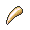

#  Quick Claw

**Category:** Hold

## Description
An item to be held by a Pokémon. A light, sharp claw that lets the bearer move first occasionally.

## Locations
| Route | Type | Info |
| --- | --- | --- |
| [Skyarrow Bridge](../routes/skyarrow-bridge.md) | General |  |

