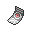

#  Spell Tag

**Category:** Hold

## Description
An item to be held by a Pokémon. It is a sinister, eerie tag that boosts the power of Ghost-type moves.

## Locations
| Route | Type | Info |
| --- | --- | --- |
| [Celestial Tower](../routes/celestial-tower.md) | General |  |

