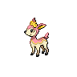
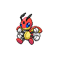
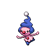
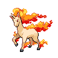
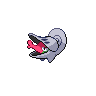
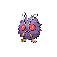

# Baton pass

**Type:**   
**Category:**   
**Power:** None  
**Accuracy:** None  
**PP:** 40  

## Description
Allows the trainer to switch out the user and pass effects along to its replacement.

## Learned by
| Sprite | Pokemon |
| --- | --- |
|  | [Absol](../pokemon/absol.md) |
|  | [Aipom](../pokemon/aipom.md) |
|  | [Ambipom](../pokemon/ambipom.md) |
|  | [Beedrill](../pokemon/beedrill.md) |
|  | [Buizel](../pokemon/buizel.md) |
|  | [Buneary](../pokemon/buneary.md) |
|  | [Butterfree](../pokemon/butterfree.md) |
|  | [Celebi](../pokemon/celebi.md) |
|  | [Deerling](../pokemon/deerling.md) |
|  | [Delibird](../pokemon/delibird.md) |
|  | [Drifblim](../pokemon/drifblim.md) |
|  | [Drifloon](../pokemon/drifloon.md) |
|  | [Durant](../pokemon/durant.md) |
|  | [Eevee](../pokemon/eevee.md) |
|  | [Emolga](../pokemon/emolga.md) |
|  | [Furret](../pokemon/furret.md) |
|  | [Girafarig](../pokemon/girafarig.md) |
|  | [Gligar](../pokemon/gligar.md) |
|  | [Gorebyss](../pokemon/gorebyss.md) |
|  | [Huntail](../pokemon/huntail.md) |
|  | [Illumise](../pokemon/illumise.md) |
|  | [Ledian](../pokemon/ledian.md) |
|  | [Ledyba](../pokemon/ledyba.md) |
|  | [Lopunny](../pokemon/lopunny.md) |
|  | [Mawile](../pokemon/mawile.md) |
|  | [Meditite](../pokemon/meditite.md) |
|  | [Mew](../pokemon/mew.md) |
|  | [Mienfoo](../pokemon/mienfoo.md) |
|  | [Mime-jr](../pokemon/mime-jr.md) |
|  | [Minun](../pokemon/minun.md) |
|  | [Mr-mime](../pokemon/mr-mime.md) |
|  | [Munna](../pokemon/munna.md) |
|  | [Ninjask](../pokemon/ninjask.md) |
|  | [Panpour](../pokemon/panpour.md) |
|  | [Pansage](../pokemon/pansage.md) |
|  | [Pansear](../pokemon/pansear.md) |
|  | [Patrat](../pokemon/patrat.md) |
|  | [Plusle](../pokemon/plusle.md) |
|  | [Ponyta](../pokemon/ponyta.md) |
|  | [Rapidash](../pokemon/rapidash.md) |
|  | [Scolipede](../pokemon/scolipede.md) |
|  | [Scyther](../pokemon/scyther.md) |
|  | [Sentret](../pokemon/sentret.md) |
|  | [Sewaddle](../pokemon/sewaddle.md) |
|  | [Shelmet](../pokemon/shelmet.md) |
|  | [Simipour](../pokemon/simipour.md) |
|  | [Simisage](../pokemon/simisage.md) |
|  | [Simisear](../pokemon/simisear.md) |
|  | [Skitty](../pokemon/skitty.md) |
|  | [Spinarak](../pokemon/spinarak.md) |
|  | [Spinda](../pokemon/spinda.md) |
|  | [Surskit](../pokemon/surskit.md) |
|  | [Togepi](../pokemon/togepi.md) |
|  | [Togetic](../pokemon/togetic.md) |
|  | [Torchic](../pokemon/torchic.md) |
|  | [Venonat](../pokemon/venonat.md) |
|  | [Volbeat](../pokemon/volbeat.md) |
|  | [Watchog](../pokemon/watchog.md) |
