# Bite

**TM/HM:** 

**Type:**   
**Category:** { style='object-fit:contain;' }  
**Power:** 60  
**Accuracy:** 100  
**PP:** 25  

## Description
Has a $effect_chance% chance to make the target flinch.

## Learned by
| Sprite | Pokemon |
| --- | --- |
|  | [Absol](../pokemon/absol.md) |
|  | [Aerodactyl](../pokemon/aerodactyl.md) |
|  | [Arbok](../pokemon/arbok.md) |
|  | [Arcanine](../pokemon/arcanine.md) |
|  | [Archen](../pokemon/archen.md) |
| 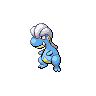 | [Bagon](../pokemon/bagon.md) |
|  | [Basculin](../pokemon/basculin.md) |
| 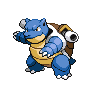 | [Blastoise](../pokemon/blastoise.md) |
|  | [Carnivine](../pokemon/carnivine.md) |
|  | [Carracosta](../pokemon/carracosta.md) |
|  | [Carvanha](../pokemon/carvanha.md) |
|  | [Charmander](../pokemon/charmander.md) |
|  | [Crobat](../pokemon/crobat.md) |
| 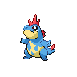 | [Croconaw](../pokemon/croconaw.md) |
|  | [Deino](../pokemon/deino.md) |
|  | [Drapion](../pokemon/drapion.md) |
|  | [Druddigon](../pokemon/druddigon.md) |
|  | [Dunsparce](../pokemon/dunsparce.md) |
|  | [Durant](../pokemon/durant.md) |
| 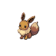 | [Eevee](../pokemon/eevee.md) |
|  | [Ekans](../pokemon/ekans.md) |
|  | [Electrike](../pokemon/electrike.md) |
|  | [Entei](../pokemon/entei.md) |
|  | [Exploud](../pokemon/exploud.md) |
| 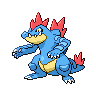 | [Feraligatr](../pokemon/feraligatr.md) |
|  | [Flareon](../pokemon/flareon.md) |
| 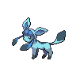 | [Glaceon](../pokemon/glaceon.md) |
|  | [Glalie](../pokemon/glalie.md) |
|  | [Glameow](../pokemon/glameow.md) |
|  | [Golbat](../pokemon/golbat.md) |
|  | [Granbull](../pokemon/granbull.md) |
| 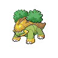 | [Grotle](../pokemon/grotle.md) |
|  | [Growlithe](../pokemon/growlithe.md) |
|  | [Gyarados](../pokemon/gyarados.md) |
|  | [Herdier](../pokemon/herdier.md) |
|  | [Hippopotas](../pokemon/hippopotas.md) |
| 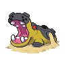 | [Hippowdon](../pokemon/hippowdon.md) |
|  | [Houndoom](../pokemon/houndoom.md) |
|  | [Houndour](../pokemon/houndour.md) |
| 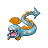 | [Huntail](../pokemon/huntail.md) |
|  | [Hydreigon](../pokemon/hydreigon.md) |
|  | [Kangaskhan](../pokemon/kangaskhan.md) |
|  | [Krokorok](../pokemon/krokorok.md) |
|  | [Krookodile](../pokemon/krookodile.md) |
|  | [Lapras](../pokemon/lapras.md) |
|  | [Larvitar](../pokemon/larvitar.md) |
|  | [Lillipup](../pokemon/lillipup.md) |
| 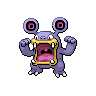 | [Loudred](../pokemon/loudred.md) |
|  | [Luxio](../pokemon/luxio.md) |
| 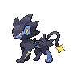 | [Luxray](../pokemon/luxray.md) |
| 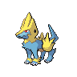 | [Manectric](../pokemon/manectric.md) |
|  | [Mawile](../pokemon/mawile.md) |
|  | [Meowth](../pokemon/meowth.md) |
|  | [Mightyena](../pokemon/mightyena.md) |
| 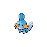 | [Mudkip](../pokemon/mudkip.md) |
| 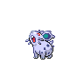 | [Nidoran♀](../pokemon/nidoran-f.md) |
| 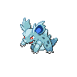 | [Nidorina](../pokemon/nidorina.md) |
| 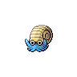 | [Omanyte](../pokemon/omanyte.md) |
|  | [Omastar](../pokemon/omastar.md) |
|  | [Pachirisu](../pokemon/pachirisu.md) |
|  | [Panpour](../pokemon/panpour.md) |
|  | [Pansage](../pokemon/pansage.md) |
|  | [Pansear](../pokemon/pansear.md) |
|  | [Patrat](../pokemon/patrat.md) |
|  | [Persian](../pokemon/persian.md) |
|  | [Poochyena](../pokemon/poochyena.md) |
|  | [Pupitar](../pokemon/pupitar.md) |
|  | [Purugly](../pokemon/purugly.md) |
|  | [Raikou](../pokemon/raikou.md) |
|  | [Raticate](../pokemon/raticate.md) |
|  | [Rattata](../pokemon/rattata.md) |
|  | [Riolu](../pokemon/riolu.md) |
|  | [Salamence](../pokemon/salamence.md) |
|  | [Sandile](../pokemon/sandile.md) |
|  | [Seviper](../pokemon/seviper.md) |
|  | [Sharpedo](../pokemon/sharpedo.md) |
|  | [Shelgon](../pokemon/shelgon.md) |
|  | [Shinx](../pokemon/shinx.md) |
|  | [Skorupi](../pokemon/skorupi.md) |
|  | [Sneasel](../pokemon/sneasel.md) |
|  | [Snorunt](../pokemon/snorunt.md) |
|  | [Snubbull](../pokemon/snubbull.md) |
| 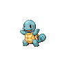 | [Squirtle](../pokemon/squirtle.md) |
| 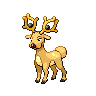 | [Stantler](../pokemon/stantler.md) |
|  | [Stoutland](../pokemon/stoutland.md) |
|  | [Suicune](../pokemon/suicune.md) |
| 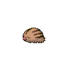 | [Swinub](../pokemon/swinub.md) |
|  | [Thundurus](../pokemon/thundurus.md) |
| 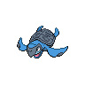 | [Tirtouga](../pokemon/tirtouga.md) |
|  | [Tornadus](../pokemon/tornadus.md) |
|  | [Torterra](../pokemon/torterra.md) |
|  | [Totodile](../pokemon/totodile.md) |
|  | [Trapinch](../pokemon/trapinch.md) |
|  | [Turtwig](../pokemon/turtwig.md) |
|  | [Tyranitar](../pokemon/tyranitar.md) |
|  | [Vaporeon](../pokemon/vaporeon.md) |
|  | [Wartortle](../pokemon/wartortle.md) |
| 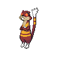 | [Watchog](../pokemon/watchog.md) |
|  | [Zubat](../pokemon/zubat.md) |
| 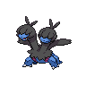 | [Zweilous](../pokemon/zweilous.md) |
