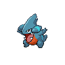

# Body slam

**Type:**   
**Category:**   
**Power:** 85  
**Accuracy:** 100  
**PP:** 15  

## Description
Has a $effect_chance% chance to paralyze the target.

## Learned by
| Sprite | Pokemon |
| --- | --- |
|  | [Amoonguss](../pokemon/amoonguss.md) |
|  | [Aron](../pokemon/aron.md) |
|  | [Azurill](../pokemon/azurill.md) |
|  | [Bayleef](../pokemon/bayleef.md) |
|  | [Chikorita](../pokemon/chikorita.md) |
|  | [Clamperl](../pokemon/clamperl.md) |
|  | [Clefairy](../pokemon/clefairy.md) |
|  | [Corphish](../pokemon/corphish.md) |
|  | [Deino](../pokemon/deino.md) |
|  | [Drifloon](../pokemon/drifloon.md) |
|  | [Foongus](../pokemon/foongus.md) |
|  | [Garbodor](../pokemon/garbodor.md) |
|  | [Gastrodon](../pokemon/gastrodon.md) |
|  | [Gible](../pokemon/gible.md) |
|  | [Goldeen](../pokemon/goldeen.md) |
|  | [Growlithe](../pokemon/growlithe.md) |
|  | [Heatmor](../pokemon/heatmor.md) |
|  | [Hippopotas](../pokemon/hippopotas.md) |
|  | [Hydreigon](../pokemon/hydreigon.md) |
|  | [Jigglypuff](../pokemon/jigglypuff.md) |
|  | [Jynx](../pokemon/jynx.md) |
|  | [Kyogre](../pokemon/kyogre.md) |
|  | [Lapras](../pokemon/lapras.md) |
|  | [Lickitung](../pokemon/lickitung.md) |
|  | [Magcargo](../pokemon/magcargo.md) |
|  | [Mamoswine](../pokemon/mamoswine.md) |
|  | [Mareep](../pokemon/mareep.md) |
|  | [Marill](../pokemon/marill.md) |
|  | [Meganium](../pokemon/meganium.md) |
|  | [Miltank](../pokemon/miltank.md) |
|  | [Munchlax](../pokemon/munchlax.md) |
|  | [Nidoqueen](../pokemon/nidoqueen.md) |
|  | [Numel](../pokemon/numel.md) |
|  | [Phanpy](../pokemon/phanpy.md) |
|  | [Piloswine](../pokemon/piloswine.md) |
|  | [Poliwag](../pokemon/poliwag.md) |
|  | [Poliwhirl](../pokemon/poliwhirl.md) |
|  | [Purugly](../pokemon/purugly.md) |
|  | [Quagsire](../pokemon/quagsire.md) |
|  | [Seaking](../pokemon/seaking.md) |
|  | [Sealeo](../pokemon/sealeo.md) |
|  | [Seviper](../pokemon/seviper.md) |
|  | [Shellos](../pokemon/shellos.md) |
|  | [Shelmet](../pokemon/shelmet.md) |
|  | [Shieldon](../pokemon/shieldon.md) |
|  | [Slakoth](../pokemon/slakoth.md) |
|  | [Slugma](../pokemon/slugma.md) |
|  | [Snorlax](../pokemon/snorlax.md) |
|  | [Spheal](../pokemon/spheal.md) |
|  | [Swalot](../pokemon/swalot.md) |
|  | [Swinub](../pokemon/swinub.md) |
|  | [Tepig](../pokemon/tepig.md) |
|  | [Throh](../pokemon/throh.md) |
|  | [Tirtouga](../pokemon/tirtouga.md) |
|  | [Torkoal](../pokemon/torkoal.md) |
|  | [Tropius](../pokemon/tropius.md) |
|  | [Turtwig](../pokemon/turtwig.md) |
|  | [Wailmer](../pokemon/wailmer.md) |
|  | [Walrein](../pokemon/walrein.md) |
|  | [Wooper](../pokemon/wooper.md) |
|  | [Zweilous](../pokemon/zweilous.md) |
