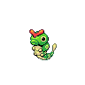

# Bug bite

**Type:**   
**Category:**   
**Power:** 60  
**Accuracy:** 100  
**PP:** 20  

## Description
If target has a berry, inflicts double damage and uses the berry.

## Learned by
| Sprite | Pokemon |
| --- | --- |
|  | [Accelgor](../pokemon/accelgor.md) |
|  | [Anorith](../pokemon/anorith.md) |
|  | [Ariados](../pokemon/ariados.md) |
|  | [Armaldo](../pokemon/armaldo.md) |
|  | [Beautifly](../pokemon/beautifly.md) |
|  | [Beedrill](../pokemon/beedrill.md) |
|  | [Burmy](../pokemon/burmy.md) |
|  | [Butterfree](../pokemon/butterfree.md) |
|  | [Carnivine](../pokemon/carnivine.md) |
|  | [Cascoon](../pokemon/cascoon.md) |
|  | [Caterpie](../pokemon/caterpie.md) |
|  | [Combee](../pokemon/combee.md) |
|  | [Crustle](../pokemon/crustle.md) |
|  | [Drapion](../pokemon/drapion.md) |
|  | [Durant](../pokemon/durant.md) |
|  | [Dustox](../pokemon/dustox.md) |
|  | [Dwebble](../pokemon/dwebble.md) |
|  | [Escavalier](../pokemon/escavalier.md) |
|  | [Flygon](../pokemon/flygon.md) |
|  | [Forretress](../pokemon/forretress.md) |
|  | [Galvantula](../pokemon/galvantula.md) |
|  | [Genesect](../pokemon/genesect.md) |
|  | [Gligar](../pokemon/gligar.md) |
|  | [Gliscor](../pokemon/gliscor.md) |
|  | [Heatmor](../pokemon/heatmor.md) |
|  | [Heatran](../pokemon/heatran.md) |
|  | [Heracross](../pokemon/heracross.md) |
|  | [Illumise](../pokemon/illumise.md) |
|  | [Joltik](../pokemon/joltik.md) |
|  | [Kakuna](../pokemon/kakuna.md) |
|  | [Karrablast](../pokemon/karrablast.md) |
|  | [Kricketot](../pokemon/kricketot.md) |
|  | [Kricketune](../pokemon/kricketune.md) |
|  | [Larvesta](../pokemon/larvesta.md) |
|  | [Leavanny](../pokemon/leavanny.md) |
|  | [Ledian](../pokemon/ledian.md) |
|  | [Ledyba](../pokemon/ledyba.md) |
|  | [Masquerain](../pokemon/masquerain.md) |
|  | [Metapod](../pokemon/metapod.md) |
|  | [Mew](../pokemon/mew.md) |
|  | [Mothim](../pokemon/mothim.md) |
|  | [Nincada](../pokemon/nincada.md) |
|  | [Ninjask](../pokemon/ninjask.md) |
|  | [Paras](../pokemon/paras.md) |
|  | [Parasect](../pokemon/parasect.md) |
|  | [Pineco](../pokemon/pineco.md) |
|  | [Pinsir](../pokemon/pinsir.md) |
|  | [Scizor](../pokemon/scizor.md) |
|  | [Scolipede](../pokemon/scolipede.md) |
|  | [Scyther](../pokemon/scyther.md) |
|  | [Sewaddle](../pokemon/sewaddle.md) |
|  | [Shedinja](../pokemon/shedinja.md) |
|  | [Shelmet](../pokemon/shelmet.md) |
|  | [Shuckle](../pokemon/shuckle.md) |
|  | [Silcoon](../pokemon/silcoon.md) |
|  | [Skorupi](../pokemon/skorupi.md) |
|  | [Spinarak](../pokemon/spinarak.md) |
|  | [Surskit](../pokemon/surskit.md) |
|  | [Swadloon](../pokemon/swadloon.md) |
|  | [Trapinch](../pokemon/trapinch.md) |
|  | [Venipede](../pokemon/venipede.md) |
|  | [Venomoth](../pokemon/venomoth.md) |
|  | [Venonat](../pokemon/venonat.md) |
|  | [Vespiquen](../pokemon/vespiquen.md) |
|  | [Vibrava](../pokemon/vibrava.md) |
|  | [Victreebel](../pokemon/victreebel.md) |
|  | [Volbeat](../pokemon/volbeat.md) |
|  | [Volcarona](../pokemon/volcarona.md) |
|  | [Weedle](../pokemon/weedle.md) |
|  | [Weepinbell](../pokemon/weepinbell.md) |
|  | [Whirlipede](../pokemon/whirlipede.md) |
|  | [Wormadam](../pokemon/wormadam.md) |
|  | [Wurmple](../pokemon/wurmple.md) |
|  | [Yanma](../pokemon/yanma.md) |
|  | [Yanmega](../pokemon/yanmega.md) |
