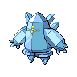
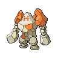
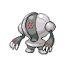

# Bulldoze

**TM/HM:** TM78

**Type:**   
**Category:** { style='object-fit:contain;' }  
**Power:** 80 60  
**Accuracy:** 100  
**PP:** 20  

## Description
Has a 100% chance to lower the target’s Speed by one stage.

## Learned by
| Sprite | Pokemon |
| --- | --- |
|  | [Abomasnow](../pokemon/abomasnow.md) |
|  | [Aerodactyl](../pokemon/aerodactyl.md) |
|  | [Aggron](../pokemon/aggron.md) |
|  | [Altaria](../pokemon/altaria.md) |
|  | [Ampharos](../pokemon/ampharos.md) |
|  | [Arbok](../pokemon/arbok.md) |
|  | [Arcanine](../pokemon/arcanine.md) |
|  | [Arceus](../pokemon/arceus.md) |
|  | [Archen](../pokemon/archen.md) |
|  | [Archeops](../pokemon/archeops.md) |
|  | [Armaldo](../pokemon/armaldo.md) |
|  | [Aron](../pokemon/aron.md) |
|  | [Azumarill](../pokemon/azumarill.md) |
|  | [Baltoy](../pokemon/baltoy.md) |
|  | [Barboach](../pokemon/barboach.md) |
|  | [Bastiodon](../pokemon/bastiodon.md) |
|  | [Beartic](../pokemon/beartic.md) |
|  | [Bibarel](../pokemon/bibarel.md) |
|  | [Blastoise](../pokemon/blastoise.md) |
|  | [Blaziken](../pokemon/blaziken.md) |
|  | [Blissey](../pokemon/blissey.md) |
|  | [Boldore](../pokemon/boldore.md) |
|  | [Bouffalant](../pokemon/bouffalant.md) |
|  | [Bronzong](../pokemon/bronzong.md) |
|  | [Bronzor](../pokemon/bronzor.md) |
|  | [Camerupt](../pokemon/camerupt.md) |
|  | [Carracosta](../pokemon/carracosta.md) |
|  | [Chansey](../pokemon/chansey.md) |
|  | [Charizard](../pokemon/charizard.md) |
|  | [Claydol](../pokemon/claydol.md) |
|  | [Conkeldurr](../pokemon/conkeldurr.md) |
|  | [Corsola](../pokemon/corsola.md) |
|  | [Cradily](../pokemon/cradily.md) |
|  | [Cranidos](../pokemon/cranidos.md) |
|  | [Croagunk](../pokemon/croagunk.md) |
|  | [Crustle](../pokemon/crustle.md) |
|  | [Cubone](../pokemon/cubone.md) |
|  | [Darmanitan](../pokemon/darmanitan.md) |
|  | [Dialga](../pokemon/dialga.md) |
|  | [Diglett](../pokemon/diglett.md) |
|  | [Donphan](../pokemon/donphan.md) |
|  | [Dragonite](../pokemon/dragonite.md) |
|  | [Drapion](../pokemon/drapion.md) |
|  | [Drilbur](../pokemon/drilbur.md) |
|  | [Druddigon](../pokemon/druddigon.md) |
|  | [Dugtrio](../pokemon/dugtrio.md) |
|  | [Dunsparce](../pokemon/dunsparce.md) |
|  | [Dusclops](../pokemon/dusclops.md) |
|  | [Dusknoir](../pokemon/dusknoir.md) |
|  | [Dwebble](../pokemon/dwebble.md) |
|  | [Ekans](../pokemon/ekans.md) |
|  | [Electivire](../pokemon/electivire.md) |
|  | [Emboar](../pokemon/emboar.md) |
|  | [Empoleon](../pokemon/empoleon.md) |
|  | [Entei](../pokemon/entei.md) |
|  | [Excadrill](../pokemon/excadrill.md) |
|  | [Exploud](../pokemon/exploud.md) |
|  | [Feraligatr](../pokemon/feraligatr.md) |
|  | [Ferrothorn](../pokemon/ferrothorn.md) |
|  | [Flygon](../pokemon/flygon.md) |
|  | [Forretress](../pokemon/forretress.md) |
|  | [Gabite](../pokemon/gabite.md) |
|  | [Gallade](../pokemon/gallade.md) |
|  | [Garchomp](../pokemon/garchomp.md) |
|  | [Gastrodon](../pokemon/gastrodon.md) |
|  | [Geodude](../pokemon/geodude.md) |
|  | [Gible](../pokemon/gible.md) |
|  | [Gigalith](../pokemon/gigalith.md) |
|  | [Girafarig](../pokemon/girafarig.md) |
|  | [Giratina](../pokemon/giratina.md) |
|  | [Glalie](../pokemon/glalie.md) |
|  | [Gligar](../pokemon/gligar.md) |
|  | [Gliscor](../pokemon/gliscor.md) |
|  | [Golem](../pokemon/golem.md) |
|  | [Golett](../pokemon/golett.md) |
|  | [Golurk](../pokemon/golurk.md) |
|  | [Granbull](../pokemon/granbull.md) |
|  | [Graveler](../pokemon/graveler.md) |
|  | [Groudon](../pokemon/groudon.md) |
|  | [Grumpig](../pokemon/grumpig.md) |
|  | [Gyarados](../pokemon/gyarados.md) |
|  | [Hariyama](../pokemon/hariyama.md) |
|  | [Haxorus](../pokemon/haxorus.md) |
|  | [Heatran](../pokemon/heatran.md) |
|  | [Heracross](../pokemon/heracross.md) |
|  | [Hippopotas](../pokemon/hippopotas.md) |
|  | [Hippowdon](../pokemon/hippowdon.md) |
|  | [Hitmonchan](../pokemon/hitmonchan.md) |
|  | [Hitmonlee](../pokemon/hitmonlee.md) |
|  | [Hitmontop](../pokemon/hitmontop.md) |
|  | [Ho-Oh](../pokemon/ho-oh.md) |
|  | [Hydreigon](../pokemon/hydreigon.md) |
|  | [Infernape](../pokemon/infernape.md) |
|  | [Kangaskhan](../pokemon/kangaskhan.md) |
|  | [Krokorok](../pokemon/krokorok.md) |
|  | [Krookodile](../pokemon/krookodile.md) |
|  | [Kyogre](../pokemon/kyogre.md) |
|  | [Lairon](../pokemon/lairon.md) |
|  | [Landorus](../pokemon/landorus.md) |
|  | [Lapras](../pokemon/lapras.md) |
|  | [Larvitar](../pokemon/larvitar.md) |
|  | [Latias](../pokemon/latias.md) |
|  | [Latios](../pokemon/latios.md) |
|  | [Lickilicky](../pokemon/lickilicky.md) |
|  | [Lickitung](../pokemon/lickitung.md) |
|  | [Loudred](../pokemon/loudred.md) |
|  | [Lucario](../pokemon/lucario.md) |
|  | [Lugia](../pokemon/lugia.md) |
|  | [Lunatone](../pokemon/lunatone.md) |
|  | [Machamp](../pokemon/machamp.md) |
|  | [Machoke](../pokemon/machoke.md) |
|  | [Machop](../pokemon/machop.md) |
|  | [Magcargo](../pokemon/magcargo.md) |
|  | [Magmortar](../pokemon/magmortar.md) |
|  | [Makuhita](../pokemon/makuhita.md) |
|  | [Mamoswine](../pokemon/mamoswine.md) |
|  | [Mankey](../pokemon/mankey.md) |
|  | [Mantine](../pokemon/mantine.md) |
|  | [Mantyke](../pokemon/mantyke.md) |
|  | [Marowak](../pokemon/marowak.md) |
|  | [Marshtomp](../pokemon/marshtomp.md) |
|  | [Meganium](../pokemon/meganium.md) |
|  | [Metagross](../pokemon/metagross.md) |
|  | [Metang](../pokemon/metang.md) |
|  | [Mew](../pokemon/mew.md) |
|  | [Mewtwo](../pokemon/mewtwo.md) |
|  | [Milotic](../pokemon/milotic.md) |
|  | [Miltank](../pokemon/miltank.md) |
|  | [Munchlax](../pokemon/munchlax.md) |
|  | [Nidoking](../pokemon/nidoking.md) |
|  | [Nidoqueen](../pokemon/nidoqueen.md) |
|  | [Nosepass](../pokemon/nosepass.md) |
|  | [Numel](../pokemon/numel.md) |
|  | [Onix](../pokemon/onix.md) |
|  | [Palkia](../pokemon/palkia.md) |
|  | [Palpitoad](../pokemon/palpitoad.md) |
|  | [Phanpy](../pokemon/phanpy.md) |
|  | [Pignite](../pokemon/pignite.md) |
|  | [Piloswine](../pokemon/piloswine.md) |
|  | [Pineco](../pokemon/pineco.md) |
|  | [Pinsir](../pokemon/pinsir.md) |
|  | [Politoed](../pokemon/politoed.md) |
|  | [Poliwhirl](../pokemon/poliwhirl.md) |
|  | [Poliwrath](../pokemon/poliwrath.md) |
|  | [Primeape](../pokemon/primeape.md) |
|  | [Probopass](../pokemon/probopass.md) |
|  | [Pupitar](../pokemon/pupitar.md) |
|  | [Purugly](../pokemon/purugly.md) |
|  | [Quagsire](../pokemon/quagsire.md) |
|  | [Raikou](../pokemon/raikou.md) |
|  | [Rampardos](../pokemon/rampardos.md) |
|  | [Rayquaza](../pokemon/rayquaza.md) |
|  | [Regice](../pokemon/regice.md) |
|  | [Regigigas](../pokemon/regigigas.md) |
|  | [Regirock](../pokemon/regirock.md) |
|  | [Registeel](../pokemon/registeel.md) |
|  | [Relicanth](../pokemon/relicanth.md) |
|  | [Rhydon](../pokemon/rhydon.md) |
|  | [Rhyhorn](../pokemon/rhyhorn.md) |
|  | [Rhyperior](../pokemon/rhyperior.md) |
|  | [Riolu](../pokemon/riolu.md) |
|  | [Roggenrola](../pokemon/roggenrola.md) |
|  | [Salamence](../pokemon/salamence.md) |
|  | [Sandile](../pokemon/sandile.md) |
|  | [Sandshrew](../pokemon/sandshrew.md) |
|  | [Sandslash](../pokemon/sandslash.md) |
|  | [Sawk](../pokemon/sawk.md) |
|  | [Sceptile](../pokemon/sceptile.md) |
|  | [Scolipede](../pokemon/scolipede.md) |
|  | [Sealeo](../pokemon/sealeo.md) |
|  | [Seismitoad](../pokemon/seismitoad.md) |
|  | [Seviper](../pokemon/seviper.md) |
|  | [Sharpedo](../pokemon/sharpedo.md) |
|  | [Shieldon](../pokemon/shieldon.md) |
|  | [Shuckle](../pokemon/shuckle.md) |
|  | [Slaking](../pokemon/slaking.md) |
|  | [Slowbro](../pokemon/slowbro.md) |
|  | [Slowking](../pokemon/slowking.md) |
|  | [Slowpoke](../pokemon/slowpoke.md) |
|  | [Snorlax](../pokemon/snorlax.md) |
|  | [Snubbull](../pokemon/snubbull.md) |
|  | [Solrock](../pokemon/solrock.md) |
|  | [Spheal](../pokemon/spheal.md) |
|  | [Stantler](../pokemon/stantler.md) |
|  | [Steelix](../pokemon/steelix.md) |
|  | [Stunfisk](../pokemon/stunfisk.md) |
|  | [Sudowoodo](../pokemon/sudowoodo.md) |
|  | [Suicune](../pokemon/suicune.md) |
|  | [Swalot](../pokemon/swalot.md) |
|  | [Swampert](../pokemon/swampert.md) |
|  | [Swinub](../pokemon/swinub.md) |
|  | [Tangrowth](../pokemon/tangrowth.md) |
|  | [Tauros](../pokemon/tauros.md) |
|  | [Teddiursa](../pokemon/teddiursa.md) |
|  | [Terrakion](../pokemon/terrakion.md) |
|  | [Throh](../pokemon/throh.md) |
|  | [Tirtouga](../pokemon/tirtouga.md) |
|  | [Torkoal](../pokemon/torkoal.md) |
|  | [Torterra](../pokemon/torterra.md) |
|  | [Toxicroak](../pokemon/toxicroak.md) |
|  | [Trapinch](../pokemon/trapinch.md) |
|  | [Tropius](../pokemon/tropius.md) |
|  | [Typhlosion](../pokemon/typhlosion.md) |
|  | [Tyranitar](../pokemon/tyranitar.md) |
|  | [Tyrogue](../pokemon/tyrogue.md) |
|  | [Ursaring](../pokemon/ursaring.md) |
|  | [Venusaur](../pokemon/venusaur.md) |
|  | [Vibrava](../pokemon/vibrava.md) |
|  | [Vigoroth](../pokemon/vigoroth.md) |
|  | [Wailmer](../pokemon/wailmer.md) |
|  | [Wailord](../pokemon/wailord.md) |
|  | [Walrein](../pokemon/walrein.md) |
|  | [Whiscash](../pokemon/whiscash.md) |
|  | [Wooper](../pokemon/wooper.md) |
