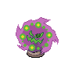

# Confuse ray

**Type:**   
**Category:**   
**Power:** None  
**Accuracy:** 100  
**PP:** 10  

## Description
Confuses the target.

## Learned by
| Sprite | Pokemon |
| --- | --- |
|  | [Ampharos](../pokemon/ampharos.md) |
|  | [Bronzong](../pokemon/bronzong.md) |
|  | [Bronzor](../pokemon/bronzor.md) |
|  | [Chandelure](../pokemon/chandelure.md) |
|  | [Chinchou](../pokemon/chinchou.md) |
|  | [Clamperl](../pokemon/clamperl.md) |
|  | [Corsola](../pokemon/corsola.md) |
|  | [Cradily](../pokemon/cradily.md) |
|  | [Crobat](../pokemon/crobat.md) |
|  | [Cryogonal](../pokemon/cryogonal.md) |
|  | [Duosion](../pokemon/duosion.md) |
|  | [Dusclops](../pokemon/dusclops.md) |
|  | [Dusknoir](../pokemon/dusknoir.md) |
|  | [Duskull](../pokemon/duskull.md) |
|  | [Feebas](../pokemon/feebas.md) |
|  | [Flaaffy](../pokemon/flaaffy.md) |
|  | [Froslass](../pokemon/froslass.md) |
|  | [Gastly](../pokemon/gastly.md) |
|  | [Gengar](../pokemon/gengar.md) |
|  | [Golbat](../pokemon/golbat.md) |
|  | [Grumpig](../pokemon/grumpig.md) |
|  | [Haunter](../pokemon/haunter.md) |
|  | [Illumise](../pokemon/illumise.md) |
|  | [Kabuto](../pokemon/kabuto.md) |
|  | [Lampent](../pokemon/lampent.md) |
|  | [Lanturn](../pokemon/lanturn.md) |
|  | [Lapras](../pokemon/lapras.md) |
|  | [Lileep](../pokemon/lileep.md) |
|  | [Litwick](../pokemon/litwick.md) |
|  | [Magby](../pokemon/magby.md) |
|  | [Magmar](../pokemon/magmar.md) |
|  | [Magmortar](../pokemon/magmortar.md) |
|  | [Mantine](../pokemon/mantine.md) |
|  | [Mantyke](../pokemon/mantyke.md) |
|  | [Mareep](../pokemon/mareep.md) |
|  | [Mime-jr](../pokemon/mime-jr.md) |
|  | [Misdreavus](../pokemon/misdreavus.md) |
|  | [Mr-mime](../pokemon/mr-mime.md) |
|  | [Murkrow](../pokemon/murkrow.md) |
|  | [Natu](../pokemon/natu.md) |
|  | [Ninetales](../pokemon/ninetales.md) |
|  | [Psyduck](../pokemon/psyduck.md) |
|  | [Ralts](../pokemon/ralts.md) |
|  | [Regigigas](../pokemon/regigigas.md) |
|  | [Reuniclus](../pokemon/reuniclus.md) |
|  | [Rotom](../pokemon/rotom.md) |
|  | [Sableye](../pokemon/sableye.md) |
|  | [Shedinja](../pokemon/shedinja.md) |
|  | [Shuppet](../pokemon/shuppet.md) |
|  | [Skorupi](../pokemon/skorupi.md) |
|  | [Solosis](../pokemon/solosis.md) |
|  | [Spiritomb](../pokemon/spiritomb.md) |
|  | [Spoink](../pokemon/spoink.md) |
|  | [Stantler](../pokemon/stantler.md) |
|  | [Starmie](../pokemon/starmie.md) |
|  | [Tentacool](../pokemon/tentacool.md) |
|  | [Tentacruel](../pokemon/tentacruel.md) |
|  | [Umbreon](../pokemon/umbreon.md) |
|  | [Vespiquen](../pokemon/vespiquen.md) |
|  | [Volbeat](../pokemon/volbeat.md) |
|  | [Vulpix](../pokemon/vulpix.md) |
|  | [Watchog](../pokemon/watchog.md) |
|  | [Xatu](../pokemon/xatu.md) |
|  | [Zubat](../pokemon/zubat.md) |
