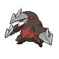
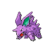
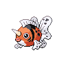

# Drill Run

**TM/HM:** [-](../items/-.md)

**Type:**   
**Category:** { style='object-fit:contain;' }  
**Power:** 80  
**Accuracy:** 95  
**PP:** 10  

## Description
Has an increased chance for a critical hit.

## Learned by
| Sprite | Pokemon |
| --- | --- |
|  | [Baltoy](../pokemon/baltoy.md) |
|  | [Beedrill](../pokemon/beedrill.md) |
|  | [Claydol](../pokemon/claydol.md) |
|  | [Dewgong](../pokemon/dewgong.md) |
|  | [Dodrio](../pokemon/dodrio.md) |
|  | [Drilbur](../pokemon/drilbur.md) |
|  | [Dunsparce](../pokemon/dunsparce.md) |
|  | [Escavalier](../pokemon/escavalier.md) |
|  | [Excadrill](../pokemon/excadrill.md) |
|  | [Fearow](../pokemon/fearow.md) |
|  | [Forretress](../pokemon/forretress.md) |
|  | [Goldeen](../pokemon/goldeen.md) |
|  | [Hitmontop](../pokemon/hitmontop.md) |
|  | [Lapras](../pokemon/lapras.md) |
|  | [Mew](../pokemon/mew.md) |
|  | [Nidoking](../pokemon/nidoking.md) |
|  | [Nidoran♂](../pokemon/nidoran-m.md) |
|  | [Nidorino](../pokemon/nidorino.md) |
|  | [Pineco](../pokemon/pineco.md) |
|  | [Rapidash](../pokemon/rapidash.md) |
|  | [Rhydon](../pokemon/rhydon.md) |
|  | [Rhyhorn](../pokemon/rhyhorn.md) |
|  | [Rhyperior](../pokemon/rhyperior.md) |
|  | [Seaking](../pokemon/seaking.md) |
|  | [Seel](../pokemon/seel.md) |
|  | [Spearow](../pokemon/spearow.md) |
