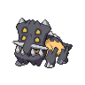

# Endure

**TM/HM:** 

**Type:**   
**Category:** { style='object-fit:contain;' }  
**Power:** -  
**Accuracy:** -  
**PP:** 10  

## Description
Prevents the user’s HP from lowering below 1 this turn.

## Learned by
| Sprite | Pokemon |
| --- | --- |
|  | [Alomomola](../pokemon/alomomola.md) |
|  | [Axew](../pokemon/axew.md) |
|  | [Bagon](../pokemon/bagon.md) |
|  | [Bastiodon](../pokemon/bastiodon.md) |
|  | [Beartic](../pokemon/beartic.md) |
|  | [Bidoof](../pokemon/bidoof.md) |
|  | [Blitzle](../pokemon/blitzle.md) |
|  | [Bonsly](../pokemon/bonsly.md) |
|  | [Bulbasaur](../pokemon/bulbasaur.md) |
|  | [Buneary](../pokemon/buneary.md) |
|  | [Chansey](../pokemon/chansey.md) |
|  | [Clamperl](../pokemon/clamperl.md) |
|  | [Corsola](../pokemon/corsola.md) |
|  | [Cubchoo](../pokemon/cubchoo.md) |
|  | [Cubone](../pokemon/cubone.md) |
|  | [Darumaka](../pokemon/darumaka.md) |
|  | [Diglett](../pokemon/diglett.md) |
|  | [Dunsparce](../pokemon/dunsparce.md) |
|  | [Durant](../pokemon/durant.md) |
|  | [Dwebble](../pokemon/dwebble.md) |
|  | [Eevee](../pokemon/eevee.md) |
|  | [Foongus](../pokemon/foongus.md) |
|  | [Geodude](../pokemon/geodude.md) |
|  | [Happiny](../pokemon/happiny.md) |
|  | [Hariyama](../pokemon/hariyama.md) |
|  | [Heracross](../pokemon/heracross.md) |
|  | [Hitmonlee](../pokemon/hitmonlee.md) |
|  | [Hoppip](../pokemon/hoppip.md) |
|  | [Kabuto](../pokemon/kabuto.md) |
|  | [Kabutops](../pokemon/kabutops.md) |
|  | [Kangaskhan](../pokemon/kangaskhan.md) |
|  | [Karrablast](../pokemon/karrablast.md) |
|  | [Krabby](../pokemon/krabby.md) |
|  | [Larvesta](../pokemon/larvesta.md) |
|  | [Lileep](../pokemon/lileep.md) |
|  | [Lillipup](../pokemon/lillipup.md) |
|  | [Litwick](../pokemon/litwick.md) |
|  | [Lopunny](../pokemon/lopunny.md) |
|  | [Makuhita](../pokemon/makuhita.md) |
|  | [Mamoswine](../pokemon/mamoswine.md) |
|  | [Mienfoo](../pokemon/mienfoo.md) |
|  | [Miltank](../pokemon/miltank.md) |
|  | [Minccino](../pokemon/minccino.md) |
|  | [Moltres](../pokemon/moltres.md) |
|  | [Nidoran-f](../pokemon/nidoran-f.md) |
|  | [Nidoran-m](../pokemon/nidoran-m.md) |
|  | [Nincada](../pokemon/nincada.md) |
|  | [Nosepass](../pokemon/nosepass.md) |
|  | [Numel](../pokemon/numel.md) |
|  | [Pachirisu](../pokemon/pachirisu.md) |
|  | [Paras](../pokemon/paras.md) |
|  | [Petilil](../pokemon/petilil.md) |
|  | [Phanpy](../pokemon/phanpy.md) |
|  | [Pichu](../pokemon/pichu.md) |
|  | [Piloswine](../pokemon/piloswine.md) |
|  | [Pineco](../pokemon/pineco.md) |
|  | [Poliwag](../pokemon/poliwag.md) |
|  | [Riolu](../pokemon/riolu.md) |
|  | [Sandshrew](../pokemon/sandshrew.md) |
|  | [Sawk](../pokemon/sawk.md) |
|  | [Scyther](../pokemon/scyther.md) |
|  | [Sewaddle](../pokemon/sewaddle.md) |
|  | [Shelmet](../pokemon/shelmet.md) |
|  | [Shieldon](../pokemon/shieldon.md) |
|  | [Skarmory](../pokemon/skarmory.md) |
|  | [Spoink](../pokemon/spoink.md) |
|  | [Stunfisk](../pokemon/stunfisk.md) |
|  | [Sudowoodo](../pokemon/sudowoodo.md) |
|  | [Sunkern](../pokemon/sunkern.md) |
|  | [Surskit](../pokemon/surskit.md) |
|  | [Swinub](../pokemon/swinub.md) |
|  | [Throh](../pokemon/throh.md) |
|  | [Timburr](../pokemon/timburr.md) |
|  | [Torchic](../pokemon/torchic.md) |
|  | [Torkoal](../pokemon/torkoal.md) |
|  | [Trapinch](../pokemon/trapinch.md) |
|  | [Tyrogue](../pokemon/tyrogue.md) |
|  | [Uxie](../pokemon/uxie.md) |
|  | [Victini](../pokemon/victini.md) |
|  | [Vigoroth](../pokemon/vigoroth.md) |
|  | [Yamask](../pokemon/yamask.md) |
