# Fly

**Type:**   
**Category:**   
**Power:** 90  
**Accuracy:** 95  
**PP:** 15  

## Description
User flies high into the air, dodging all attacks, and hits next turn.

## Learned by
| Sprite | Pokemon |
| --- | --- |
|  | [Aerodactyl](../pokemon/aerodactyl.md) |
| 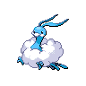 | [Altaria](../pokemon/altaria.md) |
|  | [Arceus](../pokemon/arceus.md) |
|  | [Archeops](../pokemon/archeops.md) |
| 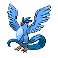 | [Articuno](../pokemon/articuno.md) |
| 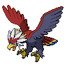 | [Braviary](../pokemon/braviary.md) |
|  | [Bronzong](../pokemon/bronzong.md) |
| 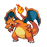 | [Charizard](../pokemon/charizard.md) |
| 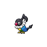 | [Chatot](../pokemon/chatot.md) |
|  | [Claydol](../pokemon/claydol.md) |
|  | [Crobat](../pokemon/crobat.md) |
|  | [Delibird](../pokemon/delibird.md) |
|  | [Dodrio](../pokemon/dodrio.md) |
|  | [Doduo](../pokemon/doduo.md) |
| 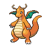 | [Dragonite](../pokemon/dragonite.md) |
|  | [Drifblim](../pokemon/drifblim.md) |
|  | [Druddigon](../pokemon/druddigon.md) |
|  | [Ducklett](../pokemon/ducklett.md) |
|  | [Farfetchd](../pokemon/farfetchd.md) |
| 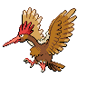 | [Fearow](../pokemon/fearow.md) |
| 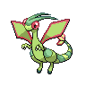 | [Flygon](../pokemon/flygon.md) |
| 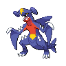 | [Garchomp](../pokemon/garchomp.md) |
|  | [Genesect](../pokemon/genesect.md) |
|  | [Giratina](../pokemon/giratina.md) |
|  | [Gliscor](../pokemon/gliscor.md) |
|  | [Golbat](../pokemon/golbat.md) |
|  | [Golurk](../pokemon/golurk.md) |
|  | [Ho-Oh](../pokemon/ho-oh.md) |
|  | [Honchkrow](../pokemon/honchkrow.md) |
| 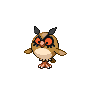 | [Hoothoot](../pokemon/hoothoot.md) |
|  | [Hydreigon](../pokemon/hydreigon.md) |
|  | [Kyurem](../pokemon/kyurem.md) |
|  | [Landorus](../pokemon/landorus.md) |
|  | [Latias](../pokemon/latias.md) |
| 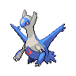 | [Latios](../pokemon/latios.md) |
|  | [Lugia](../pokemon/lugia.md) |
|  | [Mandibuzz](../pokemon/mandibuzz.md) |
|  | [Mantine](../pokemon/mantine.md) |
|  | [Metagross](../pokemon/metagross.md) |
|  | [Mew](../pokemon/mew.md) |
| 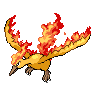 | [Moltres](../pokemon/moltres.md) |
|  | [Murkrow](../pokemon/murkrow.md) |
|  | [Noctowl](../pokemon/noctowl.md) |
|  | [Pelipper](../pokemon/pelipper.md) |
|  | [Pidgeot](../pokemon/pidgeot.md) |
|  | [Pidgeotto](../pokemon/pidgeotto.md) |
| 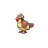 | [Pidgey](../pokemon/pidgey.md) |
|  | [Pidove](../pokemon/pidove.md) |
|  | [Rayquaza](../pokemon/rayquaza.md) |
|  | [Reshiram](../pokemon/reshiram.md) |
|  | [Rufflet](../pokemon/rufflet.md) |
|  | [Salamence](../pokemon/salamence.md) |
| 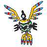 | [Sigilyph](../pokemon/sigilyph.md) |
|  | [Skarmory](../pokemon/skarmory.md) |
| 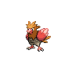 | [Spearow](../pokemon/spearow.md) |
|  | [Staraptor](../pokemon/staraptor.md) |
|  | [Staravia](../pokemon/staravia.md) |
|  | [Starly](../pokemon/starly.md) |
| 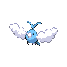 | [Swablu](../pokemon/swablu.md) |
| 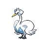 | [Swanna](../pokemon/swanna.md) |
| 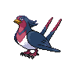 | [Swellow](../pokemon/swellow.md) |
|  | [Swoobat](../pokemon/swoobat.md) |
|  | [Taillow](../pokemon/taillow.md) |
|  | [Thundurus](../pokemon/thundurus.md) |
|  | [Togekiss](../pokemon/togekiss.md) |
| 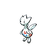 | [Togetic](../pokemon/togetic.md) |
|  | [Tornadus](../pokemon/tornadus.md) |
|  | [Tranquill](../pokemon/tranquill.md) |
| 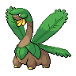 | [Tropius](../pokemon/tropius.md) |
|  | [Unfezant](../pokemon/unfezant.md) |
| 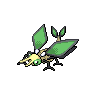 | [Vibrava](../pokemon/vibrava.md) |
|  | [Volcarona](../pokemon/volcarona.md) |
|  | [Vullaby](../pokemon/vullaby.md) |
|  | [Wingull](../pokemon/wingull.md) |
|  | [Woobat](../pokemon/woobat.md) |
|  | [Xatu](../pokemon/xatu.md) |
| 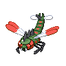 | [Yanmega](../pokemon/yanmega.md) |
|  | [Zapdos](../pokemon/zapdos.md) |
|  | [Zekrom](../pokemon/zekrom.md) |
|  | [Zubat](../pokemon/zubat.md) |
