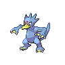
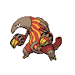
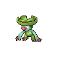
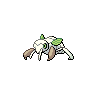

# Fury swipes

**Type:**   
**Category:**   
**Power:** 18  
**Accuracy:** 80  
**PP:** 15  

## Description
Hits 2-5 times in one turn.

## Learned by
| Sprite | Pokemon |
| --- | --- |
|  | [Aipom](../pokemon/aipom.md) |
|  | [Ambipom](../pokemon/ambipom.md) |
|  | [Ariados](../pokemon/ariados.md) |
|  | [Beartic](../pokemon/beartic.md) |
|  | [Bidoof](../pokemon/bidoof.md) |
|  | [Buizel](../pokemon/buizel.md) |
|  | [Chimchar](../pokemon/chimchar.md) |
|  | [Cubchoo](../pokemon/cubchoo.md) |
|  | [Cyndaquil](../pokemon/cyndaquil.md) |
|  | [Drilbur](../pokemon/drilbur.md) |
|  | [Excadrill](../pokemon/excadrill.md) |
|  | [Furret](../pokemon/furret.md) |
|  | [Glameow](../pokemon/glameow.md) |
|  | [Golduck](../pokemon/golduck.md) |
|  | [Heatmor](../pokemon/heatmor.md) |
|  | [Infernape](../pokemon/infernape.md) |
|  | [Kecleon](../pokemon/kecleon.md) |
|  | [Liepard](../pokemon/liepard.md) |
|  | [Linoone](../pokemon/linoone.md) |
|  | [Lombre](../pokemon/lombre.md) |
|  | [Mankey](../pokemon/mankey.md) |
|  | [Meowth](../pokemon/meowth.md) |
|  | [Monferno](../pokemon/monferno.md) |
|  | [Nidoran-f](../pokemon/nidoran-f.md) |
|  | [Nidorina](../pokemon/nidorina.md) |
|  | [Nincada](../pokemon/nincada.md) |
|  | [Ninjask](../pokemon/ninjask.md) |
|  | [Panpour](../pokemon/panpour.md) |
|  | [Pansage](../pokemon/pansage.md) |
|  | [Pansear](../pokemon/pansear.md) |
|  | [Persian](../pokemon/persian.md) |
|  | [Primeape](../pokemon/primeape.md) |
|  | [Psyduck](../pokemon/psyduck.md) |
|  | [Purrloin](../pokemon/purrloin.md) |
|  | [Purugly](../pokemon/purugly.md) |
|  | [Rattata](../pokemon/rattata.md) |
|  | [Sableye](../pokemon/sableye.md) |
|  | [Sandshrew](../pokemon/sandshrew.md) |
|  | [Sandslash](../pokemon/sandslash.md) |
|  | [Sentret](../pokemon/sentret.md) |
|  | [Shedinja](../pokemon/shedinja.md) |
|  | [Simipour](../pokemon/simipour.md) |
|  | [Simisage](../pokemon/simisage.md) |
|  | [Simisear](../pokemon/simisear.md) |
|  | [Skuntank](../pokemon/skuntank.md) |
|  | [Sneasel](../pokemon/sneasel.md) |
|  | [Spinarak](../pokemon/spinarak.md) |
|  | [Stunky](../pokemon/stunky.md) |
|  | [Teddiursa](../pokemon/teddiursa.md) |
|  | [Ursaring](../pokemon/ursaring.md) |
|  | [Vespiquen](../pokemon/vespiquen.md) |
|  | [Vigoroth](../pokemon/vigoroth.md) |
|  | [Weavile](../pokemon/weavile.md) |
|  | [Zangoose](../pokemon/zangoose.md) |
|  | [Zoroark](../pokemon/zoroark.md) |
|  | [Zorua](../pokemon/zorua.md) |
