# Gyro ball

**TM/HM:** TM74

**Type:**   
**Category:** { style='object-fit:contain;' }  
**Power:** -  
**Accuracy:** 100  
**PP:** 5  

## Description
Power raises when the user has lower Speed, up to a maximum of 150.

## Learned by
| Sprite | Pokemon |
| --- | --- |
|  | [Baltoy](../pokemon/baltoy.md) |
|  | [Blastoise](../pokemon/blastoise.md) |
|  | [Bronzong](../pokemon/bronzong.md) |
|  | [Bronzor](../pokemon/bronzor.md) |
|  | [Claydol](../pokemon/claydol.md) |
|  | [Darmanitan-standard](../pokemon/darmanitan-standard.md) |
|  | [Darumaka](../pokemon/darumaka.md) |
| 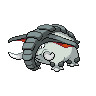 | [Donphan](../pokemon/donphan.md) |
|  | [Drifblim](../pokemon/drifblim.md) |
|  | [Drifloon](../pokemon/drifloon.md) |
|  | [Dunsparce](../pokemon/dunsparce.md) |
|  | [Duosion](../pokemon/duosion.md) |
|  | [Electrode](../pokemon/electrode.md) |
| 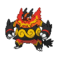 | [Emboar](../pokemon/emboar.md) |
|  | [Escavalier](../pokemon/escavalier.md) |
|  | [Ferroseed](../pokemon/ferroseed.md) |
|  | [Ferrothorn](../pokemon/ferrothorn.md) |
|  | [Forretress](../pokemon/forretress.md) |
|  | [Geodude](../pokemon/geodude.md) |
|  | [Glalie](../pokemon/glalie.md) |
|  | [Golem](../pokemon/golem.md) |
|  | [Golett](../pokemon/golett.md) |
|  | [Golurk](../pokemon/golurk.md) |
|  | [Graveler](../pokemon/graveler.md) |
|  | [Hitmontop](../pokemon/hitmontop.md) |
|  | [Jigglypuff](../pokemon/jigglypuff.md) |
|  | [Koffing](../pokemon/koffing.md) |
| 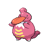 | [Lickilicky](../pokemon/lickilicky.md) |
| 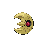 | [Lunatone](../pokemon/lunatone.md) |
| 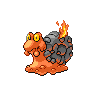 | [Magcargo](../pokemon/magcargo.md) |
|  | [Magnemite](../pokemon/magnemite.md) |
| 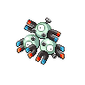 | [Magneton](../pokemon/magneton.md) |
|  | [Magnezone](../pokemon/magnezone.md) |
| 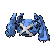 | [Metagross](../pokemon/metagross.md) |
|  | [Metang](../pokemon/metang.md) |
|  | [Mew](../pokemon/mew.md) |
|  | [Miltank](../pokemon/miltank.md) |
|  | [Munna](../pokemon/munna.md) |
| 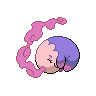 | [Musharna](../pokemon/musharna.md) |
|  | [Omanyte](../pokemon/omanyte.md) |
|  | [Omastar](../pokemon/omastar.md) |
|  | [Onix](../pokemon/onix.md) |
|  | [Pignite](../pokemon/pignite.md) |
|  | [Pineco](../pokemon/pineco.md) |
|  | [Qwilfish](../pokemon/qwilfish.md) |
|  | [Rayquaza](../pokemon/rayquaza.md) |
|  | [Reuniclus](../pokemon/reuniclus.md) |
|  | [Sandshrew](../pokemon/sandshrew.md) |
|  | [Sandslash](../pokemon/sandslash.md) |
|  | [Scolipede](../pokemon/scolipede.md) |
| 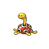 | [Shuckle](../pokemon/shuckle.md) |
|  | [Solosis](../pokemon/solosis.md) |
|  | [Solrock](../pokemon/solrock.md) |
|  | [Squirtle](../pokemon/squirtle.md) |
|  | [Starmie](../pokemon/starmie.md) |
|  | [Staryu](../pokemon/staryu.md) |
|  | [Steelix](../pokemon/steelix.md) |
| 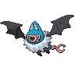 | [Swoobat](../pokemon/swoobat.md) |
|  | [Tepig](../pokemon/tepig.md) |
| 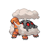 | [Torkoal](../pokemon/torkoal.md) |
|  | [Typhlosion](../pokemon/typhlosion.md) |
|  | [Venipede](../pokemon/venipede.md) |
| 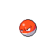 | [Voltorb](../pokemon/voltorb.md) |
|  | [Wartortle](../pokemon/wartortle.md) |
|  | [Weezing](../pokemon/weezing.md) |
|  | [Whirlipede](../pokemon/whirlipede.md) |
| 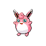 | [Wigglytuff](../pokemon/wigglytuff.md) |
|  | [Woobat](../pokemon/woobat.md) |
