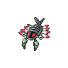
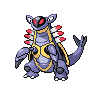
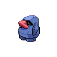

# Harden

**TM/HM:** 

**Type:**   
**Category:** { style='object-fit:contain;' }  
**Power:** -  
**Accuracy:** -  
**PP:** 30  

## Description
Raises the user’s Defense by one stage.

## Learned by
| Sprite | Pokemon |
| --- | --- |
|  | [Aggron](../pokemon/aggron.md) |
|  | [Anorith](../pokemon/anorith.md) |
|  | [Armaldo](../pokemon/armaldo.md) |
|  | [Aron](../pokemon/aron.md) |
|  | [Axew](../pokemon/axew.md) |
|  | [Baltoy](../pokemon/baltoy.md) |
|  | [Boldore](../pokemon/boldore.md) |
|  | [Bonsly](../pokemon/bonsly.md) |
|  | [Cascoon](../pokemon/cascoon.md) |
|  | [Claydol](../pokemon/claydol.md) |
|  | [Corphish](../pokemon/corphish.md) |
|  | [Corsola](../pokemon/corsola.md) |
|  | [Crawdaunt](../pokemon/crawdaunt.md) |
|  | [Ferroseed](../pokemon/ferroseed.md) |
|  | [Ferrothorn](../pokemon/ferrothorn.md) |
|  | [Gastrodon](../pokemon/gastrodon.md) |
|  | [Gigalith](../pokemon/gigalith.md) |
|  | [Gligar](../pokemon/gligar.md) |
|  | [Gliscor](../pokemon/gliscor.md) |
|  | [Grimer](../pokemon/grimer.md) |
|  | [Heracross](../pokemon/heracross.md) |
|  | [Kabuto](../pokemon/kabuto.md) |
|  | [Kabutops](../pokemon/kabutops.md) |
|  | [Kakuna](../pokemon/kakuna.md) |
|  | [Kingler](../pokemon/kingler.md) |
|  | [Krabby](../pokemon/krabby.md) |
|  | [Lairon](../pokemon/lairon.md) |
|  | [Larvesta](../pokemon/larvesta.md) |
|  | [Lunatone](../pokemon/lunatone.md) |
|  | [Magcargo](../pokemon/magcargo.md) |
|  | [Metapod](../pokemon/metapod.md) |
|  | [Muk](../pokemon/muk.md) |
|  | [Nincada](../pokemon/nincada.md) |
|  | [Ninjask](../pokemon/ninjask.md) |
|  | [Nosepass](../pokemon/nosepass.md) |
|  | [Nuzleaf](../pokemon/nuzleaf.md) |
|  | [Onix](../pokemon/onix.md) |
|  | [Pinsir](../pokemon/pinsir.md) |
|  | [Qwilfish](../pokemon/qwilfish.md) |
|  | [Relicanth](../pokemon/relicanth.md) |
|  | [Roggenrola](../pokemon/roggenrola.md) |
|  | [Seedot](../pokemon/seedot.md) |
|  | [Shedinja](../pokemon/shedinja.md) |
|  | [Shellos](../pokemon/shellos.md) |
|  | [Silcoon](../pokemon/silcoon.md) |
|  | [Slugma](../pokemon/slugma.md) |
|  | [Solrock](../pokemon/solrock.md) |
|  | [Staryu](../pokemon/staryu.md) |
|  | [Steelix](../pokemon/steelix.md) |
|  | [Sudowoodo](../pokemon/sudowoodo.md) |
|  | [Vanillish](../pokemon/vanillish.md) |
|  | [Vanillite](../pokemon/vanillite.md) |
|  | [Vanilluxe](../pokemon/vanilluxe.md) |
