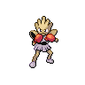
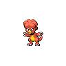

# Mega punch

**TM/HM:** 

**Type:**   
**Category:** { style='object-fit:contain;' }  
**Power:** 80  
**Accuracy:** 85  
**PP:** 20  

## Description
Inflicts regular damage with no additional effect.

## Learned by
| Sprite | Pokemon |
| --- | --- |
|  | [Geodude](../pokemon/geodude.md) |
|  | [Golett](../pokemon/golett.md) |
|  | [Golurk](../pokemon/golurk.md) |
|  | [Hitmonchan](../pokemon/hitmonchan.md) |
|  | [Kangaskhan](../pokemon/kangaskhan.md) |
|  | [Magby](../pokemon/magby.md) |
|  | [Mew](../pokemon/mew.md) |
