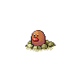

# Mud bomb

**Type:**   
**Category:**   
**Power:** 65  
**Accuracy:** 85  
**PP:** 10  

## Description
Has a $effect_chance% chance to lower the target’s accuracy by one stage.

## Learned by
| Sprite | Pokemon |
| --- | --- |
|  | [Arbok](../pokemon/arbok.md) |
|  | [Barboach](../pokemon/barboach.md) |
|  | [Chansey](../pokemon/chansey.md) |
|  | [Croagunk](../pokemon/croagunk.md) |
|  | [Diglett](../pokemon/diglett.md) |
|  | [Dugtrio](../pokemon/dugtrio.md) |
|  | [Ekans](../pokemon/ekans.md) |
|  | [Gastrodon](../pokemon/gastrodon.md) |
|  | [Grimer](../pokemon/grimer.md) |
|  | [Happiny](../pokemon/happiny.md) |
|  | [Mamoswine](../pokemon/mamoswine.md) |
|  | [Marshtomp](../pokemon/marshtomp.md) |
|  | [Mudkip](../pokemon/mudkip.md) |
|  | [Muk](../pokemon/muk.md) |
|  | [Numel](../pokemon/numel.md) |
|  | [Piloswine](../pokemon/piloswine.md) |
|  | [Poliwag](../pokemon/poliwag.md) |
|  | [Poliwhirl](../pokemon/poliwhirl.md) |
|  | [Psyduck](../pokemon/psyduck.md) |
|  | [Quagsire](../pokemon/quagsire.md) |
|  | [Shellos](../pokemon/shellos.md) |
|  | [Skitty](../pokemon/skitty.md) |
|  | [Stunfisk](../pokemon/stunfisk.md) |
|  | [Swampert](../pokemon/swampert.md) |
|  | [Swinub](../pokemon/swinub.md) |
|  | [Toxicroak](../pokemon/toxicroak.md) |
|  | [Tympole](../pokemon/tympole.md) |
|  | [Whiscash](../pokemon/whiscash.md) |
|  | [Wooper](../pokemon/wooper.md) |
