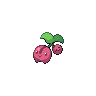
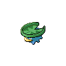
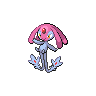
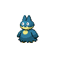

# Natural gift

**Type:**   
**Category:**   
**Power:** None  
**Accuracy:** 100  
**PP:** 15  

## Description
Power and type depend on the held berry.

## Learned by
| Sprite | Pokemon |
| --- | --- |
|  | [Altaria](../pokemon/altaria.md) |
|  | [Arceus](../pokemon/arceus.md) |
|  | [Azelf](../pokemon/azelf.md) |
|  | [Bayleef](../pokemon/bayleef.md) |
|  | [Bellsprout](../pokemon/bellsprout.md) |
|  | [Budew](../pokemon/budew.md) |
|  | [Celebi](../pokemon/celebi.md) |
|  | [Chansey](../pokemon/chansey.md) |
|  | [Cherubi](../pokemon/cherubi.md) |
|  | [Chikorita](../pokemon/chikorita.md) |
|  | [Cottonee](../pokemon/cottonee.md) |
|  | [Deerling](../pokemon/deerling.md) |
|  | [Doduo](../pokemon/doduo.md) |
|  | [Eevee](../pokemon/eevee.md) |
|  | [Exeggcute](../pokemon/exeggcute.md) |
|  | [Forretress](../pokemon/forretress.md) |
|  | [Gloom](../pokemon/gloom.md) |
|  | [Happiny](../pokemon/happiny.md) |
|  | [Ho-oh](../pokemon/ho-oh.md) |
|  | [Lotad](../pokemon/lotad.md) |
|  | [Lugia](../pokemon/lugia.md) |
|  | [Meganium](../pokemon/meganium.md) |
|  | [Mesprit](../pokemon/mesprit.md) |
|  | [Miltank](../pokemon/miltank.md) |
|  | [Munchlax](../pokemon/munchlax.md) |
|  | [Oddish](../pokemon/oddish.md) |
|  | [Panpour](../pokemon/panpour.md) |
|  | [Pansage](../pokemon/pansage.md) |
|  | [Pansear](../pokemon/pansear.md) |
|  | [Paras](../pokemon/paras.md) |
|  | [Petilil](../pokemon/petilil.md) |
|  | [Phanpy](../pokemon/phanpy.md) |
|  | [Pineco](../pokemon/pineco.md) |
|  | [Roselia](../pokemon/roselia.md) |
|  | [Sentret](../pokemon/sentret.md) |
|  | [Shroomish](../pokemon/shroomish.md) |
|  | [Simipour](../pokemon/simipour.md) |
|  | [Simisage](../pokemon/simisage.md) |
|  | [Simisear](../pokemon/simisear.md) |
|  | [Snivy](../pokemon/snivy.md) |
|  | [Snorlax](../pokemon/snorlax.md) |
|  | [Snover](../pokemon/snover.md) |
|  | [Sunflora](../pokemon/sunflora.md) |
|  | [Sunkern](../pokemon/sunkern.md) |
|  | [Swablu](../pokemon/swablu.md) |
|  | [Tangela](../pokemon/tangela.md) |
|  | [Tangrowth](../pokemon/tangrowth.md) |
|  | [Treecko](../pokemon/treecko.md) |
|  | [Tropius](../pokemon/tropius.md) |
|  | [Uxie](../pokemon/uxie.md) |
|  | [Vanillite](../pokemon/vanillite.md) |
