# Payback

**TM/HM:** TM66

**Type:**   
**Category:** { style='object-fit:contain;' }  
**Power:** 50  
**Accuracy:** 100  
**PP:** 10  

## Description
Power is doubled if the target has already moved this turn.

## Learned by
| Sprite | Pokemon |
| --- | --- |
|  | [Absol](../pokemon/absol.md) |
|  | [Aerodactyl](../pokemon/aerodactyl.md) |
|  | [Aggron](../pokemon/aggron.md) |
|  | [Aipom](../pokemon/aipom.md) |
| 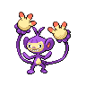 | [Ambipom](../pokemon/ambipom.md) |
|  | [Amoonguss](../pokemon/amoonguss.md) |
| 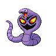 | [Arbok](../pokemon/arbok.md) |
|  | [Arceus](../pokemon/arceus.md) |
| 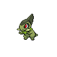 | [Axew](../pokemon/axew.md) |
|  | [Azelf](../pokemon/azelf.md) |
| 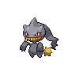 | [Banette](../pokemon/banette.md) |
|  | [Beedrill](../pokemon/beedrill.md) |
|  | [Bisharp](../pokemon/bisharp.md) |
|  | [Bouffalant](../pokemon/bouffalant.md) |
|  | [Bronzong](../pokemon/bronzong.md) |
|  | [Bronzor](../pokemon/bronzor.md) |
|  | [Cacnea](../pokemon/cacnea.md) |
| 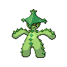 | [Cacturne](../pokemon/cacturne.md) |
|  | [Carnivine](../pokemon/carnivine.md) |
| 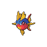 | [Carvanha](../pokemon/carvanha.md) |
|  | [Chandelure](../pokemon/chandelure.md) |
|  | [Cloyster](../pokemon/cloyster.md) |
|  | [Cofagrigus](../pokemon/cofagrigus.md) |
| 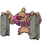 | [Conkeldurr](../pokemon/conkeldurr.md) |
| 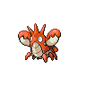 | [Corphish](../pokemon/corphish.md) |
| 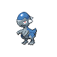 | [Cranidos](../pokemon/cranidos.md) |
| 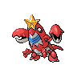 | [Crawdaunt](../pokemon/crawdaunt.md) |
|  | [Croagunk](../pokemon/croagunk.md) |
|  | [Crobat](../pokemon/crobat.md) |
| 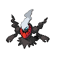 | [Darkrai](../pokemon/darkrai.md) |
|  | [Darmanitan-standard](../pokemon/darmanitan-standard.md) |
|  | [Delcatty](../pokemon/delcatty.md) |
|  | [Dodrio](../pokemon/dodrio.md) |
| 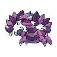 | [Drapion](../pokemon/drapion.md) |
| 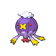 | [Drifblim](../pokemon/drifblim.md) |
| 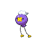 | [Drifloon](../pokemon/drifloon.md) |
| 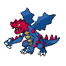 | [Druddigon](../pokemon/druddigon.md) |
| 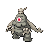 | [Dusclops](../pokemon/dusclops.md) |
|  | [Dusknoir](../pokemon/dusknoir.md) |
|  | [Duskull](../pokemon/duskull.md) |
| 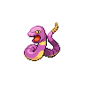 | [Ekans](../pokemon/ekans.md) |
|  | [Ferroseed](../pokemon/ferroseed.md) |
|  | [Ferrothorn](../pokemon/ferrothorn.md) |
| 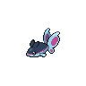 | [Finneon](../pokemon/finneon.md) |
| 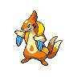 | [Floatzel](../pokemon/floatzel.md) |
|  | [Foongus](../pokemon/foongus.md) |
|  | [Forretress](../pokemon/forretress.md) |
|  | [Fraxure](../pokemon/fraxure.md) |
|  | [Froslass](../pokemon/froslass.md) |
| 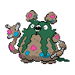 | [Garbodor](../pokemon/garbodor.md) |
|  | [Gastly](../pokemon/gastly.md) |
| 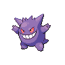 | [Gengar](../pokemon/gengar.md) |
|  | [Giratina-altered](../pokemon/giratina-altered.md) |
|  | [Glalie](../pokemon/glalie.md) |
|  | [Glameow](../pokemon/glameow.md) |
| 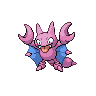 | [Gligar](../pokemon/gligar.md) |
| 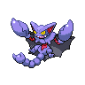 | [Gliscor](../pokemon/gliscor.md) |
|  | [Golbat](../pokemon/golbat.md) |
| 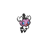 | [Gothita](../pokemon/gothita.md) |
|  | [Gothitelle](../pokemon/gothitelle.md) |
| 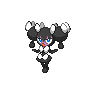 | [Gothorita](../pokemon/gothorita.md) |
|  | [Granbull](../pokemon/granbull.md) |
|  | [Grimer](../pokemon/grimer.md) |
|  | [Grumpig](../pokemon/grumpig.md) |
| 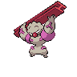 | [Gurdurr](../pokemon/gurdurr.md) |
| 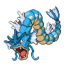 | [Gyarados](../pokemon/gyarados.md) |
|  | [Hariyama](../pokemon/hariyama.md) |
|  | [Haunter](../pokemon/haunter.md) |
|  | [Haxorus](../pokemon/haxorus.md) |
|  | [Heatran](../pokemon/heatran.md) |
|  | [Herdier](../pokemon/herdier.md) |
| 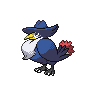 | [Honchkrow](../pokemon/honchkrow.md) |
|  | [Houndoom](../pokemon/houndoom.md) |
| 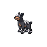 | [Houndour](../pokemon/houndour.md) |
| 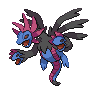 | [Hydreigon](../pokemon/hydreigon.md) |
|  | [Jynx](../pokemon/jynx.md) |
| 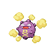 | [Koffing](../pokemon/koffing.md) |
|  | [Krokorok](../pokemon/krokorok.md) |
| 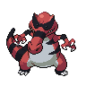 | [Krookodile](../pokemon/krookodile.md) |
| 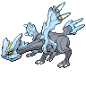 | [Kyurem](../pokemon/kyurem.md) |
|  | [Lampent](../pokemon/lampent.md) |
|  | [Landorus-incarnate](../pokemon/landorus-incarnate.md) |
| 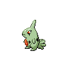 | [Larvitar](../pokemon/larvitar.md) |
|  | [Leavanny](../pokemon/leavanny.md) |
|  | [Liepard](../pokemon/liepard.md) |
|  | [Litwick](../pokemon/litwick.md) |
| 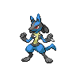 | [Lucario](../pokemon/lucario.md) |
| 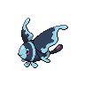 | [Lumineon](../pokemon/lumineon.md) |
| 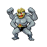 | [Machamp](../pokemon/machamp.md) |
| 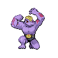 | [Machoke](../pokemon/machoke.md) |
|  | [Machop](../pokemon/machop.md) |
|  | [Mandibuzz](../pokemon/mandibuzz.md) |
| 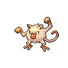 | [Mankey](../pokemon/mankey.md) |
|  | [Mawile](../pokemon/mawile.md) |
|  | [Meloetta-aria](../pokemon/meloetta-aria.md) |
|  | [Meowth](../pokemon/meowth.md) |
| 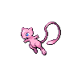 | [Mew](../pokemon/mew.md) |
|  | [Mienfoo](../pokemon/mienfoo.md) |
|  | [Mienshao](../pokemon/mienshao.md) |
|  | [Mightyena](../pokemon/mightyena.md) |
|  | [Misdreavus](../pokemon/misdreavus.md) |
| 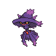 | [Mismagius](../pokemon/mismagius.md) |
|  | [Mr-mime](../pokemon/mr-mime.md) |
|  | [Muk](../pokemon/muk.md) |
|  | [Murkrow](../pokemon/murkrow.md) |
| 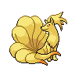 | [Ninetales](../pokemon/ninetales.md) |
| 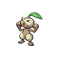 | [Nuzleaf](../pokemon/nuzleaf.md) |
|  | [Octillery](../pokemon/octillery.md) |
|  | [Onix](../pokemon/onix.md) |
|  | [Panpour](../pokemon/panpour.md) |
|  | [Pansage](../pokemon/pansage.md) |
|  | [Pansear](../pokemon/pansear.md) |
|  | [Pawniard](../pokemon/pawniard.md) |
|  | [Pelipper](../pokemon/pelipper.md) |
| 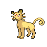 | [Persian](../pokemon/persian.md) |
|  | [Pineco](../pokemon/pineco.md) |
|  | [Politoed](../pokemon/politoed.md) |
|  | [Poliwrath](../pokemon/poliwrath.md) |
| 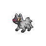 | [Poochyena](../pokemon/poochyena.md) |
| 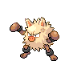 | [Primeape](../pokemon/primeape.md) |
| 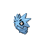 | [Pupitar](../pokemon/pupitar.md) |
| 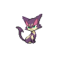 | [Purrloin](../pokemon/purrloin.md) |
| 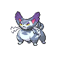 | [Purugly](../pokemon/purugly.md) |
|  | [Qwilfish](../pokemon/qwilfish.md) |
|  | [Rampardos](../pokemon/rampardos.md) |
|  | [Regigigas](../pokemon/regigigas.md) |
|  | [Reshiram](../pokemon/reshiram.md) |
|  | [Rhydon](../pokemon/rhydon.md) |
| 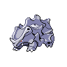 | [Rhyhorn](../pokemon/rhyhorn.md) |
|  | [Rhyperior](../pokemon/rhyperior.md) |
|  | [Riolu](../pokemon/riolu.md) |
|  | [Sableye](../pokemon/sableye.md) |
|  | [Sandile](../pokemon/sandile.md) |
|  | [Sawk](../pokemon/sawk.md) |
|  | [Scolipede](../pokemon/scolipede.md) |
|  | [Scrafty](../pokemon/scrafty.md) |
|  | [Scraggy](../pokemon/scraggy.md) |
|  | [Seismitoad](../pokemon/seismitoad.md) |
|  | [Seviper](../pokemon/seviper.md) |
|  | [Sewaddle](../pokemon/sewaddle.md) |
|  | [Sharpedo](../pokemon/sharpedo.md) |
|  | [Shellder](../pokemon/shellder.md) |
|  | [Shiftry](../pokemon/shiftry.md) |
|  | [Shuppet](../pokemon/shuppet.md) |
|  | [Simipour](../pokemon/simipour.md) |
|  | [Simisage](../pokemon/simisage.md) |
|  | [Simisear](../pokemon/simisear.md) |
|  | [Skarmory](../pokemon/skarmory.md) |
|  | [Skitty](../pokemon/skitty.md) |
|  | [Skorupi](../pokemon/skorupi.md) |
|  | [Skuntank](../pokemon/skuntank.md) |
|  | [Smoochum](../pokemon/smoochum.md) |
|  | [Sneasel](../pokemon/sneasel.md) |
|  | [Snubbull](../pokemon/snubbull.md) |
|  | [Spoink](../pokemon/spoink.md) |
|  | [Steelix](../pokemon/steelix.md) |
|  | [Stoutland](../pokemon/stoutland.md) |
|  | [Stunfisk](../pokemon/stunfisk.md) |
|  | [Stunky](../pokemon/stunky.md) |
|  | [Swadloon](../pokemon/swadloon.md) |
|  | [Tangrowth](../pokemon/tangrowth.md) |
|  | [Tauros](../pokemon/tauros.md) |
|  | [Teddiursa](../pokemon/teddiursa.md) |
|  | [Tentacool](../pokemon/tentacool.md) |
|  | [Tentacruel](../pokemon/tentacruel.md) |
|  | [Throh](../pokemon/throh.md) |
|  | [Thundurus-incarnate](../pokemon/thundurus-incarnate.md) |
|  | [Timburr](../pokemon/timburr.md) |
|  | [Tornadus-incarnate](../pokemon/tornadus-incarnate.md) |
|  | [Toxicroak](../pokemon/toxicroak.md) |
|  | [Trubbish](../pokemon/trubbish.md) |
|  | [Tyranitar](../pokemon/tyranitar.md) |
|  | [Umbreon](../pokemon/umbreon.md) |
|  | [Ursaring](../pokemon/ursaring.md) |
|  | [Venipede](../pokemon/venipede.md) |
|  | [Vullaby](../pokemon/vullaby.md) |
|  | [Vulpix](../pokemon/vulpix.md) |
|  | [Weavile](../pokemon/weavile.md) |
|  | [Weezing](../pokemon/weezing.md) |
|  | [Whirlipede](../pokemon/whirlipede.md) |
|  | [Yamask](../pokemon/yamask.md) |
|  | [Zangoose](../pokemon/zangoose.md) |
|  | [Zekrom](../pokemon/zekrom.md) |
|  | [Zoroark](../pokemon/zoroark.md) |
|  | [Zorua](../pokemon/zorua.md) |
|  | [Zubat](../pokemon/zubat.md) |
