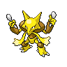
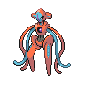
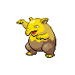
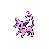
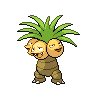
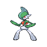
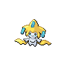
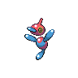
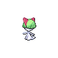
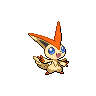

# Psyshock

**Type:**   
**Category:**   
**Power:** 80  
**Accuracy:** 100  
**PP:** 10  

## Description
Inflicts damage based on the target’s Defense, not Special Defense.

## Learned by
| Sprite | Pokemon |
| --- | --- |
|  | [Abra](../pokemon/abra.md) |
|  | [Alakazam](../pokemon/alakazam.md) |
|  | [Arceus](../pokemon/arceus.md) |
|  | [Audino](../pokemon/audino.md) |
|  | [Azelf](../pokemon/azelf.md) |
|  | [Baltoy](../pokemon/baltoy.md) |
|  | [Beheeyem](../pokemon/beheeyem.md) |
|  | [Bronzong](../pokemon/bronzong.md) |
|  | [Bronzor](../pokemon/bronzor.md) |
|  | [Chimecho](../pokemon/chimecho.md) |
|  | [Chingling](../pokemon/chingling.md) |
|  | [Claydol](../pokemon/claydol.md) |
|  | [Clefable](../pokemon/clefable.md) |
|  | [Clefairy](../pokemon/clefairy.md) |
|  | [Cleffa](../pokemon/cleffa.md) |
|  | [Cresselia](../pokemon/cresselia.md) |
|  | [Deoxys](../pokemon/deoxys.md) |
|  | [Drowzee](../pokemon/drowzee.md) |
|  | [Duosion](../pokemon/duosion.md) |
|  | [Elgyem](../pokemon/elgyem.md) |
|  | [Espeon](../pokemon/espeon.md) |
|  | [Exeggutor](../pokemon/exeggutor.md) |
|  | [Gallade](../pokemon/gallade.md) |
|  | [Gardevoir](../pokemon/gardevoir.md) |
|  | [Girafarig](../pokemon/girafarig.md) |
|  | [Golduck](../pokemon/golduck.md) |
|  | [Gothita](../pokemon/gothita.md) |
|  | [Gothitelle](../pokemon/gothitelle.md) |
|  | [Gothorita](../pokemon/gothorita.md) |
|  | [Grumpig](../pokemon/grumpig.md) |
|  | [Hypno](../pokemon/hypno.md) |
|  | [Jirachi](../pokemon/jirachi.md) |
|  | [Jynx](../pokemon/jynx.md) |
|  | [Kadabra](../pokemon/kadabra.md) |
|  | [Kirlia](../pokemon/kirlia.md) |
|  | [Latias](../pokemon/latias.md) |
|  | [Latios](../pokemon/latios.md) |
|  | [Lugia](../pokemon/lugia.md) |
|  | [Lunatone](../pokemon/lunatone.md) |
|  | [Medicham](../pokemon/medicham.md) |
|  | [Meditite](../pokemon/meditite.md) |
|  | [Meloetta](../pokemon/meloetta.md) |
|  | [Mesprit](../pokemon/mesprit.md) |
|  | [Metagross](../pokemon/metagross.md) |
|  | [Metang](../pokemon/metang.md) |
|  | [Mew](../pokemon/mew.md) |
|  | [Mewtwo](../pokemon/mewtwo.md) |
|  | [Mime Jr.](../pokemon/mime-jr.md) |
|  | [Mr. Mime](../pokemon/mr-mime.md) |
|  | [Munna](../pokemon/munna.md) |
|  | [Musharna](../pokemon/musharna.md) |
|  | [Natu](../pokemon/natu.md) |
|  | [Ninetales](../pokemon/ninetales.md) |
|  | [Porygon](../pokemon/porygon.md) |
|  | [Porygon-Z](../pokemon/porygon-z.md) |
|  | [Porygon2](../pokemon/porygon2.md) |
|  | [Psyduck](../pokemon/psyduck.md) |
|  | [Ralts](../pokemon/ralts.md) |
|  | [Reuniclus](../pokemon/reuniclus.md) |
|  | [Sigilyph](../pokemon/sigilyph.md) |
|  | [Slowbro](../pokemon/slowbro.md) |
|  | [Slowking](../pokemon/slowking.md) |
|  | [Slowpoke](../pokemon/slowpoke.md) |
|  | [Smoochum](../pokemon/smoochum.md) |
|  | [Solosis](../pokemon/solosis.md) |
|  | [Solrock](../pokemon/solrock.md) |
|  | [Spoink](../pokemon/spoink.md) |
|  | [Stantler](../pokemon/stantler.md) |
|  | [Starmie](../pokemon/starmie.md) |
|  | [Swoobat](../pokemon/swoobat.md) |
|  | [Togekiss](../pokemon/togekiss.md) |
|  | [Togepi](../pokemon/togepi.md) |
|  | [Togetic](../pokemon/togetic.md) |
|  | [Uxie](../pokemon/uxie.md) |
|  | [Victini](../pokemon/victini.md) |
|  | [Woobat](../pokemon/woobat.md) |
|  | [Xatu](../pokemon/xatu.md) |
