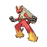

# Role play

**Type:**   
**Category:**   
**Power:** None  
**Accuracy:** None  
**PP:** 10  

## Description
Copies the target’s ability.

## Learned by
| Sprite | Pokemon |
| --- | --- |
|  | [Abomasnow](../pokemon/abomasnow.md) |
|  | [Abra](../pokemon/abra.md) |
|  | [Absol](../pokemon/absol.md) |
|  | [Aipom](../pokemon/aipom.md) |
|  | [Alakazam](../pokemon/alakazam.md) |
|  | [Ambipom](../pokemon/ambipom.md) |
|  | [Audino](../pokemon/audino.md) |
|  | [Azelf](../pokemon/azelf.md) |
|  | [Banette](../pokemon/banette.md) |
|  | [Beheeyem](../pokemon/beheeyem.md) |
|  | [Bisharp](../pokemon/bisharp.md) |
|  | [Blaziken](../pokemon/blaziken.md) |
|  | [Bonsly](../pokemon/bonsly.md) |
|  | [Cacnea](../pokemon/cacnea.md) |
|  | [Cacturne](../pokemon/cacturne.md) |
|  | [Chatot](../pokemon/chatot.md) |
|  | [Chimchar](../pokemon/chimchar.md) |
|  | [Clefable](../pokemon/clefable.md) |
|  | [Clefairy](../pokemon/clefairy.md) |
|  | [Cleffa](../pokemon/cleffa.md) |
|  | [Cofagrigus](../pokemon/cofagrigus.md) |
|  | [Croagunk](../pokemon/croagunk.md) |
|  | [Drowzee](../pokemon/drowzee.md) |
|  | [Duosion](../pokemon/duosion.md) |
|  | [Elgyem](../pokemon/elgyem.md) |
|  | [Gengar](../pokemon/gengar.md) |
|  | [Golduck](../pokemon/golduck.md) |
|  | [Gothita](../pokemon/gothita.md) |
|  | [Gothitelle](../pokemon/gothitelle.md) |
|  | [Gothorita](../pokemon/gothorita.md) |
|  | [Grumpig](../pokemon/grumpig.md) |
|  | [Hariyama](../pokemon/hariyama.md) |
|  | [Hitmonchan](../pokemon/hitmonchan.md) |
|  | [Hitmonlee](../pokemon/hitmonlee.md) |
|  | [Hitmontop](../pokemon/hitmontop.md) |
|  | [Houndoom](../pokemon/houndoom.md) |
|  | [Houndour](../pokemon/houndour.md) |
|  | [Hypno](../pokemon/hypno.md) |
|  | [Igglybuff](../pokemon/igglybuff.md) |
|  | [Infernape](../pokemon/infernape.md) |
|  | [Jigglypuff](../pokemon/jigglypuff.md) |
|  | [Jynx](../pokemon/jynx.md) |
|  | [Kadabra](../pokemon/kadabra.md) |
|  | [Kecleon](../pokemon/kecleon.md) |
|  | [Latias](../pokemon/latias.md) |
|  | [Liepard](../pokemon/liepard.md) |
|  | [Lilligant](../pokemon/lilligant.md) |
|  | [Lucario](../pokemon/lucario.md) |
|  | [Machamp](../pokemon/machamp.md) |
|  | [Machoke](../pokemon/machoke.md) |
|  | [Machop](../pokemon/machop.md) |
|  | [Makuhita](../pokemon/makuhita.md) |
|  | [Mankey](../pokemon/mankey.md) |
|  | [Medicham](../pokemon/medicham.md) |
|  | [Meditite](../pokemon/meditite.md) |
|  | [Mesprit](../pokemon/mesprit.md) |
|  | [Mew](../pokemon/mew.md) |
|  | [Mewtwo](../pokemon/mewtwo.md) |
|  | [Mienfoo](../pokemon/mienfoo.md) |
|  | [Mienshao](../pokemon/mienshao.md) |
|  | [Mime-jr](../pokemon/mime-jr.md) |
|  | [Monferno](../pokemon/monferno.md) |
|  | [Mr-mime](../pokemon/mr-mime.md) |
|  | [Ninetales](../pokemon/ninetales.md) |
|  | [Panpour](../pokemon/panpour.md) |
|  | [Pansage](../pokemon/pansage.md) |
|  | [Pansear](../pokemon/pansear.md) |
|  | [Pawniard](../pokemon/pawniard.md) |
|  | [Primeape](../pokemon/primeape.md) |
|  | [Psyduck](../pokemon/psyduck.md) |
|  | [Purrloin](../pokemon/purrloin.md) |
|  | [Reuniclus](../pokemon/reuniclus.md) |
|  | [Riolu](../pokemon/riolu.md) |
|  | [Sableye](../pokemon/sableye.md) |
|  | [Shuppet](../pokemon/shuppet.md) |
|  | [Simipour](../pokemon/simipour.md) |
|  | [Simisage](../pokemon/simisage.md) |
|  | [Simisear](../pokemon/simisear.md) |
|  | [Smoochum](../pokemon/smoochum.md) |
|  | [Snover](../pokemon/snover.md) |
|  | [Solosis](../pokemon/solosis.md) |
|  | [Spinda](../pokemon/spinda.md) |
|  | [Spoink](../pokemon/spoink.md) |
|  | [Stantler](../pokemon/stantler.md) |
|  | [Sudowoodo](../pokemon/sudowoodo.md) |
|  | [Tauros](../pokemon/tauros.md) |
|  | [Toxicroak](../pokemon/toxicroak.md) |
|  | [Tyrogue](../pokemon/tyrogue.md) |
|  | [Uxie](../pokemon/uxie.md) |
|  | [Victini](../pokemon/victini.md) |
|  | [Vulpix](../pokemon/vulpix.md) |
|  | [Wigglytuff](../pokemon/wigglytuff.md) |
|  | [Yamask](../pokemon/yamask.md) |
