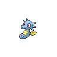
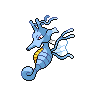
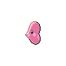
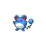
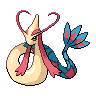
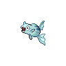
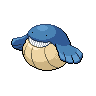
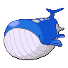

# Scald

**Type:**   
**Category:**   
**Power:** 80  
**Accuracy:** 100  
**PP:** 15  

## Description
Has a $effect_chance% chance to burn the target.

## Learned by
| Sprite | Pokemon |
| --- | --- |
|  | [Alomomola](../pokemon/alomomola.md) |
|  | [Azumarill](../pokemon/azumarill.md) |
|  | [Azurill](../pokemon/azurill.md) |
|  | [Barboach](../pokemon/barboach.md) |
|  | [Basculin](../pokemon/basculin.md) |
|  | [Basculin](../pokemon/basculin.md) |
|  | [Bibarel](../pokemon/bibarel.md) |
|  | [Blastoise](../pokemon/blastoise.md) |
|  | [Buizel](../pokemon/buizel.md) |
|  | [Carracosta](../pokemon/carracosta.md) |
|  | [Carvanha](../pokemon/carvanha.md) |
|  | [Castform](../pokemon/castform.md) |
|  | [Chinchou](../pokemon/chinchou.md) |
|  | [Clamperl](../pokemon/clamperl.md) |
|  | [Corphish](../pokemon/corphish.md) |
|  | [Corsola](../pokemon/corsola.md) |
|  | [Crawdaunt](../pokemon/crawdaunt.md) |
|  | [Croconaw](../pokemon/croconaw.md) |
|  | [Dewott](../pokemon/dewott.md) |
|  | [Ducklett](../pokemon/ducklett.md) |
|  | [Emboar](../pokemon/emboar.md) |
|  | [Empoleon](../pokemon/empoleon.md) |
|  | [Feebas](../pokemon/feebas.md) |
|  | [Feraligatr](../pokemon/feraligatr.md) |
|  | [Finneon](../pokemon/finneon.md) |
|  | [Floatzel](../pokemon/floatzel.md) |
|  | [Gastrodon](../pokemon/gastrodon.md) |
|  | [Goldeen](../pokemon/goldeen.md) |
|  | [Golduck](../pokemon/golduck.md) |
|  | [Gorebyss](../pokemon/gorebyss.md) |
|  | [Gyarados](../pokemon/gyarados.md) |
|  | [Horsea](../pokemon/horsea.md) |
|  | [Huntail](../pokemon/huntail.md) |
|  | [Kabuto](../pokemon/kabuto.md) |
|  | [Kabutops](../pokemon/kabutops.md) |
|  | [Kingdra](../pokemon/kingdra.md) |
|  | [Kingler](../pokemon/kingler.md) |
|  | [Krabby](../pokemon/krabby.md) |
|  | [Kyogre](../pokemon/kyogre.md) |
|  | [Lanturn](../pokemon/lanturn.md) |
|  | [Lombre](../pokemon/lombre.md) |
|  | [Lotad](../pokemon/lotad.md) |
|  | [Ludicolo](../pokemon/ludicolo.md) |
|  | [Lumineon](../pokemon/lumineon.md) |
|  | [Luvdisc](../pokemon/luvdisc.md) |
|  | [Manaphy](../pokemon/manaphy.md) |
|  | [Mantine](../pokemon/mantine.md) |
|  | [Mantyke](../pokemon/mantyke.md) |
|  | [Maractus](../pokemon/maractus.md) |
|  | [Marill](../pokemon/marill.md) |
|  | [Marshtomp](../pokemon/marshtomp.md) |
|  | [Masquerain](../pokemon/masquerain.md) |
|  | [Mew](../pokemon/mew.md) |
|  | [Milotic](../pokemon/milotic.md) |
|  | [Mudkip](../pokemon/mudkip.md) |
|  | [Octillery](../pokemon/octillery.md) |
|  | [Omanyte](../pokemon/omanyte.md) |
|  | [Omastar](../pokemon/omastar.md) |
|  | [Oshawott](../pokemon/oshawott.md) |
|  | [Palpitoad](../pokemon/palpitoad.md) |
|  | [Panpour](../pokemon/panpour.md) |
|  | [Pelipper](../pokemon/pelipper.md) |
|  | [Phione](../pokemon/phione.md) |
|  | [Piplup](../pokemon/piplup.md) |
|  | [Politoed](../pokemon/politoed.md) |
|  | [Poliwag](../pokemon/poliwag.md) |
|  | [Poliwhirl](../pokemon/poliwhirl.md) |
|  | [Poliwrath](../pokemon/poliwrath.md) |
|  | [Prinplup](../pokemon/prinplup.md) |
|  | [Psyduck](../pokemon/psyduck.md) |
|  | [Quagsire](../pokemon/quagsire.md) |
|  | [Qwilfish](../pokemon/qwilfish.md) |
|  | [Relicanth](../pokemon/relicanth.md) |
|  | [Remoraid](../pokemon/remoraid.md) |
|  | [Rotom](../pokemon/rotom.md) |
|  | [Samurott](../pokemon/samurott.md) |
|  | [Seadra](../pokemon/seadra.md) |
|  | [Seaking](../pokemon/seaking.md) |
|  | [Seismitoad](../pokemon/seismitoad.md) |
|  | [Sharpedo](../pokemon/sharpedo.md) |
|  | [Shellos](../pokemon/shellos.md) |
|  | [Simipour](../pokemon/simipour.md) |
|  | [Slowbro](../pokemon/slowbro.md) |
|  | [Slowking](../pokemon/slowking.md) |
|  | [Slowpoke](../pokemon/slowpoke.md) |
|  | [Squirtle](../pokemon/squirtle.md) |
|  | [Starmie](../pokemon/starmie.md) |
|  | [Staryu](../pokemon/staryu.md) |
|  | [Stunfisk](../pokemon/stunfisk.md) |
|  | [Suicune](../pokemon/suicune.md) |
|  | [Surskit](../pokemon/surskit.md) |
|  | [Swampert](../pokemon/swampert.md) |
|  | [Swanna](../pokemon/swanna.md) |
|  | [Tentacool](../pokemon/tentacool.md) |
|  | [Tentacruel](../pokemon/tentacruel.md) |
|  | [Tirtouga](../pokemon/tirtouga.md) |
|  | [Totodile](../pokemon/totodile.md) |
|  | [Tympole](../pokemon/tympole.md) |
|  | [Vaporeon](../pokemon/vaporeon.md) |
|  | [Wailmer](../pokemon/wailmer.md) |
|  | [Wailord](../pokemon/wailord.md) |
|  | [Wartortle](../pokemon/wartortle.md) |
|  | [Whiscash](../pokemon/whiscash.md) |
|  | [Wingull](../pokemon/wingull.md) |
|  | [Wooper](../pokemon/wooper.md) |
