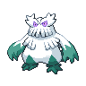
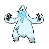
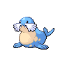
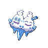

# Sheer cold

**Type:**   
**Category:**   
**Power:** None  
**Accuracy:** 30  
**PP:** 5  

## Description
Causes a one-hit KO.

## Learned by
| Sprite | Pokemon |
| --- | --- |
|  | [Abomasnow](../pokemon/abomasnow.md) |
|  | [Articuno](../pokemon/articuno.md) |
|  | [Beartic](../pokemon/beartic.md) |
|  | [Cryogonal](../pokemon/cryogonal.md) |
|  | [Cubchoo](../pokemon/cubchoo.md) |
|  | [Dewgong](../pokemon/dewgong.md) |
|  | [Glaceon](../pokemon/glaceon.md) |
|  | [Glalie](../pokemon/glalie.md) |
|  | [Kyogre](../pokemon/kyogre.md) |
|  | [Lapras](../pokemon/lapras.md) |
|  | [Sealeo](../pokemon/sealeo.md) |
|  | [Snover](../pokemon/snover.md) |
|  | [Spheal](../pokemon/spheal.md) |
|  | [Suicune](../pokemon/suicune.md) |
|  | [Vanillish](../pokemon/vanillish.md) |
|  | [Vanillite](../pokemon/vanillite.md) |
|  | [Vanilluxe](../pokemon/vanilluxe.md) |
|  | [Walrein](../pokemon/walrein.md) |
