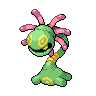
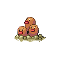
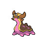
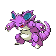
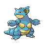
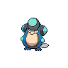
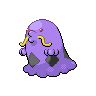
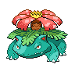
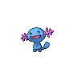

# Sludge wave

**Type:**   
**Category:**   
**Power:** 95  
**Accuracy:** 100  
**PP:** 10  

## Description
Has a $effect_chance% chance to poison the target.

## Learned by
| Sprite | Pokemon |
| --- | --- |
|  | [Arbok](../pokemon/arbok.md) |
|  | [Cradily](../pokemon/cradily.md) |
|  | [Crawdaunt](../pokemon/crawdaunt.md) |
|  | [Croagunk](../pokemon/croagunk.md) |
|  | [Dugtrio](../pokemon/dugtrio.md) |
|  | [Ekans](../pokemon/ekans.md) |
|  | [Garbodor](../pokemon/garbodor.md) |
|  | [Gastly](../pokemon/gastly.md) |
|  | [Gastrodon](../pokemon/gastrodon.md) |
|  | [Gengar](../pokemon/gengar.md) |
|  | [Grimer](../pokemon/grimer.md) |
|  | [Gulpin](../pokemon/gulpin.md) |
|  | [Haunter](../pokemon/haunter.md) |
|  | [Koffing](../pokemon/koffing.md) |
|  | [Marshtomp](../pokemon/marshtomp.md) |
|  | [Mew](../pokemon/mew.md) |
|  | [Mudkip](../pokemon/mudkip.md) |
|  | [Muk](../pokemon/muk.md) |
|  | [Nidoking](../pokemon/nidoking.md) |
|  | [Nidoqueen](../pokemon/nidoqueen.md) |
|  | [Octillery](../pokemon/octillery.md) |
|  | [Palpitoad](../pokemon/palpitoad.md) |
|  | [Quagsire](../pokemon/quagsire.md) |
|  | [Qwilfish](../pokemon/qwilfish.md) |
|  | [Seismitoad](../pokemon/seismitoad.md) |
|  | [Seviper](../pokemon/seviper.md) |
|  | [Shuckle](../pokemon/shuckle.md) |
|  | [Stunfisk](../pokemon/stunfisk.md) |
|  | [Swalot](../pokemon/swalot.md) |
|  | [Swampert](../pokemon/swampert.md) |
|  | [Tentacool](../pokemon/tentacool.md) |
|  | [Tentacruel](../pokemon/tentacruel.md) |
|  | [Toxicroak](../pokemon/toxicroak.md) |
|  | [Trubbish](../pokemon/trubbish.md) |
|  | [Tympole](../pokemon/tympole.md) |
|  | [Venusaur](../pokemon/venusaur.md) |
|  | [Weezing](../pokemon/weezing.md) |
|  | [Wooper](../pokemon/wooper.md) |
