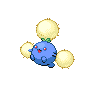
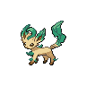
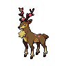
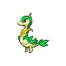
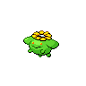

# Synthesis

**Type:**   
**Category:**   
**Power:** None  
**Accuracy:** None  
**PP:** 5  

## Description
Heals the user by half its max HP.  Affected by weather.

## Learned by
| Sprite | Pokemon |
| --- | --- |
|  | [Abomasnow](../pokemon/abomasnow.md) |
|  | [Amoonguss](../pokemon/amoonguss.md) |
|  | [Bayleef](../pokemon/bayleef.md) |
|  | [Bellossom](../pokemon/bellossom.md) |
|  | [Bellsprout](../pokemon/bellsprout.md) |
|  | [Breloom](../pokemon/breloom.md) |
|  | [Budew](../pokemon/budew.md) |
|  | [Bulbasaur](../pokemon/bulbasaur.md) |
|  | [Cacnea](../pokemon/cacnea.md) |
|  | [Cacturne](../pokemon/cacturne.md) |
|  | [Carnivine](../pokemon/carnivine.md) |
|  | [Celebi](../pokemon/celebi.md) |
|  | [Cherrim](../pokemon/cherrim.md) |
|  | [Cherubi](../pokemon/cherubi.md) |
|  | [Chikorita](../pokemon/chikorita.md) |
|  | [Cradily](../pokemon/cradily.md) |
|  | [Deerling](../pokemon/deerling.md) |
|  | [Exeggcute](../pokemon/exeggcute.md) |
|  | [Exeggutor](../pokemon/exeggutor.md) |
|  | [Foongus](../pokemon/foongus.md) |
|  | [Gloom](../pokemon/gloom.md) |
|  | [Grotle](../pokemon/grotle.md) |
|  | [Grovyle](../pokemon/grovyle.md) |
|  | [Hoppip](../pokemon/hoppip.md) |
|  | [Ivysaur](../pokemon/ivysaur.md) |
|  | [Jumpluff](../pokemon/jumpluff.md) |
|  | [Leafeon](../pokemon/leafeon.md) |
|  | [Leavanny](../pokemon/leavanny.md) |
|  | [Lileep](../pokemon/lileep.md) |
|  | [Lilligant](../pokemon/lilligant.md) |
|  | [Lombre](../pokemon/lombre.md) |
|  | [Lotad](../pokemon/lotad.md) |
|  | [Ludicolo](../pokemon/ludicolo.md) |
|  | [Maractus](../pokemon/maractus.md) |
|  | [Meganium](../pokemon/meganium.md) |
|  | [Mew](../pokemon/mew.md) |
|  | [Nuzleaf](../pokemon/nuzleaf.md) |
|  | [Oddish](../pokemon/oddish.md) |
|  | [Pansage](../pokemon/pansage.md) |
|  | [Paras](../pokemon/paras.md) |
|  | [Parasect](../pokemon/parasect.md) |
|  | [Petilil](../pokemon/petilil.md) |
|  | [Roselia](../pokemon/roselia.md) |
|  | [Roserade](../pokemon/roserade.md) |
|  | [Sawsbuck](../pokemon/sawsbuck.md) |
|  | [Sceptile](../pokemon/sceptile.md) |
|  | [Seedot](../pokemon/seedot.md) |
|  | [Serperior](../pokemon/serperior.md) |
|  | [Servine](../pokemon/servine.md) |
|  | [Sewaddle](../pokemon/sewaddle.md) |
|  | [Shiftry](../pokemon/shiftry.md) |
|  | [Shroomish](../pokemon/shroomish.md) |
|  | [Simisage](../pokemon/simisage.md) |
|  | [Skiploom](../pokemon/skiploom.md) |
|  | [Snivy](../pokemon/snivy.md) |
|  | [Snover](../pokemon/snover.md) |
|  | [Sunflora](../pokemon/sunflora.md) |
|  | [Sunkern](../pokemon/sunkern.md) |
|  | [Swadloon](../pokemon/swadloon.md) |
|  | [Tangela](../pokemon/tangela.md) |
|  | [Tangrowth](../pokemon/tangrowth.md) |
|  | [Torterra](../pokemon/torterra.md) |
|  | [Treecko](../pokemon/treecko.md) |
|  | [Tropius](../pokemon/tropius.md) |
|  | [Turtwig](../pokemon/turtwig.md) |
|  | [Venusaur](../pokemon/venusaur.md) |
|  | [Victreebel](../pokemon/victreebel.md) |
|  | [Vileplume](../pokemon/vileplume.md) |
|  | [Virizion](../pokemon/virizion.md) |
|  | [Weepinbell](../pokemon/weepinbell.md) |
