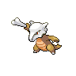

# Thrash

**TM/HM:** 

**Type:**   
**Category:** { style='object-fit:contain;' }  
**Power:** 120  
**Accuracy:** 100  
**PP:** 10  

## Description
Hits every turn for 2-3 turns, then confuses the user.

## Learned by
| Sprite | Pokemon |
| --- | --- |
|  | [Archen](../pokemon/archen.md) |
|  | [Archeops](../pokemon/archeops.md) |
|  | [Bagon](../pokemon/bagon.md) |
|  | [Barboach](../pokemon/barboach.md) |
|  | [Basculin-red-striped](../pokemon/basculin.md) |
|  | [Basculin-red-striped](../pokemon/basculin.md) |
|  | [Beartic](../pokemon/beartic.md) |
|  | [Blitzle](../pokemon/blitzle.md) |
|  | [Bouffalant](../pokemon/bouffalant.md) |
|  | [Braviary](../pokemon/braviary.md) |
|  | [Carvanha](../pokemon/carvanha.md) |
|  | [Cranidos](../pokemon/cranidos.md) |
|  | [Croconaw](../pokemon/croconaw.md) |
|  | [Cubchoo](../pokemon/cubchoo.md) |
|  | [Cubone](../pokemon/cubone.md) |
|  | [Cyndaquil](../pokemon/cyndaquil.md) |
|  | [Darmanitan-standard](../pokemon/darmanitan-standard.md) |
|  | [Darumaka](../pokemon/darumaka.md) |
|  | [Dodrio](../pokemon/dodrio.md) |
|  | [Doduo](../pokemon/doduo.md) |
|  | [Eelektrik](../pokemon/eelektrik.md) |
|  | [Feraligatr](../pokemon/feraligatr.md) |
|  | [Gible](../pokemon/gible.md) |
|  | [Growlithe](../pokemon/growlithe.md) |
|  | [Gyarados](../pokemon/gyarados.md) |
|  | [Krokorok](../pokemon/krokorok.md) |
|  | [Larvesta](../pokemon/larvesta.md) |
|  | [Larvitar](../pokemon/larvitar.md) |
|  | [Machoke](../pokemon/machoke.md) |
|  | [Machop](../pokemon/machop.md) |
|  | [Mamoswine](../pokemon/mamoswine.md) |
|  | [Mankey](../pokemon/mankey.md) |
|  | [Marowak](../pokemon/marowak.md) |
|  | [Nidoking](../pokemon/nidoking.md) |
|  | [Piloswine](../pokemon/piloswine.md) |
|  | [Pinsir](../pokemon/pinsir.md) |
|  | [Ponyta](../pokemon/ponyta.md) |
|  | [Primeape](../pokemon/primeape.md) |
|  | [Pupitar](../pokemon/pupitar.md) |
|  | [Rufflet](../pokemon/rufflet.md) |
|  | [Sandile](../pokemon/sandile.md) |
|  | [Spinda](../pokemon/spinda.md) |
|  | [Stantler](../pokemon/stantler.md) |
|  | [Tauros](../pokemon/tauros.md) |
|  | [Teddiursa](../pokemon/teddiursa.md) |
|  | [Tepig](../pokemon/tepig.md) |
|  | [Thundurus-incarnate](../pokemon/thundurus-incarnate.md) |
|  | [Tornadus-incarnate](../pokemon/tornadus-incarnate.md) |
|  | [Totodile](../pokemon/totodile.md) |
|  | [Turtwig](../pokemon/turtwig.md) |
|  | [Tyranitar](../pokemon/tyranitar.md) |
|  | [Ursaring](../pokemon/ursaring.md) |
|  | [Wailmer](../pokemon/wailmer.md) |
|  | [Zebstrika](../pokemon/zebstrika.md) |
