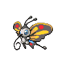
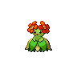
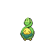

# Venoshock

**Type:**   
**Category:**   
**Power:** 65  
**Accuracy:** 100  
**PP:** 10  

## Description
Inflicts double damage if the target is Poisoned.

## Learned by
| Sprite | Pokemon |
| --- | --- |
|  | [Accelgor](../pokemon/accelgor.md) |
|  | [Amoonguss](../pokemon/amoonguss.md) |
|  | [Arbok](../pokemon/arbok.md) |
|  | [Ariados](../pokemon/ariados.md) |
|  | [Beautifly](../pokemon/beautifly.md) |
|  | [Beedrill](../pokemon/beedrill.md) |
|  | [Bellossom](../pokemon/bellossom.md) |
|  | [Bellsprout](../pokemon/bellsprout.md) |
|  | [Breloom](../pokemon/breloom.md) |
|  | [Budew](../pokemon/budew.md) |
|  | [Bulbasaur](../pokemon/bulbasaur.md) |
|  | [Butterfree](../pokemon/butterfree.md) |
|  | [Cacnea](../pokemon/cacnea.md) |
|  | [Cacturne](../pokemon/cacturne.md) |
|  | [Croagunk](../pokemon/croagunk.md) |
|  | [Crobat](../pokemon/crobat.md) |
|  | [Drapion](../pokemon/drapion.md) |
|  | [Dustox](../pokemon/dustox.md) |
|  | [Ekans](../pokemon/ekans.md) |
|  | [Foongus](../pokemon/foongus.md) |
|  | [Forretress](../pokemon/forretress.md) |
|  | [Garbodor](../pokemon/garbodor.md) |
|  | [Gastly](../pokemon/gastly.md) |
|  | [Gengar](../pokemon/gengar.md) |
|  | [Gligar](../pokemon/gligar.md) |
|  | [Gliscor](../pokemon/gliscor.md) |
|  | [Gloom](../pokemon/gloom.md) |
|  | [Golbat](../pokemon/golbat.md) |
|  | [Grimer](../pokemon/grimer.md) |
|  | [Gulpin](../pokemon/gulpin.md) |
|  | [Haunter](../pokemon/haunter.md) |
|  | [Heracross](../pokemon/heracross.md) |
|  | [Ivysaur](../pokemon/ivysaur.md) |
|  | [Koffing](../pokemon/koffing.md) |
|  | [Mew](../pokemon/mew.md) |
|  | [Mothim](../pokemon/mothim.md) |
|  | [Muk](../pokemon/muk.md) |
|  | [Nidoking](../pokemon/nidoking.md) |
|  | [Nidoqueen](../pokemon/nidoqueen.md) |
|  | [Nidoran♀](../pokemon/nidoran-f.md) |
|  | [Nidoran♂](../pokemon/nidoran-m.md) |
|  | [Nidorina](../pokemon/nidorina.md) |
|  | [Nidorino](../pokemon/nidorino.md) |
|  | [Oddish](../pokemon/oddish.md) |
|  | [Paras](../pokemon/paras.md) |
|  | [Parasect](../pokemon/parasect.md) |
|  | [Pineco](../pokemon/pineco.md) |
|  | [Qwilfish](../pokemon/qwilfish.md) |
|  | [Roselia](../pokemon/roselia.md) |
|  | [Roserade](../pokemon/roserade.md) |
|  | [Scizor](../pokemon/scizor.md) |
|  | [Scolipede](../pokemon/scolipede.md) |
|  | [Seismitoad](../pokemon/seismitoad.md) |
|  | [Seviper](../pokemon/seviper.md) |
|  | [Shelmet](../pokemon/shelmet.md) |
|  | [Shroomish](../pokemon/shroomish.md) |
|  | [Shuckle](../pokemon/shuckle.md) |
|  | [Skorupi](../pokemon/skorupi.md) |
|  | [Skuntank](../pokemon/skuntank.md) |
|  | [Spinarak](../pokemon/spinarak.md) |
|  | [Stunky](../pokemon/stunky.md) |
|  | [Swalot](../pokemon/swalot.md) |
|  | [Tentacool](../pokemon/tentacool.md) |
|  | [Tentacruel](../pokemon/tentacruel.md) |
|  | [Toxicroak](../pokemon/toxicroak.md) |
|  | [Trubbish](../pokemon/trubbish.md) |
|  | [Venipede](../pokemon/venipede.md) |
|  | [Venomoth](../pokemon/venomoth.md) |
|  | [Venonat](../pokemon/venonat.md) |
|  | [Venusaur](../pokemon/venusaur.md) |
|  | [Vespiquen](../pokemon/vespiquen.md) |
|  | [Victreebel](../pokemon/victreebel.md) |
|  | [Vileplume](../pokemon/vileplume.md) |
|  | [Weepinbell](../pokemon/weepinbell.md) |
|  | [Weezing](../pokemon/weezing.md) |
|  | [Whirlipede](../pokemon/whirlipede.md) |
|  | [Wormadam](../pokemon/wormadam.md) |
|  | [Zubat](../pokemon/zubat.md) |
