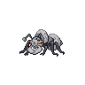

# Durant

{ width=150 }

## Type
{ width=60 } { width=60 }

## Evolution
{ width=40 } **[Durant](../pokemon/durant.md)**

## Abilities
| Slot | Original | New |
| --- | --- | --- |
| Ability 1 | **[Swarm](../abilities/swarm.md)**: Strengthens bug moves to inflict 1.5× damage at 1/3 max HP or less. | **[Swarm](../abilities/swarm.md)**: Strengthens bug moves to inflict 1.5× damage at 1/3 max HP or less. |
| Ability 2 | **[Hustle](../abilities/hustle.md)**: Strengthens physical moves to inflict 1.5× damage, but decreases their accuracy to 0.8×. | **[Hustle](../abilities/hustle.md)**: Strengthens physical moves to inflict 1.5× damage, but decreases their accuracy to 0.8×. |

## Type Defenses
| 0x | 0.5x | 2x | 4x |
| --- | --- | --- | --- |
| { width=40 } | { width=40 } |  | { width=40 } |
|  | { width=40 } |  |  |
|  | { width=40 } |  |  |
|  | { width=40 } |  |  |
|  | { width=40 } |  |  |
|  | { width=40 } |  |  |
|  | { width=40 } |  |  |

## Base Stats
| Stat | Value | Bar |
| --- | --- | --- |
| Hp | 75 58 | 

 |
| Attack | 111 109 | 

 |
| Defense | 112 | 

 |
| Special attack | 48 | 

 |
| Special defense | 55 48 | 

 |
| Speed | 109 | 

 |

## Locations
| Route | Method | Rate |
| --- | --- | --- |
| [Chargestone Cave 1F](../routes/chargestone-cave-1f.md) | { width=20 } Cave, Normal | 10% |
| [Chargestone Cave 1F](../routes/chargestone-cave-1f.md) | { width=20 } Cave, Normal | 5% |
| [Twist Mountain 1F - All Seasons](../routes/twist-mountain-1f---all-seasons.md) | { width=20 } Cave, Normal | 5% |
| [Victory Road Outside](../routes/victory-road-outside.md) | { width=20 } Cave, Normal | 20% |

## Level Up Moves
| Level | Type | Move | Cat | Power | Acc | PP | Change |
| --- | --- | --- | --- | --- | --- | --- | --- |
| 1 | { width=40 } | [Thunder fang](../moves/thunder-fang.md) | { width=30 style="vertical-align:middle; object-fit:contain;" } | 65 | 95 | 15 | NEW |
| 1 | { width=40 } | [Vice grip](../moves/vice-grip.md) | { width=30 style="vertical-align:middle; object-fit:contain;" } | 55 | 100 | 30 |  |
| 1 | { width=40 } | [Sand attack](../moves/sand-attack.md) | { width=30 style="vertical-align:middle; object-fit:contain;" } | - | 100 | 15 |  |
| 6 | { width=40 } | [Fury cutter](../moves/fury-cutter.md) | { width=30 style="vertical-align:middle; object-fit:contain;" } | 40 | 95 | 20 |  |
| 11 | { width=40 } | [Bite](../moves/bite.md) | { width=30 style="vertical-align:middle; object-fit:contain;" } | 60 | 100 | 25 |  |
| 16 | { width=40 } | [Agility](../moves/agility.md) | { width=30 style="vertical-align:middle; object-fit:contain;" } | - | - | 30 |  |
| 21 | { width=40 } | [Metal claw](../moves/metal-claw.md) | { width=30 style="vertical-align:middle; object-fit:contain;" } | 50 | 95 | 35 |  |
| 26 | { width=40 } | [Bug bite](../moves/bug-bite.md) | { width=30 style="vertical-align:middle; object-fit:contain;" } | 60 | 100 | 20 |  |
| 31 | { width=40 } | [Crunch](../moves/crunch.md) | { width=30 style="vertical-align:middle; object-fit:contain;" } | 80 | 100 | 15 |  |
| 36 | { width=40 } | [Iron head](../moves/iron-head.md) | { width=30 style="vertical-align:middle; object-fit:contain;" } | 80 | 100 | 15 |  |
| 41 | { width=40 } | [TM28 Dig](../moves/dig.md) | { width=30 style="vertical-align:middle; object-fit:contain;" } | 80 | 100 | 10 |  |
| 46 | { width=40 } | [Entrainment](../moves/entrainment.md) | { width=30 style="vertical-align:middle; object-fit:contain;" } | - | 100 | 15 |  |
| 51 | { width=40 } | [TM81 X scissor](../moves/x-scissor.md) | { width=30 style="vertical-align:middle; object-fit:contain;" } | 80 | 100 | 15 |  |
| 56 | { width=40 } | [Iron defense](../moves/iron-defense.md) | { width=30 style="vertical-align:middle; object-fit:contain;" } | - | - | 15 |  |
| 61 | { width=40 } | [Guillotine](../moves/guillotine.md) | { width=30 style="vertical-align:middle; object-fit:contain;" } | - | 30 | 5 |  |
| 66 | { width=40 } | [Metal sound](../moves/metal-sound.md) | { width=30 style="vertical-align:middle; object-fit:contain;" } | - | 85 | 40 |  |

## TM Moves
| Type | Move | Cat | Power | Acc | PP |
| --- | --- | --- | --- | --- | --- |
| { width=40 } | [TM40 Aerial ace](../moves/aerial-ace.md) | { width=30 style="vertical-align:middle; object-fit:contain;" } | 60 | - | 20 |
| { width=40 } | [TM45 Attract](../moves/attract.md) | { width=30 style="vertical-align:middle; object-fit:contain;" } | - | 100 | 15 |
| { width=40 } | [TM32 Double team](../moves/double-team.md) | { width=30 style="vertical-align:middle; object-fit:contain;" } | - | - | 15 |
| { width=40 } | [TM53 Energy ball](../moves/energy-ball.md) | { width=30 style="vertical-align:middle; object-fit:contain;" } | 90 | 100 | 10 |
| { width=40 } | [TM42 Facade](../moves/facade.md) | { width=30 style="vertical-align:middle; object-fit:contain;" } | 70 | 100 | 20 |
| { width=40 } | [TM91 Flash cannon](../moves/flash-cannon.md) | { width=30 style="vertical-align:middle; object-fit:contain;" } | 80 | 100 | 10 |
| { width=40 } | [TM21 Frustration](../moves/frustration.md) | { width=30 style="vertical-align:middle; object-fit:contain;" } | - | 100 | 20 |
| { width=40 } | [TM68 Giga impact](../moves/giga-impact.md) | { width=30 style="vertical-align:middle; object-fit:contain;" } | 150 | 90 | 5 |
| { width=40 } | [TM10 Hidden power](../moves/hidden-power.md) | { width=30 style="vertical-align:middle; object-fit:contain;" } | 60 | 100 | 15 |
| { width=40 } | [TM01 Hone claws](../moves/hone-claws.md) | { width=30 style="vertical-align:middle; object-fit:contain;" } | - | - | 15 |
| { width=40 } | [TM17 Protect](../moves/protect.md) | { width=30 style="vertical-align:middle; object-fit:contain;" } | - | - | 10 |
| { width=40 } | [TM44 Rest](../moves/rest.md) | { width=30 style="vertical-align:middle; object-fit:contain;" } | - | - | 5 |
| { width=40 } | [TM67 Retaliate](../moves/retaliate.md) | { width=30 style="vertical-align:middle; object-fit:contain;" } | 70 | 100 | 5 |
| { width=40 } | [TM27 Return](../moves/return.md) | { width=30 style="vertical-align:middle; object-fit:contain;" } | - | 100 | 20 |
| { width=40 } | [TM69 Rock polish](../moves/rock-polish.md) | { width=30 style="vertical-align:middle; object-fit:contain;" } | - | - | 20 |
| { width=40 } | [TM80 Rock slide](../moves/rock-slide.md) | { width=30 style="vertical-align:middle; object-fit:contain;" } | 75 | 90 | 10 |
| { width=40 } | [TM94 Rock smash](../moves/rock-smash.md) | { width=30 style="vertical-align:middle; object-fit:contain;" } | 40 | 100 | 15 |
| { width=40 } | [TM39 Rock tomb](../moves/rock-tomb.md) | { width=30 style="vertical-align:middle; object-fit:contain;" } | 60 | 95 | 15 |
| { width=40 } | [TM48 Round](../moves/round.md) | { width=30 style="vertical-align:middle; object-fit:contain;" } | 60 | 100 | 15 |
| { width=40 } | [TM37 Sandstorm](../moves/sandstorm.md) | { width=30 style="vertical-align:middle; object-fit:contain;" } | - | - | 10 |
| { width=40 } | [TM65 Shadow claw](../moves/shadow-claw.md) | { width=30 style="vertical-align:middle; object-fit:contain;" } | 70 | 100 | 15 |
| { width=40 } | [TM71 Stone edge](../moves/stone-edge.md) | { width=30 style="vertical-align:middle; object-fit:contain;" } | 100 | 80 | 5 |
| { width=40 } | [TM76 Struggle bug](../moves/struggle-bug.md) | { width=30 style="vertical-align:middle; object-fit:contain;" } | 50 | 100 | 20 |
| { width=40 } | [TM90 Substitute](../moves/substitute.md) | { width=30 style="vertical-align:middle; object-fit:contain;" } | - | - | 10 |
| { width=40 } | [TM87 Swagger](../moves/swagger.md) | { width=30 style="vertical-align:middle; object-fit:contain;" } | - | 85 | 15 |
| { width=40 } | [TM73 Thunder wave](../moves/thunder-wave.md) | { width=30 style="vertical-align:middle; object-fit:contain;" } | - | 90 | 20 |
| { width=40 } | [TM06 Toxic](../moves/toxic.md) | { width=30 style="vertical-align:middle; object-fit:contain;" } | - | 90 | 10 |

## HM Moves
| Type | Move | Cat | Power | Acc | PP |
| --- | --- | --- | --- | --- | --- |
| { width=40 } | [HM01 Cut](../moves/cut.md) | { width=30 style="vertical-align:middle; object-fit:contain;" } | 50 | 95 | 30 |
| { width=40 } | [HM04 Strength](../moves/strength.md) | { width=30 style="vertical-align:middle; object-fit:contain;" } | 80 | 100 | 15 |

## Egg Moves
| Type | Move | Cat | Power | Acc | PP |
| --- | --- | --- | --- | --- | --- |
| { width=40 } | [Baton pass](../moves/baton-pass.md) | { width=30 style="vertical-align:middle; object-fit:contain;" } | - | - | 40 |
| { width=40 } | [Endure](../moves/endure.md) | { width=30 style="vertical-align:middle; object-fit:contain;" } | - | - | 10 |
| { width=40 } | [Feint attack](../moves/feint-attack.md) | { width=30 style="vertical-align:middle; object-fit:contain;" } | 60 | - | 20 |
| { width=40 } | [Rock climb](../moves/rock-climb.md) | { width=30 style="vertical-align:middle; object-fit:contain;" } | 90 | 85 | 20 |
| { width=40 } | [Screech](../moves/screech.md) | { width=30 style="vertical-align:middle; object-fit:contain;" } | - | 85 | 40 |
| { width=40 } | [Thunder fang](../moves/thunder-fang.md) | { width=30 style="vertical-align:middle; object-fit:contain;" } | 65 | 95 | 15 |

## Tutor Moves
| Type | Move | Cat | Power | Acc | PP |
| --- | --- | --- | --- | --- | --- |
| { width=40 } | [Endeavor](../moves/endeavor.md) | { width=30 style="vertical-align:middle; object-fit:contain;" } | - | 100 | 5 |
| { width=40 } | [Sleep talk](../moves/sleep-talk.md) | { width=30 style="vertical-align:middle; object-fit:contain;" } | - | - | 10 |
| { width=40 } | [Snore](../moves/snore.md) | { width=30 style="vertical-align:middle; object-fit:contain;" } | 50 | 100 | 15 |
| { width=40 } | [Superpower](../moves/superpower.md) | { width=30 style="vertical-align:middle; object-fit:contain;" } | 120 | 100 | 5 |
