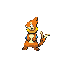

# Floatzel

## Type

## Evolution
 **[Buizel]( buizel.md)**  ➡️   **[Floatzel]( floatzel.md)** (Lv. 26)

## Abilities
| Slot | Original | New |
| --- | --- | --- |
| Ability 1 | **[Swift swim](../abilities/swift-swim.md)**: Doubles Speed during rain. | **[Swift Swim](../abilities/swift-swim.md)**: Doubles Speed during rain. |
| Ability 2 | **[Water veil](../abilities/water-veil.md)**: Prevents burns. | **[Technician](../abilities/technician.md)**: Strengthens moves of 60 base power or less to 1.5× their power. |

## Type Defenses
| Type | Effectiveness |
| --- | --- |
|  | x2.0 |
|  | x2.0 |
|  | x0.5 |
|  | x0.5 |
|  | x0.5 |
|  | x0.5 |

## Base Stats
| Stat | Value | Bar |
| --- | --- | --- |
| Hp | 85 | 

 |
| Attack | 105 | 

 |
| Defense | 55 | 

 |
| Special attack | 85 | 

 |
| Special defense | 50 | 

 |
| Speed | 115 | 

 |

## Locations
| Route | Method | Rate |
| --- | --- | --- |
| [Cold Storage](../routes/cold_storage.md) |  Grass, Doubles | 10% |
| [Route 11](../routes/route_11.md) |  Surf, Normal | 40% |

## Level Up Moves
| Level | Type | Move | Cat | Power | Acc | PP | Change |
| --- | --- | --- | --- | --- | --- | --- | --- |
| 1 |  | [Growl](../moves/growl.md) |  | - | 100 | 40 |  |
| 1 |  | [Sonic boom](../moves/sonic-boom.md) |  | - | 90 | 20 |  |
| 1 |  | [Quick attack](../moves/quick-attack.md) |  | 40 | 100 | 30 |  |
| 1 |  | [Water sport](../moves/water-sport.md) |  | - | - | 15 |  |
| 1 |  | [Ice fang](../moves/ice-fang.md) |  | 65 | 95 | 15 |  |
| 6 |  | [Water gun](../moves/water-gun.md) |  | 40 | 100 | 25 |  |
| 10 |  | [Pursuit](../moves/pursuit.md) |  | 40 | 100 | 20 |  |
| 15 |  | [Swift](../moves/swift.md) |  | 60 | - | 20 |  |
| 21 |  | [Aqua jet](../moves/aqua-jet.md) |  | 40 | 100 | 20 |  |
| 26 |  | [Crunch](../moves/crunch.md) |  | 80 | 100 | 15 |  |
| 29 |  | [Agility](../moves/agility.md) |  | - | - | 30 |  |
| 29 |  | [Double hit](../moves/double-hit.md) |  | 35 | 90 | 10 |  |
| 39 |  | [Whirlpool](../moves/whirlpool.md) |  | 35 | 85 | 15 |  |
| 50 |  | [Razor wind](../moves/razor-wind.md) |  | 80 | 100 | 10 |  |
| 57 |  | [Hydro pump](../moves/hydro-pump.md) |  | 110 | 80 | 5 |  |
| 62 |  | [Aqua tail](../moves/aqua-tail.md) |  | 90 | 90 | 10 |  |

## TM Moves
| Type | Move | Cat | Power | Acc | PP |
| --- | --- | --- | --- | --- | --- |
|  | [TM45 Attract](../moves/attract.md) |  | - | 100 | 15 |
|  | [TM14 Blizzard](../moves/blizzard.md) |  | 110 | 70 | 5 |
|  | [TM31 Brick break](../moves/brick-break.md) |  | 75 | 100 | 15 |
|  | [TM08 Bulk up](../moves/bulk-up.md) |  | - | - | 20 |
|  | [TM28 Dig](../moves/dig.md) |  | 80 | 100 | 10 |
|  | [TM32 Double team](../moves/double-team.md) |  | - | - | 15 |
|  | [TM49 Echoed voice](../moves/echoed-voice.md) |  | 40 | 100 | 15 |
|  | [TM42 Facade](../moves/facade.md) |  | 70 | 100 | 20 |
|  | [TM52 Focus blast](../moves/focus-blast.md) |  | 120 | 70 | 5 |
|  | [TM21 Frustration](../moves/frustration.md) |  | - | 100 | 20 |
|  | [TM68 Giga impact](../moves/giga-impact.md) |  | 150 | 90 | 5 |
|  | [TM07 Hail](../moves/hail.md) |  | - | - | 10 |
|  | [TM10 Hidden power](../moves/hidden-power.md) |  | 60 | 100 | 15 |
|  | [TM15 Hyper beam](../moves/hyper-beam.md) |  | 150 | 90 | 5 |
|  | [TM13 Ice beam](../moves/ice-beam.md) |  | 90 | 100 | 10 |
|  | [TM66 Payback](../moves/payback.md) |  | 50 | 100 | 10 |
|  | [TM17 Protect](../moves/protect.md) |  | - | - | 10 |
|  | [TM18 Rain dance](../moves/rain-dance.md) |  | - | - | 5 |
|  | [TM44 Rest](../moves/rest.md) |  | - | - | 5 |
|  | [TM27 Return](../moves/return.md) |  | - | 100 | 20 |
|  | [TM05 Roar](../moves/roar.md) |  | - | - | 20 |
|  | [TM94 Rock smash](../moves/rock-smash.md) |  | 40 | 100 | 15 |
|  | [TM39 Rock tomb](../moves/rock-tomb.md) |  | 60 | 95 | 15 |
|  | [TM48 Round](../moves/round.md) |  | 60 | 100 | 15 |
|  | [TM55 Scald](../moves/scald.md) |  | 80 | 100 | 15 |
|  | [TM90 Substitute](../moves/substitute.md) |  | - | - | 10 |
|  | [TM87 Swagger](../moves/swagger.md) |  | - | 85 | 15 |
|  | [TM12 Taunt](../moves/taunt.md) |  | - | 100 | 20 |
|  | [TM41 Torment](../moves/torment.md) |  | - | 100 | 15 |
|  | [TM06 Toxic](../moves/toxic.md) |  | - | 90 | 10 |

## HM Moves
| Type | Move | Cat | Power | Acc | PP |
| --- | --- | --- | --- | --- | --- |
|  | [HM06 Dive](../moves/dive.md) |  | 80 | 100 | 10 |
|  | [HM04 Strength](../moves/strength.md) |  | 80 | 100 | 15 |
|  | [HM03 Surf](../moves/surf.md) |  | 90 | 100 | 15 |
|  | [HM05 Waterfall](../moves/waterfall.md) |  | 80 | 100 | 15 |

## Tutor Moves
| Type | Move | Cat | Power | Acc | PP |
| --- | --- | --- | --- | --- | --- |
|  | [Ice punch](../moves/ice-punch.md) |  | 75 | 100 | 15 |
|  | [Icy wind](../moves/icy-wind.md) |  | 55 | 95 | 15 |
|  | [Iron tail](../moves/iron-tail.md) |  | 100 | 75 | 15 |
|  | [Low kick](../moves/low-kick.md) |  | - | 100 | 20 |
|  | [Sleep talk](../moves/sleep-talk.md) |  | - | - | 10 |
|  | [Snore](../moves/snore.md) |  | 50 | 100 | 15 |
