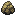

# Glalie

## Type
Original:   
New:  

## Evolution
|Stage |  | Stage |
|:---: | :---: | :---: |
| **[Snorunt]( snorunt.md)** | ➡️ Lv. 42 |  **[Glalie]( glalie.md)** |
| **[Snorunt]( snorunt.md)** | ➡️ Use dawn-stone |  **[Froslass]( froslass.md)** |

## Abilities
| Slot | Original | New |
| --- | --- | --- |
| Ability 1 | **[Inner focus](../abilities/inner-focus.md)**: Prevents flinching. | **[Solid Rock](../abilities/solid-rock.md)**: Decreases damage taken from super-effective moves by 1/4. |
| Ability 2 | **[Ice body](../abilities/ice-body.md)**: Heals for 1/16 max HP after each turn during hail.  Protects against hail damage. | **[Moody](../abilities/moody.md)**: Raises a random stat two stages and lowers another one stage after each turn. |

## Base Happiness
70

## Held Items
None

## Type Defenses
| 0x | 0.5x | 1x | 2x | 4x |
| --- | --- | --- | --- | --- |
|  |  |  |  |  |
|  |  |  |  |  |
|  |  |  |  |  |
|  |  |  |  |  |
|  |  |  |  |  |
|  |  |  |  |  |
|  |  |  |  |  |

## Base Stats
| Stat | Value | Bar |
| --- | --- | --- |
| Hp | 100 80 | 

 |
| Attack | 100 80 | 

 |
| Defense | 120 80 | 

 |
| Special attack | 60 80 | 

 |
| Special defense | 60 80 | 

 |
| Speed | 60 80 | 

 |
| **Total** | 500 480 | |

## Locations
| Route | Method | Rate |
| --- | --- | --- |
| [Giant Chasm](../routes/giant-chasm.md) |  Cave, Normal | 10% |

## Level Up Moves
| Level | Type | Move | Cat | Power | Acc | PP |
| :--- | :--- | :--- | :--- | :--- | :--- | :--- |
| 1 |  | [Leer](../moves/leer.md) | { style="vertical-align:middle; object-fit:contain;" } | - | 100 | 30 |
| 1 |  | [Bite](../moves/bite.md) | { style="vertical-align:middle; object-fit:contain;" } | 60 | 100 | 25 |
| 1 |  | [Double team](../moves/double-team.md) | { style="vertical-align:middle; object-fit:contain;" } | - | - | 15 |
| 1 |  | [Powder snow](../moves/powder-snow.md) | { style="vertical-align:middle; object-fit:contain;" } | 40 | 100 | 25 |
| 13 |  | [Icy wind](../moves/icy-wind.md) | { style="vertical-align:middle; object-fit:contain;" } | 55 | 95 | 15 |
| 19 |  | [Headbutt](../moves/headbutt.md) | { style="vertical-align:middle; object-fit:contain;" } | 70 | 100 | 15 |
| 22 |  | [Protect](../moves/protect.md) | { style="vertical-align:middle; object-fit:contain;" } | - | - | 10 |
| 28 |  | [Ice fang](../moves/ice-fang.md) | { style="vertical-align:middle; object-fit:contain;" } | 65 | 95 | 15 |
| 31 |  | [Crunch](../moves/crunch.md) | { style="vertical-align:middle; object-fit:contain;" } | 80 | 100 | 15 |
| 37 NEW |  | [Avalanche](../moves/avalanche.md) | { style="vertical-align:middle; object-fit:contain;" } | 60 | 100 | 10 |
| 37 NEW |  | [Ice beam](../moves/ice-beam.md) | { style="vertical-align:middle; object-fit:contain;" } | 90 | 100 | 10 |
| 37 REMOVED |  | [Ice beam](../moves/ice-beam.md) | { style="vertical-align:middle; object-fit:contain;" } | 90 | 100 | 10 |
| 40 |  | [Hail](../moves/hail.md) | { style="vertical-align:middle; object-fit:contain;" } | - | - | 10 |
| 51 |  | [Blizzard](../moves/blizzard.md) | { style="vertical-align:middle; object-fit:contain;" } | 110 | 70 | 5 |
| 59 |  | [Sheer cold](../moves/sheer-cold.md) | { style="vertical-align:middle; object-fit:contain;" } | - | 30 | 5 |

## TM Moves
| No. | Type | Move | Cat | Power | Acc | PP |
| :--- | :--- | :--- | :--- | :--- | :--- | :--- |
| TM45 |  | [Attract](../moves/attract.md) | { style="vertical-align:middle; object-fit:contain;" } | - | 100 | 15 |
| TM78 |  | [Bulldoze](../moves/bulldoze.md) | { style="vertical-align:middle; object-fit:contain;" } | 60 | 100 | 20 |
| TM26 |  | [Earthquake](../moves/earthquake.md) | { style="vertical-align:middle; object-fit:contain;" } | 100 | 100 | 10 |
| TM64 |  | [Explosion](../moves/explosion.md) | { style="vertical-align:middle; object-fit:contain;" } | 250 | 100 | 5 |
| TM42 |  | [Facade](../moves/facade.md) | { style="vertical-align:middle; object-fit:contain;" } | 70 | 100 | 20 |
| TM70 |  | [Flash](../moves/flash.md) | { style="vertical-align:middle; object-fit:contain;" } | - | 100 | 20 |
| TM79 |  | [Frost breath](../moves/frost-breath.md) | { style="vertical-align:middle; object-fit:contain;" } | 60 | 90 | 10 |
| TM21 |  | [Frustration](../moves/frustration.md) | { style="vertical-align:middle; object-fit:contain;" } | - | 100 | 20 |
| TM68 |  | [Giga impact](../moves/giga-impact.md) | { style="vertical-align:middle; object-fit:contain;" } | 150 | 90 | 5 |
| TM74 |  | [Gyro ball](../moves/gyro-ball.md) | { style="vertical-align:middle; object-fit:contain;" } | - | 100 | 5 |
| TM10 |  | [Hidden power](../moves/hidden-power.md) | { style="vertical-align:middle; object-fit:contain;" } | 60 | 100 | 15 |
| TM15 |  | [Hyper beam](../moves/hyper-beam.md) | { style="vertical-align:middle; object-fit:contain;" } | 150 | 90 | 5 |
| TM16 |  | [Light screen](../moves/light-screen.md) | { style="vertical-align:middle; object-fit:contain;" } | - | - | 30 |
| TM66 |  | [Payback](../moves/payback.md) | { style="vertical-align:middle; object-fit:contain;" } | 50 | 100 | 10 |
| TM18 |  | [Rain dance](../moves/rain-dance.md) | { style="vertical-align:middle; object-fit:contain;" } | - | - | 5 |
| TM44 |  | [Rest](../moves/rest.md) | { style="vertical-align:middle; object-fit:contain;" } | - | - | 5 |
| TM27 |  | [Return](../moves/return.md) | { style="vertical-align:middle; object-fit:contain;" } | - | 100 | 20 |
| TM69  NEW|  | [Rock polish](../moves/rock-polish.md) | { style="vertical-align:middle; object-fit:contain;" } | - | - | 20 |
| TM48 |  | [Round](../moves/round.md) | { style="vertical-align:middle; object-fit:contain;" } | 60 | 100 | 15 |
| TM20 |  | [Safeguard](../moves/safeguard.md) | { style="vertical-align:middle; object-fit:contain;" } | - | - | 25 |
| TM37  NEW|  | [Sandstorm](../moves/sandstorm.md) | { style="vertical-align:middle; object-fit:contain;" } | - | - | 10 |
| TM30 |  | [Shadow ball](../moves/shadow-ball.md) | { style="vertical-align:middle; object-fit:contain;" } | 80 | 100 | 15 |
| TM23  NEW|  | [Smack down](../moves/smack-down.md) | { style="vertical-align:middle; object-fit:contain;" } | 50 | 100 | 15 |
| TM90 |  | [Substitute](../moves/substitute.md) | { style="vertical-align:middle; object-fit:contain;" } | - | - | 10 |
| TM87 |  | [Swagger](../moves/swagger.md) | { style="vertical-align:middle; object-fit:contain;" } | - | 85 | 15 |
| TM12 |  | [Taunt](../moves/taunt.md) | { style="vertical-align:middle; object-fit:contain;" } | - | 100 | 20 |
| TM41 |  | [Torment](../moves/torment.md) | { style="vertical-align:middle; object-fit:contain;" } | - | 100 | 15 |
| TM06 |  | [Toxic](../moves/toxic.md) | { style="vertical-align:middle; object-fit:contain;" } | - | 90 | 10 |

## Tutor Moves
| No. | Type | Move | Cat | Power | Acc | PP |
| :--- | :--- | :--- | :--- | :--- | :--- | :--- |
|  |  | [Block](../moves/block.md) | { style="vertical-align:middle; object-fit:contain;" } | - | - | 5 |
|  |  | [Dark pulse](../moves/dark-pulse.md) | { style="vertical-align:middle; object-fit:contain;" } | 80 | 100 | 15 |
|  |  | [Iron head](../moves/iron-head.md) | { style="vertical-align:middle; object-fit:contain;" } | 80 | 100 | 15 |
|  |  | [Signal beam](../moves/signal-beam.md) | { style="vertical-align:middle; object-fit:contain;" } | 75 | 100 | 15 |
|  |  | [Sleep talk](../moves/sleep-talk.md) | { style="vertical-align:middle; object-fit:contain;" } | - | - | 10 |
|  |  | [Snore](../moves/snore.md) | { style="vertical-align:middle; object-fit:contain;" } | 50 | 100 | 15 |
|  |  | [Spite](../moves/spite.md) | { style="vertical-align:middle; object-fit:contain;" } | - | 100 | 10 |
|  |  | [Super fang](../moves/super-fang.md) | { style="vertical-align:middle; object-fit:contain;" } | - | 90 | 10 |
