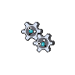
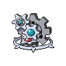

# Klang

## Type

## Evolution
|Stage |  | Stage |  | Stage |
|:---: | :---: | :---: | :---: | :---: |
| **[Klink]( klink.md)** | ➡️ Lv. 38 |  **[Klang]( klang.md)** | ➡️ Lv. 49 |  **[Klinklang]( klinklang.md)** |

## Abilities
| Slot | Original | New |
| --- | --- | --- |
| Ability 1 | **[Plus](../abilities/plus.md)**: Increases Special Attack to 1.5× when a friendly Pokémon has plus or minus. | **[Motor Drive](../abilities/motor-drive.md)**: Absorbs electric moves, raising Speed one stage. |
| Ability 2 | **[Minus](../abilities/minus.md)**: Increases Special Attack to 1.5× when a friendly Pokémon has plus or minus. | **[Clear Body](../abilities/clear-body.md)**: Prevents stats from being lowered by other Pokémon. |

## Base Happiness
70

## Held Items
None

## Type Defenses
| 0x | 0.5x | 1x | 2x | 4x |
| --- | --- | --- | --- | --- |
|  |  |  |  |  |
|  |  |  |  |  |
|  |  |  |  |  |
|  |  |  |  |  |
|  |  |  |  |  |
|  |  |  |  |  |
|  |  |  |  |  |
|  |  |  |  |  |
|  |  |  |  |  |

## Base Stats
| Stat | Value | Bar |
| --- | --- | --- |
| Hp | 60 | 

 |
| Attack | 80 | 

 |
| Defense | 95 | 

 |
| Special attack | 70 | 

 |
| Special defense | 85 | 

 |
| Speed | 50 | 

 |
| **Total** | **440** | |

## Locations
| Route | Method | Rate |
| --- | --- | --- |
| [Chargestone Cave](../routes/chargestone-cave.md) |  Cave, Normal | 20% |
| [P2 Laboratory](../routes/p2-laboratory.md) |  Grass, Normal | 20% |
| [Victory Road](../routes/victory-road.md) |  Cave, Normal | 10% |

## Level Up Moves
| Level | Move | Type | Cat | Power | Acc | PP |
| :--- | :--- | :--- | :--- | :--- | :--- | :--- |
| 1  | [Vice grip](../moves/vice-grip.md) |  | { style="vertical-align:middle; object-fit:contain;" } | 55 | 100 | 30 |
| 1  | [Thunder shock](../moves/thunder-shock.md) |  | { style="vertical-align:middle; object-fit:contain;" } | 40 | 100 | 30 |
| 1  | [Charge](../moves/charge.md) |  | { style="vertical-align:middle; object-fit:contain;" } | - | - | 20 |
| 1  | [Gear grind](../moves/gear-grind.md) |  | { style="vertical-align:middle; object-fit:contain;" } | 50 | 85 | 15 |
| 21  | [Bind](../moves/bind.md) |  | { style="vertical-align:middle; object-fit:contain;" } | 15 | 85 | 20 |
| 26  | [Charge beam](../moves/charge-beam.md) |  | { style="vertical-align:middle; object-fit:contain;" } | 50 | 90 | 10 |
| 31  | [Autotomize](../moves/autotomize.md) |  | { style="vertical-align:middle; object-fit:contain;" } | - | - | 15 |
| 33  NEW | [Spark](../moves/spark.md) |  | { style="vertical-align:middle; object-fit:contain;" } | 65 | 100 | 20 |
| 36  | [Mirror shot](../moves/mirror-shot.md) |  | { style="vertical-align:middle; object-fit:contain;" } | 65 | 85 | 10 |
| 40  | [Screech](../moves/screech.md) |  | { style="vertical-align:middle; object-fit:contain;" } | - | 85 | 40 |
| 44  | [Discharge](../moves/discharge.md) |  | { style="vertical-align:middle; object-fit:contain;" } | 80 | 100 | 15 |
| 48  | [Metal sound](../moves/metal-sound.md) |  | { style="vertical-align:middle; object-fit:contain;" } | - | 85 | 40 |
| 52  | [Shift gear](../moves/shift-gear.md) |  | { style="vertical-align:middle; object-fit:contain;" } | - | - | 10 |
| 56  | [Lock on](../moves/lock-on.md) |  | { style="vertical-align:middle; object-fit:contain;" } | - | - | 5 |
| 60  | [Zap cannon](../moves/zap-cannon.md) |  | { style="vertical-align:middle; object-fit:contain;" } | 120 | 50 | 5 |
| 64  | [Hyper beam](../moves/hyper-beam.md) |  | { style="vertical-align:middle; object-fit:contain;" } | 150 | 90 | 5 |

## TM Moves
| No. | Move | Type | Cat | Power | Acc | PP |
| :--- | :--- | :--- | :--- | :--- | :--- | :--- |
| TM80  NEW| [Rock slide](../moves/rock-slide.md) |  | { style="vertical-align:middle; object-fit:contain;" } | 75 | 90 | 10 |
| TM32 | [Double team](../moves/double-team.md) |  | { style="vertical-align:middle; object-fit:contain;" } | - | - | 15 |
| TM42 | [Facade](../moves/facade.md) |  | { style="vertical-align:middle; object-fit:contain;" } | 70 | 100 | 20 |
| TM91 | [Flash cannon](../moves/flash-cannon.md) |  | { style="vertical-align:middle; object-fit:contain;" } | 80 | 100 | 10 |
| TM21 | [Frustration](../moves/frustration.md) |  | { style="vertical-align:middle; object-fit:contain;" } | - | 100 | 20 |
| TM10 | [Hidden power](../moves/hidden-power.md) |  | { style="vertical-align:middle; object-fit:contain;" } | 60 | 100 | 15 |
| TM17 | [Protect](../moves/protect.md) |  | { style="vertical-align:middle; object-fit:contain;" } | - | - | 10 |
| TM44 | [Rest](../moves/rest.md) |  | { style="vertical-align:middle; object-fit:contain;" } | - | - | 5 |
| TM27 | [Return](../moves/return.md) |  | { style="vertical-align:middle; object-fit:contain;" } | - | 100 | 20 |
| TM69 | [Rock polish](../moves/rock-polish.md) |  | { style="vertical-align:middle; object-fit:contain;" } | - | - | 20 |
| TM94 | [Rock smash](../moves/rock-smash.md) |  | { style="vertical-align:middle; object-fit:contain;" } | 40 | 100 | 15 |
| TM48 | [Round](../moves/round.md) |  | { style="vertical-align:middle; object-fit:contain;" } | 60 | 100 | 15 |
| TM37 | [Sandstorm](../moves/sandstorm.md) |  | { style="vertical-align:middle; object-fit:contain;" } | - | - | 10 |
| TM90 | [Substitute](../moves/substitute.md) |  | { style="vertical-align:middle; object-fit:contain;" } | - | - | 10 |
| TM87 | [Swagger](../moves/swagger.md) |  | { style="vertical-align:middle; object-fit:contain;" } | - | 85 | 15 |
| TM73 | [Thunder wave](../moves/thunder-wave.md) |  | { style="vertical-align:middle; object-fit:contain;" } | - | 90 | 20 |
| TM24 | [Thunderbolt](../moves/thunderbolt.md) |  | { style="vertical-align:middle; object-fit:contain;" } | 90 | 100 | 15 |
| TM06 | [Toxic](../moves/toxic.md) |  | { style="vertical-align:middle; object-fit:contain;" } | - | 90 | 10 |
| TM72 | [Volt switch](../moves/volt-switch.md) |  | { style="vertical-align:middle; object-fit:contain;" } | 70 | 100 | 20 |
| TM93 | [Wild charge](../moves/wild-charge.md) |  | { style="vertical-align:middle; object-fit:contain;" } | 90 | 100 | 15 |

## Tutor Moves
| No. | Move | Type | Cat | Power | Acc | PP |
| :--- | :--- | :--- | :--- | :--- | :--- | :--- |
|  | [Gravity](../moves/gravity.md) |  | { style="vertical-align:middle; object-fit:contain;" } | - | - | 5 |
|  | [Iron defense](../moves/iron-defense.md) |  | { style="vertical-align:middle; object-fit:contain;" } | - | - | 15 |
|  | [Magic coat](../moves/magic-coat.md) |  | { style="vertical-align:middle; object-fit:contain;" } | - | - | 15 |
|  | [Magnet rise](../moves/magnet-rise.md) |  | { style="vertical-align:middle; object-fit:contain;" } | - | - | 10 |
|  | [Recycle](../moves/recycle.md) |  | { style="vertical-align:middle; object-fit:contain;" } | - | - | 10 |
|  | [Signal beam](../moves/signal-beam.md) |  | { style="vertical-align:middle; object-fit:contain;" } | 75 | 100 | 15 |
|  | [Sleep talk](../moves/sleep-talk.md) |  | { style="vertical-align:middle; object-fit:contain;" } | - | - | 10 |
|  | [Snore](../moves/snore.md) |  | { style="vertical-align:middle; object-fit:contain;" } | 50 | 100 | 15 |
|  | [Uproar](../moves/uproar.md) |  | { style="vertical-align:middle; object-fit:contain;" } | 90 | 100 | 10 |
