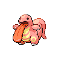

# Lickitung

## Type

## Evolution
 **[Lickitung]( lickitung.md)**  ➡️   **[Lickilicky]( lickilicky.md)** (Know rollout)

## Abilities
| Slot | Original | New |
| --- | --- | --- |
| Ability 1 | **[Own tempo](../abilities/own-tempo.md)**: Prevents confusion. | **[Cloud Nine](../abilities/cloud-nine.md)**: Negates all effects of weather, but does not prevent the weather itself. |
| Ability 2 | **[Oblivious](../abilities/oblivious.md)**: Prevents infatuation and protects against captivate. | **[Gluttony](../abilities/gluttony.md)**: Makes the Pokémon eat any held Berry triggered by low HP below 1/2 its max HP. |

## Type Defenses
| Type | Effectiveness |
| --- | --- |
|  | x2.0 |
|  | x0.0 |

## Base Stats
| Stat | Value | Bar |
| --- | --- | --- |
| Hp | 90 | 

 |
| Attack | 55 | 

 |
| Defense | 75 | 

 |
| Special attack | 60 | 

 |
| Special defense | 75 | 

 |
| Speed | 30 | 

 |

## Locations
| Route | Method | Rate |
| --- | --- | --- |
| [Route 5](../routes/route_5.md) |  Grass, Doubles | 10% |
| [Route 17](../routes/route_17.md) |  Grass, Normal | 10% |
| [Route 17](../routes/route_17.md) |  Grass, Doubles | 10% |
| [Challenger’s Cave – All Floors](../routes/challengers_cave_–_all_floors.md) |  Cave, Normal | 10% |

## Level Up Moves
| Level | Type | Move | Cat | Power | Acc | PP | Change |
| --- | --- | --- | --- | --- | --- | --- | --- |
| 1 |  | [Lick](../moves/lick.md) |  | 30 | 100 | 30 |  |
| 5 |  | [Supersonic](../moves/supersonic.md) |  | - | 55 | 20 |  |
| 9 |  | [Defense curl](../moves/defense-curl.md) |  | - | - | 40 |  |
| 13 |  | [Knock off](../moves/knock-off.md) |  | 65 | 100 | 20 |  |
| 17 |  | [Wrap](../moves/wrap.md) |  | 15 | 90 | 20 |  |
| 21 |  | [Stomp](../moves/stomp.md) |  | 65 | 100 | 20 |  |
| 25 |  | [Disable](../moves/disable.md) |  | - | 100 | 20 |  |
| 29 |  | [Slam](../moves/slam.md) |  | 80 | 75 | 20 |  |
| 33 |  | [Rollout](../moves/rollout.md) |  | 30 | 90 | 20 |  |
| 37 |  | [Chip away](../moves/chip-away.md) |  | 70 | 100 | 20 |  |
| 41 |  | [Me first](../moves/me-first.md) |  | - | - | 20 |  |
| 45 |  | [Refresh](../moves/refresh.md) |  | - | - | 20 |  |
| 49 |  | [Screech](../moves/screech.md) |  | - | 85 | 40 |  |
| 53 |  | [Power whip](../moves/power-whip.md) |  | 120 | 85 | 10 |  |
| 57 |  | [Wring out](../moves/wring-out.md) |  | - | 100 | 5 |  |

## TM Moves
| Type | Move | Cat | Power | Acc | PP |
| --- | --- | --- | --- | --- | --- |
|  | [TM45 Attract](../moves/attract.md) |  | - | 100 | 15 |
|  | [TM14 Blizzard](../moves/blizzard.md) |  | 110 | 70 | 5 |
|  | [TM31 Brick break](../moves/brick-break.md) |  | 75 | 100 | 15 |
|  | [TM78 Bulldoze](../moves/bulldoze.md) |  | 60 | 100 | 20 |
|  | [TM28 Dig](../moves/dig.md) |  | 80 | 100 | 10 |
|  | [TM32 Double team](../moves/double-team.md) |  | - | - | 15 |
|  | [TM82 Dragon tail](../moves/dragon-tail.md) |  | 60 | 90 | 10 |
|  | [TM85 Dream eater](../moves/dream-eater.md) |  | 100 | 100 | 15 |
|  | [TM26 Earthquake](../moves/earthquake.md) |  | 100 | 100 | 10 |
|  | [TM42 Facade](../moves/facade.md) |  | 70 | 100 | 20 |
|  | [TM38 Fire blast](../moves/fire-blast.md) |  | 110 | 85 | 5 |
|  | [TM35 Flamethrower](../moves/flamethrower.md) |  | 90 | 100 | 15 |
|  | [TM56 Fling](../moves/fling.md) |  | - | 100 | 10 |
|  | [TM21 Frustration](../moves/frustration.md) |  | - | 100 | 20 |
|  | [TM68 Giga impact](../moves/giga-impact.md) |  | 150 | 90 | 5 |
|  | [TM10 Hidden power](../moves/hidden-power.md) |  | 60 | 100 | 15 |
|  | [TM15 Hyper beam](../moves/hyper-beam.md) |  | 150 | 90 | 5 |
|  | [TM13 Ice beam](../moves/ice-beam.md) |  | 90 | 100 | 10 |
|  | [TM59 Incinerate](../moves/incinerate.md) |  | 60 | 100 | 15 |
|  | [TM17 Protect](../moves/protect.md) |  | - | - | 10 |
|  | [TM77 Psych up](../moves/psych-up.md) |  | - | - | 10 |
|  | [TM18 Rain dance](../moves/rain-dance.md) |  | - | - | 5 |
|  | [TM44 Rest](../moves/rest.md) |  | - | - | 5 |
|  | [TM67 Retaliate](../moves/retaliate.md) |  | 70 | 100 | 5 |
|  | [TM27 Return](../moves/return.md) |  | - | 100 | 20 |
|  | [TM80 Rock slide](../moves/rock-slide.md) |  | 75 | 90 | 10 |
|  | [TM94 Rock smash](../moves/rock-smash.md) |  | 40 | 100 | 15 |
|  | [TM39 Rock tomb](../moves/rock-tomb.md) |  | 60 | 95 | 15 |
|  | [TM48 Round](../moves/round.md) |  | 60 | 100 | 15 |
|  | [TM37 Sandstorm](../moves/sandstorm.md) |  | - | - | 10 |
|  | [TM30 Shadow ball](../moves/shadow-ball.md) |  | 80 | 100 | 15 |
|  | [TM22 Solar beam](../moves/solar-beam.md) |  | 120 | 100 | 10 |
|  | [TM90 Substitute](../moves/substitute.md) |  | - | - | 10 |
|  | [TM11 Sunny day](../moves/sunny-day.md) |  | - | - | 5 |
|  | [TM87 Swagger](../moves/swagger.md) |  | - | 85 | 15 |
|  | [TM75 Swords dance](../moves/swords-dance.md) |  | - | - | 20 |
|  | [TM46 Thief](../moves/thief.md) |  | 60 | 100 | 25 |
|  | [TM25 Thunder](../moves/thunder.md) |  | 110 | 70 | 10 |
|  | [TM24 Thunderbolt](../moves/thunderbolt.md) |  | 90 | 100 | 15 |
|  | [TM06 Toxic](../moves/toxic.md) |  | - | 90 | 10 |
|  | [TM83 Work up](../moves/work-up.md) |  | - | - | 30 |

## HM Moves
| Type | Move | Cat | Power | Acc | PP |
| --- | --- | --- | --- | --- | --- |
|  | [HM01 Cut](../moves/cut.md) |  | 50 | 95 | 30 |
|  | [HM04 Strength](../moves/strength.md) |  | 80 | 100 | 15 |
|  | [HM03 Surf](../moves/surf.md) |  | 90 | 100 | 15 |

## Egg Moves
| Type | Move | Cat | Power | Acc | PP |
| --- | --- | --- | --- | --- | --- |
|  | [Amnesia](../moves/amnesia.md) |  | - | - | 20 |
|  | [Belly drum](../moves/belly-drum.md) |  | - | - | 10 |
|  | [Body slam](../moves/body-slam.md) |  | 85 | 100 | 15 |
|  | [Curse](../moves/curse.md) |  | - | - | 10 |
|  | [Hammer arm](../moves/hammer-arm.md) |  | 100 | 90 | 10 |
|  | [Magnitude](../moves/magnitude.md) |  | - | 100 | 30 |
|  | [Muddy water](../moves/muddy-water.md) |  | 90 | 85 | 10 |
|  | [Sleep talk](../moves/sleep-talk.md) |  | - | - | 10 |
|  | [Smelling salts](../moves/smelling-salts.md) |  | 70 | 100 | 10 |
|  | [Snore](../moves/snore.md) |  | 50 | 100 | 15 |
|  | [Zen headbutt](../moves/zen-headbutt.md) |  | 80 | 90 | 15 |

## Tutor Moves
| Type | Move | Cat | Power | Acc | PP |
| --- | --- | --- | --- | --- | --- |
|  | [Aqua tail](../moves/aqua-tail.md) |  | 90 | 90 | 10 |
|  | [Bind](../moves/bind.md) |  | 15 | 85 | 20 |
|  | [Fire punch](../moves/fire-punch.md) |  | 75 | 100 | 15 |
|  | [Ice punch](../moves/ice-punch.md) |  | 75 | 100 | 15 |
|  | [Icy wind](../moves/icy-wind.md) |  | 55 | 95 | 15 |
|  | [Iron tail](../moves/iron-tail.md) |  | 100 | 75 | 15 |
|  | [Thunder punch](../moves/thunder-punch.md) |  | 75 | 100 | 15 |
