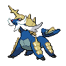
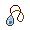

# Oshawott

## Type

## Evolution
|Stage |  | Stage |  | Stage |
|:---: | :---: | :---: | :---: | :---: |
| **[Oshawott]( oshawott.md)** | ➡️ Lv. 17 |  **[Dewott]( dewott.md)** | ➡️ Lv. 36 |  **[Samurott]( samurott.md)** |

## Abilities
| Slot | Original | New |
| --- | --- | --- |
| Ability 1 | **[Torrent](../abilities/torrent.md)**: Strengthens water moves to inflict 1.5× damage at 1/3 max HP or less. | **[Torrent](../abilities/torrent.md)**: Strengthens water moves to inflict 1.5× damage at 1/3 max HP or less. |
| Ability 2 | **[Shell armor](../abilities/shell-armor.md)**: Protects against critical hits. | **[Vital Spirit](../abilities/vital-spirit.md)**: Prevents sleep. |

## Base Happiness
70

## Held Items
-  Mystic Water (50%)

## Type Defenses
| 0x | 0.5x | 1x | 2x | 4x |
| --- | --- | --- | --- | --- |
|  |  |  |  |  |
|  |  |  |  |  |
|  |  |  |  |  |
|  |  |  |  |  |
|  |  |  |  |  |
|  |  |  |  |  |
|  |  |  |  |  |
|  |  |  |  |  |
|  |  |  |  |  |
|  |  |  |  |  |
|  |  |  |  |  |

## Base Stats
| Stat | Value | Bar |
| --- | --- | --- |
| Hp | 55 | 

 |
| Attack | 55 | 

 |
| Defense | 45 | 

 |
| Special attack | 63 | 

 |
| Special defense | 45 | 

 |
| Speed | 45 | 

 |
| **Total** | **308** | |

## Locations
| Route | Method | Rate |
| --- | --- | --- |
| [Route 3](../routes/route-3.md) |  Grass, Special | 10% |

## Level Up Moves
| Level | Move | Type | Cat | Power | Acc | PP |
| :--- | :--- | :--- | :--- | :--- | :--- | :--- |
| 1 | [Secret sword](../moves/secret-sword.md)  NEW|  | { style="vertical-align:middle; object-fit:contain;" } | 85 | 100 | 10 |
| 1 | [Tackle](../moves/tackle.md) |  | { style="vertical-align:middle; object-fit:contain;" } | 40 | 100 | 35 |
| 5 | [Tail whip](../moves/tail-whip.md) |  | { style="vertical-align:middle; object-fit:contain;" } | - | 100 | 30 |
| 7 | [Water gun](../moves/water-gun.md) |  | { style="vertical-align:middle; object-fit:contain;" } | 40 | 100 | 25 |
| 11 | [Water sport](../moves/water-sport.md) |  | { style="vertical-align:middle; object-fit:contain;" } | - | - | 15 |
| 13 | [Focus energy](../moves/focus-energy.md) |  | { style="vertical-align:middle; object-fit:contain;" } | - | - | 30 |
| 17 | [Karate chop](../moves/karate-chop.md)  NEW|  | { style="vertical-align:middle; object-fit:contain;" } | 50 | 100 | 25 |
| 17 | [Razor shell](../moves/razor-shell.md) |  | { style="vertical-align:middle; object-fit:contain;" } | 75 | 95 | 10 |
| 19 | [Fury cutter](../moves/fury-cutter.md) |  | { style="vertical-align:middle; object-fit:contain;" } | 40 | 95 | 20 |
| 23 | [Water pulse](../moves/water-pulse.md) |  | { style="vertical-align:middle; object-fit:contain;" } | 60 | 100 | 20 |
| 25 | [Revenge](../moves/revenge.md) |  | { style="vertical-align:middle; object-fit:contain;" } | 60 | 100 | 10 |
| 29 | [Aqua jet](../moves/aqua-jet.md) |  | { style="vertical-align:middle; object-fit:contain;" } | 40 | 100 | 20 |
| 31 | [Encore](../moves/encore.md) |  | { style="vertical-align:middle; object-fit:contain;" } | - | 100 | 5 |
| 35 | [Aqua tail](../moves/aqua-tail.md) |  | { style="vertical-align:middle; object-fit:contain;" } | 90 | 90 | 10 |
| 36 | [Sacred sword](../moves/sacred-sword.md)  NEW|  | { style="vertical-align:middle; object-fit:contain;" } | 90 | 100 | 15 |
| 37 | [Retaliate](../moves/retaliate.md) |  | { style="vertical-align:middle; object-fit:contain;" } | 70 | 100 | 5 |
| 41 | [Swords dance](../moves/swords-dance.md) |  | { style="vertical-align:middle; object-fit:contain;" } | - | - | 20 |
| 43 | [Hydro pump](../moves/hydro-pump.md) |  | { style="vertical-align:middle; object-fit:contain;" } | 110 | 80 | 5 |
| 76 | [Shell smash](../moves/shell-smash.md)  NEW|  | { style="vertical-align:middle; object-fit:contain;" } | - | - | 15 |

## TM Moves
| No. | Move | Type | Cat | Power | Acc | PP |
| :--- | :--- | :--- | :--- | :--- | :--- | :--- |
| TM40 | [Aerial ace](../moves/aerial-ace.md) |  | { style="vertical-align:middle; object-fit:contain;" } | 60 | - | 20 |
| TM45 | [Attract](../moves/attract.md) |  | { style="vertical-align:middle; object-fit:contain;" } | - | 100 | 15 |
| TM14 | [Blizzard](../moves/blizzard.md) |  | { style="vertical-align:middle; object-fit:contain;" } | 110 | 70 | 5 |
| TM28 | [Dig](../moves/dig.md) |  | { style="vertical-align:middle; object-fit:contain;" } | 80 | 100 | 10 |
| TM32 | [Double team](../moves/double-team.md) |  | { style="vertical-align:middle; object-fit:contain;" } | - | - | 15 |
| TM42 | [Facade](../moves/facade.md) |  | { style="vertical-align:middle; object-fit:contain;" } | 70 | 100 | 20 |
| TM54 | [False swipe](../moves/false-swipe.md) |  | { style="vertical-align:middle; object-fit:contain;" } | 40 | 100 | 40 |
| TM56 | [Fling](../moves/fling.md) |  | { style="vertical-align:middle; object-fit:contain;" } | - | 100 | 10 |
| TM21 | [Frustration](../moves/frustration.md) |  | { style="vertical-align:middle; object-fit:contain;" } | - | 100 | 20 |
| TM86 | [Grass knot](../moves/grass-knot.md) |  | { style="vertical-align:middle; object-fit:contain;" } | - | 100 | 20 |
| TM07 | [Hail](../moves/hail.md) |  | { style="vertical-align:middle; object-fit:contain;" } | - | - | 10 |
| TM10 | [Hidden power](../moves/hidden-power.md) |  | { style="vertical-align:middle; object-fit:contain;" } | 60 | 100 | 15 |
| TM13 | [Ice beam](../moves/ice-beam.md) |  | { style="vertical-align:middle; object-fit:contain;" } | 90 | 100 | 10 |
| TM17 | [Protect](../moves/protect.md) |  | { style="vertical-align:middle; object-fit:contain;" } | - | - | 10 |
| TM18 | [Rain dance](../moves/rain-dance.md) |  | { style="vertical-align:middle; object-fit:contain;" } | - | - | 5 |
| TM44 | [Rest](../moves/rest.md) |  | { style="vertical-align:middle; object-fit:contain;" } | - | - | 5 |
| TM27 | [Return](../moves/return.md) |  | { style="vertical-align:middle; object-fit:contain;" } | - | 100 | 20 |
| TM94 | [Rock smash](../moves/rock-smash.md) |  | { style="vertical-align:middle; object-fit:contain;" } | 40 | 100 | 15 |
| TM48 | [Round](../moves/round.md) |  | { style="vertical-align:middle; object-fit:contain;" } | 60 | 100 | 15 |
| TM55 | [Scald](../moves/scald.md) |  | { style="vertical-align:middle; object-fit:contain;" } | 80 | 100 | 15 |
| TM90 | [Substitute](../moves/substitute.md) |  | { style="vertical-align:middle; object-fit:contain;" } | - | - | 10 |
| TM87 | [Swagger](../moves/swagger.md) |  | { style="vertical-align:middle; object-fit:contain;" } | - | 85 | 15 |
| TM12 | [Taunt](../moves/taunt.md) |  | { style="vertical-align:middle; object-fit:contain;" } | - | 100 | 20 |
| TM06 | [Toxic](../moves/toxic.md) |  | { style="vertical-align:middle; object-fit:contain;" } | - | 90 | 10 |
| TM81 | [X scissor](../moves/x-scissor.md) |  | { style="vertical-align:middle; object-fit:contain;" } | 80 | 100 | 15 |

## HM Moves
| No. | Move | Type | Cat | Power | Acc | PP |
| :--- | :--- | :--- | :--- | :--- | :--- | :--- |
| HM01 | [Cut](../moves/cut.md) |  | { style="vertical-align:middle; object-fit:contain;" } | 50 | 95 | 30 |
| HM06 | [Dive](../moves/dive.md) |  | { style="vertical-align:middle; object-fit:contain;" } | 80 | 100 | 10 |
| HM03 | [Surf](../moves/surf.md) |  | { style="vertical-align:middle; object-fit:contain;" } | 90 | 100 | 15 |
| HM05 | [Waterfall](../moves/waterfall.md) |  | { style="vertical-align:middle; object-fit:contain;" } | 80 | 100 | 15 |

## Egg Moves
| No. | Move | Type | Cat | Power | Acc | PP |
| :--- | :--- | :--- | :--- | :--- | :--- | :--- |
|  | [Air slash](../moves/air-slash.md) |  | { style="vertical-align:middle; object-fit:contain;" } | 75 | 95 | 15 |
|  | [Assurance](../moves/assurance.md) |  | { style="vertical-align:middle; object-fit:contain;" } | 60 | 100 | 10 |
|  | [Brine](../moves/brine.md) |  | { style="vertical-align:middle; object-fit:contain;" } | 65 | 100 | 10 |
|  | [Copycat](../moves/copycat.md) |  | { style="vertical-align:middle; object-fit:contain;" } | - | - | 20 |
|  | [Detect](../moves/detect.md) |  | { style="vertical-align:middle; object-fit:contain;" } | - | - | 5 |
|  | [Night slash](../moves/night-slash.md) |  | { style="vertical-align:middle; object-fit:contain;" } | 70 | 100 | 15 |
|  | [Screech](../moves/screech.md) |  | { style="vertical-align:middle; object-fit:contain;" } | - | 85 | 40 |
|  | [Trump card](../moves/trump-card.md) |  | { style="vertical-align:middle; object-fit:contain;" } | - | - | 5 |

## Tutor Moves
| No. | Move | Type | Cat | Power | Acc | PP |
| :--- | :--- | :--- | :--- | :--- | :--- | :--- |
|  | [Covet](../moves/covet.md) |  | { style="vertical-align:middle; object-fit:contain;" } | 60 | 100 | 25 |
|  | [Helping hand](../moves/helping-hand.md) |  | { style="vertical-align:middle; object-fit:contain;" } | - | - | 20 |
|  | [Icy wind](../moves/icy-wind.md) |  | { style="vertical-align:middle; object-fit:contain;" } | 55 | 95 | 15 |
|  | [Iron tail](../moves/iron-tail.md) |  | { style="vertical-align:middle; object-fit:contain;" } | 100 | 75 | 15 |
|  | [Sleep talk](../moves/sleep-talk.md) |  | { style="vertical-align:middle; object-fit:contain;" } | - | - | 10 |
|  | [Snore](../moves/snore.md) |  | { style="vertical-align:middle; object-fit:contain;" } | 50 | 100 | 15 |
|  | [Water pledge](../moves/water-pledge.md) |  | { style="vertical-align:middle; object-fit:contain;" } | 80 | 100 | 10 |
