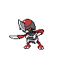

# Pawniard

## Type
 

## Evolution
|Stage |  | Stage |  | Stage |
|:---: | :---: | :---: | :---: | :---: |
| **[Pawniard]( pawniard.md)** | ➡️ Lv. 52 |  **[Bisharp]( bisharp.md)** | ➡️  |  **[Kingambit]( kingambit.md)** |

## Abilities
| Slot | Original | New |
| --- | --- | --- |
| Ability 1 | **[Defiant](../abilities/defiant.md)**: Raises Attack two stages upon having any stat lowered. | **[Defiant](../abilities/defiant.md)**: Raises Attack two stages upon having any stat lowered. |
| Ability 2 | **[Inner focus](../abilities/inner-focus.md)**: Prevents flinching. | **[Pressure](../abilities/pressure.md)**: Increases the PP cost of moves targetting the Pokémon by one. |

## Base Happiness
70

## Held Items
None

## Type Defenses
| 0x | 0.5x | 1x | 2x | 4x |
| --- | --- | --- | --- | --- |
|  |  |  |  |  |
|  |  |  |  |  |
|  |  |  |  |  |
|  |  |  |  |  |
|  |  |  |  |  |
|  |  |  |  |  |
|  |  |  |  |  |
|  |  |  |  |  |
|  |  |  |  |  |

## Base Stats
| Stat | Value | Bar |
| --- | --- | --- |
| Hp | 45 | 

 |
| Attack | 85 | 

 |
| Defense | 70 | 

 |
| Special attack | 40 | 

 |
| Special defense | 40 | 

 |
| Speed | 60 | 

 |
| **Total** | **340** | |

## Locations
| Route | Method | Rate |
| --- | --- | --- |
| [Route 16](../routes/route-16.md) |  Grass, Normal | 5% |
| [Route 9](../routes/route-9.md) |  Grass, Normal | 10% |

## Level Up Moves
| Level | Move | Type | Cat | Power | Acc | PP |
| :--- | :--- | :--- | :--- | :--- | :--- | :--- |
| 1 | [Scratch](../moves/scratch.md) |  | { style="vertical-align:middle; object-fit:contain;" } | 40 | 100 | 35 |
| 6 | [Leer](../moves/leer.md) |  | { style="vertical-align:middle; object-fit:contain;" } | - | 100 | 30 |
| 9 | [Fury cutter](../moves/fury-cutter.md) |  | { style="vertical-align:middle; object-fit:contain;" } | 40 | 95 | 20 |
| 14 | [Torment](../moves/torment.md) |  | { style="vertical-align:middle; object-fit:contain;" } | - | 100 | 15 |
| 17 | [Feint attack](../moves/feint-attack.md) |  | { style="vertical-align:middle; object-fit:contain;" } | 60 | - | 20 |
| 22 | [Scary face](../moves/scary-face.md) |  | { style="vertical-align:middle; object-fit:contain;" } | - | 100 | 10 |
| 25 | [Metal claw](../moves/metal-claw.md) |  | { style="vertical-align:middle; object-fit:contain;" } | 50 | 95 | 35 |
| 30 | [Slash](../moves/slash.md) |  | { style="vertical-align:middle; object-fit:contain;" } | 70 | 100 | 20 |
| 33 | [Assurance](../moves/assurance.md) |  | { style="vertical-align:middle; object-fit:contain;" } | 60 | 100 | 10 |
| 38 | [Metal sound](../moves/metal-sound.md) |  | { style="vertical-align:middle; object-fit:contain;" } | - | 85 | 40 |
| 41 | [Embargo](../moves/embargo.md) |  | { style="vertical-align:middle; object-fit:contain;" } | - | 100 | 15 |
| 43 NEW | [Psycho cut](../moves/psycho-cut.md) |  | { style="vertical-align:middle; object-fit:contain;" } | 70 | 100 | 20 |
| 46 | [Iron defense](../moves/iron-defense.md) |  | { style="vertical-align:middle; object-fit:contain;" } | - | - | 15 |
| 49 | [Night slash](../moves/night-slash.md) |  | { style="vertical-align:middle; object-fit:contain;" } | 70 | 100 | 15 |
| 52 NEW | [Sucker punch](../moves/sucker-punch.md) |  | { style="vertical-align:middle; object-fit:contain;" } | 70 | 100 | 5 |
| 54 | [Iron head](../moves/iron-head.md) |  | { style="vertical-align:middle; object-fit:contain;" } | 80 | 100 | 15 |
| 57 | [Swords dance](../moves/swords-dance.md) |  | { style="vertical-align:middle; object-fit:contain;" } | - | - | 20 |
| 62 | [Guillotine](../moves/guillotine.md) |  | { style="vertical-align:middle; object-fit:contain;" } | - | 30 | 5 |

## TM Moves
| No. | Move | Type | Cat | Power | Acc | PP |
| :--- | :--- | :--- | :--- | :--- | :--- | :--- |
| TM40 | [Aerial ace](../moves/aerial-ace.md) |  | { style="vertical-align:middle; object-fit:contain;" } | 60 | - | 20 |
| TM45 | [Attract](../moves/attract.md) |  | { style="vertical-align:middle; object-fit:contain;" } | - | 100 | 15 |
| TM31 | [Brick break](../moves/brick-break.md) |  | { style="vertical-align:middle; object-fit:contain;" } | 75 | 100 | 15 |
| TM28 | [Dig](../moves/dig.md) |  | { style="vertical-align:middle; object-fit:contain;" } | 80 | 100 | 10 |
| TM32 | [Double team](../moves/double-team.md) |  | { style="vertical-align:middle; object-fit:contain;" } | - | - | 15 |
| TM42 | [Facade](../moves/facade.md) |  | { style="vertical-align:middle; object-fit:contain;" } | 70 | 100 | 20 |
| TM54 | [False swipe](../moves/false-swipe.md) |  | { style="vertical-align:middle; object-fit:contain;" } | 40 | 100 | 40 |
| TM56 | [Fling](../moves/fling.md) |  | { style="vertical-align:middle; object-fit:contain;" } | - | 100 | 10 |
| TM21 | [Frustration](../moves/frustration.md) |  | { style="vertical-align:middle; object-fit:contain;" } | - | 100 | 20 |
| TM86 | [Grass knot](../moves/grass-knot.md) |  | { style="vertical-align:middle; object-fit:contain;" } | - | 100 | 20 |
| TM10 | [Hidden power](../moves/hidden-power.md) |  | { style="vertical-align:middle; object-fit:contain;" } | 60 | 100 | 15 |
| TM01 | [Hone claws](../moves/hone-claws.md) |  | { style="vertical-align:middle; object-fit:contain;" } | - | - | 15 |
| TM47 | [Low sweep](../moves/low-sweep.md) |  | { style="vertical-align:middle; object-fit:contain;" } | 65 | 100 | 20 |
| TM66 | [Payback](../moves/payback.md) |  | { style="vertical-align:middle; object-fit:contain;" } | 50 | 100 | 10 |
| TM84 | [Poison jab](../moves/poison-jab.md) |  | { style="vertical-align:middle; object-fit:contain;" } | 80 | 100 | 20 |
| TM17 | [Protect](../moves/protect.md) |  | { style="vertical-align:middle; object-fit:contain;" } | - | - | 10 |
| TM18 | [Rain dance](../moves/rain-dance.md) |  | { style="vertical-align:middle; object-fit:contain;" } | - | - | 5 |
| TM44 | [Rest](../moves/rest.md) |  | { style="vertical-align:middle; object-fit:contain;" } | - | - | 5 |
| TM67 | [Retaliate](../moves/retaliate.md) |  | { style="vertical-align:middle; object-fit:contain;" } | 70 | 100 | 5 |
| TM27 | [Return](../moves/return.md) |  | { style="vertical-align:middle; object-fit:contain;" } | - | 100 | 20 |
| TM69 | [Rock polish](../moves/rock-polish.md) |  | { style="vertical-align:middle; object-fit:contain;" } | - | - | 20 |
| TM94 | [Rock smash](../moves/rock-smash.md) |  | { style="vertical-align:middle; object-fit:contain;" } | 40 | 100 | 15 |
| TM39 | [Rock tomb](../moves/rock-tomb.md) |  | { style="vertical-align:middle; object-fit:contain;" } | 60 | 95 | 15 |
| TM48 | [Round](../moves/round.md) |  | { style="vertical-align:middle; object-fit:contain;" } | 60 | 100 | 15 |
| TM37 | [Sandstorm](../moves/sandstorm.md) |  | { style="vertical-align:middle; object-fit:contain;" } | - | - | 10 |
| TM65 | [Shadow claw](../moves/shadow-claw.md) |  | { style="vertical-align:middle; object-fit:contain;" } | 70 | 100 | 15 |
| TM95 | [Snarl](../moves/snarl.md) |  | { style="vertical-align:middle; object-fit:contain;" } | 55 | 95 | 15 |
| TM90 | [Substitute](../moves/substitute.md) |  | { style="vertical-align:middle; object-fit:contain;" } | - | - | 10 |
| TM87 | [Swagger](../moves/swagger.md) |  | { style="vertical-align:middle; object-fit:contain;" } | - | 85 | 15 |
| TM12 | [Taunt](../moves/taunt.md) |  | { style="vertical-align:middle; object-fit:contain;" } | - | 100 | 20 |
| TM46 | [Thief](../moves/thief.md) |  | { style="vertical-align:middle; object-fit:contain;" } | 60 | 100 | 25 |
| TM73 | [Thunder wave](../moves/thunder-wave.md) |  | { style="vertical-align:middle; object-fit:contain;" } | - | 90 | 20 |
| TM06 | [Toxic](../moves/toxic.md) |  | { style="vertical-align:middle; object-fit:contain;" } | - | 90 | 10 |
| TM81 | [X scissor](../moves/x-scissor.md) |  | { style="vertical-align:middle; object-fit:contain;" } | 80 | 100 | 15 |

## HM Moves
| No. | Move | Type | Cat | Power | Acc | PP |
| :--- | :--- | :--- | :--- | :--- | :--- | :--- |
| HM01 | [Cut](../moves/cut.md) |  | { style="vertical-align:middle; object-fit:contain;" } | 50 | 95 | 30 |

## Egg Moves
| No. | Move | Type | Cat | Power | Acc | PP |
| :--- | :--- | :--- | :--- | :--- | :--- | :--- |
|  | [Headbutt](../moves/headbutt.md) |  | { style="vertical-align:middle; object-fit:contain;" } | 70 | 100 | 15 |
|  | [Mean look](../moves/mean-look.md) |  | { style="vertical-align:middle; object-fit:contain;" } | - | - | 5 |
|  | [Psycho cut](../moves/psycho-cut.md) |  | { style="vertical-align:middle; object-fit:contain;" } | 70 | 100 | 20 |
|  | [Pursuit](../moves/pursuit.md) |  | { style="vertical-align:middle; object-fit:contain;" } | 40 | 100 | 20 |
|  | [Revenge](../moves/revenge.md) |  | { style="vertical-align:middle; object-fit:contain;" } | 60 | 100 | 10 |
|  | [Stealth rock](../moves/stealth-rock.md) |  | { style="vertical-align:middle; object-fit:contain;" } | - | - | 20 |
|  | [Sucker punch](../moves/sucker-punch.md) |  | { style="vertical-align:middle; object-fit:contain;" } | 70 | 100 | 5 |

## Tutor Moves
| No. | Move | Type | Cat | Power | Acc | PP |
| :--- | :--- | :--- | :--- | :--- | :--- | :--- |
|  | [Dark pulse](../moves/dark-pulse.md) |  | { style="vertical-align:middle; object-fit:contain;" } | 80 | 100 | 15 |
|  | [Dual chop](../moves/dual-chop.md) |  | { style="vertical-align:middle; object-fit:contain;" } | 40 | 90 | 15 |
|  | [Foul play](../moves/foul-play.md) |  | { style="vertical-align:middle; object-fit:contain;" } | 95 | 100 | 15 |
|  | [Knock off](../moves/knock-off.md) |  | { style="vertical-align:middle; object-fit:contain;" } | 65 | 100 | 20 |
|  | [Low kick](../moves/low-kick.md) |  | { style="vertical-align:middle; object-fit:contain;" } | - | 100 | 20 |
|  | [Magnet rise](../moves/magnet-rise.md) |  | { style="vertical-align:middle; object-fit:contain;" } | - | - | 10 |
|  | [Role play](../moves/role-play.md) |  | { style="vertical-align:middle; object-fit:contain;" } | - | - | 10 |
|  | [Sleep talk](../moves/sleep-talk.md) |  | { style="vertical-align:middle; object-fit:contain;" } | - | - | 10 |
|  | [Snatch](../moves/snatch.md) |  | { style="vertical-align:middle; object-fit:contain;" } | - | - | 10 |
|  | [Snore](../moves/snore.md) |  | { style="vertical-align:middle; object-fit:contain;" } | 50 | 100 | 15 |
|  | [Spite](../moves/spite.md) |  | { style="vertical-align:middle; object-fit:contain;" } | - | 100 | 10 |
