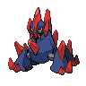

# Roggenrola

## Type

## Evolution
|Stage |  | Stage |  | Stage |
|:---: | :---: | :---: | :---: | :---: |
| **[Roggenrola]( roggenrola.md)** | ➡️ Lv. 25 |  **[Boldore]( boldore.md)** | ➡️ Trade |  **[Gigalith]( gigalith.md)** |

## Abilities
| Slot | Original | New |
| --- | --- | --- |
| Ability 1 | **[Sturdy](../abilities/sturdy.md)**: Prevents being KOed from full HP, leaving 1 HP instead.  Protects against the one-hit KO moves regardless of HP. | **[Sturdy](../abilities/sturdy.md)**: Prevents being KOed from full HP, leaving 1 HP instead.  Protects against the one-hit KO moves regardless of HP. |
| Ability 2 | **[Weak armor](../abilities/weak-armor.md)**: Raises Speed and lowers Defense by one stage each upon being hit by a physical move. | **[Sand Force](../abilities/sand-force.md)**: Strengthens rock, ground, and steel moves to 1.3× their power during a sandstorm.  Protects against sandstorm damage. |

## Base Happiness
70

## Held Items
None

## Type Defenses
| 0x | 0.5x | 1x | 2x | 4x |
| --- | --- | --- | --- | --- |
|  |  |  |  |  |
|  |  |  |  |  |
|  |  |  |  |  |
|  |  |  |  |  |
|  |  |  |  |  |
|  |  |  |  |  |
|  |  |  |  |  |
|  |  |  |  |  |

## Base Stats
| Stat | Value | Bar |
| --- | --- | --- |
| Hp | 55 | 

 |
| Attack | 75 | 

 |
| Defense | 85 | 

 |
| Special attack | 25 | 

 |
| Special defense | 25 | 

 |
| Speed | 15 | 

 |
| **Total** | **280** | |

## Locations
| Route | Method | Rate |
| --- | --- | --- |
| [Wellspring Cave](../routes/wellspring-cave.md) |  Cave, Normal | 10% |

## Level Up Moves
| Level | Move | Type | Cat | Power | Acc | PP |
| :--- | :--- | :--- | :--- | :--- | :--- | :--- |
| 1  | [Tackle](../moves/tackle.md) |  | { style="vertical-align:middle; object-fit:contain;" } | 40 | 100 | 35 |
| 4  | [Harden](../moves/harden.md) |  | { style="vertical-align:middle; object-fit:contain;" } | - | - | 30 |
| 7  | [Sand attack](../moves/sand-attack.md) |  | { style="vertical-align:middle; object-fit:contain;" } | - | 100 | 15 |
| 10  | [Headbutt](../moves/headbutt.md) |  | { style="vertical-align:middle; object-fit:contain;" } | 70 | 100 | 15 |
| 12  NEW | [Magnitude](../moves/magnitude.md) |  | { style="vertical-align:middle; object-fit:contain;" } | - | 100 | 30 |
| 14  | [Rock blast](../moves/rock-blast.md) |  | { style="vertical-align:middle; object-fit:contain;" } | 25 | 90 | 10 |
| 17  | [Mud slap](../moves/mud-slap.md) |  | { style="vertical-align:middle; object-fit:contain;" } | 20 | 100 | 10 |
| 20  | [Iron defense](../moves/iron-defense.md) |  | { style="vertical-align:middle; object-fit:contain;" } | - | - | 15 |
| 23  | [Smack down](../moves/smack-down.md) |  | { style="vertical-align:middle; object-fit:contain;" } | 50 | 100 | 15 |
| 27  | [Rock slide](../moves/rock-slide.md) |  | { style="vertical-align:middle; object-fit:contain;" } | 80 75 | 95 90 | 10 |
| 30  | [Stealth rock](../moves/stealth-rock.md) |  | { style="vertical-align:middle; object-fit:contain;" } | - | - | 20 |
| 33  | [Sandstorm](../moves/sandstorm.md) |  | { style="vertical-align:middle; object-fit:contain;" } | - | - | 10 |
| 36  | [Stone edge](../moves/stone-edge.md) |  | { style="vertical-align:middle; object-fit:contain;" } | 100 | 80 | 5 |
| 40  | [Explosion](../moves/explosion.md) |  | { style="vertical-align:middle; object-fit:contain;" } | 250 | 100 | 5 |

## TM Moves
| No. | Move | Type | Cat | Power | Acc | PP |
| :--- | :--- | :--- | :--- | :--- | :--- | :--- |
| TM45 | [Attract](../moves/attract.md) |  | { style="vertical-align:middle; object-fit:contain;" } | - | 100 | 15 |
| TM78 | [Bulldoze](../moves/bulldoze.md) |  | { style="vertical-align:middle; object-fit:contain;" } | 80 60 | 100 | 20 |
| TM32 | [Double team](../moves/double-team.md) |  | { style="vertical-align:middle; object-fit:contain;" } | - | - | 15 |
| TM26 | [Earthquake](../moves/earthquake.md) |  | { style="vertical-align:middle; object-fit:contain;" } | 100 | 100 | 10 |
| TM42 | [Facade](../moves/facade.md) |  | { style="vertical-align:middle; object-fit:contain;" } | 70 | 100 | 20 |
| TM91 | [Flash cannon](../moves/flash-cannon.md) |  | { style="vertical-align:middle; object-fit:contain;" } | 80 | 100 | 10 |
| TM21 | [Frustration](../moves/frustration.md) |  | { style="vertical-align:middle; object-fit:contain;" } | - | 100 | 20 |
| TM10 | [Hidden power](../moves/hidden-power.md) |  | { style="vertical-align:middle; object-fit:contain;" } | 60 | 100 | 15 |
| TM17 | [Protect](../moves/protect.md) |  | { style="vertical-align:middle; object-fit:contain;" } | - | - | 10 |
| TM44 | [Rest](../moves/rest.md) |  | { style="vertical-align:middle; object-fit:contain;" } | - | - | 5 |
| TM27 | [Return](../moves/return.md) |  | { style="vertical-align:middle; object-fit:contain;" } | - | 100 | 20 |
| TM69 | [Rock polish](../moves/rock-polish.md) |  | { style="vertical-align:middle; object-fit:contain;" } | - | - | 20 |
| TM94 | [Rock smash](../moves/rock-smash.md) |  | { style="vertical-align:middle; object-fit:contain;" } | 40 | 100 | 15 |
| TM48 | [Round](../moves/round.md) |  | { style="vertical-align:middle; object-fit:contain;" } | 60 | 100 | 15 |
| TM90 | [Substitute](../moves/substitute.md) |  | { style="vertical-align:middle; object-fit:contain;" } | - | - | 10 |
| TM87 | [Swagger](../moves/swagger.md) |  | { style="vertical-align:middle; object-fit:contain;" } | - | 85 | 15 |
| TM06 | [Toxic](../moves/toxic.md) |  | { style="vertical-align:middle; object-fit:contain;" } | - | 90 | 10 |

## HM Moves
| No. | Move | Type | Cat | Power | Acc | PP |
| :--- | :--- | :--- | :--- | :--- | :--- | :--- |
| HM04 | [Strength](../moves/strength.md) |  normal | { style="vertical-align:middle; object-fit:contain;" } | 85 80 | 100 | 15 |

## Egg Moves
| No. | Move | Type | Cat | Power | Acc | PP |
| :--- | :--- | :--- | :--- | :--- | :--- | :--- |
|  | [Autotomize](../moves/autotomize.md) |  | { style="vertical-align:middle; object-fit:contain;" } | - | - | 15 |
|  | [Curse](../moves/curse.md) |  | { style="vertical-align:middle; object-fit:contain;" } | - | - | 10 |
|  | [Gravity](../moves/gravity.md) |  | { style="vertical-align:middle; object-fit:contain;" } | - | - | 5 |
|  | [Heavy slam](../moves/heavy-slam.md) |  | { style="vertical-align:middle; object-fit:contain;" } | - | 100 | 10 |
|  | [Lock on](../moves/lock-on.md) |  | { style="vertical-align:middle; object-fit:contain;" } | - | - | 5 |
|  | [Magnitude](../moves/magnitude.md) |  | { style="vertical-align:middle; object-fit:contain;" } | - | 100 | 30 |
| TM39 | [Rock tomb](../moves/rock-tomb.md) |  | { style="vertical-align:middle; object-fit:contain;" } | 60 | 95 | 15 |
|  | [Take down](../moves/take-down.md) |  | { style="vertical-align:middle; object-fit:contain;" } | 90 | 85 | 20 |

## Tutor Moves
| No. | Move | Type | Cat | Power | Acc | PP |
| :--- | :--- | :--- | :--- | :--- | :--- | :--- |
|  | [Block](../moves/block.md) |  | { style="vertical-align:middle; object-fit:contain;" } | - | - | 5 |
|  | [Earth power](../moves/earth-power.md) |  | { style="vertical-align:middle; object-fit:contain;" } | 90 | 100 | 10 |
|  | [Sleep talk](../moves/sleep-talk.md) |  | { style="vertical-align:middle; object-fit:contain;" } | - | - | 10 |
|  | [Snore](../moves/snore.md) |  | { style="vertical-align:middle; object-fit:contain;" } | 50 | 100 | 15 |
