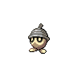

# Seedot

## Type

## Evolution
|Stage |  | Stage |  | Stage |
|:---: | :---: | :---: | :---: | :---: |
| **[Seedot]( seedot.md)** | ➡️ Lv. 14 |  **[Nuzleaf]( nuzleaf.md)** | ➡️ Use leaf-stone |  **[Shiftry]( shiftry.md)** |

## Abilities
| Slot | Original | New |
| --- | --- | --- |
| Ability 1 | **[Chlorophyll](../abilities/chlorophyll.md)**: Doubles Speed during strong sunlight. | **[Pickpocket](../abilities/pickpocket.md)**: Steals attacking Pokémon's held items on contact. |
| Ability 2 | **[Early bird](../abilities/early-bird.md)**: Makes sleep pass twice as quickly. | **[Early Bird](../abilities/early-bird.md)**: Makes sleep pass twice as quickly. |

## Base Happiness
70

## Held Items
None

## Type Defenses
| 0x | 0.5x | 1x | 2x | 4x |
| --- | --- | --- | --- | --- |
|  |  |  |  |  |
|  |  |  |  |  |
|  |  |  |  |  |
|  |  |  |  |  |
|  |  |  |  |  |
|  |  |  |  |  |
|  |  |  |  |  |
|  |  |  |  |  |

## Base Stats
| Stat | Value | Bar |
| --- | --- | --- |
| Hp | 40 | 

 |
| Attack | 40 | 

 |
| Defense | 50 | 

 |
| Special attack | 30 | 

 |
| Special defense | 30 | 

 |
| Speed | 30 | 

 |
| **Total** | **220** | |

## Locations
| Route | Method | Rate |
| --- | --- | --- |
| [Route 3](../routes/route-3.md) |  Grass, Normal | 10% |

## Level Up Moves
| Level | Move | Type | Cat | Power | Acc | PP |
| :--- | :--- | :--- | :--- | :--- | :--- | :--- |
| 1  | [Bide](../moves/bide.md) |  | { style="vertical-align:middle; object-fit:contain;" } | - | - | 10 |
| 1  NEW | [Bullet seed](../moves/bullet-seed.md) |  | { style="vertical-align:middle; object-fit:contain;" } | 25 | 100 | 30 |
| 1  NEW | [Quick attack](../moves/quick-attack.md) |  | { style="vertical-align:middle; object-fit:contain;" } | 40 | 100 | 30 |
| 3  | [Harden](../moves/harden.md) |  | { style="vertical-align:middle; object-fit:contain;" } | - | - | 30 |
| 7  | [Growth](../moves/growth.md) |  | { style="vertical-align:middle; object-fit:contain;" } | - | - | 20 |
| 13  | [Nature power](../moves/nature-power.md) |  | { style="vertical-align:middle; object-fit:contain;" } | - | - | 20 |
| 17  NEW | [Seed bomb](../moves/seed-bomb.md) |  | { style="vertical-align:middle; object-fit:contain;" } | 80 | 100 | 15 |
| 21  | [Synthesis](../moves/synthesis.md) |  | { style="vertical-align:middle; object-fit:contain;" } | - | - | 5 |
| 26  NEW | [Leech seed](../moves/leech-seed.md) |  | { style="vertical-align:middle; object-fit:contain;" } | - | 90 | 10 |
| 31  | [Sunny day](../moves/sunny-day.md) |  | { style="vertical-align:middle; object-fit:contain;" } | - | - | 5 |
| 43  | [Explosion](../moves/explosion.md) |  | { style="vertical-align:middle; object-fit:contain;" } | 250 | 100 | 5 |

## TM Moves
| No. | Move | Type | Cat | Power | Acc | PP |
| :--- | :--- | :--- | :--- | :--- | :--- | :--- |
| TM45 | [Attract](../moves/attract.md) |  | { style="vertical-align:middle; object-fit:contain;" } | - | 100 | 15 |
| TM28 | [Dig](../moves/dig.md) |  | { style="vertical-align:middle; object-fit:contain;" } | 100 80 | 100 | 10 |
| TM32 | [Double team](../moves/double-team.md) |  | { style="vertical-align:middle; object-fit:contain;" } | - | - | 15 |
| TM53 | [Energy ball](../moves/energy-ball.md) |  | { style="vertical-align:middle; object-fit:contain;" } | 90 | 100 | 10 |
| TM42 | [Facade](../moves/facade.md) |  | { style="vertical-align:middle; object-fit:contain;" } | 70 | 100 | 20 |
| TM54 | [False swipe](../moves/false-swipe.md) |  | { style="vertical-align:middle; object-fit:contain;" } | 40 | 100 | 40 |
| TM70 | [Flash](../moves/flash.md) |  | { style="vertical-align:middle; object-fit:contain;" } | - | 100 | 20 |
| TM21 | [Frustration](../moves/frustration.md) |  | { style="vertical-align:middle; object-fit:contain;" } | - | 100 | 20 |
| TM86 | [Grass knot](../moves/grass-knot.md) |  | { style="vertical-align:middle; object-fit:contain;" } | - | 100 | 20 |
| TM10 | [Hidden power](../moves/hidden-power.md) |  | { style="vertical-align:middle; object-fit:contain;" } | 60 | 100 | 15 |
| TM17 | [Protect](../moves/protect.md) |  | { style="vertical-align:middle; object-fit:contain;" } | - | - | 10 |
| TM44 | [Rest](../moves/rest.md) |  | { style="vertical-align:middle; object-fit:contain;" } | - | - | 5 |
| TM67 | [Retaliate](../moves/retaliate.md) |  | { style="vertical-align:middle; object-fit:contain;" } | 70 | 100 | 5 |
| TM27 | [Return](../moves/return.md) |  | { style="vertical-align:middle; object-fit:contain;" } | - | 100 | 20 |
| TM94 | [Rock smash](../moves/rock-smash.md) |  | { style="vertical-align:middle; object-fit:contain;" } | 40 | 100 | 15 |
| TM48 | [Round](../moves/round.md) |  | { style="vertical-align:middle; object-fit:contain;" } | 60 | 100 | 15 |
| TM30 | [Shadow ball](../moves/shadow-ball.md) |  | { style="vertical-align:middle; object-fit:contain;" } | 90 80 | 100 | 15 |
| TM22 | [Solar beam](../moves/solar-beam.md) |  | { style="vertical-align:middle; object-fit:contain;" } | 120 | 100 | 10 |
| TM90 | [Substitute](../moves/substitute.md) |  | { style="vertical-align:middle; object-fit:contain;" } | - | - | 10 |
| TM87 | [Swagger](../moves/swagger.md) |  | { style="vertical-align:middle; object-fit:contain;" } | - | 85 | 15 |
| TM75 | [Swords dance](../moves/swords-dance.md) |  | { style="vertical-align:middle; object-fit:contain;" } | - | - | 20 |
| TM06 | [Toxic](../moves/toxic.md) |  | { style="vertical-align:middle; object-fit:contain;" } | - | 90 | 10 |

## Egg Moves
| No. | Move | Type | Cat | Power | Acc | PP |
| :--- | :--- | :--- | :--- | :--- | :--- | :--- |
|  | [Amnesia](../moves/amnesia.md) |  | { style="vertical-align:middle; object-fit:contain;" } | - | - | 20 |
|  | [Beat up](../moves/beat-up.md) |  | { style="vertical-align:middle; object-fit:contain;" } | - | 100 | 10 |
|  | [Bullet seed](../moves/bullet-seed.md) |  | { style="vertical-align:middle; object-fit:contain;" } | 25 | 100 | 30 |
|  | [Defog](../moves/defog.md) |  | { style="vertical-align:middle; object-fit:contain;" } | - | - | 15 |
|  | [Foul play](../moves/foul-play.md) |  | { style="vertical-align:middle; object-fit:contain;" } | 95 | 100 | 15 |
|  | [Leech seed](../moves/leech-seed.md) |  | { style="vertical-align:middle; object-fit:contain;" } | - | 90 | 10 |
|  | [Nasty plot](../moves/nasty-plot.md) |  | { style="vertical-align:middle; object-fit:contain;" } | - | - | 20 |
|  | [Power swap](../moves/power-swap.md) |  | { style="vertical-align:middle; object-fit:contain;" } | - | - | 10 |
|  | [Quick attack](../moves/quick-attack.md) |  | { style="vertical-align:middle; object-fit:contain;" } | 40 | 100 | 30 |
|  | [Razor wind](../moves/razor-wind.md) |  | { style="vertical-align:middle; object-fit:contain;" } | 80 | 100 | 10 |
|  | [Take down](../moves/take-down.md) |  | { style="vertical-align:middle; object-fit:contain;" } | 90 | 85 | 20 |
|  | [Worry seed](../moves/worry-seed.md) |  | { style="vertical-align:middle; object-fit:contain;" } | - | 100 | 10 |

## Tutor Moves
| No. | Move | Type | Cat | Power | Acc | PP |
| :--- | :--- | :--- | :--- | :--- | :--- | :--- |
|  | [Giga drain](../moves/giga-drain.md) |  | { style="vertical-align:middle; object-fit:contain;" } | 75 | 100 | 10 |
|  | [Seed bomb](../moves/seed-bomb.md) |  | { style="vertical-align:middle; object-fit:contain;" } | 80 | 100 | 15 |
|  | [Sleep talk](../moves/sleep-talk.md) |  | { style="vertical-align:middle; object-fit:contain;" } | - | - | 10 |
|  | [Snore](../moves/snore.md) |  | { style="vertical-align:middle; object-fit:contain;" } | 50 | 100 | 15 |
|  | [Spite](../moves/spite.md) |  | { style="vertical-align:middle; object-fit:contain;" } | - | 100 | 10 |
