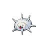
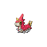
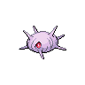

# Silcoon

## Type

## Evolution
|Stage |  | Stage |  | Stage |
|:---: | :---: | :---: | :---: | :---: |
| **[Wurmple]( wurmple.md)** | ➡️ Lv. 7 |  **[Silcoon]( silcoon.md)** | ➡️ Lv. 10 |  **[Beautifly]( beautifly.md)** |
| **[Wurmple]( wurmple.md)** | ➡️ Lv. 7 |  **[Cascoon]( cascoon.md)** | ➡️ Lv. 10 |  **[Dustox]( dustox.md)** |

## Abilities
| Slot | Original | New |
| --- | --- | --- |
| Ability 1 | **[Shed skin](../abilities/shed-skin.md)**: Has a 33% chance of curing any major status ailment after each turn. | **[Shed Skin](../abilities/shed-skin.md)**: Has a 33% chance of curing any major status ailment after each turn. |
| Ability 2 | - | **[Battle Armor](../abilities/battle-armor.md)**: Protects against critical hits. |

## Base Happiness
70

## Held Items
None

## Type Defenses
| 0x | 0.5x | 1x | 2x | 4x |
| --- | --- | --- | --- | --- |
|  |  |  |  |  |
|  |  |  |  |  |
|  |  |  |  |  |
|  |  |  |  |  |
|  |  |  |  |  |
|  |  |  |  |  |
|  |  |  |  |  |
|  |  |  |  |  |
|  |  |  |  |  |
|  |  |  |  |  |
|  |  |  |  |  |

## Base Stats
| Stat | Value | Bar |
| --- | --- | --- |
| Hp | 50 | 

 |
| Attack | 35 | 

 |
| Defense | 55 | 

 |
| Special attack | 25 | 

 |
| Special defense | 25 | 

 |
| Speed | 15 | 

 |
| **Total** | **205** | |

## Locations
Evolve from [Wurmple](../pokemon/wurmple.md)

## Level Up Moves
| Level | Move | Type | Cat | Power | Acc | PP |
| :--- | :--- | :--- | :--- | :--- | :--- | :--- |
| 1 SHIFTED (from ?) | [Poison sting](../moves/poison-sting.md) |  | { style="vertical-align:middle; object-fit:contain;" } | 15 | 100 | 35 |
| 1 SHIFTED (from ?) | [Bug bite](../moves/bug-bite.md) |  | { style="vertical-align:middle; object-fit:contain;" } | 60 | 100 | 20 |
| 1 | [Harden](../moves/harden.md) |  | { style="vertical-align:middle; object-fit:contain;" } | - | - | 30 |
| 10 NEW | [Air cutter](../moves/air-cutter.md) |  | { style="vertical-align:middle; object-fit:contain;" } | 60 | 95 | 25 |
| 10 NEW | [Clear smog](../moves/clear-smog.md) |  | { style="vertical-align:middle; object-fit:contain;" } | 50 | - | 15 |
| 10 NEW | [Struggle bug](../moves/struggle-bug.md) |  | { style="vertical-align:middle; object-fit:contain;" } | 50 | 100 | 20 |
| 17 NEW | [Sleep powder](../moves/sleep-powder.md) |  | { style="vertical-align:middle; object-fit:contain;" } | - | 75 | 15 |
| 17 NEW | - | Reflect, light screen | - | - | - | - |
| 49 NEW | [Air slash](../moves/air-slash.md) |  | { style="vertical-align:middle; object-fit:contain;" } | 75 | 95 | 15 |
| 49 NEW | [Tailwind](../moves/tailwind.md) |  | { style="vertical-align:middle; object-fit:contain;" } | - | - | 15 |

## Tutor Moves
| No. | Move | Type | Cat | Power | Acc | PP |
| :--- | :--- | :--- | :--- | :--- | :--- | :--- |
|  | [Bug bite](../moves/bug-bite.md) |  | { style="vertical-align:middle; object-fit:contain;" } | 60 | 100 | 20 |
|  | [Electroweb](../moves/electroweb.md) |  | { style="vertical-align:middle; object-fit:contain;" } | 55 | 95 | 15 |
|  | [Iron defense](../moves/iron-defense.md) |  | { style="vertical-align:middle; object-fit:contain;" } | - | - | 15 |
