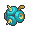

# Suicune

## Type

## Evolution

[Suicune]( suicune.md)

## Abilities
| Slot | Original | New |
| --- | --- | --- |
| Ability 1 | **[Pressure](../abilities/pressure.md)**: Increases the PP cost of moves targetting the Pokémon by one. | **[Pressure](../abilities/pressure.md)**: Increases the PP cost of moves targetting the Pokémon by one. |
| Ability 2 | **[Inner focus](../abilities/inner-focus.md)**: Prevents flinching. | **[Water Absorb](../abilities/water-absorb.md)**: Absorbs water moves, healing for 1/4 max HP. |

## Base Happiness
70

## Held Items
-  Rowap Berry (100%)

## Type Defenses
| 0x | 0.5x | 1x | 2x | 4x |
| --- | --- | --- | --- | --- |
|  |  |  |  |  |
|  |  |  |  |  |
|  |  |  |  |  |
|  |  |  |  |  |
|  |  |  |  |  |
|  |  |  |  |  |
|  |  |  |  |  |
|  |  |  |  |  |
|  |  |  |  |  |
|  |  |  |  |  |
|  |  |  |  |  |

## Base Stats
| Stat | Value | Bar |
| --- | --- | --- |
| Hp | 100 | 

 |
| Attack | 75 | 

 |
| Defense | 115 | 

 |
| Special attack | 90 | 

 |
| Special defense | 115 | 

 |
| Speed | 85 | 

 |
| **Total** | **580** | |

## Locations
No known wild location.

## Level Up Moves
| Level | Type | Move | Cat | Power | Acc | PP |
| :--- | :--- | :--- | :--- | :--- | :--- | :--- |
| NEW 1 |  | [Air slash](../moves/air-slash.md) | { style="vertical-align:middle; object-fit:contain;" } | 75 | 95 | 15 |
| NEW 1 | - | Extremespeed | - | - | - | - |
| NEW 1 |  | [Sheer cold](../moves/sheer-cold.md) | { style="vertical-align:middle; object-fit:contain;" } | - | 30 | 5 |
| NEW 1 |  | [Aqua ring](../moves/aqua-ring.md) | { style="vertical-align:middle; object-fit:contain;" } | - | - | 20 |
| 1 |  | [Leer](../moves/leer.md) | { style="vertical-align:middle; object-fit:contain;" } | - | 100 | 30 |
| 1 |  | [Bite](../moves/bite.md) | { style="vertical-align:middle; object-fit:contain;" } | 60 | 100 | 25 |
| 8 |  | [Bubble beam](../moves/bubble-beam.md) | { style="vertical-align:middle; object-fit:contain;" } | 65 | 100 | 20 |
| 15 |  | [TM18 Rain dance](../moves/rain-dance.md) | { style="vertical-align:middle; object-fit:contain;" } | - | - | 5 |
| 22 |  | [Gust](../moves/gust.md) | { style="vertical-align:middle; object-fit:contain;" } | 40 | 100 | 35 |
| 29 |  | [Aurora beam](../moves/aurora-beam.md) | { style="vertical-align:middle; object-fit:contain;" } | 65 | 100 | 20 |
| 36 |  | [Mist](../moves/mist.md) | { style="vertical-align:middle; object-fit:contain;" } | - | - | 30 |
| 43 |  | [Mirror coat](../moves/mirror-coat.md) | { style="vertical-align:middle; object-fit:contain;" } | - | 100 | 20 |
| 50 |  | [Ice fang](../moves/ice-fang.md) | { style="vertical-align:middle; object-fit:contain;" } | 65 | 95 | 15 |
| 57 |  | [Tailwind](../moves/tailwind.md) | { style="vertical-align:middle; object-fit:contain;" } | - | - | 15 |
| 64 |  | [Extrasensory](../moves/extrasensory.md) | { style="vertical-align:middle; object-fit:contain;" } | 80 | 100 | 20 |
| 71 |  | [Hydro pump](../moves/hydro-pump.md) | { style="vertical-align:middle; object-fit:contain;" } | 110 | 80 | 5 |
| 78 |  | [TM04 Calm mind](../moves/calm-mind.md) | { style="vertical-align:middle; object-fit:contain;" } | - | - | 20 |
| 85 |  | [TM14 Blizzard](../moves/blizzard.md) | { style="vertical-align:middle; object-fit:contain;" } | 110 | 70 | 5 |

## TM Moves
| Type | Move | Cat | Power | Acc | PP |
| :--- | :--- | :--- | :--- | :--- | :--- |
|  | [TM78 Bulldoze](../moves/bulldoze.md) | { style="vertical-align:middle; object-fit:contain;" } | 60 | 100 | 20 |
|  | [TM28 Dig](../moves/dig.md) | { style="vertical-align:middle; object-fit:contain;" } | 80 | 100 | 10 |
|  | [TM32 Double team](../moves/double-team.md) | { style="vertical-align:middle; object-fit:contain;" } | - | - | 15 |
|  | [TM42 Facade](../moves/facade.md) | { style="vertical-align:middle; object-fit:contain;" } | 70 | 100 | 20 |
|  | [TM21 Frustration](../moves/frustration.md) | { style="vertical-align:middle; object-fit:contain;" } | - | 100 | 20 |
|  | [TM68 Giga impact](../moves/giga-impact.md) | { style="vertical-align:middle; object-fit:contain;" } | 150 | 90 | 5 |
|  | [TM07 Hail](../moves/hail.md) | { style="vertical-align:middle; object-fit:contain;" } | - | - | 10 |
|  | [TM10 Hidden power](../moves/hidden-power.md) | { style="vertical-align:middle; object-fit:contain;" } | 60 | 100 | 15 |
|  | [TM15 Hyper beam](../moves/hyper-beam.md) | { style="vertical-align:middle; object-fit:contain;" } | 150 | 90 | 5 |
|  | [TM13 Ice beam](../moves/ice-beam.md) | { style="vertical-align:middle; object-fit:contain;" } | 90 | 100 | 10 |
|  | [TM17 Protect](../moves/protect.md) | { style="vertical-align:middle; object-fit:contain;" } | - | - | 10 |
|  | [TM77 Psych up](../moves/psych-up.md) | { style="vertical-align:middle; object-fit:contain;" } | - | - | 10 |
|  | [TM60 Quash](../moves/quash.md) | { style="vertical-align:middle; object-fit:contain;" } | - | 100 | 15 |
|  | [TM33 Reflect](../moves/reflect.md) | { style="vertical-align:middle; object-fit:contain;" } | - | - | 20 |
|  | [TM44 Rest](../moves/rest.md) | { style="vertical-align:middle; object-fit:contain;" } | - | - | 5 |
|  | [TM27 Return](../moves/return.md) | { style="vertical-align:middle; object-fit:contain;" } | - | 100 | 20 |
|  | [TM05 Roar](../moves/roar.md) | { style="vertical-align:middle; object-fit:contain;" } | - | - | 20 |
|  | [TM94 Rock smash](../moves/rock-smash.md) | { style="vertical-align:middle; object-fit:contain;" } | 40 | 100 | 15 |
|  | [TM48 Round](../moves/round.md) | { style="vertical-align:middle; object-fit:contain;" } | 60 | 100 | 15 |
|  | [TM37 Sandstorm](../moves/sandstorm.md) | { style="vertical-align:middle; object-fit:contain;" } | - | - | 10 |
|  | [TM55 Scald](../moves/scald.md) | { style="vertical-align:middle; object-fit:contain;" } | 80 | 100 | 15 |
|  | [TM30 Shadow ball](../moves/shadow-ball.md) | { style="vertical-align:middle; object-fit:contain;" } | 80 | 100 | 15 |
|  | [TM95 Snarl](../moves/snarl.md) | { style="vertical-align:middle; object-fit:contain;" } | 55 | 95 | 15 |
|  | [TM90 Substitute](../moves/substitute.md) | { style="vertical-align:middle; object-fit:contain;" } | - | - | 10 |
|  | [TM11 Sunny day](../moves/sunny-day.md) | { style="vertical-align:middle; object-fit:contain;" } | - | - | 5 |
|  | [TM87 Swagger](../moves/swagger.md) | { style="vertical-align:middle; object-fit:contain;" } | - | 85 | 15 |
|  | [TM06 Toxic](../moves/toxic.md) | { style="vertical-align:middle; object-fit:contain;" } | - | 90 | 10 |

## HM Moves
| Type | Move | Cat | Power | Acc | PP |
| :--- | :--- | :--- | :--- | :--- | :--- |
|  | [HM01 Cut](../moves/cut.md) | { style="vertical-align:middle; object-fit:contain;" } | 50 | 95 | 30 |
|  | [HM06 Dive](../moves/dive.md) | { style="vertical-align:middle; object-fit:contain;" } | 80 | 100 | 10 |
|  | [HM03 Surf](../moves/surf.md) | { style="vertical-align:middle; object-fit:contain;" } | 90 | 100 | 15 |
|  | [HM05 Waterfall](../moves/waterfall.md) | { style="vertical-align:middle; object-fit:contain;" } | 80 | 100 | 15 |

## Tutor Moves
| Type | Move | Cat | Power | Acc | PP |
| :--- | :--- | :--- | :--- | :--- | :--- |
|  | [Icy wind](../moves/icy-wind.md) | { style="vertical-align:middle; object-fit:contain;" } | 55 | 95 | 15 |
|  | [Iron head](../moves/iron-head.md) | { style="vertical-align:middle; object-fit:contain;" } | 80 | 100 | 15 |
|  | [Iron tail](../moves/iron-tail.md) | { style="vertical-align:middle; object-fit:contain;" } | 100 | 75 | 15 |
|  | [Signal beam](../moves/signal-beam.md) | { style="vertical-align:middle; object-fit:contain;" } | 75 | 100 | 15 |
|  | [Sleep talk](../moves/sleep-talk.md) | { style="vertical-align:middle; object-fit:contain;" } | - | - | 10 |
|  | [Snore](../moves/snore.md) | { style="vertical-align:middle; object-fit:contain;" } | 50 | 100 | 15 |
