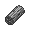

# Torchic

## Type

## Evolution
|Stage |  | Stage |  | Stage |
|:---: | :---: | :---: | :---: | :---: |
| **[Torchic]( torchic.md)** | ➡️ Lv. 16 |  **[Combusken]( combusken.md)** | ➡️ Lv. 36 |  **[Blaziken]( blaziken.md)** |

## Abilities
| Slot | Original | New |
| --- | --- | --- |
| Ability 1 | **[Blaze](../abilities/blaze.md)**: Strengthens fire moves to inflict 1.5× damage at 1/3 max HP or less. | **[Blaze](../abilities/blaze.md)**: Strengthens fire moves to inflict 1.5× damage at 1/3 max HP or less. |
| Ability 2 | **[Speed boost](../abilities/speed-boost.md)**: Raises Speed one stage after each turn. | **[Speed Boost](../abilities/speed-boost.md)**: Raises Speed one stage after each turn. |

## Base Happiness
70

## Held Items
-  Charcoal (50%)

## Type Defenses
| 0x | 0.5x | 1x | 2x | 4x |
| --- | --- | --- | --- | --- |
|  |  |  |  |  |
|  |  |  |  |  |
|  |  |  |  |  |
|  |  |  |  |  |
|  |  |  |  |  |
|  |  |  |  |  |
|  |  |  |  |  |
|  |  |  |  |  |
|  |  |  |  |  |

## Base Stats
| Stat | Value | Bar |
| --- | --- | --- |
| Hp | 45 | 

 |
| Attack | 60 | 

 |
| Defense | 40 | 

 |
| Special attack | 70 | 

 |
| Special defense | 50 | 

 |
| Speed | 45 | 

 |
| **Total** | **310** | |

## Locations
| Route | Method | Rate |
| --- | --- | --- |
| [Pinwheel Forest](../routes/pinwheel-forest.md) |  Grass, Special | 5% |

## Level Up Moves
| Level | Type | Move | Cat | Power | Acc | PP |
| :--- | :--- | :--- | :--- | :--- | :--- | :--- |
| 1 NEW | - | Thunderpunch | - | - | - | - |
| 1 NEW |  | [Night slash](../moves/night-slash.md) | { style="vertical-align:middle; object-fit:contain;" } | 70 | 100 | 15 |
| 1 |  | [Scratch](../moves/scratch.md) | { style="vertical-align:middle; object-fit:contain;" } | 40 | 100 | 35 |
| 1 |  | [Growl](../moves/growl.md) | { style="vertical-align:middle; object-fit:contain;" } | - | 100 | 40 |
| 7 |  | [Focus energy](../moves/focus-energy.md) | { style="vertical-align:middle; object-fit:contain;" } | - | - | 30 |
| 10 |  | [Ember](../moves/ember.md) | { style="vertical-align:middle; object-fit:contain;" } | 40 | 100 | 25 |
| 16 |  | [Peck](../moves/peck.md) | { style="vertical-align:middle; object-fit:contain;" } | 35 | 100 | 35 |
| 19 |  | [Sand attack](../moves/sand-attack.md) | { style="vertical-align:middle; object-fit:contain;" } | - | 100 | 15 |
| 22 NEW |  | [Baton pass](../moves/baton-pass.md) | { style="vertical-align:middle; object-fit:contain;" } | - | - | 40 |
| 25 NEW |  | [Low kick](../moves/low-kick.md) | { style="vertical-align:middle; object-fit:contain;" } | - | 100 | 20 |
| 25 |  | [Fire spin](../moves/fire-spin.md) | { style="vertical-align:middle; object-fit:contain;" } | 35 | 85 | 15 |
| 28 |  | [Quick attack](../moves/quick-attack.md) | { style="vertical-align:middle; object-fit:contain;" } | 40 | 100 | 30 |
| 34 |  | [Slash](../moves/slash.md) | { style="vertical-align:middle; object-fit:contain;" } | 70 | 100 | 20 |
| 37 |  | [Mirror move](../moves/mirror-move.md) | { style="vertical-align:middle; object-fit:contain;" } | - | - | 20 |
| 43 |  | [Flamethrower](../moves/flamethrower.md) | { style="vertical-align:middle; object-fit:contain;" } | 90 | 100 | 15 |

## TM Moves
| No. | Type | Move | Cat | Power | Acc | PP |
| :--- | :--- | :--- | :--- | :--- | :--- | :--- |
| TM40 |  | [Aerial ace](../moves/aerial-ace.md) | { style="vertical-align:middle; object-fit:contain;" } | 60 | - | 20 |
| TM45 |  | [Attract](../moves/attract.md) | { style="vertical-align:middle; object-fit:contain;" } | - | 100 | 15 |
| TM28 |  | [Dig](../moves/dig.md) | { style="vertical-align:middle; object-fit:contain;" } | 80 | 100 | 10 |
| TM32 |  | [Double team](../moves/double-team.md) | { style="vertical-align:middle; object-fit:contain;" } | - | - | 15 |
| TM49 |  | [Echoed voice](../moves/echoed-voice.md) | { style="vertical-align:middle; object-fit:contain;" } | 40 | 100 | 15 |
| TM42 |  | [Facade](../moves/facade.md) | { style="vertical-align:middle; object-fit:contain;" } | 70 | 100 | 20 |
| TM38 |  | [Fire blast](../moves/fire-blast.md) | { style="vertical-align:middle; object-fit:contain;" } | 110 | 85 | 5 |
| TM43 |  | [Flame charge](../moves/flame-charge.md) | { style="vertical-align:middle; object-fit:contain;" } | 50 | 100 | 20 |
| TM21 |  | [Frustration](../moves/frustration.md) | { style="vertical-align:middle; object-fit:contain;" } | - | 100 | 20 |
| TM10 |  | [Hidden power](../moves/hidden-power.md) | { style="vertical-align:middle; object-fit:contain;" } | 60 | 100 | 15 |
| TM01 |  | [Hone claws](../moves/hone-claws.md) | { style="vertical-align:middle; object-fit:contain;" } | - | - | 15 |
| TM59 |  | [Incinerate](../moves/incinerate.md) | { style="vertical-align:middle; object-fit:contain;" } | 60 | 100 | 15 |
| TM50 |  | [Overheat](../moves/overheat.md) | { style="vertical-align:middle; object-fit:contain;" } | 130 | 90 | 5 |
| TM17 |  | [Protect](../moves/protect.md) | { style="vertical-align:middle; object-fit:contain;" } | - | - | 10 |
| TM44 |  | [Rest](../moves/rest.md) | { style="vertical-align:middle; object-fit:contain;" } | - | - | 5 |
| TM27 |  | [Return](../moves/return.md) | { style="vertical-align:middle; object-fit:contain;" } | - | 100 | 20 |
| TM80 |  | [Rock slide](../moves/rock-slide.md) | { style="vertical-align:middle; object-fit:contain;" } | 75 | 90 | 10 |
| TM94 |  | [Rock smash](../moves/rock-smash.md) | { style="vertical-align:middle; object-fit:contain;" } | 40 | 100 | 15 |
| TM39 |  | [Rock tomb](../moves/rock-tomb.md) | { style="vertical-align:middle; object-fit:contain;" } | 60 | 95 | 15 |
| TM48 |  | [Round](../moves/round.md) | { style="vertical-align:middle; object-fit:contain;" } | 60 | 100 | 15 |
| TM65 |  | [Shadow claw](../moves/shadow-claw.md) | { style="vertical-align:middle; object-fit:contain;" } | 70 | 100 | 15 |
| TM90 |  | [Substitute](../moves/substitute.md) | { style="vertical-align:middle; object-fit:contain;" } | - | - | 10 |
| TM11 |  | [Sunny day](../moves/sunny-day.md) | { style="vertical-align:middle; object-fit:contain;" } | - | - | 5 |
| TM87 |  | [Swagger](../moves/swagger.md) | { style="vertical-align:middle; object-fit:contain;" } | - | 85 | 15 |
| TM75 |  | [Swords dance](../moves/swords-dance.md) | { style="vertical-align:middle; object-fit:contain;" } | - | - | 20 |
| TM06 |  | [Toxic](../moves/toxic.md) | { style="vertical-align:middle; object-fit:contain;" } | - | 90 | 10 |
| TM61 |  | [Will o wisp](../moves/will-o-wisp.md) | { style="vertical-align:middle; object-fit:contain;" } | - | 85 | 15 |

## HM Moves
| No. | Type | Move | Cat | Power | Acc | PP |
| :--- | :--- | :--- | :--- | :--- | :--- | :--- |
| HM01 |  | [Cut](../moves/cut.md) | { style="vertical-align:middle; object-fit:contain;" } | 50 | 95 | 30 |
| HM04 |  | [Strength](../moves/strength.md) | { style="vertical-align:middle; object-fit:contain;" } | 80 | 100 | 15 |

## Egg Moves
| No. | Type | Move | Cat | Power | Acc | PP |
| :--- | :--- | :--- | :--- | :--- | :--- | :--- |
|  |  | [Agility](../moves/agility.md) | { style="vertical-align:middle; object-fit:contain;" } | - | - | 30 |
|  |  | [Baton pass](../moves/baton-pass.md) | { style="vertical-align:middle; object-fit:contain;" } | - | - | 40 |
|  |  | [Counter](../moves/counter.md) | { style="vertical-align:middle; object-fit:contain;" } | - | 100 | 20 |
|  |  | [Crush claw](../moves/crush-claw.md) | { style="vertical-align:middle; object-fit:contain;" } | 75 | 95 | 10 |
|  |  | [Curse](../moves/curse.md) | { style="vertical-align:middle; object-fit:contain;" } | - | - | 10 |
|  |  | [Endure](../moves/endure.md) | { style="vertical-align:middle; object-fit:contain;" } | - | - | 10 |
|  |  | [Feather dance](../moves/feather-dance.md) | { style="vertical-align:middle; object-fit:contain;" } | - | 100 | 15 |
|  |  | [Feint](../moves/feint.md) | { style="vertical-align:middle; object-fit:contain;" } | 30 | 100 | 10 |
|  |  | [Flame burst](../moves/flame-burst.md) | { style="vertical-align:middle; object-fit:contain;" } | 70 | 100 | 15 |
|  |  | [Last resort](../moves/last-resort.md) | { style="vertical-align:middle; object-fit:contain;" } | 140 | 100 | 5 |
|  |  | [Low kick](../moves/low-kick.md) | { style="vertical-align:middle; object-fit:contain;" } | - | 100 | 20 |
|  |  | [Night slash](../moves/night-slash.md) | { style="vertical-align:middle; object-fit:contain;" } | 70 | 100 | 15 |
|  |  | [Reversal](../moves/reversal.md) | { style="vertical-align:middle; object-fit:contain;" } | - | 100 | 15 |
|  |  | [Smelling salts](../moves/smelling-salts.md) | { style="vertical-align:middle; object-fit:contain;" } | 70 | 100 | 10 |

## Tutor Moves
| No. | Type | Move | Cat | Power | Acc | PP |
| :--- | :--- | :--- | :--- | :--- | :--- | :--- |
|  |  | [Bounce](../moves/bounce.md) | { style="vertical-align:middle; object-fit:contain;" } | 85 | 85 | 5 |
|  |  | [Fire pledge](../moves/fire-pledge.md) | { style="vertical-align:middle; object-fit:contain;" } | 80 | 100 | 10 |
|  |  | [Heat wave](../moves/heat-wave.md) | { style="vertical-align:middle; object-fit:contain;" } | 95 | 90 | 10 |
|  |  | [Helping hand](../moves/helping-hand.md) | { style="vertical-align:middle; object-fit:contain;" } | - | - | 20 |
|  |  | [Sleep talk](../moves/sleep-talk.md) | { style="vertical-align:middle; object-fit:contain;" } | - | - | 10 |
|  |  | [Snore](../moves/snore.md) | { style="vertical-align:middle; object-fit:contain;" } | 50 | 100 | 15 |
