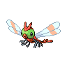

# Yanmega

## Type
 

## Evolution
 **[Yanma]( yanma.md)** ➡️ Know ancient-power ➡️  **[Yanmega]( yanmega.md)**

## Abilities
| Slot | Original | New |
| --- | --- | --- |
| Ability 1 | **[Speed boost](../abilities/speed-boost.md)**: Raises Speed one stage after each turn. | **[Speed Boost](../abilities/speed-boost.md)**: Raises Speed one stage after each turn. |
| Ability 2 | **[Tinted lens](../abilities/tinted-lens.md)**: Doubles damage inflicted with not-very-effective moves. | **[Tinted Lens](../abilities/tinted-lens.md)**: Doubles damage inflicted with not-very-effective moves. |

## Type Defenses
| 0x | 0.5x | 2x | 4x |
| --- | --- | --- | --- |
|  |  |  |  |
|  |  |  |  |
|  |  |  |  |
|  |  |  |  |

## Base Stats
| Stat | Value | Bar |
| --- | --- | --- |
| Hp | 86 | 

 |
| Attack | 76 | 

 |
| Defense | 86 | 

 |
| Special attack | 116 | 

 |
| Special defense | 56 | 

 |
| Speed | 95 | 

 |

## Locations
Evolve from [Yanma]( yanma.md)

## Level Up Moves
| Level | Type | Move | Cat | Power | Acc | PP | Change |
| --- | --- | --- | --- | --- | --- | --- | --- |
| 1 |  | [Tackle](../moves/tackle.md) |  | 40 | 100 | 35 |  |
| 1 |  | [Quick attack](../moves/quick-attack.md) |  | 40 | 100 | 30 |  |
| 1 |  | [TM32 Double team](../moves/double-team.md) |  | - | - | 15 |  |
| 1 |  | [Foresight](../moves/foresight.md) |  | - | - | 40 |  |
| 1 |  | [Night slash](../moves/night-slash.md) |  | 70 | 100 | 15 |  |
| 1 |  | [Bug bite](../moves/bug-bite.md) |  | 60 | 100 | 20 |  |
| 14 |  | [Sonic boom](../moves/sonic-boom.md) |  | - | 90 | 20 |  |
| 17 |  | [Detect](../moves/detect.md) |  | - | - | 5 |  |
| 22 |  | [Supersonic](../moves/supersonic.md) |  | - | 55 | 20 |  |
| 27 |  | [Uproar](../moves/uproar.md) |  | 90 | 100 | 10 |  |
| 30 |  | [Pursuit](../moves/pursuit.md) |  | 40 | 100 | 20 |  |
| 33 |  | [Ancient power](../moves/ancient-power.md) |  | 60 | 100 | 5 |  |
| 38 |  | [Feint](../moves/feint.md) |  | 30 | 100 | 10 |  |
| 43 |  | [Slash](../moves/slash.md) |  | 70 | 100 | 20 |  |
| 46 |  | [Screech](../moves/screech.md) |  | - | 85 | 40 |  |
| 49 |  | [TM89 U turn](../moves/u-turn.md) |  | 70 | 100 | 20 |  |
| 54 |  | [Air slash](../moves/air-slash.md) |  | 75 | 95 | 15 |  |
| 57 |  | [Bug buzz](../moves/bug-buzz.md) |  | 90 | 100 | 10 |  |

## TM Moves
| Type | Move | Cat | Power | Acc | PP |
| --- | --- | --- | --- | --- | --- |
|  | [TM40 Aerial ace](../moves/aerial-ace.md) |  | 60 | - | 20 |
|  | [TM45 Attract](../moves/attract.md) |  | - | 100 | 15 |
|  | [TM85 Dream eater](../moves/dream-eater.md) |  | 100 | 100 | 15 |
|  | [TM42 Facade](../moves/facade.md) |  | 70 | 100 | 20 |
|  | [TM70 Flash](../moves/flash.md) |  | - | 100 | 20 |
|  | [TM21 Frustration](../moves/frustration.md) |  | - | 100 | 20 |
|  | [TM68 Giga impact](../moves/giga-impact.md) |  | 150 | 90 | 5 |
|  | [TM10 Hidden power](../moves/hidden-power.md) |  | 60 | 100 | 15 |
|  | [TM15 Hyper beam](../moves/hyper-beam.md) |  | 150 | 90 | 5 |
|  | [TM17 Protect](../moves/protect.md) |  | - | - | 10 |
|  | [TM77 Psych up](../moves/psych-up.md) |  | - | - | 10 |
|  | [TM29 Psychic](../moves/psychic.md) |  | 90 | 100 | 10 |
|  | [TM44 Rest](../moves/rest.md) |  | - | - | 5 |
|  | [TM27 Return](../moves/return.md) |  | - | 100 | 20 |
|  | [TM48 Round](../moves/round.md) |  | 60 | 100 | 15 |
|  | [TM30 Shadow ball](../moves/shadow-ball.md) |  | 80 | 100 | 15 |
|  | [TM22 Solar beam](../moves/solar-beam.md) |  | 120 | 100 | 10 |
|  | [TM76 Struggle bug](../moves/struggle-bug.md) |  | 50 | 100 | 20 |
|  | [TM90 Substitute](../moves/substitute.md) |  | - | - | 10 |
|  | [TM11 Sunny day](../moves/sunny-day.md) |  | - | - | 5 |
|  | [TM87 Swagger](../moves/swagger.md) |  | - | 85 | 15 |
|  | [TM46 Thief](../moves/thief.md) |  | 60 | 100 | 25 |
|  | [TM06 Toxic](../moves/toxic.md) |  | - | 90 | 10 |

## Tutor Moves
| Type | Move | Cat | Power | Acc | PP |
| --- | --- | --- | --- | --- | --- |
|  | [Giga drain](../moves/giga-drain.md) |  | 75 | 100 | 10 |
|  | [Roost](../moves/roost.md) |  | - | - | 5 |
|  | [Signal beam](../moves/signal-beam.md) |  | 75 | 100 | 15 |
|  | [Sleep talk](../moves/sleep-talk.md) |  | - | - | 10 |
|  | [Snore](../moves/snore.md) |  | 50 | 100 | 15 |
|  | [Tailwind](../moves/tailwind.md) |  | - | - | 15 |
