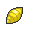

# Abundant Shrine

## Encounters
### General
####  Grass, Normal
| Sprite | Pokemon | Rate |
| --- | --- | --- |
|  | [Chimecho](../pokemon/chimecho.md) | 20% |
|  | [Vulpix](../pokemon/vulpix.md) | 20% |
|  | [Growlithe](../pokemon/growlithe.md) | 10% |
|  | [Cottonee](../pokemon/cottonee.md) | 10% |
|  | [Petilil](../pokemon/petilil.md) | 10% |
|  | [Bronzor](../pokemon/bronzor.md) | 10% |
|  | [Murkrow](../pokemon/murkrow.md) | 10% |
|  | [Misdreavus](../pokemon/misdreavus.md) | 10% |

####  Grass, Doubles
| Sprite | Pokemon | Rate |
| --- | --- | --- |
|  | [Eevee](../pokemon/eevee.md) | 20% |
|  | [Bronzong](../pokemon/bronzong.md) | 20% |
|  | [Girafarig](../pokemon/girafarig.md) | 10% |
|  | [Stantler](../pokemon/stantler.md) | 10% |
|  | [Hypno](../pokemon/hypno.md) | 10% |
|  | [Mightyena](../pokemon/mightyena.md) | 10% |
|  | [Mr. Mime](../pokemon/mr-mime.md) | 10% |
|  | [Sudowoodo](../pokemon/sudowoodo.md) | 10% |

####  Grass, Special
| Sprite | Pokemon | Rate |
| --- | --- | --- |
|  | [Audino](../pokemon/audino.md) | 70% |
|  | [Emolga](../pokemon/emolga.md) | 10% |
|  | [Arcanine](../pokemon/arcanine.md) | 5% |
|  | [Ninetales](../pokemon/ninetales.md) | 5% |
|  | [Whimsicott](../pokemon/whimsicott.md) | 5% |
|  | [Lilligant](../pokemon/lilligant.md) | 5% |

####  Surf, Normal
| Sprite | Pokemon | Rate |
| --- | --- | --- |
|  | [Slowpoke](../pokemon/slowpoke.md) | 100% |

####  Surf, Special
| Sprite | Pokemon | Rate |
| --- | --- | --- |
|  | [Slowking](../pokemon/slowking.md) | 60% |
|  | [Slowbro](../pokemon/slowbro.md) | 40% |

####  Fish, Normal
| Sprite | Pokemon | Rate |
| --- | --- | --- |
|  | [Goldeen](../pokemon/goldeen.md) | 70% |
|  | [Basculin](../pokemon/basculin.md) | 30% |

####  Fish, Special
| Sprite | Pokemon | Rate |
| --- | --- | --- |
|  | [Goldeen](../pokemon/goldeen.md) | 60% |
|  | [Basculin](../pokemon/basculin.md) | 30% |
|  | [Seaking](../pokemon/seaking.md) | 10% |

## Special Encounters
### [Ho-oh](../pokemon/ho-oh.md)
| Sprite | Level | Location | Method | Rate |
| --- | --- | --- | --- | --- |
|  | 70 | Abundant Shrine |  Grass, Special | 1% |

*Ho-oh sometimes visits the shrine as a peace offering from Johto. Legendaries have culture too, you know! If you’re lucky, you might catch a glimpse of it.*

### [Landorus](../pokemon/landorus.md)
| Sprite | Level | Location | Method | Rate |
| --- | --- | --- | --- | --- |
|  | 75 | Abundant Shrine |  Fixed | Fixed |

## Items
### General
| Item | Original |
| --- | --- |
|  Enigma Berry | Razor Fang |
|  [Soul Dew](../items/soul-dew.md) | TM35 Flamethrower |

## Trainers
### Gym Leader Cilan, Gym Leader Cress, Gym Leader Chili
**Battle Type:** Rotation Battle (First Fight) / Triple Battle (Rematch)  
**Reward:** [TM83](../moves/work-up.md) Work Up  

#### Chili’s Team
| Sprite | Pokemon | Level | Ability | Item | Moves |
| --- | --- | --- | --- | --- | --- |
|  | [Emboar](../pokemon/emboar.md) | 86 | Blaze |  Passho Berry | Flare Blitz, Earthquake, Hammer Arm, Scald |
|  | [Charizard](../pokemon/charizard.md) | 86 | Blaze |  Charti Berry | Fire Blast, Air Slash, Outrage, Earthquake |
|  | [Typhlosion](../pokemon/typhlosion.md) | 86 | Blaze |  Shuca Berry | Eruption, Focus Blast, SolarBeam, ThunderPunch |
|  | [Blaziken](../pokemon/blaziken.md) | 86 | Blaze |  Payapa Berry | Hi Jump Kick, Flare Blitz, Stone Edge, ThunderPunch |
|  | [Infernape](../pokemon/infernape.md) | 86 | Blaze |  Coba Berry | Overheat, Close Combat, Grass Knot, ThunderPunch |
|  | [Simisear](../pokemon/simisear.md) | 88 | Gluttony |  Petaya Berry | Fire Blast, Focus Blast, Grass Knot, Will-O-Wisp |

