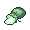

# Chargestone Cave

## Encounters
### 1F
####  Cave, Normal
| Sprite | Pokemon | Rate |
| --- | --- | --- |
|  | [Joltik](../pokemon/joltik.md) | 20% |
|  | [Klink](../pokemon/klink.md) | 20% |
|  | [Elekid](../pokemon/elekid.md) | 10% |
|  | [Magnemite](../pokemon/magnemite.md) | 10% |
|  | [Voltorb](../pokemon/voltorb.md) | 10% |
|  | [Ferroseed](../pokemon/ferroseed.md) | 10% |
|  | [Nosepass](../pokemon/nosepass.md) | 10% |
|  | [Lairon](../pokemon/lairon.md) | 10% |

####  Cave, Special
| Sprite | Pokemon | Rate |
| --- | --- | --- |
|  | [Drilbur](../pokemon/drilbur.md) | 50% |
|  | [Diglett](../pokemon/diglett.md) | 50% |

### B1F
####  Cave, Normal
| Sprite | Pokemon | Rate |
| --- | --- | --- |
|  | [Joltik](../pokemon/joltik.md) | 20% |
|  | [Klink](../pokemon/klink.md) | 20% |
|  | [Mawile](../pokemon/mawile.md) | 10% |
|  | [Sableye](../pokemon/sableye.md) | 10% |
|  | [Tynamo](../pokemon/tynamo.md) | 10% |
|  | [Durant](../pokemon/durant.md) | 10% |
|  | [Nosepass](../pokemon/nosepass.md) | 10% |
|  | [Deino](../pokemon/deino.md) | 10% |

####  Cave, Special
| Sprite | Pokemon | Rate |
| --- | --- | --- |
|  | [Drilbur](../pokemon/drilbur.md) | 50% |
|  | [Diglett](../pokemon/diglett.md) | 50% |

### B2F
####  Cave, Normal
| Sprite | Pokemon | Rate |
| --- | --- | --- |
|  | [Galvantula](../pokemon/galvantula.md) | 20% |
|  | [Klang](../pokemon/klang.md) | 20% |
|  | [Electabuzz](../pokemon/electabuzz.md) | 10% |
|  | [Magneton](../pokemon/magneton.md) | 10% |
|  | [Electrode](../pokemon/electrode.md) | 10% |
|  | [Ferrothorn](../pokemon/ferrothorn.md) | 10% |
|  | [Durant](../pokemon/durant.md) | 5% |
|  | [Eelektrik](../pokemon/eelektrik.md) | 5% |
|  | [Porygon](../pokemon/porygon.md) | 5% |
|  | [Rotom](../pokemon/rotom.md) | 4% |

####  Cave, Special
| Sprite | Pokemon | Rate |
| --- | --- | --- |
|  | [Excadrill](../pokemon/excadrill.md) | 50% |
|  | [Dugtrio](../pokemon/dugtrio.md) | 50% |

## Special Encounters
### [Zapdos](../pokemon/zapdos.md)
| Sprite | Level | Location | Method | Rate |
| --- | --- | --- | --- | --- |
|  | 50 | Chargestone Cave, B2F. |  Cave, Normal. | 1% |

*Zapdos, like most Electric types, is drawn to high potential sources. Watch out – don’t underestimate its power!*

## Items
### General
| Item |
| --- |
|  [Lucky Egg * 6](../items/lucky-egg.md) Lucky Egg (From Professor Juniper) |
|  [Life Orb](../items/life-orb.md) TM69 Rock Polish (NPC) (Gift from Sage) |
|  [Electirizer](../items/electirizer.md) |
|  [Elixir](../items/elixir.md) (With Dowsing Machine) |
|  [Hyper Potion](../items/hyper-potion.md) |
|  [Hyper Potion](../items/hyper-potion.md) |
|  [Max Potion](../items/max-potion.md) (With Dowsing Machine) |
|  [Parlyz Heal](../items/parlyz-heal.md) |
|  [Parlyz Heal](../items/parlyz-heal.md) (With Dowsing Machine) |
|  [Parlyz Heal](../items/parlyz-heal.md) |
|  [Revive](../items/revive.md) |
|  [Revive](../items/revive.md) (With Dowsing Machine) |
|  [Bright Powder](../items/bright-powder.md) |
|  [Bug Gem](../items/bug-gem.md) |
|  [Dark Gem](../items/dark-gem.md) |
|  [Dragon Gem](../items/dragon-gem.md) |
|  [Electric Gem](../items/electric-gem.md) |
|  [Fighting Gem](../items/fighting-gem.md) |
|  [Fire Gem](../items/fire-gem.md) |
|  [Flying Gem](../items/flying-gem.md) |
|  [Ghost Gem](../items/ghost-gem.md) |
|  [Grass Gem](../items/grass-gem.md) |
|  [Ground Gem](../items/ground-gem.md) |
|  [Ice Gem](../items/ice-gem.md) |
|  [Magnet](../items/magnet.md) |
|  [Normal Gem](../items/normal-gem.md) |
|  [Poison Gem](../items/poison-gem.md) |
|  [Psychic Gem](../items/psychic-gem.md) |
|  [Rock Gem](../items/rock-gem.md) |
|  [Steel Gem](../items/steel-gem.md) |
|  [Water Gem](../items/water-gem.md) |
|  [Dawn Stone](../items/dawn-stone.md) (Dustcloud) |
|  [Dusk Stone](../items/dusk-stone.md) (Dustcloud) |
|  [Fire Stone](../items/fire-stone.md) (Dustcloud) |
|  [Leaf Stone](../items/leaf-stone.md) (Dustcloud) |
|  [Moon Stone](../items/moon-stone.md) (Dustcloud) |
|  [Shiny Stone](../items/shiny-stone.md) (Dustcloud) |
|  [Thunderstone](../items/thunderstone.md) |
|  [Thunderstone](../items/thunderstone.md) (Dustcloud) |
|  [Water Stone](../items/water-stone.md) (Dustcloud) |
|  [HP Up](../items/hp-up.md) (With Dowsing Machine) |
|  [Iron](../items/iron.md) |
|  [Rare Candy](../items/rare-candy.md) |
|  [Nugget](../items/nugget.md) |
|  [Star Piece](../items/star-piece.md) (With Dowsing Machine) |
|  [Heal Ball](../items/heal-ball.md) |
|  [Timer Ball](../items/timer-ball.md) |

## Trainers
### Ace Trainer Jared
| Sprite | Pokemon | Level | Ability | Item | Moves |
| --- | --- | --- | --- | --- | --- |
|  | [Axew](../pokemon/axew.md) | 40 | - | - |  |
|  | [Dragonair](../pokemon/dragonair.md) | 40 | - | - |  |

### Scientist Ronald
| Sprite | Pokemon | Level | Ability | Item | Moves |
| --- | --- | --- | --- | --- | --- |
|  | [Klang](../pokemon/klang.md) | 40 | - | - |  |

### Scientist Naoko
| Sprite | Pokemon | Level | Ability | Item | Moves |
| --- | --- | --- | --- | --- | --- |
|  | [Durant](../pokemon/durant.md) | 40 | - | - |  |
|  | [Ferrothorn](../pokemon/ferrothorn.md) | 40 | - | - |  |

### Hiker Hardy
| Sprite | Pokemon | Level | Ability | Item | Moves |
| --- | --- | --- | --- | --- | --- |
|  | [Bronzong](../pokemon/bronzong.md) | 39 | - | - |  |
|  | [Relicanth](../pokemon/relicanth.md) | 39 | - | - |  |
|  | [Carracosta](../pokemon/carracosta.md) | 39 | - | - |  |

### Scientist Orville
| Sprite | Pokemon | Level | Ability | Item | Moves |
| --- | --- | --- | --- | --- | --- |
|  | [Fearow](../pokemon/fearow.md) | 42 | - | - |  |
|  | [Pidgeot](../pokemon/pidgeot.md) | 42 | - | - |  |

### Ace Trainer Corky
| Sprite | Pokemon | Level | Ability | Item | Moves |
| --- | --- | --- | --- | --- | --- |
|  | [Bagon](../pokemon/bagon.md) | 40 | - | - |  |
|  | [Zangoose](../pokemon/zangoose.md) | 40 | - | - |  |
|  | [Cradily](../pokemon/cradily.md) | 40 | - | - |  |

### Doctor Wayne
| Sprite | Pokemon | Level | Ability | Item | Moves |
| --- | --- | --- | --- | --- | --- |
|  | [Reuniclus](../pokemon/reuniclus.md) | 41 | - | - |  |

### Plasma Grunt
| Sprite | Pokemon | Level | Ability | Item | Moves |
| --- | --- | --- | --- | --- | --- |
|  | [Krokorok](../pokemon/krokorok.md) | 39 | - | - |  |
|  | [Watchog](../pokemon/watchog.md) | 39 | - | - |  |
|  | [Scrafty](../pokemon/scrafty.md) | 39 | - | - |  |

### Plasma Grunt
| Sprite | Pokemon | Level | Ability | Item | Moves |
| --- | --- | --- | --- | --- | --- |
|  | [Eelektrik](../pokemon/eelektrik.md) | 39 | - | - |  |
|  | [Banette](../pokemon/banette.md) | 39 | - | - |  |
|  | [Crawdaunt](../pokemon/crawdaunt.md) | 39 | - | - |  |

### Plasma Grunt
| Sprite | Pokemon | Level | Ability | Item | Moves |
| --- | --- | --- | --- | --- | --- |
|  | [Arbok](../pokemon/arbok.md) | 39 | - | - |  |
|  | [Honchkrow](../pokemon/honchkrow.md) | 39 | - | - |  |
|  | [Vileplume](../pokemon/vileplume.md) | 39 | - | - |  |

### Plasma Grunt
| Sprite | Pokemon | Level | Ability | Item | Moves |
| --- | --- | --- | --- | --- | --- |
|  | [Garbodor](../pokemon/garbodor.md) | 42 | - | - |  |

### Plasma Grunt
| Sprite | Pokemon | Level | Ability | Item | Moves |
| --- | --- | --- | --- | --- | --- |
|  | [Pawniard](../pokemon/pawniard.md) | 38 | - | - |  |
|  | [Cacturne](../pokemon/cacturne.md) | 38 | - | - |  |
|  | [Scraggy](../pokemon/scraggy.md) | 38 | - | - |  |
|  | [Mightyena](../pokemon/mightyena.md) | 38 | - | - |  |

### Plasma Grunt
| Sprite | Pokemon | Level | Ability | Item | Moves |
| --- | --- | --- | --- | --- | --- |
|  | [Exploud](../pokemon/exploud.md) | 42 | - | - |  |

### Plasma Grunt
| Sprite | Pokemon | Level | Ability | Item | Moves |
| --- | --- | --- | --- | --- | --- |
|  | [Garbodor](../pokemon/garbodor.md) | 41 | - | - |  |
|  | [Weezing](../pokemon/weezing.md) | 41 | - | - |  |

### Ace Trainer Allison
| Sprite | Pokemon | Level | Ability | Item | Moves |
| --- | --- | --- | --- | --- | --- |
|  | [Dratini](../pokemon/dratini.md) | 42 | - | - |  |
|  | [Rhydon](../pokemon/rhydon.md) | 42 | - | - |  |
|  | [Exeggutor](../pokemon/exeggutor.md) | 42 | - | - |  |

### Ace Trainer Stella
| Sprite | Pokemon | Level | Ability | Item | Moves |
| --- | --- | --- | --- | --- | --- |
|  | [Farfetch'D](../pokemon/farfetchd.md) | 42 | - | - |  |
|  | [Hypno](../pokemon/hypno.md) | 42 | - | - |  |
|  | [Arcanine](../pokemon/arcanine.md) | 42 | - | - |  |

### PKMN Trainer N – 4
**Battle Type:** Single Battle  

#### N’s Team
| Sprite | Pokemon | Level | Ability | Item | Moves |
| --- | --- | --- | --- | --- | --- |
|  | [Rotom](../pokemon/rotom.md) | 47 | - | - |  |
|  | [Rotom](../pokemon/rotom.md) | 47 | - | - |  |
|  | [Rotom](../pokemon/rotom.md) | 47 | - | - |  |
|  | [Rotom](../pokemon/rotom.md) | 47 | - | - |  |
|  | [Rotom](../pokemon/rotom.md) | 47 | - | - |  |
|  | [Rotom](../pokemon/rotom.md) | 47 | - | - |  |

