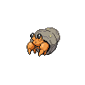
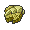
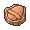

# Desert Resort

## Entrance
###  Sand
| Sprite | Pokemon | Rate |
| --- | --- | --- |
|  | [Sandile](../pokemon/sandile.md) | 20% |
|  | [Sandshrew](../pokemon/sandshrew.md) | 20% |
|  | [Darumaka](../pokemon/darumaka.md) | 10% |
|  | [Scraggy](../pokemon/scraggy.md) | 10% |
|  | [Cacnea](../pokemon/cacnea.md) | 10% |
|  | [Dwebble](../pokemon/dwebble.md) | 10% |
|  | [Baltoy](../pokemon/baltoy.md) | 10% |
|  | [Trapinch](../pokemon/trapinch.md) | 10% |
|  | [Trapinch](../pokemon/trapinch.md) | 20% |
|  | [Darumaka](../pokemon/darumaka.md) | 20% |
|  | [Cacnea](../pokemon/cacnea.md) | 10% |
|  | [Hippopotas](../pokemon/hippopotas.md) | 10% |
|  | [Gligar](../pokemon/gligar.md) | 10% |
|  | [Dwebble](../pokemon/dwebble.md) | 10% |
|  | [Maractus](../pokemon/maractus.md) | 5% |
|  | [Sigilyph](../pokemon/sigilyph.md) | 5% |
|  | [Skarmory](../pokemon/skarmory.md) | 5% |
|  | [Mandibuzz](../pokemon/mandibuzz.md) | 5% |

## General Items
| Item | Original |
| --- | --- |
|  [Helix Fossil](../items/helix-fossil.md) | Fresh Water |
|  [Claw Fossil](../items/claw-fossil.md) | Stardust |
|  [Dome Fossil](../items/dome-fossil.md) | BlackGlasses |
|  [Armor Fossil](../items/armor-fossil.md) | Super Potion |
|  [Fire Stone * 6](../items/fire-stone.md) | Fire Stone |

## Trainers
### Doctor Jerry
| Sprite | Pokemon | Level | Ability | Item | Moves |
| --- | --- | --- | --- | --- | --- |
|  | [Chansey](../pokemon/chansey.md) | 30 | - |  - |  |

### Backpacker Kelsey
| Sprite | Pokemon | Level | Ability | Item | Moves |
| --- | --- | --- | --- | --- | --- |
|  | [Togetic](../pokemon/togetic.md) | 29 | - |  - |  |
|  | [Sunflora](../pokemon/sunflora.md) | 29 | - |  - |  |
|  | [Luvdisc](../pokemon/luvdisc.md) | 29 | - |  - |  |

### PKMN Ranger Mylene
| Sprite | Pokemon | Level | Ability | Item | Moves |
| --- | --- | --- | --- | --- | --- |
|  | [Lairon](../pokemon/lairon.md) | 32 | - |  - |  |
|  | [Ninjask](../pokemon/ninjask.md) | 32 | - |  - |  |

### PKMN Ranger Jaden
| Sprite | Pokemon | Level | Ability | Item | Moves |
| --- | --- | --- | --- | --- | --- |
|  | [Swellow](../pokemon/swellow.md) | 32 | - |  - |  |
|  | [Sudowoodo](../pokemon/sudowoodo.md) | 32 | - |  - |  |

### Backpacker Nate
| Sprite | Pokemon | Level | Ability | Item | Moves |
| --- | --- | --- | --- | --- | --- |
|  | [Barboach](../pokemon/barboach.md) | 29 | - |  - |  |
|  | [Kecleon](../pokemon/kecleon.md) | 29 | - |  - |  |
|  | [Granbull](../pokemon/granbull.md) | 29 | - |  - |  |

### Backpacker Liz
| Sprite | Pokemon | Level | Ability | Item | Moves |
| --- | --- | --- | --- | --- | --- |
|  | [Shellder](../pokemon/shellder.md) | 29 | - |  - |  |
|  | [Rufflet](../pokemon/rufflet.md) | 29 | - |  - |  |
|  | [Vullaby](../pokemon/vullaby.md) | 29 | - |  - |  |

### Psychic Cybil
| Sprite | Pokemon | Level | Ability | Item | Moves |
| --- | --- | --- | --- | --- | --- |
|  | [Gothita](../pokemon/gothita.md) | 28 | - |  - |  |
|  | [Solosis](../pokemon/solosis.md) | 28 | - |  - |  |
|  | [Yamask](../pokemon/yamask.md) | 28 | - |  - |  |
|  | [Haunter](../pokemon/haunter.md) | 28 | - |  - |  |

### Psychic Low
| Sprite | Pokemon | Level | Ability | Item | Moves |
| --- | --- | --- | --- | --- | --- |
|  | [Wynaut](../pokemon/wynaut.md) | 30 | - |  - |  |
|  | [Chimecho](../pokemon/chimecho.md) | 30 | - |  - |  |

### Backpacker Elaine
| Sprite | Pokemon | Level | Ability | Item | Moves |
| --- | --- | --- | --- | --- | --- |
|  | [Krabby](../pokemon/krabby.md) | 29 | - |  - |  |
|  | [Cubchoo](../pokemon/cubchoo.md) | 29 | - |  - |  |
|  | [Tirtouga](../pokemon/tirtouga.md) | 29 | - |  - |  |

### Psychic Gaven
| Sprite | Pokemon | Level | Ability | Item | Moves |
| --- | --- | --- | --- | --- | --- |
|  | [Duskull](../pokemon/duskull.md) | 30 | - |  - |  |
|  | [Shuppet](../pokemon/shuppet.md) | 30 | - |  - |  |

