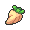

# Driftveil City

## Encounters
### General
####  Surf, Normal
| Sprite | Pokemon | Rate |
| --- | --- | --- |
|  | [Frillish](../pokemon/frillish.md) | 60% |
|  | [Tentacool](../pokemon/tentacool.md) | 30% |
|  | [Staryu](../pokemon/staryu.md) | 10% |

####  Surf, Special
| Sprite | Pokemon | Rate |
| --- | --- | --- |
|  | [Staryu](../pokemon/staryu.md) | 60% |
|  | [Tentacruel](../pokemon/tentacruel.md) | 30% |
|  | [Lapras](../pokemon/lapras.md) | 10% |

####  Fish, Normal
| Sprite | Pokemon | Rate |
| --- | --- | --- |
|  | [Horsea](../pokemon/horsea.md) | 60% |
|  | [Wailmer](../pokemon/wailmer.md) | 30% |
|  | [Mantyke](../pokemon/mantyke.md) | 10% |

####  Fish, Special
| Sprite | Pokemon | Rate |
| --- | --- | --- |
|  | [Wailmer](../pokemon/wailmer.md) | 60% |
|  | [Seadra](../pokemon/seadra.md) | 30% |
|  | [Mantyke](../pokemon/mantyke.md) | 10% |

## Items
### General
| Item |
| --- |
|  [Rage Candy Bar](../items/rage-candy-bar.md) HM02 Fly (NPC) (From Bianca) |
|  [Water Stone * 6](../items/water-stone.md) Water Stone |
|  [Fresh Water](../items/fresh-water.md) (In Gym Entrance) |
|  [Expert Belt](../items/expert-belt.md) (Show Lv. 30 Pokémon in Market) |
|  [Shell Bell](../items/shell-bell.md) |
|  [Big Pearl](../items/big-pearl.md) |
|  [Heart Scale](../items/heart-scale.md) |
|  [Repeat Ball](../items/repeat-ball.md) |
|  [Ultra Ball](../items/ultra-ball.md) |

### PokéMart
| Item |
| --- |
|  [Antidote](../items/antidote.md) |
|  [Awakening](../items/awakening.md) |
|  [Burn Heal](../items/burn-heal.md) |
|  [Full Heal](../items/full-heal.md) |
|  [Full Restore](../items/full-restore.md) |
|  [Hyper Potion](../items/hyper-potion.md) |
|  [Ice Heal](../items/ice-heal.md) |
|  [Max Potion](../items/max-potion.md) |
|  [Parlyz Heal](../items/parlyz-heal.md) |
|  [Potion](../items/potion.md) |
|  [Revive](../items/revive.md) |
|  [Super Potion](../items/super-potion.md) |
|  [Escape Rope](../items/escape-rope.md) |
|  [Max Repel](../items/max-repel.md) |
|  [Repel](../items/repel.md) |
|  [Dusk Ball](../items/dusk-ball.md) |
|  [Great Ball](../items/great-ball.md) |
|  [Net Ball](../items/net-ball.md) |
|  [Poké Ball](../items/poke-ball.md) |
|  [Ultra Ball](../items/ultra-ball.md) |

## Trainers
### Motorcyclist Charles
| Sprite | Pokemon | Level | Ability | Item | Moves |
| --- | --- | --- | --- | --- | --- |
|  | [Poliwrath](../pokemon/poliwrath.md) | 35 | - | - |  |
|  | [Forretress](../pokemon/forretress.md) | 35 | - | - |  |
|  | [Torkoal](../pokemon/torkoal.md) | 35 | - | - |  |

### Youngster Kyle
| Sprite | Pokemon | Level | Ability | Item | Moves |
| --- | --- | --- | --- | --- | --- |
|  | [Wailord](../pokemon/wailord.md) | 85 | - | - |  |

### Worker Felix
| Sprite | Pokemon | Level | Ability | Item | Moves |
| --- | --- | --- | --- | --- | --- |
|  | [Sandile](../pokemon/sandile.md) | 38 | - | - |  |
|  | [Gible](../pokemon/gible.md) | 38 | - | - |  |
|  | [Piloswine](../pokemon/piloswine.md) | 38 | - | - |  |
|  | [Rhyhorn](../pokemon/rhyhorn.md) | 38 | - | - |  |

### Worker Don
| Sprite | Pokemon | Level | Ability | Item | Moves |
| --- | --- | --- | --- | --- | --- |
|  | [Larvitar](../pokemon/larvitar.md) | 38 | - | - |  |
|  | [Onix](../pokemon/onix.md) | 38 | - | - |  |
|  | [Gabite](../pokemon/gabite.md) | 38 | - | - |  |
|  | [Sandslash](../pokemon/sandslash.md) | 38 | - | - |  |

### Worker Sterling
| Sprite | Pokemon | Level | Ability | Item | Moves |
| --- | --- | --- | --- | --- | --- |
|  | [Gligar](../pokemon/gligar.md) | 37 | - | - |  |
|  | [Palpitoad](../pokemon/palpitoad.md) | 37 | - | - |  |
|  | [Nidoking](../pokemon/nidoking.md) | 37 | - | - |  |
|  | [Vibrava](../pokemon/vibrava.md) | 37 | - | - |  |

### Clerk Isaac
| Sprite | Pokemon | Level | Ability | Item | Moves |
| --- | --- | --- | --- | --- | --- |
|  | [Camerupt](../pokemon/camerupt.md) | 39 | - | - |  |
|  | [Whiscash](../pokemon/whiscash.md) | 39 | - | - |  |
|  | [Torterra](../pokemon/torterra.md) | 39 | - | - |  |
|  | [Claydol](../pokemon/claydol.md) | 39 | - | - |  |

### Clerk Katie
| Sprite | Pokemon | Level | Ability | Item | Moves |
| --- | --- | --- | --- | --- | --- |
|  | [Pupitar](../pokemon/pupitar.md) | 38 | - | - |  |
|  | [Nidoqueen](../pokemon/nidoqueen.md) | 38 | - | - |  |
|  | [Donphan](../pokemon/donphan.md) | 38 | - | - |  |
|  | [Dugtrio](../pokemon/dugtrio.md) | 38 | - | - |  |

### Rival Bianca – 1
**Battle Type:** Single Battle  

#### Bianca’s Team
| Sprite | Pokemon | Level | Ability | Item | Moves |
| --- | --- | --- | --- | --- | --- |
|  | [Snivy](../pokemon/snivy.md) | 5 | - | - |  |

### Gym Leader Clay
**Battle Type:** Single Battle  
**Reward:** [TM78](../moves/bulldoze.md) Bulldoze  

#### Clay’s Team
| Sprite | Pokemon | Level | Ability | Item | Moves |
| --- | --- | --- | --- | --- | --- |
|  | [Hippowdon](../pokemon/hippowdon.md) | 42 | Sand Stream | - | Bulldoze, Slack Off, Stealth Rock, Stone Edge |
|  | [Seismitoad](../pokemon/seismitoad.md) | 42 | Poison Hand |  [Chesto Berry](../items/chesto-berry.md) | Earth Power, Muddy Water, Sludge Wave, Rest |
|  | [Steelix](../pokemon/steelix.md) | 42 | Sturdy |  Passho Berry | Earthquake, Fire Fang, Gyro Ball, Coil* |
|  | [Marowak](../pokemon/marowak.md) | 42 | Rock Head |  [Thick Club](../items/thick-club.md) | Earthquake, Stone Edge, Low Kick, Perish Song |
|  | [Krookodile](../pokemon/krookodile.md) | 42 | Intimidate |  Persim Berry | Earthquake, Crunch, Thrash, Torment |
|  | [Excadrill](../pokemon/excadrill.md) | 44 | Sand Rush |  Sitrus Berry | Earthquake, Rock Slide, X-Scissor, Swords Dance |

