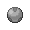

# Giant Chasm

## Encounters
### Outside Area
####  Grass, Normal
| Sprite | Pokemon | Rate |
| --- | --- | --- |
|  | [Absol](../pokemon/absol.md) | 20% |
|  | [Drifblim](../pokemon/drifblim.md) | 20% |
|  | [Swellow](../pokemon/swellow.md) | 10% |
|  | [Lunatone](../pokemon/lunatone.md) | 10% |
|  | [Solrock](../pokemon/solrock.md) | 10% |
|  | [Wormadam](../pokemon/wormadam.md) | 10% |
|  | [Mothim](../pokemon/mothim.md) | 10% |
|  | [Pelipper](../pokemon/pelipper.md) | 10% |

####  Grass, Doubles
| Sprite | Pokemon | Rate |
| --- | --- | --- |
|  | [Golbat](../pokemon/golbat.md) | 20% |
|  | [Tangela](../pokemon/tangela.md) | 20% |
|  | [Nidorino](../pokemon/nidorino.md) | 10% |
|  | [Nidorina](../pokemon/nidorina.md) | 10% |
|  | [Yanma](../pokemon/yanma.md) | 10% |
|  | [Gloom](../pokemon/gloom.md) | 10% |
|  | [Weepinbell](../pokemon/weepinbell.md) | 10% |
|  | [Skiploom](../pokemon/skiploom.md) | 10% |

####  Grass, Special
| Sprite | Pokemon | Rate |
| --- | --- | --- |
|  | [Audino](../pokemon/audino.md) | 80% |
|  | [Tangrowth](../pokemon/tangrowth.md) | 5% |
|  | [Crobat](../pokemon/crobat.md) | 5% |
|  | [Nidoking](../pokemon/nidoking.md) | 5% |
|  | [Nidoqueen](../pokemon/nidoqueen.md) | 5% |

### Outside Area
####  Cave, Normal
| Sprite | Pokemon | Rate |
| --- | --- | --- |
|  | [Woobat](../pokemon/woobat.md) | 20% |
|  | [Jynx](../pokemon/jynx.md) | 20% |
|  | [Glalie](../pokemon/glalie.md) | 10% |
|  | [Beartic](../pokemon/beartic.md) | 10% |
|  | [Slowbro](../pokemon/slowbro.md) | 10% |
|  | [Piloswine](../pokemon/piloswine.md) | 10% |
|  | [Graveler](../pokemon/graveler.md) | 10% |
|  | [Boldore](../pokemon/boldore.md) | 10% |

####  Cave, Special
| Sprite | Pokemon | Rate |
| --- | --- | --- |
|  | [Excadrill](../pokemon/excadrill.md) | 100% |

####  Surf, Normal
| Sprite | Pokemon | Rate |
| --- | --- | --- |
|  | [Seel](../pokemon/seel.md) | 60% |
|  | [Dewgong](../pokemon/dewgong.md) | 40% |

####  Surf, Special
| Sprite | Pokemon | Rate |
| --- | --- | --- |
|  | [Walrein](../pokemon/walrein.md) | 100% |

####  Fish, Normal
| Sprite | Pokemon | Rate |
| --- | --- | --- |
|  | [Poliwag](../pokemon/poliwag.md) | 65% |
|  | [Basculin](../pokemon/basculin.md) | 30% |
|  | [Poliwhirl](../pokemon/poliwhirl.md) | 5% |

####  Fish, Special
| Sprite | Pokemon | Rate |
| --- | --- | --- |
|  | [Poliwhirl](../pokemon/poliwhirl.md) | 65% |
|  | [Baculin](../pokemon/basculin.md) | 30% |
|  | [Poliwrath](../pokemon/poliwrath.md) | 5% |

### Outside Area
####  Grass, Normal
| Sprite | Pokemon | Rate |
| --- | --- | --- |
|  | [Clefairy](../pokemon/clefairy.md) | 20% |
|  | [Jigglypuff](../pokemon/jigglypuff.md) | 20% |
|  | [Skitty](../pokemon/skitty.md) | 10% |
|  | [Sneasel](../pokemon/sneasel.md) | 10% |
|  | [Metang](../pokemon/metang.md) | 10% |
|  | [Vanillish](../pokemon/vanillish.md) | 10% |
|  | [Golbat](../pokemon/golbat.md) | 10% |
|  | [Porygon](../pokemon/porygon.md) | 10% |

####  Grass, Doubles
| Sprite | Pokemon | Rate |
| --- | --- | --- |
|  | [Piloswine](../pokemon/piloswine.md) | 20% |
|  | [Abomasnow](../pokemon/abomasnow.md) | 20% |
|  | [Bouffalant](../pokemon/bouffalant.md) | 10% |
|  | [Solrock](../pokemon/solrock.md) | 10% |
|  | [Lunatone](../pokemon/lunatone.md) | 10% |
|  | [Skiploom](../pokemon/skiploom.md) | 10% |
|  | [Metang](../pokemon/metang.md) | 10% |
|  | [Ditto](../pokemon/ditto.md) | 10% |

####  Grass, Special
| Sprite | Pokemon | Rate |
| --- | --- | --- |
|  | [Audino](../pokemon/audino.md) | 80% |
|  | [Clefable](../pokemon/clefable.md) | 5% |
|  | [Wigglytuff](../pokemon/wigglytuff.md) | 5% |
|  | [Mamoswine](../pokemon/mamoswine.md) | 5% |
|  | [Metagross](../pokemon/metagross.md) | 5% |

## Special Encounters
### [Deoxys](../pokemon/deoxys.md)
| Sprite | Level | Location | Method | Rate |
| --- | --- | --- | --- | --- |
|  | 70 | Giant Chasm, Outside Area Giant Chasm – Inside Cave |  Doubles Grass. | 1% |

*With stories of the Giant Chasm formed from a meteor, it’s not unlikely to imagine that Deoxys has made a settlement somewhere near. Perhaps you might encounter it while it searches for meteorite.*

### [Dialga](../pokemon/dialga.md)
| Sprite | Level | Location | Method | Rate |
| --- | --- | --- | --- | --- |
|  | 70 | Giant Chasm, Inside Cave (not Kyurem bit) |  Cave, Normal | 1% |

*The Giant Chasm, ruled by Kyurem, is sometimes rumoured to also be related to the powers of time. Dialga’s visits to this place mean you might just find it, or perhaps its counterpart, Palkia.*

### [Palkia](../pokemon/palkia.md)
| Sprite | Level | Location | Method | Rate |
| --- | --- | --- | --- | --- |
|  | 70 | Giant Chasm, Inside Cave (not Kyurem bit) Giant Chasm – Inside Plains |  Cave, Normal | 1% |

*Equally, the distortions in space mean Palkia has taken residence in this unknown area of the world.*

### [Giratina](../pokemon/giratina.md)
| Sprite | Level | Location | Method | Rate |
| --- | --- | --- | --- | --- |
|  | 70 | Giant Chasm, Inside Plains |  Grass, Doubles | 1% |

*Giratina, the third dragon of Sinnoh, also makes an appearance. Though he intends to see the Celestial Tower, the Giant Chasm is an ideal place for rest.*

### [Reshiram](../pokemon/reshiram.md)
| Sprite | Level | Location | Method | Rate |
| --- | --- | --- | --- | --- |
|  | 70 | Giant Chasm, Inside Plains (Volt White Only) |  Grass, Doubles | 1% |

*The remaining Tao dragon also appears, having split off from N and returning to greet the third member of its trio. You might be able to find it, if you’re lucky…*

### [Zekrom](../pokemon/zekrom.md)
| Sprite | Level | Location | Method | Rate |
| --- | --- | --- | --- | --- |
|  | 70 | Giant Chasm, Inside Plains (Blaze Black Only) |  Grass, Doubles | 1% |

*The remaining Tao dragon also appears, having split off from N and returning to greet the third member of its trio. You might be able to find it, if you’re lucky…*

### [Kyurem](../pokemon/kyurem.md)
| Sprite | Level | Location | Method | Rate |
| --- | --- | --- | --- | --- |
|  | 75 | Giant Chasm, Rear Cave | Fixed | Fixed |

## Items
### General
| Item |
| --- |
|  [Rare Candy * 50](../items/rare-candy.md) TM03 Psyshock |
|  God Stone TM13 Ice Beam |
|  [Full Heal](../items/full-heal.md) |
|  [Max Elixir](../items/max-elixir.md) |
|  [Max Potion](../items/max-potion.md) |
|  [Max Revive](../items/max-revive.md) |
|  [Revive](../items/revive.md) |
|  [Bug Gem](../items/bug-gem.md) |
|  [Dark Gem](../items/dark-gem.md) |
|  [Dragon Gem](../items/dragon-gem.md) |
|  [Electric Gem](../items/electric-gem.md) |
|  [Fighting Gem](../items/fighting-gem.md) |
|  [Fire Gem](../items/fire-gem.md) |
|  [Flying Gem](../items/flying-gem.md) |
|  [Ghost Gem](../items/ghost-gem.md) |
|  [Grass Gem](../items/grass-gem.md) |
|  [Ground Gem](../items/ground-gem.md) |
|  [Ice Gem](../items/ice-gem.md) |
|  [Normal Gem](../items/normal-gem.md) |
|  [Poison Gem](../items/poison-gem.md) |
|  [Psychic Gem](../items/psychic-gem.md) |
|  [Rock Gem](../items/rock-gem.md) |
|  [Steel Gem](../items/steel-gem.md) |
|  [Water Gem](../items/water-gem.md) |
|  [Dawn Stone](../items/dawn-stone.md) (Dustcloud) |
|  [Dusk Stone](../items/dusk-stone.md) (Dustcloud) |
|  [Fire Stone](../items/fire-stone.md) (Dustcloud) |
|  [Leaf Stone](../items/leaf-stone.md) (Dustcloud) |
|  [Moon Stone](../items/moon-stone.md) (Dustcloud) |
|  [Shiny Stone](../items/shiny-stone.md) (Dustcloud) |
|  [Thunderstone](../items/thunderstone.md) (Dustcloud) |
|  [Water Stone](../items/water-stone.md) (Dustcloud) |
|  [Carbos](../items/carbos.md) |
|  [Big Mushroom](../items/big-mushroom.md) |
|  [Comet Shard](../items/comet-shard.md) |
|  [Star Piece](../items/star-piece.md) |
|  [Star Piece](../items/star-piece.md) |
|  [TinyMushroom](../items/tinymushroom.md) |
|  [TinyMushroom](../items/tinymushroom.md) |

