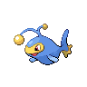
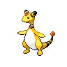

# Nimbasa City

## General Items
| Item | Original |
| --- | --- |
|  Cherish Ball * 20 | Ultra Ball * 10 (NPC) |
|  [HM02 Fly](../items/hm02.md) | Bicycle (NPC) |
|  [TM93 Wild Charge](../items/tm93.md) | TM72 Volt Switch (NPC) |
|  [Shiny Stone * 6](../items/shiny-stone.md) | Sun Stone (NPC) |
|  ThunderStone * 6 | X Attack |

## Trainers
### Plasma Grunt
| Sprite | Pokemon | Level | Ability | Item | Moves |
| --- | --- | --- | --- | --- | --- |
|  | [Mawile](../pokemon/mawile.md) | 31 | - |  - |  |
|  | [Sableye](../pokemon/sableye.md) | 31 | - |  - |  |

### Lady Magnolia
| Sprite | Pokemon | Level | Ability | Item | Moves |
| --- | --- | --- | --- | --- | --- |
|  | [Plusle](../pokemon/plusle.md) | 33 | - |  - |  |
|  | [Minun](../pokemon/minun.md) | 33 | - |  - |  |
|  | [Joltik](../pokemon/joltik.md) | 33 | - |  - |  |
|  | [Tynamo](../pokemon/tynamo.md) | 33 | - |  - |  |
|  | [Pichu](../pokemon/pichu.md) | 33 | - |  - |  |

### Rich Boy Cody
| Sprite | Pokemon | Level | Ability | Item | Moves |
| --- | --- | --- | --- | --- | --- |
|  | [Pachirisu](../pokemon/pachirisu.md) | 34 | - |  - |  |
|  | [Electabuzz](../pokemon/electabuzz.md) | 34 | - |  - |  |
|  | [Pikachu](../pokemon/pikachu.md) | 34 | - |  - |  |
|  | [Flaaffy](../pokemon/flaaffy.md) | 34 | - |  - |  |
|  | [Jolteon](../pokemon/jolteon.md) | 34 | - |  - |  |

### Rich Boy Rolan
| Sprite | Pokemon | Level | Ability | Item | Moves |
| --- | --- | --- | --- | --- | --- |
|  | [Luxray](../pokemon/luxray.md) | 34 | - |  - |  |
|  | [Jolteon](../pokemon/jolteon.md) | 34 | - |  - |  |
|  | [Magneton](../pokemon/magneton.md) | 34 | - |  - |  |
|  | [Electrode](../pokemon/electrode.md) | 34 | - |  - |  |
|  | [Lanturn](../pokemon/lanturn.md) | 34 | - |  - |  |

### Lady Colette
| Sprite | Pokemon | Level | Ability | Item | Moves |
| --- | --- | --- | --- | --- | --- |
|  | [Stunfisk](../pokemon/stunfisk.md) | 35 | - |  - |  |
|  | [Rotom](../pokemon/rotom.md) | 35 | - |  - |  |
|  | [Emolga](../pokemon/emolga.md) | 35 | - |  - |  |

### PKMN Trainer N – 3
**Battle Type:** Double Battle  

#### N’s Team
| Sprite | Pokemon | Level | Ability | Item | Moves |
| --- | --- | --- | --- | --- | --- |
|  | [Hippopotas](../pokemon/hippopotas.md) | 33 | - |  - |  |
|  | [Maractus](../pokemon/maractus.md) | 33 | - |  - |  |
|  | [Gligar](../pokemon/gligar.md) | 33 | - |  - |  |
|  | [Larvesta](../pokemon/larvesta.md) | 33 | - |  - |  |
|  | [Golett](../pokemon/golett.md) | 33 | - |  - |  |
|  | [Sigilyph](../pokemon/sigilyph.md) | 33 | - |  - |  |

### Gym Leader Elesa
**Battle Type:** Single Battle  
**Reward:** [TM93](../moves/wild-charge.md) Wild Charge  

#### Elesa’s Team
| Sprite | Pokemon | Level | Ability | Item | Moves |
| --- | --- | --- | --- | --- | --- |
|  | [Emolga](../pokemon/emolga.md) | 36 | Static |  - | Wild Charge, U-turn, Acrobatics, Roost |
|  | [Manectric](../pokemon/manectric.md) | 36 | Static |  - | Thunderbolt, Volt Switch, Flamethrower, Attract |
|  | [Ampharos](../pokemon/ampharos.md) | 36 | Static |  - | Thunderbolt, Charge, Focus Blast, Cotton Guard |
|  | [Raichu](../pokemon/raichu.md) | 36 | Static |  - | Wild Charge, Volt Switch, Grass Knot, Focus Blast |
|  | [Galvantula](../pokemon/galvantula.md) | 36 | Compoundeyes |  - | Thunder, Volt Switch, Signal Beam, Energy Ball |
|  | [Zebstrika](../pokemon/zebstrika.md) | 38 | Lightningrod |  Sitrus Berry | Wild Charge, Volt Switch, Flame Charge, Double Kick |

