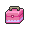

# Nimbasa City

## Items
### General
| Item |
| --- |
|  [Cherish Ball * 20](../items/cherish-ball.md) Ultra Ball * 10 (NPC) (From Professor Juniper) |
|  [HM02 Fly](../items/hm02.md) Bicycle (NPC) (From Bike Shop Owner) |
|  [TM93 Wild Charge](../items/tm93.md) |
|  [Shiny Stone * 6](../items/shiny-stone.md) Sun Stone (NPC) |
|  [Thunder Stone * 6](../items/thunder-stone.md) X Attack |
|  [Ether](../items/ether.md) |
|  [Fresh Water](../items/fresh-water.md) (In Gym Entrance) |
|  [Max Revive](../items/max-revive.md) |
|  [Macho Brace](../items/macho-brace.md) |
|  [Soothe Bell](../items/soothe-bell.md) |
|  [PP Max](../items/pp-max.md) |
|  [PP Max](../items/pp-max.md) |
|  [PP Up](../items/pp-up.md) |
|  [Rare Candy](../items/rare-candy.md) |
|  [Max Repel](../items/max-repel.md) |
|  [Nugget](../items/nugget.md) |
|  [Prop Case](../items/prop-case.md) (From Owner of Musical) |
|  [Vs. Recorder](../items/vs-recorder.md) |
|  [TM49 Echoed Voice](../items/tm49.md) (Musical Hall) |
|  [HM04 Strength](../items/hm04.md) |

### PokéMart
| Item |
| --- |
|  [Antidote](../items/antidote.md) |
|  [Awakening](../items/awakening.md) |
|  [Burn Heal](../items/burn-heal.md) |
|  [Fresh Water](../items/fresh-water.md) |
|  [Full Heal](../items/full-heal.md) |
|  [Full Restore](../items/full-restore.md) |
|  [Hyper Potion](../items/hyper-potion.md) |
|  [Ice Heal](../items/ice-heal.md) |
|  [Lemonade](../items/lemonade.md) |
|  [Max Potion](../items/max-potion.md) |
|  [Parlyz Heal](../items/parlyz-heal.md) |
|  [Potion](../items/potion.md) |
|  [Revive](../items/revive.md) |
|  [Soda Pop](../items/soda-pop.md) |
|  [Super Potion](../items/super-potion.md) |
|  [Escape Rope](../items/escape-rope.md) |
|  [Max Repel](../items/max-repel.md) |
|  [Repel](../items/repel.md) |
|  [Great Ball](../items/great-ball.md) |
|  [Poké Ball](../items/poke-ball.md) |
|  [Ultra Ball](../items/ultra-ball.md) |

## Trainers
### Plasma Grunt
| Sprite | Pokemon | Level | Ability | Item | Moves |
| --- | --- | --- | --- | --- | --- |
|  | [Mawile](../pokemon/mawile.md) | 31 | - | - |  |
|  | [Sableye](../pokemon/sableye.md) | 31 | - | - |  |

### Lady Magnolia
| Sprite | Pokemon | Level | Ability | Item | Moves |
| --- | --- | --- | --- | --- | --- |
|  | [Plusle](../pokemon/plusle.md) | 33 | - | - |  |
|  | [Minun](../pokemon/minun.md) | 33 | - | - |  |
|  | [Joltik](../pokemon/joltik.md) | 33 | - | - |  |
|  | [Tynamo](../pokemon/tynamo.md) | 33 | - | - |  |
|  | [Pichu](../pokemon/pichu.md) | 33 | - | - |  |

### Rich Boy Cody
| Sprite | Pokemon | Level | Ability | Item | Moves |
| --- | --- | --- | --- | --- | --- |
|  | [Pachirisu](../pokemon/pachirisu.md) | 34 | - | - |  |
|  | [Electabuzz](../pokemon/electabuzz.md) | 34 | - | - |  |
|  | [Pikachu](../pokemon/pikachu.md) | 34 | - | - |  |
|  | [Flaaffy](../pokemon/flaaffy.md) | 34 | - | - |  |
|  | [Jolteon](../pokemon/jolteon.md) | 34 | - | - |  |

### Rich Boy Rolan
| Sprite | Pokemon | Level | Ability | Item | Moves |
| --- | --- | --- | --- | --- | --- |
|  | [Luxray](../pokemon/luxray.md) | 34 | - | - |  |
|  | [Jolteon](../pokemon/jolteon.md) | 34 | - | - |  |
|  | [Magneton](../pokemon/magneton.md) | 34 | - | - |  |
|  | [Electrode](../pokemon/electrode.md) | 34 | - | - |  |
|  | [Lanturn](../pokemon/lanturn.md) | 34 | - | - |  |

### Lady Colette
| Sprite | Pokemon | Level | Ability | Item | Moves |
| --- | --- | --- | --- | --- | --- |
|  | [Stunfisk](../pokemon/stunfisk.md) | 35 | - | - |  |
|  | [Rotom](../pokemon/rotom.md) | 35 | - | - |  |
|  | [Emolga](../pokemon/emolga.md) | 35 | - | - |  |

### PKMN Trainer N – 3
**Battle Type:** Double Battle  

#### N’s Team
| Sprite | Pokemon | Level | Ability | Item | Moves |
| --- | --- | --- | --- | --- | --- |
|  | [Hippopotas](../pokemon/hippopotas.md) | 33 | - | - |  |
|  | [Maractus](../pokemon/maractus.md) | 33 | - | - |  |
|  | [Gligar](../pokemon/gligar.md) | 33 | - | - |  |
|  | [Larvesta](../pokemon/larvesta.md) | 33 | - | - |  |
|  | [Golett](../pokemon/golett.md) | 33 | - | - |  |
|  | [Sigilyph](../pokemon/sigilyph.md) | 33 | - | - |  |

### Gym Leader Elesa
**Battle Type:** Single Battle  
**Reward:** [TM93](../moves/wild-charge.md) Wild Charge  

#### Elesa’s Team
| Sprite | Pokemon | Level | Ability | Item | Moves |
| --- | --- | --- | --- | --- | --- |
|  | [Emolga](../pokemon/emolga.md) | 36 | Static | - | Wild Charge, U-turn, Acrobatics, Roost |
|  | [Manectric](../pokemon/manectric.md) | 36 | Static | - | Thunderbolt, Volt Switch, Flamethrower, Attract |
|  | [Ampharos](../pokemon/ampharos.md) | 36 | Static | - | Thunderbolt, Charge, Focus Blast, Cotton Guard |
|  | [Raichu](../pokemon/raichu.md) | 36 | Static | - | Wild Charge, Volt Switch, Grass Knot, Focus Blast |
|  | [Galvantula](../pokemon/galvantula.md) | 36 | Compoundeyes | - | Thunder, Volt Switch, Signal Beam, Energy Ball |
|  | [Zebstrika](../pokemon/zebstrika.md) | 38 | Lightningrod |  Sitrus Berry | Wild Charge, Volt Switch, Flame Charge, Double Kick |

